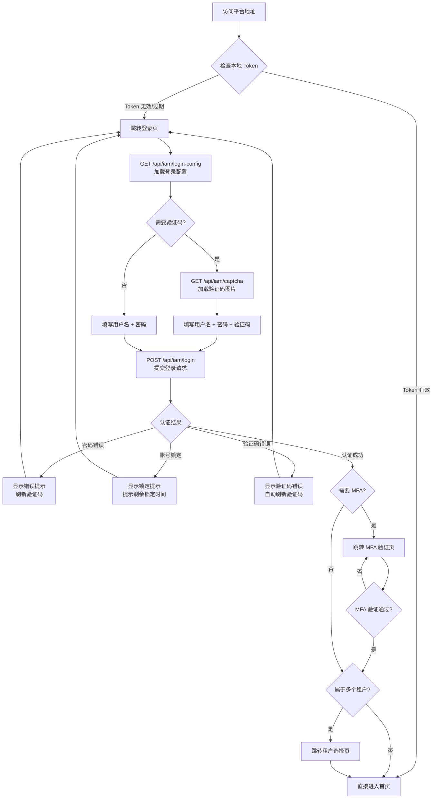

# 登录

## 功能简介

Rune Console 使用统一的认证系统，Console（用户控制台）和 BOSS（管理后台）共用同一套身份认证服务。用户通过用户名/密码登录后，系统颁发 JWT（JSON Web Token）访问令牌，后续的所有 API 请求均携带该令牌进行身份验证。系统在登录过程中会根据平台配置动态调整登录流程，例如是否显示验证码、是否强制要求 MFA 等。

## 进入路径

- 直接访问 Console 或 BOSS 地址，未登录时自动跳转至登录页
- Console 登录地址：`https://your-domain/console/auth/sign-in`
- BOSS 登录地址：`https://your-domain/boss/auth/sign-in`

> 💡 提示: 如果您在浏览器中直接访问某个受保护的页面（例如 `/console/rune/instances`），系统会将该地址记录为「登录后跳转目标」，登录成功后自动回到该页面，无需手动查找。

## 页面说明

登录页面默认分为左右两栏布局：左侧为品牌展示区域，右侧为登录表单。在移动端设备上，页面会自动切换为单栏布局，仅展示登录表单。

### 登录配置加载

页面加载时，前端会调用 `GET /api/iam/login-config` 接口获取平台登录配置，返回内容决定登录页的行为：

| 配置项 | 说明 |
|--------|------|
| 是否允许注册 | 决定「注册」链接是否可见 |
| 是否启用验证码 | 决定是否在登录表单中显示验证码输入框 |
| 是否强制 MFA | 决定登录后是否额外需要 MFA 动态验证码 |
| 是否允许密码重置 | 决定「忘记密码」链接是否可见 |
| 平台名称与 Logo | 用于登录页品牌展示区域的自定义 |

> 💡 提示: 以上配置项由系统管理员在 BOSS 后台的「平台设置」中管理。如果您发现登录页缺少注册入口或忘记密码链接，请联系系统管理员确认平台配置。

### 登录表单

| 字段 | 类型 | 必填 | 说明 |
|------|------|------|------|
| 用户名/邮箱 | 文本输入 | ✅ | 输入注册时的用户名或邮箱地址，不区分大小写 |
| 密码 | 密码输入 | ✅ | 输入账号密码，支持点击眼睛图标切换明文/密文显示 |
| 验证码 | 文本输入 + 验证码图片 | 条件必填 | 仅在平台启用验证码时显示，参见下方「验证码处理」说明 |
| 记住我 | 复选框 | — | 勾选后延长登录会话有效期（默认 7 天→30 天） |

### 验证码处理

当平台启用验证码登录时，登录表单会额外出现验证码输入区域：

1. **验证码加载**：页面加载时自动调用 `GET /api/iam/captcha` 获取验证码图片，返回 Base64 编码的图片数据和一个 `captchaId`
2. **输入验证码**：用户需要根据图片中显示的字符（通常为 4-6 位字母数字组合），在验证码输入框中填写
3. **刷新验证码**：点击验证码图片即可刷新获取新的验证码，`captchaId` 也会同步更新
4. **验证码过期**：验证码有效期约为 **2 分钟**，过期后需点击刷新重新获取
5. **提交验证**：登录请求 `POST /api/iam/login` 会将 `captchaId` 和用户输入的验证码一并提交至后端验证

> ⚠️ 注意: 验证码区分大小写。如果图片显示模糊无法辨认，请点击图片刷新获取新的验证码。

### 操作步骤

1. 在浏览器中访问平台地址（Console 或 BOSS）
2. 等待页面加载完成，登录配置自动获取
3. 在「用户名/邮箱」字段输入您的账号
4. 在「密码」字段输入您的密码
5. 如果页面显示验证码，输入图片中的验证码字符
6. 根据需要勾选「记住我」
7. 点击 **登录** 按钮
8. 登录成功后：
   - 若平台启用了 MFA 且您已绑定 MFA 设备 → 跳转到 [MFA 验证页面](./mfa.md)
   - 若您只属于一个租户 → 直接进入控制台首页
   - 若您属于多个租户 → 跳转到 [租户选择页](./select-tenant.md)
   - 若您尚未加入任何租户 → 引导您注册或加入租户

### 辅助操作

- **忘记密码**：点击登录表单下方的「忘记密码？」链接，进入 [密码重置流程](./reset-password.md)
- **注册账号**：点击「还没有账号？注册」链接，进入 [注册页面](./register.md)（仅在平台允许注册时可见）

## 登录流程

## 错误处理与常见问题

### 常见错误信息

| 错误提示 | 原因 | 解决方案 |
|----------|------|----------|
| 用户名或密码错误 | 输入的凭证不匹配 | 检查用户名和密码是否正确，注意密码区分大小写 |
| 验证码错误 | 输入的验证码与图片不匹配 | 仔细查看验证码图片，注意区分大小写；或点击图片刷新 |
| 验证码已过期 | 验证码超过有效期（约 2 分钟） | 点击验证码图片重新获取 |
| 账号已被锁定 | 连续登录失败次数过多 | 等待锁定时间结束（默认 15 分钟），或联系管理员解锁 |
| 账号已被禁用 | 管理员禁用了该账号 | 联系系统管理员或租户管理员 |
| 网络请求失败 | 网络连接异常或服务不可用 | 检查网络连接，稍后重试 |

### 账号锁定机制

为防止暴力破解，平台实施以下安全策略：

- 连续 **5 次** 登录失败后，账号将被临时锁定
- 默认锁定时间为 **15 分钟**，锁定期间该账号无法登录
- 锁定次数和时长由系统管理员在 BOSS 后台配置
- 管理员可在 BOSS 后台手动解锁被锁定的账号

> ⚠️ 注意: 账号锁定是基于账号维度的，与登录 IP 无关。即使换用其他设备，被锁定的账号在锁定期内仍然无法登录。

## 会话管理

### JWT Token 机制

登录成功后，系统返回 JWT Token，前端将其存储在浏览器的 `localStorage` 中：

- **Access Token**：用于 API 请求认证，有效期较短（默认 2 小时）
- **Refresh Token**：用于刷新 Access Token，有效期较长（默认 7 天，勾选「记住我」后为 30 天）
- Token 过期后，前端会自动使用 Refresh Token 获取新的 Access Token，用户无感知
- 当 Refresh Token 也过期时，用户会被重定向至登录页重新认证

### 会话失效场景

以下情况会导致当前会话失效，需要重新登录：

1. Access Token 和 Refresh Token 均已过期
2. 管理员在后台重置了您的密码
3. 管理员禁用了您的账号
4. 您主动点击「退出登录」
5. 管理员修改了平台安全策略（如强制所有用户重新登录）

### 退出登录

点击右上角头像菜单中的「退出登录」，系统将：

1. 清除本地存储的 Token
2. 通知后端使当前 Token 失效
3. 跳转回登录页面

## 浏览器兼容性

| 浏览器 | 最低版本 | 说明 |
|--------|----------|------|
| Google Chrome | 90+ | ✅ 推荐使用 |
| Microsoft Edge | 90+ | ✅ 推荐使用 |
| Mozilla Firefox | 88+ | ✅ 支持 |
| Apple Safari | 14+ | ✅ 支持 |
| Internet Explorer | — | ❌ 不支持 |

> 💡 提示: 为获得最佳体验，建议使用最新版本的 Chrome 或 Edge 浏览器。如遇到页面显示异常，请先尝试更新浏览器版本或清除浏览器缓存。

## 注意事项

- 连续输入错误密码会触发账号锁定，请仔细核对后再登录
- 登录会话有有效期，过期后需要重新登录
- 建议使用强密码，并启用 [MFA](./mfa.md) 增强账户安全性
- 不要在公共设备上勾选「记住我」，使用完毕后请及时退出登录
- 如果您发现账号存在异常登录行为，请立即修改密码并联系管理员
