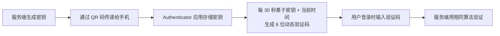
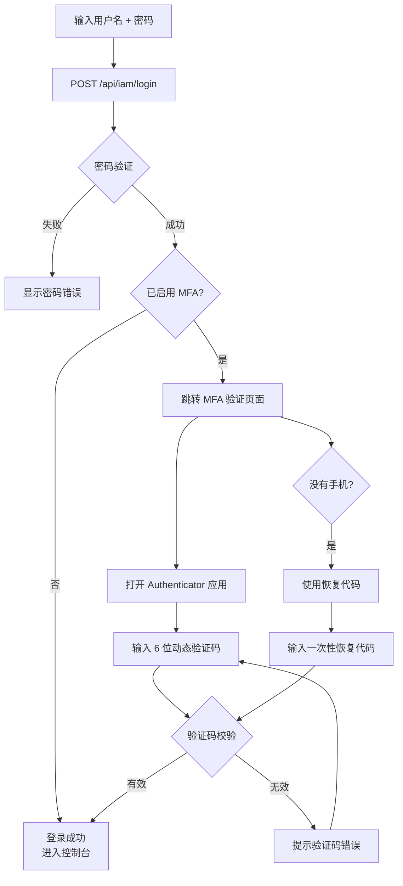

# 多因素认证 (MFA)

## 功能简介

多因素认证（Multi-Factor Authentication，简称 MFA）是一种安全机制，在传统的用户名+密码认证之上增加额外的验证步骤。Rune Console 支持基于 TOTP（Time-based One-Time Password，基于时间的一次性密码）的 MFA 方案。启用 MFA 后，登录时除了输入密码外，还需要提供由 Authenticator 应用生成的 6 位动态验证码，从而大幅提升账号安全性。

### 什么是 TOTP？

TOTP 是一种基于时间的动态密码生成算法。其工作原理如下：

- 服务端和 Authenticator 应用共享同一个密钥（Secret Key）
- 双方基于「密钥 + 当前时间」使用相同的算法生成 6 位数字验证码
- 验证码每 **30 秒** 刷新一次
- 即使密码被泄露，攻击者没有您的手机无法获取动态验证码，因此账号仍然安全

> 💡 提示: TOTP 是行业标准的双因素认证方案，被 Google、GitHub、AWS 等主流平台广泛采用，安全可靠。

## MFA 的启用策略

MFA 在 Rune Console 中有两种启用方式：

### 用户自主启用

- 用户可以随时在个人中心启用 MFA，无需管理员干预
- 适用于安全意识较强的用户主动加固账号
- 启用后可以自行禁用（需验证当前动态验证码）

### 管理员强制启用

- 系统管理员可在 BOSS 后台的「平台设置」中启用「强制 MFA」策略
- 启用后，所有用户在下次登录时必须完成 MFA 绑定
- 未绑定 MFA 的用户登录后会被强制引导到 MFA 设置页面，完成绑定后才能进入控制台
- 管理员也可以针对特定角色（如管理员角色）强制启用 MFA

> ⚠️ 注意: 当平台启用「强制 MFA」策略后，所有用户必须绑定 MFA 才能正常使用平台。请提前准备好 Authenticator 应用。

## 进入路径

- 个人中心 → 安全设置 → MFA
- 地址：`/console/iam/security`
- 强制 MFA：登录后自动跳转到 MFA 设置页面

## 推荐的 Authenticator 应用

在启用 MFA 之前，请先在您的手机上安装以下任一 Authenticator 应用：

| 应用名称 | 平台 | 说明 |
|----------|------|------|
| Google Authenticator | iOS / Android | Google 出品，简单易用，推荐首选 |
| Microsoft Authenticator | iOS / Android | 微软出品，支持云端备份 |
| Authy | iOS / Android / Desktop | 支持多设备同步和云端加密备份 |
| 1Password | iOS / Android / Desktop | 密码管理器，内置 TOTP 支持 |

> 💡 提示: 推荐使用支持云端备份的应用（如 Microsoft Authenticator 或 Authy），以防设备丢失后无法恢复。如果使用 Google Authenticator，请务必保存恢复代码。

## 启用 MFA

### 页面说明

MFA 设置采用分步引导（Stepper）界面，引导您逐步完成绑定过程。

### 步骤一：生成 QR 码

1. 进入 **个人中心** → **安全设置**（或在强制 MFA 场景下自动跳转）
2. 点击 **「启用 MFA」** 按钮
3. 系统调用 `POST /api/iam/init-mfa` 接口，服务端生成 TOTP 密钥
4. 页面通过 Canvas 渲染显示一个 QR 码，同时在下方显示密钥文本（Secret Key）

界面组成：

| 区域 | 说明 |
|------|------|
| QR 码图像 | Canvas 渲染的二维码，包含 TOTP 密钥信息 |
| 密钥文本 | QR 码中包含的密钥明文，点击可复制，用于手动输入 |
| 操作提示 | 引导用户使用 Authenticator 应用扫码 |

> 💡 提示: 如果您的手机无法扫描 QR 码（例如使用桌面版 Authenticator），可以点击「无法扫码？」链接，然后手动复制页面上显示的密钥文本，在 Authenticator 应用中选择「手动输入」方式添加。

### 步骤二：扫描 QR 码

1. 打开手机上的 Authenticator 应用
2. 在应用中选择「添加账号」或点击「+」号
3. 选择「扫描 QR 码」选项
4. 使用手机摄像头扫描页面上显示的 QR 码
5. 扫描成功后，Authenticator 应用会自动添加一个新条目，显示如下：
   - **账号名称**：您的用户名
   - **服务名称**：Rune Console（或平台自定义名称）
   - **6 位动态验证码**：每 30 秒刷新一次，旁边通常有一个倒计时环
6. 点击页面上的 **「下一步」** 按钮

### 步骤三：验证动态验证码

1. 查看 Authenticator 应用中显示的当前 6 位动态验证码
2. 在页面的验证码输入框中输入该 6 位数字
3. 点击 **「验证」** 按钮
4. 系统调用 `POST /api/iam/verify-mfa` 接口验证输入的验证码
5. 验证通过后，MFA 绑定成功

> ⚠️ 注意: 动态验证码每 30 秒刷新一次。如果您输入时验证码刚好切换，请输入最新的验证码。如果连续验证失败，请检查手机的系统时间是否准确——TOTP 验证码的生成严格依赖时间同步。

### 步骤四：保存恢复代码

验证成功后，系统会显示一组恢复代码（Recovery Codes）：

- 恢复代码通常为 **8-10 个** 一次性使用的备用代码
- 每个代码只能使用一次
- 用于设备丢失时的紧急登录
- 页面提供「复制」和「下载」按钮

> ⚠️ 注意: **请务必安全保存恢复代码！** 这是设备丢失时恢复账号访问的唯一方式。建议将恢复代码保存在安全的离线位置（如打印出来放在保险箱中），不要保存在手机上。

### 完成启用

点击 **「完成」** 按钮，MFA 启用成功。从下次登录开始，您将需要同时提供密码和动态验证码。

## 使用 MFA 登录

启用 MFA 后，登录流程增加了一个额外的验证步骤：

### 操作步骤

1. 在登录页面正常输入用户名和密码
2. 点击「登录」按钮
3. 密码验证通过后，系统跳转到 **MFA 验证页面**
4. 打开手机上的 Authenticator 应用
5. 找到 Rune Console 对应的条目
6. 查看当前显示的 6 位动态验证码
7. 在 MFA 验证页面的输入框中填写该验证码
8. 点击 **「验证」** 按钮
9. 验证通过后进入控制台

### MFA 登录流程图

### 使用恢复代码登录

如果无法使用 Authenticator 应用（例如手机不在身边），可以使用恢复代码进行登录：

1. 在 MFA 验证页面，点击 **「使用恢复代码」** 链接
2. 输入一个之前保存的恢复代码
3. 点击 **「验证」**
4. 验证通过后正常登录

> ⚠️ 注意: 每个恢复代码只能使用一次。使用后该代码自动失效。当恢复代码剩余数量较少时，建议尽快重新绑定 MFA 或生成新的恢复代码。

## 禁用 MFA

如果您希望关闭 MFA（前提是平台没有强制启用 MFA），可以按以下步骤操作：

1. 进入 **个人中心** → **安全设置**
2. 在 MFA 区域点击 **「禁用 MFA」**
3. 系统弹出确认对话框
4. 输入当前 Authenticator 应用中显示的 **6 位动态验证码** 确认身份
5. 点击 **「确认禁用」**
6. MFA 已禁用，后续登录不再需要动态验证码

> ⚠️ 注意: 如果平台启用了「强制 MFA」策略，您将无法禁用 MFA。禁用按钮会显示为灰色不可点击状态，并提示「平台要求所有用户启用 MFA」。

## 设备丢失与恢复

### 有恢复代码

如果您安全保存了恢复代码：

1. 使用恢复代码登录（参见上方「使用恢复代码登录」）
2. 登录后进入 **个人中心** → **安全设置**
3. 先禁用当前 MFA
4. 重新启用 MFA，使用新设备扫描新的 QR 码
5. 保存新的恢复代码

### 没有恢复代码

如果您同时丢失了设备和恢复代码：

1. **联系租户管理员或系统管理员**
2. 管理员可以在后台为您重置 MFA 绑定
   - 系统管理员路径：BOSS → 用户管理 → 找到您的账号 → 重置 MFA
   - 租户管理员路径：Console → 成员管理 → 找到您 → 重置 MFA
3. MFA 重置后，您可以仅使用密码登录
4. 登录后建议立即重新绑定 MFA

> 💡 提示: 管理员重置 MFA 时可能需要您提供身份验证（如当面确认、邮箱验证等），这是为了防止他人冒用您的身份申请重置。

### 更换设备

如果您更换了手机但旧手机仍可用：

1. 使用旧手机上的 Authenticator 验证码正常登录
2. 进入个人中心 → 安全设置
3. 禁用当前 MFA（需要旧手机上的验证码）
4. 重新启用 MFA，使用新手机扫描新的 QR 码
5. 在新手机上确认可以正常生成验证码
6. 保存新的恢复代码
7. 删除旧手机上 Authenticator 应用中的对应条目

## 常见问题

### 验证码一直验证失败

最常见的原因是 **手机时间不准确**。TOTP 算法依赖精确的时间同步：

- **解决方案**：在手机设置中开启「自动设置时间」（即使用网络时间）
- **Google Authenticator 专用**：在应用设置中有「校准时间用于生成验证码」选项
- **时差容忍**：系统通常允许前后 30 秒的时间偏差，但超出此范围将导致验证失败

### MFA 绑定后 Authenticator 中没有对应条目

- 可能是扫码时没有成功保存
- 重新进入安全设置，禁用并重新启用 MFA，重新扫码

### 能否在多台设备上使用 MFA？

- 在步骤一生成 QR 码时，可以同时用多台设备扫描同一个 QR 码
- 所有扫描了该 QR 码的设备都会生成相同的验证码
- 也可以将密钥文本手动输入到桌面版 Authenticator 应用中

## 注意事项

- 请妥善保管恢复代码，这是设备丢失时恢复账户的唯一方式
- 建议在多台可信设备上备份 MFA 密钥
- 如果同时丢失设备和恢复代码，需联系平台管理员重置 MFA
- 确保手机时间与网络时间同步，否则验证码可能无法通过验证
- 禁用 MFA 后，原有的恢复代码和密钥将全部失效
- 重新启用 MFA 会生成全新的密钥和恢复代码
