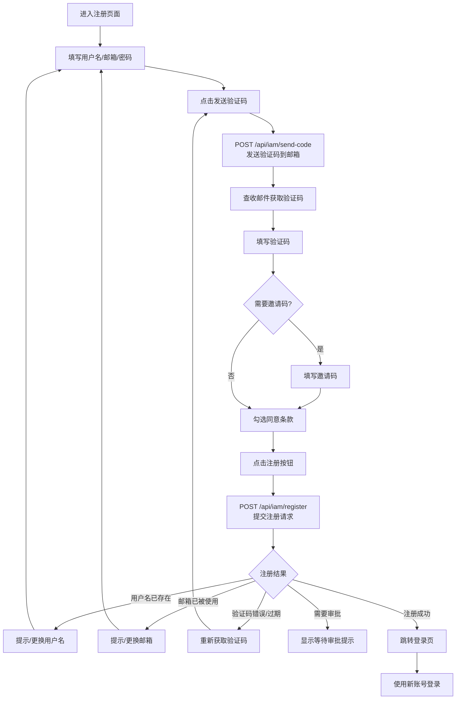

# 注册

## 功能简介

新用户可以通过注册页面创建 Rune Console 平台账号。注册功能是否开放取决于系统管理员的平台配置——管理员可以选择开放注册、仅限邀请码注册、或完全关闭注册。注册后根据平台策略，可能需要管理员审批才能激活账号。

## 前提条件

在开始注册之前，请确认以下事项：

- **平台已开放注册**：系统管理员已在 BOSS 后台启用了用户注册功能。如果登录页面没有「注册」链接，则说明平台当前不允许自助注册，请联系管理员获取账号
- **有效的邮箱或手机号**：注册过程中需要接收验证码，请确保您可以访问所填写的邮箱或手机
- **邀请码（如需要）**：部分平台配置下注册需要提供邀请码，请提前向管理员获取

> 💡 提示: 平台的注册策略由系统管理员在 BOSS 后台的「平台设置」中配置。如果您无法注册，请联系您的组织管理员了解注册方式。

## 进入路径

- 登录页面 → 点击「还没有账号？注册」链接
- 直接访问：`https://your-domain/console/auth/sign-up`

## 页面说明

注册页面采用简洁的单列表单布局，位于页面中央。表单上方显示平台 Logo 和名称，下方提供返回登录页的链接。

### 注册表单

| 字段 | 类型 | 必填 | 验证规则 | 说明 |
|------|------|------|----------|------|
| 用户名 | 文本输入 | ✅ | 3-32 个字符，仅限小写字母、数字、下划线、短横线；必须以字母开头 | 平台内的唯一标识，创建后 **不可更改** |
| 邮箱 | 邮箱输入 | ✅ | 标准邮箱格式（`user@domain.com`） | 用于接收验证码、通知邮件和密码重置 |
| 手机号 | 电话输入 | 视配置 | 需包含国际区号（如 `+86`），11 位数字 | 部分平台要求提供手机号 |
| 密码 | 密码输入 | ✅ | 最少 8 个字符，需包含大写字母、小写字母和数字 | 登录密码，可点击眼睛图标查看明文 |
| 确认密码 | 密码输入 | ✅ | 必须与密码字段完全一致 | 防止密码输入错误 |
| 邮箱验证码 | 文本输入 | ✅ | 6 位数字 | 点击「发送验证码」后从邮箱获取 |
| 邀请码 | 文本输入 | 视配置 | — | 仅在平台要求邀请码注册时显示 |

### 用户名命名规范

用户名是您在平台中的唯一标识，请遵循以下规范：

- **长度**：3 至 32 个字符
- **允许字符**：小写英文字母（`a-z`）、数字（`0-9`）、下划线（`_`）、短横线（`-`）
- **起始字符**：必须以英文字母开头
- **唯一性**：用户名全平台唯一，不可与已有用户重复
- **不可变更**：用户名创建后无法修改，请谨慎选择

> ⚠️ 注意: 用户名一旦设定不可更改，它将作为您在平台中的永久标识。请使用有意义且易记的名称。

### 密码强度要求

注册密码需满足以下安全要求：

| 要求 | 说明 |
|------|------|
| 最小长度 | 不少于 **8** 个字符 |
| 大写字母 | 至少包含 **1** 个大写字母（A-Z） |
| 小写字母 | 至少包含 **1** 个小写字母（a-z） |
| 数字 | 至少包含 **1** 个数字（0-9） |
| 特殊字符 | 建议包含（如 `!@#$%^&*`），部分平台配置下为必须 |

表单在输入密码时会实时显示密码强度指示条（弱 / 中 / 强），建议达到「强」级别。

> 💡 提示: 良好的密码习惯：不要使用与用户名、邮箱相同的字符组合；避免使用常见词汇（如 `password123`）；推荐使用密码管理器生成和存储复杂密码。

### 验证码获取

1. 填写完邮箱后，点击邮箱输入框右侧的 **发送验证码** 按钮
2. 系统调用 `POST /api/iam/send-code` 向您的邮箱发送一封包含 6 位数字验证码的邮件
3. 验证码发送后，按钮会显示 **60 秒倒计时**，倒计时结束前不可重复发送
4. 验证码有效期约为 **5 分钟**，过期后需重新获取
5. 如果长时间未收到验证码邮件，请检查垃圾邮件文件夹

> ⚠️ 注意: 如果多次发送验证码仍未收到，请确认邮箱地址是否正确，或联系系统管理员确认邮件服务是否正常。

## 操作步骤

1. 在登录页点击「还没有账号？注册」链接，进入注册页面
2. 在「用户名」字段输入您希望使用的用户名
3. 在「邮箱」字段输入有效的邮箱地址
4. 填写密码和确认密码，确保满足密码强度要求
5. 点击 **发送验证码**，前往邮箱查收验证码邮件
6. 在「验证码」字段输入收到的 6 位数字验证码
7. 如果页面显示邀请码字段，输入您获取的邀请码
8. 阅读并勾选「我已阅读并同意《服务条款》和《隐私政策》」
9. 点击 **注册** 按钮提交注册

## 注册流程

## 注册审批流程

部分平台配置下，新用户注册后不能立即使用账号，需要管理员审批：

### 无需审批（自动激活）

1. 用户提交注册表单
2. 系统验证信息无误后立即创建账号
3. 账号处于激活状态，用户可直接登录
4. 跳转至登录页面

### 需要管理员审批

1. 用户提交注册表单
2. 系统创建账号但标记为「待审批」状态
3. 页面显示「注册申请已提交，请等待管理员审批」
4. 系统管理员在 BOSS 后台的用户管理中查看待审批列表
5. 管理员审批通过后，系统发送邮件通知用户
6. 用户收到通知后方可登录

> 💡 提示: 如果您提交注册后长时间未收到审批通过的通知，请联系您的组织管理员确认审批进度。

### 邀请码注册

当平台启用邀请码注册模式时：

1. 管理员在 BOSS 后台生成邀请码，并分发给指定人员
2. 用户在注册表单中填写邀请码
3. 系统验证邀请码的有效性（是否存在、是否已过期、是否已被使用）
4. 验证通过后完成注册，邀请码标记为已使用

## 常见错误信息

| 错误提示 | 原因 | 解决方案 |
|----------|------|----------|
| 用户名已被占用 | 该用户名已被其他用户注册 | 更换一个不同的用户名 |
| 邮箱已被注册 | 该邮箱地址已关联到其他账号 | 使用其他邮箱，或通过「忘记密码」找回已有账号 |
| 验证码错误 | 输入的验证码与发送的不匹配 | 检查邮件中的验证码是否输入正确 |
| 验证码已过期 | 验证码超过 5 分钟有效期 | 重新点击「发送验证码」获取新的验证码 |
| 邀请码无效 | 邀请码不存在或已过期/已使用 | 联系管理员获取新的有效邀请码 |
| 密码强度不足 | 密码不满足复杂度要求 | 按照密码强度要求添加缺失的字符类型 |
| 两次密码不一致 | 确认密码与密码字段不匹配 | 重新输入确认密码，确保与密码一致 |

## 注意事项

- 用户名一旦设定 **不可更改**，请在注册前仔细考虑
- 邮箱验证码有效期约 5 分钟，请在获取后尽快完成注册
- 密码需满足最低强度要求，建议使用强密码保障账号安全
- 如果验证码过期，可点击「重新发送」获取新验证码
- 注册后默认不属于任何租户，需要创建新租户或加入已有租户才能使用平台功能
- 同一邮箱只能注册一个账号
