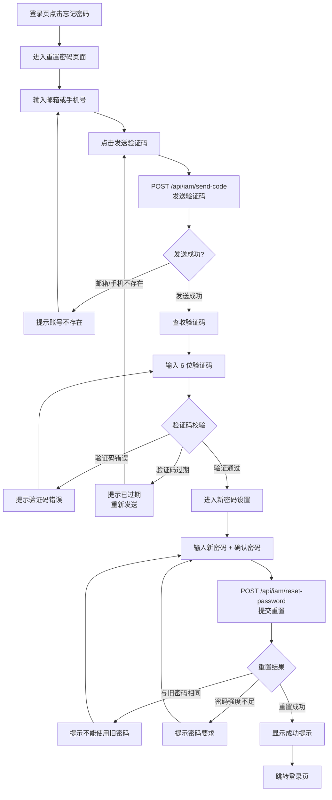

# 重置密码

## 功能简介

当您忘记了 Rune Console 的登录密码时，可以通过邮箱或手机号验证码重置密码。重置流程通过向您注册时绑定的邮箱或手机号发送验证码来确认身份，验证通过后即可设置新密码。重置成功后，所有已登录的会话将立即失效，您需要使用新密码重新登录。

## 进入路径

- 登录页面 → 点击「忘记密码？」链接
- 直接访问：`https://your-domain/console/auth/reset-password`

## 页面说明

重置密码页面采用分步式表单设计，需要依次完成身份验证和密码设置两个步骤。

### 步骤一：身份验证

首先需要验证您的身份，确认您是账号的合法持有者。

| 字段 | 类型 | 必填 | 说明 |
|------|------|------|------|
| 邮箱/手机号 | 文本输入 | ✅ | 输入注册时绑定的邮箱地址或手机号码 |
| 验证码 | 文本输入 | ✅ | 输入接收到的 6 位数字验证码 |

**验证码发送流程：**

1. 在输入框中填写注册时使用的邮箱地址或手机号码
2. 点击右侧的 **发送验证码** 按钮
3. 系统调用 `POST /api/iam/send-code` 接口，向目标邮箱/手机发送验证码
4. 按钮进入 **60 秒倒计时**，倒计时期间不可重复发送
5. 检查您的邮箱收件箱（或手机短信），获取 6 位数字验证码
6. 在验证码输入框中填写收到的验证码

> 💡 提示: 如果使用邮箱接收验证码，请同时检查垃圾邮件/广告邮件文件夹。验证码邮件的发件人通常为平台配置的系统邮箱地址。

> ⚠️ 注意: 验证码有效期约为 **5 分钟**。请在收到验证码后尽快完成后续操作。如果验证码已过期，请点击「重新发送」获取新的验证码。

### 步骤二：设置新密码

身份验证通过后，进入新密码设置页面。

| 字段 | 类型 | 必填 | 验证规则 | 说明 |
|------|------|------|----------|------|
| 新密码 | 密码输入 | ✅ | 不少于 8 个字符，包含大小写字母和数字 | 设置新的登录密码 |
| 确认密码 | 密码输入 | ✅ | 必须与新密码完全一致 | 重复输入新密码以确认 |

**新密码要求：**

| 要求 | 说明 |
|------|------|
| 最小长度 | 不少于 **8** 个字符 |
| 大写字母 | 至少包含 **1** 个大写字母（A-Z） |
| 小写字母 | 至少包含 **1** 个小写字母（a-z） |
| 数字 | 至少包含 **1** 个数字（0-9） |
| 历史密码 | 新密码不能与最近使用过的密码相同 |

> ⚠️ 注意: 密码输入框旁边提供了密码强度指示条，建议设置强度为「强」的密码以保障账号安全。

## 操作步骤

### 完整操作流程

1. 在登录页面点击「忘记密码？」链接
2. 进入重置密码页面
3. 在「邮箱/手机号」字段输入注册时绑定的邮箱或手机号
4. 点击 **发送验证码** 按钮
5. 前往邮箱收件箱或查看手机短信，获取 6 位数字验证码
6. 在「验证码」字段输入收到的验证码
7. 点击 **下一步** 或 **验证** 按钮
8. 系统验证通过后进入新密码设置页面
9. 在「新密码」字段输入新密码（需满足密码强度要求）
10. 在「确认密码」字段重复输入新密码
11. 点击 **重置密码** 按钮
12. 重置成功后，页面显示成功提示并自动跳转至登录页
13. 使用新密码登录

### 重置密码流程图

## 重置成功后的影响

密码重置成功后，以下事项会生效：

1. **所有会话立即失效**：您在所有设备和浏览器上的登录状态都会被清除
2. **Token 全部失效**：之前颁发的 JWT Token（Access Token 和 Refresh Token）将全部失效
3. **需要重新登录**：您需要在所有设备上使用新密码重新登录
4. **MFA 不受影响**：如果您已启用 MFA，MFA 绑定关系不会因密码重置而改变
5. **API Key 不受影响**：已创建的 API Key 不会因密码重置而失效

> 💡 提示: 如果您怀疑账号被盗用，在重置密码后建议同时检查并更新您的 MFA 设置和 API Key。

## 常见错误信息

| 错误提示 | 原因 | 解决方案 |
|----------|------|----------|
| 该邮箱未注册 | 输入的邮箱地址不在系统中 | 确认邮箱地址是否正确，或使用注册时的其他邮箱 |
| 验证码错误 | 输入的验证码与发送的不匹配 | 仔细核对邮件/短信中的验证码 |
| 验证码已过期 | 验证码超过 5 分钟有效期 | 点击「重新发送」获取新的验证码 |
| 新密码不能与旧密码相同 | 新密码与最近使用过的密码重复 | 设置一个之前未使用过的密码 |
| 密码强度不足 | 密码不满足复杂度要求 | 增加密码长度或添加缺失的字符类型 |
| 两次密码不一致 | 确认密码与新密码不匹配 | 重新输入确认密码 |
| 验证码发送过于频繁 | 短时间内多次请求发送验证码 | 等待 60 秒倒计时结束后再试 |

## 无法接收验证码的处理

如果您无法通过注册邮箱或手机号接收验证码，可能有以下原因和解决方案：

### 邮箱无法使用

- **邮箱已停用**：如果注册的邮箱账号已被注销或停用，您将无法收到验证码
- **企业邮箱被回收**：离职后企业邮箱可能被回收
- **解决方案**：联系系统管理员，通过后台管理直接重置您的密码

### 手机号已更换

- **号码已注销**：原手机号已被运营商回收
- **号码已过户**：手机号已转让他人
- **解决方案**：联系系统管理员，提供身份证明后由管理员协助重置

### 验证码邮件被拦截

- 检查垃圾邮件/广告邮件文件夹
- 将系统邮件发件人地址添加到白名单
- 联系 IT 部门确认企业邮件网关是否拦截了验证码邮件

> 💡 提示: 如果以上方法均无法解决问题，请联系系统管理员。管理员可以在 BOSS 后台的用户管理中直接为您重置密码，无需验证码。

## 安全建议

- 重置密码后，建议在所有常用设备上重新登录一次以确认新密码有效
- 重置密码后检查账号的登录历史，确认是否有异常登录记录
- 如果是因为怀疑账号被盗而重置密码，建议同时启用 [MFA](./mfa.md) 增强安全
- 不要使用与其他平台相同的密码
- 建议使用密码管理器安全存储密码

## 注意事项

- 验证码有效期约 5 分钟，请在收到后及时使用
- 新密码不能与最近使用过的密码相同
- 重置成功后所有已登录的会话将立即失效
- 60 秒内不可重复发送验证码
- 如果连续多次输入错误的验证码，可能会触发安全限制，需等待一段时间后再试
