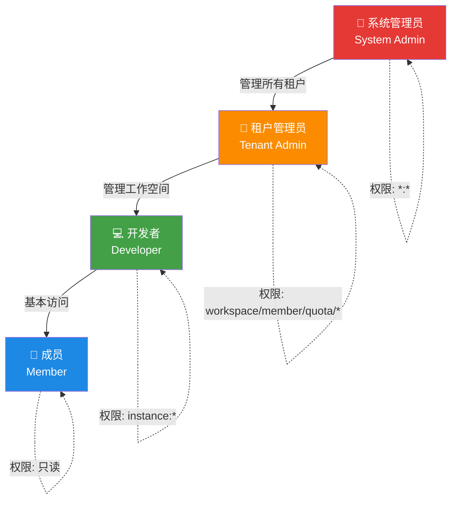
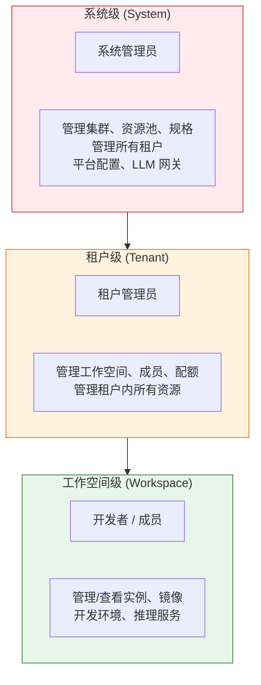
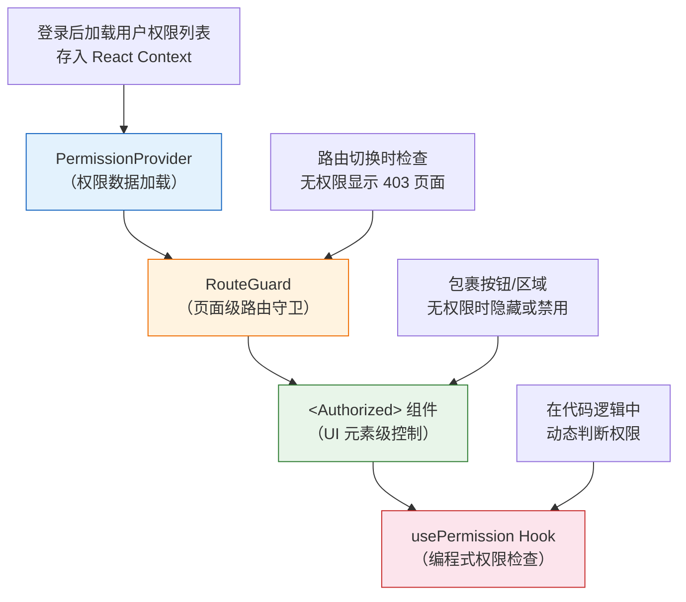

# 角色与权限

## 功能简介

Rune Console 采用基于角色的访问控制（RBAC，Role-Based Access Control）体系。平台预置了四种角色，每种角色拥有不同的权限范围和可操作的资源。权限在前端表现为导航菜单的显示/隐藏、UI 元素的可见/不可见、操作按钮的启用/禁用，但真正的安全控制始终由后端 API 保障——即使绕过前端限制直接调用 API，没有权限的请求同样会被拒绝。

## 角色体系概览



### 三级权限作用域

Rune Console 的权限体系分为三个层级，从上到下逐级收窄：



| 作用域 | 说明 | 涉及角色 |
|--------|------|----------|
| **系统级** | 整个平台范围，跨所有租户 | 系统管理员 |
| **租户级** | 单个租户范围内 | 租户管理员 |
| **工作空间级** | 单个工作空间范围内 | 开发者、成员 |

> 💡 提示: 高层级角色自动拥有低层级的所有权限。例如，租户管理员在其租户范围内拥有开发者和成员的所有权限。

## 角色详细说明

### 系统管理员 (System Admin)

- **作用域**：整个平台（系统级）
- **权限范围**：`*:*`（所有资源的所有操作）
- **访问界面**：Console + BOSS

系统管理员是平台的超级用户，拥有所有功能的完全访问权限。

**可执行的操作：**

| 操作类别 | 具体操作 |
|----------|----------|
| 集群管理 | 添加/编辑/删除计算集群，查看集群状态和监控 |
| 资源池管理 | 创建/配置资源池，分配资源到租户 |
| 规格管理 | 定义实例规格（GPU 类型、内存、CPU 等） |
| 租户管理 | 创建/禁用/删除租户，审批租户注册，分配配额 |
| 用户管理 | 管理平台所有用户，重置密码，重置 MFA |
| 系统模板 | 管理系统级镜像模板（所有租户可用） |
| LLM 网关 | 配置模型网关、API Key、审计日志、内容审核 |
| 平台配置 | 登录策略、注册策略、MFA 策略、平台主题 |
| 系统镜像 | 管理系统预置镜像 |
| 应用市场 | 管理系统级应用市场中的应用 |

**实际操作示例：**

```
# 系统管理员可以执行的操作举例
*:*                    → 所有资源的所有操作
cluster:create         → 创建新集群
resource-pool:update   → 编辑资源池配置
tenant:delete          → 删除租户
user:reset-password    → 重置用户密码
gateway:config         → 配置 LLM 网关
```

> ⚠️ 注意: 系统管理员拥有最高权限，请谨慎分配此角色。建议平台仅设置 1-2 个系统管理员，并强制启用 MFA。

### 租户管理员 (Tenant Admin)

- **作用域**：指定租户（租户级）
- **权限范围**：租户内的完整管理权限
- **访问界面**：Console

租户管理员负责管理一个租户内的所有资源和成员。

**权限明细：**

| 权限表达式 | 说明 | 包含的操作 |
|------------|------|------------|
| `workspace:*` | 工作空间的所有操作 | `create`, `list`, `get`, `update`, `delete` |
| `member:*` | 成员管理的所有操作 | `create`, `list`, `get`, `update`, `delete`, `invite` |
| `quota:*` | 配额的所有操作 | `list`, `get`, `update`, `allocate` |
| `instance:*` | 实例的所有操作 | `create`, `list`, `get`, `update`, `delete`, `start`, `stop` |
| `image:*` | 镜像的所有操作 | `create`, `list`, `get`, `update`, `delete`, `push`, `pull` |
| `template:*` | 模板的所有操作 | `create`, `list`, `get`, `update`, `delete` |
| `volume:*` | 存储卷的所有操作 | `create`, `list`, `get`, `update`, `delete`, `mount` |

**可以做什么：**

- ✅ 创建和管理工作空间
- ✅ 邀请新成员并分配角色
- ✅ 分配和调整配额
- ✅ 创建、启停、删除所有类型的实例
- ✅ 管理租户内的镜像、模板和存储卷
- ✅ 查看租户级别的使用统计和监控数据

**不可以做什么：**

- ❌ 管理计算集群和资源池（系统级）
- ❌ 创建或管理其他租户
- ❌ 访问 BOSS 后台管理界面
- ❌ 配置平台级设置（登录策略、MFA 策略等）
- ❌ 管理 LLM 网关配置

**实际操作示例：**

```
# 租户管理员的典型操作
workspace:create       → 创建新工作空间
member:invite          → 邀请新成员加入租户
quota:allocate         → 为工作空间分配 GPU 配额
instance:delete        → 删除不再使用的实例
image:push             → 上传自定义镜像
```

### 开发者 (Developer)

- **作用域**：指定租户（工作空间级）
- **权限范围**：实例的完全操作权限 + 其他资源的只读权限
- **访问界面**：Console

开发者是平台的主要使用者，可以创建和管理自己的计算实例。

**权限明细：**

| 权限表达式 | 说明 | 包含的操作 |
|------------|------|------------|
| `workspace:list` | 列出工作空间 | `list` |
| `workspace:get` | 查看工作空间详情 | `get` |
| `instance:*` | 实例的所有操作 | `create`, `list`, `get`, `update`, `delete`, `start`, `stop` |
| `image:list` | 列出镜像 | `list` |
| `image:get` | 查看镜像详情 | `get` |
| `template:list` | 列出模板 | `list` |
| `template:get` | 查看模板详情 | `get` |

**可以做什么：**

- ✅ 创建各类实例（推理服务、微调任务、开发环境等）
- ✅ 启动、停止、重启自己的实例
- ✅ 删除自己创建的实例
- ✅ 浏览可用的镜像和模板
- ✅ 查看工作空间信息
- ✅ 使用应用市场中的应用

**不可以做什么：**

- ❌ 创建或删除工作空间
- ❌ 邀请或移除成员
- ❌ 调整配额
- ❌ 管理镜像（上传/删除自定义镜像）
- ❌ 管理模板
- ❌ 管理存储卷

**实际操作示例：**

```
# 开发者的典型操作
instance:create        → 创建新的开发环境实例
instance:start         → 启动已停止的实例
instance:stop          → 停止运行中的实例
image:list             → 浏览可用镜像列表
template:get           → 查看模板详细信息
```

### 成员 (Member)

- **作用域**：指定租户（工作空间级）
- **权限范围**：资源的只读权限
- **访问界面**：Console（只读）

成员是权限最低的角色，仅可查看资源信息，不能进行任何写操作。

**权限明细：**

| 权限表达式 | 说明 | 包含的操作 |
|------------|------|------------|
| `workspace:list` | 列出工作空间 | `list` |
| `workspace:get` | 查看工作空间详情 | `get` |
| `instance:list` | 列出实例 | `list` |
| `instance:get` | 查看实例详情 | `get` |
| `image:list` | 列出镜像 | `list` |
| `image:get` | 查看镜像详情 | `get` |

**可以做什么：**

- ✅ 查看工作空间列表和详情
- ✅ 查看实例列表和详情（状态、日志等）
- ✅ 浏览可用镜像列表

**不可以做什么：**

- ❌ 创建/启动/停止/删除任何实例
- ❌ 管理工作空间
- ❌ 管理成员
- ❌ 上传或管理镜像
- ❌ 执行任何写操作

> 💡 提示: 成员角色适用于需要查看项目进展但不需要直接操作资源的人员，如项目经理、产品经理、审计人员等。

## 角色对比总览表

下表汇总了四种角色在各资源上的权限对比：

| 资源 | 操作 | 系统管理员 | 租户管理员 | 开发者 | 成员 |
|------|------|:----------:|:----------:|:------:|:----:|
| **集群** | 创建/编辑/删除 | ✅ | ❌ | ❌ | ❌ |
| **资源池** | 创建/编辑/删除 | ✅ | ❌ | ❌ | ❌ |
| **租户** | 创建/管理 | ✅ | ❌ | ❌ | ❌ |
| **平台设置** | 配置 | ✅ | ❌ | ❌ | ❌ |
| **LLM 网关** | 配置 | ✅ | ❌ | ❌ | ❌ |
| **工作空间** | 创建/编辑/删除 | ✅ | ✅ | ❌ | ❌ |
| **工作空间** | 查看 | ✅ | ✅ | ✅ | ✅ |
| **成员** | 邀请/管理 | ✅ | ✅ | ❌ | ❌ |
| **配额** | 分配/调整 | ✅ | ✅ | ❌ | ❌ |
| **实例** | 创建/启停/删除 | ✅ | ✅ | ✅ | ❌ |
| **实例** | 查看 | ✅ | ✅ | ✅ | ✅ |
| **镜像** | 上传/删除 | ✅ | ✅ | ❌ | ❌ |
| **镜像** | 查看 | ✅ | ✅ | ✅ | ✅ |
| **模板** | 创建/编辑/删除 | ✅ | ✅ | ❌ | ❌ |
| **模板** | 查看 | ✅ | ✅ | ✅ | ✅ |
| **存储卷** | 创建/挂载/删除 | ✅ | ✅ | ❌ | ❌ |

## 权限表达式格式

Rune Console 使用简洁的文本格式表达权限，格式为：

```
[service:]<resource>:<action>
```

### 格式说明

| 部分 | 是否必须 | 说明 | 示例 |
|------|----------|------|------|
| `service` | 可选 | 服务前缀，用于区分不同微服务 | `compute`、`gateway` |
| `resource` | 必须 | 资源类型 | `instance`、`workspace`、`member` |
| `action` | 必须 | 操作类型 | `create`、`list`、`get`、`update`、`delete` |

### 权限表达式示例

```
# 基本格式
instance:create          → 创建实例
workspace:list           → 列出工作空间
member:delete            → 删除成员

# 带服务前缀
compute:instance:create  → 计算服务中的创建实例
gateway:config:update    → 网关服务中的更新配置

# 通配符
instance:*               → 实例的所有操作
*:*                      → 所有资源的所有操作
workspace:list/get       → 工作空间的列出和查看操作
```

### 通配符匹配规则

权限验证时使用通配符匹配：

| 表达式 | 匹配范围 | 说明 |
|--------|----------|------|
| `*:*` | 所有资源的所有操作 | 系统管理员的权限 |
| `instance:*` | 实例的所有操作 | 包含 create、list、get、update、delete 等 |
| `workspace:list/get` | 工作空间的列出和查看 | 多个 action 用 `/` 分隔 |

验证逻辑：当用户执行某个操作时，系统检查用户角色的权限列表中是否有匹配的表达式。匹配规则为：

1. 精确匹配：`instance:create` 匹配 `instance:create` ✅
2. 资源通配：`instance:*` 匹配 `instance:create` ✅
3. 全通配：`*:*` 匹配任何权限表达式 ✅
4. 不匹配：`instance:list` 不匹配 `instance:create` ❌

## 前端权限控制机制

Rune Console 在前端实现了多层次的权限控制，从上到下层层过滤，确保不同角色看到合适的界面：



### 1. PermissionProvider（权限数据层）

- 用户登录后，系统获取当前用户的角色和权限列表
- 权限数据通过 React Context 在整个应用中共享
- 切换租户或工作空间时自动重新加载权限

### 2. RouteGuard（页面级路由守卫）

- 每个路由可以配置所需的权限
- 用户导航到某个页面时，RouteGuard 检查是否拥有对应权限
- 无权限时展示 403 禁止访问页面，而不是空白页或报错
- 示例：访问「成员管理」页面需要 `member:list` 权限

### 3. `<Authorized>` 组件（UI 元素级控制）

- 用于包裹需要权限控制的 UI 元素（按钮、菜单项、操作区域等）
- 无权限时可选择隐藏元素或将元素设为禁用状态
- 示例：「创建实例」按钮仅对拥有 `instance:create` 权限的用户可见

### 4. `usePermission` Hook（编程式权限检查）

- 在组件逻辑中通过代码判断用户是否拥有某权限
- 返回布尔值，用于条件渲染和逻辑分支
- 示例：`const canCreate = usePermission('instance:create')`

> ⚠️ 注意: 前端权限控制仅为 UI 层面的体验优化，用于避免用户看到无权操作的按钮或页面。实际的安全控制始终由后端 API 实现——即使前端代码被篡改，后端仍会拒绝没有权限的请求。

### 导航菜单过滤

左侧导航栏根据用户角色自动过滤可见的菜单项：

| 菜单项 | 系统管理员 | 租户管理员 | 开发者 | 成员 |
|--------|:----------:|:----------:|:------:|:----:|
| 总览/Dashboard | ✅ | ✅ | ✅ | ✅ |
| 推理服务 | ✅ | ✅ | ✅ | ❌ |
| 微调服务 | ✅ | ✅ | ✅ | ❌ |
| 开发环境 | ✅ | ✅ | ✅ | ❌ |
| 应用 | ✅ | ✅ | ✅ | ❌ |
| 实验 | ✅ | ✅ | ✅ | ❌ |
| 评测 | ✅ | ✅ | ✅ | ❌ |
| 应用市场 | ✅ | ✅ | ✅ | ❌ |
| 日志查看 | ✅ | ✅ | ✅ | ❌ |
| 成员管理 | ✅ | ✅ | ❌ | ❌ |
| 工作空间管理 | ✅ | ✅ | ❌ | ❌ |
| 配额管理 | ✅ | ✅ | ❌ | ❌ |
| BOSS 后台 | ✅ | ❌ | ❌ | ❌ |

## 角色分配与变更

### 谁可以分配角色

| 操作 | 可执行的角色 |
|------|-------------|
| 分配/变更系统管理员 | 系统管理员 |
| 分配/变更租户管理员 | 系统管理员、租户管理员 |
| 分配/变更开发者 | 租户管理员 |
| 分配/变更成员 | 租户管理员 |

### 如何变更用户角色

**租户管理员调整租户内成员角色：**

1. 进入 Console → 成员管理
2. 找到目标用户
3. 点击「编辑」按钮
4. 在角色下拉框中选择新的角色
5. 点击「保存」

**系统管理员调整系统角色：**

1. 进入 BOSS → 用户管理
2. 找到目标用户
3. 编辑用户角色

### 角色变更的即时生效

角色变更后的生效时机：

- 如果用户当前在线，权限变更不会立即生效
- 用户需要 **刷新页面** 或 **重新登录** 后新权限才会加载
- 系统建议在变更重要权限后通知用户刷新页面

## 权限刷新时机

以下场景会触发权限数据的重新获取：

| 场景 | 说明 |
|------|------|
| 用户登录后 | 登录成功时加载初始权限数据 |
| 切换租户时 | 不同租户中可能是不同角色 |
| 切换工作空间时 | 工作空间级别可能有额外的权限配置 |
| 角色变更后 | 管理员修改了您的角色（需要刷新页面） |
| 手动刷新页面 | 浏览器刷新会重新获取权限数据 |

## 实际场景示例

### 场景一：AI 团队日常使用

- **张三**（租户管理员）：创建工作空间「模型训练」和「推理部署」，邀请团队成员，分配 GPU 配额
- **李四**（开发者）：在「模型训练」工作空间中创建微调任务，部署推理服务
- **王五**（开发者）：在「推理部署」工作空间中管理推理实例，调试开发环境
- **赵六**（成员-产品经理）：查看各工作空间的实例状态和使用情况

### 场景二：多租户管理

- **管理员 A**（系统管理员）：创建租户「研发部」和「产品部」，分配集群资源
- **管理员 B**（租户管理员-研发部）：管理研发部的工作空间和成员
- **管理员 C**（租户管理员-产品部）：管理产品部的工作空间和成员
- **开发者 D**：同时属于「研发部」（开发者角色）和「产品部」（成员角色）

> 💡 提示: 一个用户可以在不同租户中拥有不同的角色。切换租户时，界面会根据您在目标租户中的角色自动调整。

## 注意事项

- 前端权限仅为 UI 体验优化，实际安全由后端 API 保障
- 如果发现权限异常，请尝试刷新页面或重新登录以重新加载权限
- 需要更高权限请联系对应租户的管理员或系统管理员
- 角色变更后需要刷新页面或重新登录才能生效
- 系统管理员角色应谨慎分配，建议启用 MFA 加强安全
