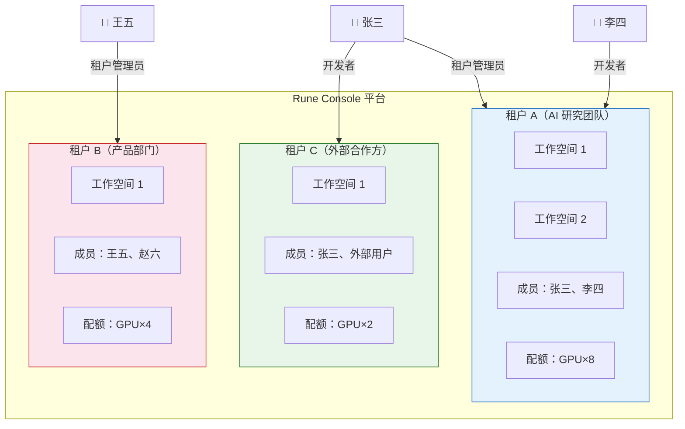
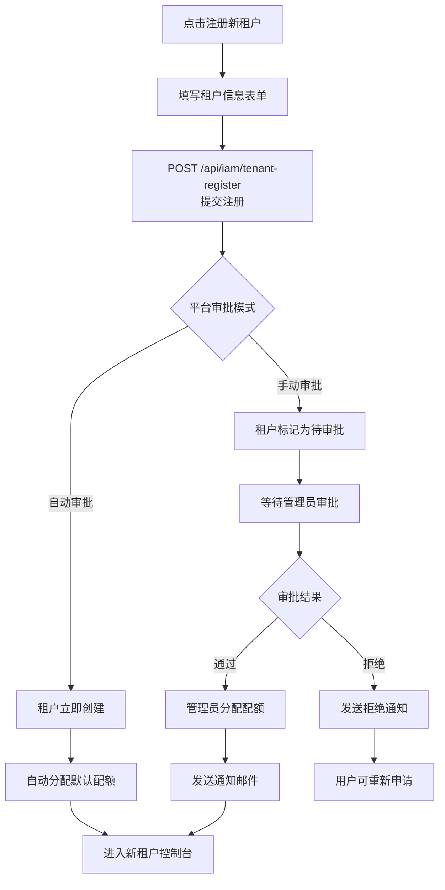

# 选择/注册租户

## 功能简介

Rune Console 采用多租户架构，每个租户是一个独立的资源隔离单元，拥有自己的工作空间、成员、配额和资源。用户登录后，如果属于多个租户或尚未加入任何租户，系统将引导用户选择目标租户或注册新租户。租户的概念类似于「组织」或「团队」，不同租户之间的数据和资源完全隔离。

## 多租户概念

如上图所示，一个用户可以同时属于多个租户，且在不同租户中可以拥有不同的角色。例如，张三在「AI 研究团队」中是租户管理员，但在「外部合作方」中仅是开发者。

> 💡 提示: 租户间的资源完全隔离。您在租户 A 中创建的实例、数据集、模型等资源，在租户 B 中不可见，也不可访问。

## 进入路径

- 登录后自动跳转（当用户属于多个租户时）
- 地址：`/auth/select-tenant`
- 头像菜单 → 「切换租户」

## 选择租户

### 页面说明

登录成功后，如果您属于多个租户，系统会展示租户选择页面。该页面以卡片列表的形式展示您有权访问的所有租户。

### 租户卡片信息

每个租户卡片显示以下信息：

| 信息 | 说明 |
|------|------|
| 租户名称 | 租户的显示名称 |
| 租户 ID | 租户的唯一标识符 |
| 您的角色 | 您在该租户中的角色（租户管理员/开发者/成员） |
| 成员数量 | 该租户中的成员总数 |
| 租户状态 | 正常/已禁用/审批中 |

### 操作步骤

1. 登录成功后，系统自动调用 `GET /api/iam/current/tenants` 获取您的租户列表
2. 页面以卡片列表形式展示您有权访问的所有租户
3. 浏览租户列表，确认各租户中您的角色
4. 点击目标租户卡片即可进入该租户的控制台

> 💡 提示: 如果您只属于一个租户，登录后会自动跳过此页面，直接进入该租户的控制台首页。

### 搜索与筛选

当您属于较多租户时，可通过以下方式快速定位：

- **搜索框**：输入租户名称或 ID 进行模糊搜索
- **排序**：按最近访问时间排序，常用的租户排在前面

## 注册新租户

如果您还没有租户，或希望创建一个新的独立工作空间，可以在租户选择页面注册新租户。

### 页面说明

### 注册表单

点击租户选择页面中的 **「注册新租户」** 按钮，进入租户注册表单：

| 字段 | 类型 | 必填 | 验证规则 | 说明 |
|------|------|------|----------|------|
| 租户名称 | 文本输入 | ✅ | 2-64 个字符 | 租户的显示名称，可包含中文 |
| 租户 ID | 文本输入 | ✅ | 3-32 个字符，仅小写字母、数字和短横线，以字母开头 | 租户的唯一标识，创建后 **不可更改** |
| 描述 | 文本域 | — | 最多 256 个字符 | 租户的用途或团队描述 |
| 联系人邮箱 | 邮箱输入 | 视配置 | 标准邮箱格式 | 租户管理联系邮箱 |

> ⚠️ 注意: 租户 ID 创建后不可更改，它会出现在 API 调用和资源标识中，请使用有意义的简短英文名称。例如：`ai-research-team`、`product-dept`。

### 操作步骤

1. 在租户选择页面点击 **「注册新租户」** 按钮
2. 填写租户名称（显示用途）
3. 设置租户 ID（唯一标识，不可更改）
4. 可选填写描述和联系人邮箱
5. 点击 **「提交注册」** 按钮
6. 系统调用 `POST /api/iam/tenant-register` 提交租户注册请求

### 注册结果处理

租户注册提交后的处理方式取决于平台配置：

**自动审批模式：**
1. 提交后立即创建租户
2. 您自动成为该租户的「租户管理员」角色
3. 系统自动进入新租户的控制台
4. 您可以开始邀请成员和配置工作空间

**手动审批模式：**
1. 提交后租户标记为「待审批」状态
2. 页面显示「租户注册申请已提交，请等待系统管理员审批」
3. 系统管理员在 BOSS 后台审批租户注册申请
4. 审批通过后，系统管理员为该租户分配资源配额
5. 系统发送邮件/通知告知您审批结果
6. 您收到通知后重新登录，即可在租户列表中看到新租户

> 💡 提示: 新创建的租户默认没有资源配额。在手动审批模式下，管理员会在审批时分配初始配额；在自动审批模式下，系统会分配预设的默认配额。如果您需要更多资源，请联系系统管理员调整配额。

## 切换租户

在已登录并进入某个租户后，您可以随时切换到其他租户，无需退出登录。

### 通过头像菜单切换

1. 点击页面右上角的用户头像区域
2. 在弹出的下拉菜单中，可以看到当前租户的名称和角色
3. 点击 **「切换租户」** 选项
4. 系统弹出租户选择弹窗，列出您有权访问的所有租户
5. 点击目标租户即可切换

### 切换租户时发生的事情

切换租户后，系统会执行以下操作：

1. **更新上下文**：当前租户信息、工作空间列表、配额信息全部切换为目标租户
2. **重新加载权限**：您的角色和权限会根据目标租户中的设定重新加载
3. **导航菜单刷新**：左侧导航栏根据新租户中的角色重新过滤
4. **页面跳转**：自动跳转到新租户的控制台首页
5. **工作空间重置**：如果目标租户有多个工作空间，您可能需要选择目标工作空间

> ⚠️ 注意: 切换租户后，之前在旧租户中打开的页面可能会失效。如果您正在进行操作（如创建实例），请先完成或取消操作再切换租户。

### 快捷切换

- 在头像下拉菜单中，最近使用过的租户会排在列表前面
- 可以通过搜索框快速查找目标租户

## 租户的角色与权限

同一个用户在不同租户中可以拥有不同的角色：

| 场景 | 说明 |
|------|------|
| 在租户 A 中是「租户管理员」 | 拥有该租户的完整管理权限 |
| 在租户 B 中是「开发者」 | 可以创建和管理实例，但不能管理成员和配额 |
| 在租户 C 中是「成员」 | 仅可查看资源，无法进行写操作 |

当您切换到不同租户时，界面会根据您在该租户中的角色自动调整可见的功能菜单和可执行的操作。

> 💡 提示: 如果您在某个租户中需要更高的权限，请联系该租户的管理员为您调整角色。

## 常见问题

### 登录后没有任何租户

如果您是新注册的用户，可能还没有加入任何租户。此时您有两个选择：

1. **注册新租户**：创建一个属于自己的租户
2. **联系管理员**：请已有租户的管理员将您添加为成员

### 租户显示为「已禁用」

如果租户列表中某个租户显示为「已禁用」状态：

- 该租户已被系统管理员禁用
- 您无法选择进入已禁用的租户
- 请联系系统管理员了解详情

### 找不到之前的租户

如果您确认自己属于某个租户但列表中没有显示：

- 可能是租户管理员将您移出了该租户
- 可能是该租户已被删除或禁用
- 请联系相关租户管理员或系统管理员

## 注意事项

- 不同租户之间资源完全隔离，数据不互通
- 您在不同租户中可能拥有不同的角色和权限
- 切换租户后，工作空间和资源上下文会重新加载
- 租户 ID 一旦创建不可更改，请谨慎设置
- 新租户需要管理员分配资源配额后才能正常使用
