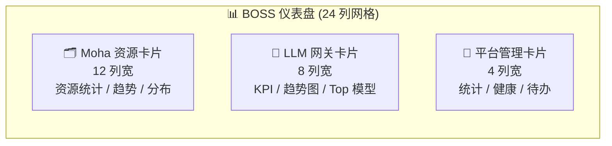
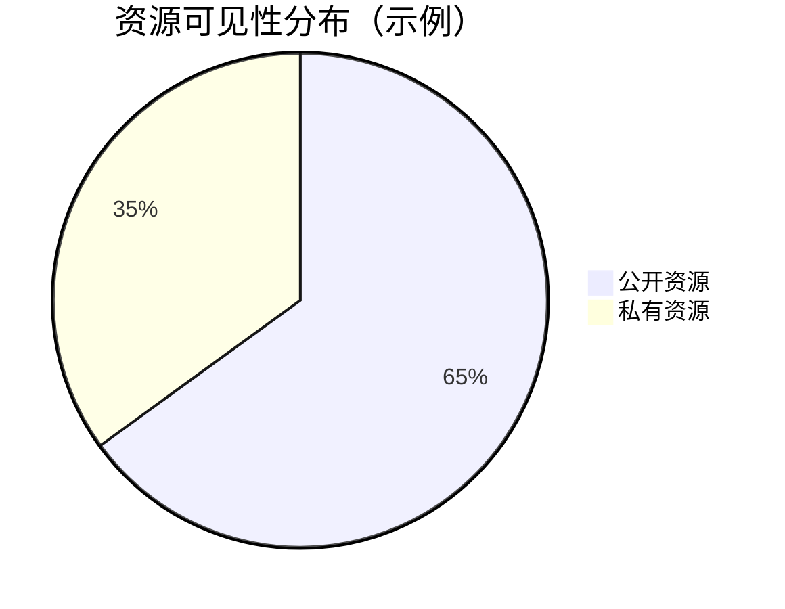
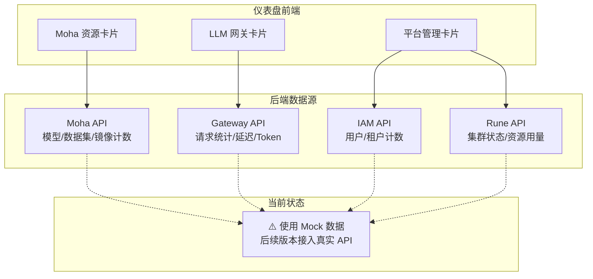

# 平台仪表盘

## 功能简介

BOSS 仪表盘是系统管理员进入管理门户后的**首屏页面**，提供平台全局的运营态势感知。仪表盘通过三大主题卡片——**Moha 资源卡片**、**LLM 网关卡片**和**平台管理卡片**——将平台最关键的运营数据集中呈现，帮助管理员快速掌握资源使用情况、网关运营状态及平台整体健康度。

## 进入路径

BOSS → 首页 / 仪表盘

路径：`/boss/dashboard`

## 页面布局

仪表盘采用响应式网格布局，三张卡片按列宽分布：

| 卡片 | 列宽 | 位置 | 核心内容 |
|------|------|------|----------|
| Moha 资源卡片 | 12 列 | 左侧 | 模型/数据集/工作空间/镜像统计、热门列表、公开/私有分布 |
| LLM 网关卡片 | 8 列 | 中间 | 请求总量/平均延迟/Token总量/错误率、24h趋势图、Top 5 模型 |
| 平台管理卡片 | 4 列 | 右侧 | 租户/集群/用户数、资源健康度、待处理事项 |

> 💡 提示: 当前仪表盘数据为 **Mock 数据**（模拟数据），用于展示仪表盘的布局和交互设计。后续版本将接入真实后端 API，届时所有指标将实时更新。

---

## Moha 资源卡片

Moha 资源卡片占据 **12 列宽**（页面左半部分），是仪表盘中面积最大的卡片，集中展示 Moha 数据仓库的资源全貌。

### 资源总量统计

卡片顶部以四个计数器展示核心资源总量：

| 指标 | 图标 | 说明 |
|------|------|------|
| **模型数** | 🤖 | 平台中所有模型仓库的总数 |
| **数据集数** | 📊 | 平台中所有数据集的总数 |
| **工作空间数** | 💻 | 所有 Space 工作空间的总数 |
| **镜像数** | 🐳 | 镜像仓库中的镜像总数 |

每个计数器会显示该类资源的**公开数量**和**私有数量**，直观反映资源开放程度。

### 热门资源趋势列表

卡片中部展示各资源类别下的**热门资源排行**，基于近期下载量、访问量或引用次数排序：

- **热门模型** — 近期被最多用户使用或下载的模型
- **热门数据集** — 近期被最多引用或下载的数据集
- **热门 Space** — 近期访问量最高的 Space 应用

每个热门条目包含资源名称、所属组织、趋势箭头（↑/↓）和变化幅度。

### 公开/私有分布

卡片底部以分布条或饼图展示各类资源的**公开（Public）与私有（Private）**占比，帮助管理员了解平台资源的开放程度：

> 💡 提示: 如果私有资源占比过高，可能意味着平台的资源共享文化有待加强；反之如果公开资源过多，则需关注数据安全合规。

---

## LLM 网关卡片

LLM 网关卡片占据 **8 列宽**，聚焦展示 LLM Gateway 的实时运营数据，帮助管理员监控模型服务的可用性和性能。

### 四大核心 KPI

卡片顶部以四个指标卡展示网关核心运营指标，每个指标配有**趋势箭头**（对比前一周期）：

| KPI 指标 | 单位 | 趋势 | 说明 |
|----------|------|------|------|
| **请求总量** | 次 | ↑/↓ | 统计周期内的 API 请求总次数 |
| **平均延迟** | ms | ↑/↓ | 所有请求的平均响应延时 |
| **Token 总量** | 个 | ↑/↓ | 统计周期内消耗的总 Token 数 |
| **错误率** | % | ↑/↓ | 返回非 2xx 响应的请求占比 |

趋势箭头颜色说明：
- 🟢 **绿色上箭头**: 请求量/Token量增长（表示使用量增加，属正向）
- 🔴 **红色上箭头**: 延迟/错误率增长（表示质量下降，需关注）
- 🟢 **绿色下箭头**: 延迟/错误率下降（表示质量改善）

### 24 小时趋势图

卡片中部展示一个**面积图（Area Chart）**，以 24 小时为横轴展示请求量的时间分布。通过趋势图，管理员可以：

- 识别**请求高峰时段**（如工作日上午 9-11 点）
- 发现**异常请求脉冲**（如突发的大量请求）
- 评估**服务容量**是否满足高峰需求

### Top 5 热门模型

卡片底部展示请求量最高的 **5 个模型**排行：

| 排名 | 展示字段 | 说明 |
|------|----------|------|
| 1-5 | 模型名称 | 被调用的模型标识 |
| — | 请求占比 | 该模型请求量占总请求的百分比 |
| — | 进度条 | 可视化请求占比 |

> ⚠️ 注意: 网关卡片目前使用 Mock 数据。接入真实数据后，KPI 指标和趋势图将支持自定义时间范围的筛选。

---

## 平台管理卡片

平台管理卡片占据 **4 列宽**（页面最右侧），以紧凑的形式展示平台基础设施和管理状态。

### 平台统计数字

卡片顶部展示三个核心平台实体计数：

| 指标 | 说明 |
|------|------|
| **租户数** | 平台中已创建的租户总数 |
| **集群数** | 已接入的 Kubernetes 集群总数 |
| **用户数** | 平台已注册的用户总数 |

### 资源健康度

卡片中部以进度条或仪表盘形式展示关键基础设施指标的健康度：

| 指标 | 健康区间 | 警告区间 | 危险区间 |
|------|----------|----------|----------|
| **CPU 使用率** | 0%-60% | 60%-85% | >85% |
| **内存使用率** | 0%-70% | 70%-90% | >90% |
| **资源容量** | 0%-75% | 75%-90% | >90% |

健康度以颜色编码直观展示：
- 🟢 **绿色**: 健康状态，资源充裕
- 🟡 **黄色**: 预警状态，需关注
- 🔴 **红色**: 危险状态，需立即处理

### 待处理事项

卡片底部列出当前待管理员处理的事项，例如：

- 待审批的租户申请
- 连接异常的集群
- 配额即将用尽的租户
- 过期的 API Key

> 💡 提示: 待处理事项可点击直接跳转到对应的管理页面，帮助管理员快速响应。

---

## 仪表盘数据架构

## 常见问题

### 仪表盘数据为什么不是实时的？

当前版本的仪表盘使用 Mock（模拟）数据进行展示，目的是验证仪表盘的布局设计和交互体验。后续版本将逐步接入真实后端 API，届时数据将按照配置的刷新间隔自动更新。

### 卡片是否支持自定义？

当前版本的三张卡片布局和内容是固定的。平台设置中的**动态仪表板**功能可用来创建更灵活的自定义监控面板，支持自由添加和排列图表组件。

### 如何判断平台是否健康？

重点关注以下信号：
1. **资源健康度**全部为绿色
2. **网关错误率**低于 1%
3. **平均延迟**在合理范围内（建议 < 500ms）
4. **待处理事项**数量为 0

> ⚠️ 注意: 即使仪表盘显示一切正常，也建议定期进入各管理模块进行深入检查，仪表盘展示的是概要信息，无法覆盖所有细节。
