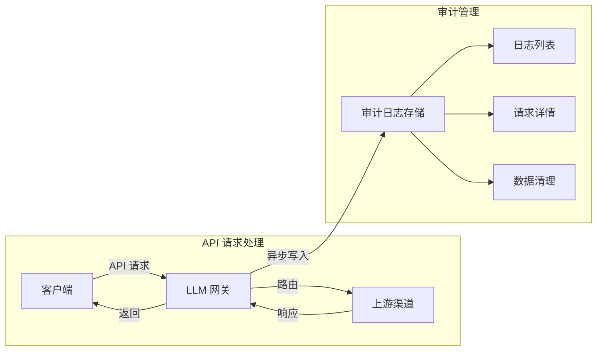
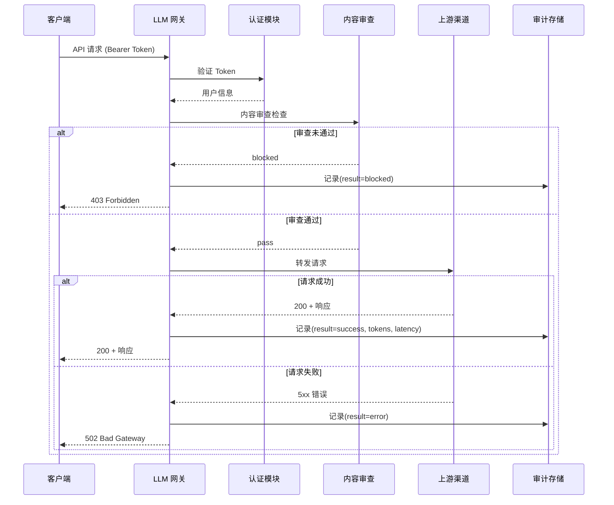

# 审计日志

## 功能简介

审计日志是 LLM 网关的**安全合规核心功能**，完整记录每一次通过网关的 API 请求的详细信息，包括请求者身份、使用的模型、Token 消耗、处理结果、完整的请求/响应负载等。审计日志为安全审查、问题排查、合规审计和使用分析提供可靠的数据支撑。

> 💡 提示: 审计功能通过 [网关配置](./config.md) 中的 `auditEnabled` 开关控制。建议在生产环境中始终保持审计功能开启，以满足安全合规要求。

## 进入路径

BOSS → LLM 网关 → **审计日志**

路径：`/boss/gateway/audit`

API 基路径：`/api/airouter/v1/audit`

## 审计数据流



## 筛选条件

页面顶部提供多维度筛选器，支持精准定位目标审计记录：


| 筛选器 | 类型 | 说明 |
|--------|------|------|
| 用户 | 下拉选择 | 按请求用户筛选 |
| Token | 下拉选择 | 按使用的 API Token 筛选 |
| 提供商 | 下拉选择 | 按上游模型提供商筛选 |
| 模型 | 下拉选择 | 按请求的模型名称筛选 |
| 时间范围 | 日期范围选择器 | 按请求发生时间筛选 |
| 结果 | 下拉选择 | 按处理结果筛选：`success` / `error` |

> 💡 提示: 排查特定用户问题时，建议组合使用「用户」和「时间范围」筛选器，快速定位该用户在指定时段内的所有请求记录。

## 审计记录列表


| 列 | 字段名 | 说明 | 备注 |
|----|--------|------|------|
| 请求 ID | `requestId` | 唯一请求标识 | 可点击跳转详情页；含敏感信息的请求会显示⚠️警告图标 |
| 请求时间 | `requestStarted` | 请求发起时间戳 | 精确到毫秒 |
| 用户名/用户 ID | `username` / `userId` | 请求发起者 | 同时显示用户名和 ID |
| Token ID | `tokenId` | 使用的 API Token | 截断显示（仅前 8 位） |
| 租户 ID | `tenantId` | 所属租户标识 | — |
| 渠道名称 | `channelName` | 路由到的渠道名称 | — |
| 模型 | `model` | 请求的模型名称 | — |
| 结果 | `result` | 请求处理结果 | 彩色标签 |
| Token 总数 | `totalTokens` | 本次请求消耗的总 Token 数 | Prompt + Completion |
| 操作 | — | 查看详情 | — |

### 结果状态颜色编码

| 结果 | 颜色 | 枚举值 | 说明 |
|------|------|--------|------|
| 成功 | 🟢 绿色 | `success` | 请求成功处理并返回结果 |
| 错误 | 🔴 红色 | `error` | 请求处理过程中发生错误 |
| 已拦截 | 🟠 橙色 | `blocked` | 被内容审查策略拦截 |
| 配额超限 | 🔴 红色 | `quota_exceeded` | 超出 Token 使用配额 |

### 敏感内容警告

当请求内容触发了 [内容审查](./moderation.md) 策略检测时，审计记录的请求 ID 旁会显示 ⚠️ 警告图标，提醒管理员该请求涉及敏感内容。

> ⚠️ 注意: 敏感内容标记不代表请求一定被拦截。根据审查策略的 Action 配置（log/replace/block），部分请求可能仅记录日志或替换内容后放行。

## 审计详情页

点击请求 ID 进入详情页，查看该请求的完整信息：


### 基本信息

| 字段 | 说明 |
|------|------|
| 请求 ID | 唯一标识 |
| 用户 | 请求用户（用户名 + ID） |
| Token | 使用的 API Token（完整 ID） |
| 租户 | 所属租户 |
| 渠道 | 路由使用的渠道 |
| 模型 | 请求的模型 |
| 结果 | 处理结果（彩色标签） |
| 请求时间 | 请求开始时间 |
| 响应时间 | 响应完成时间 |
| 延迟 | 端到端延迟（毫秒） |

### Token 统计

| 字段 | 说明 |
|------|------|
| Prompt Tokens | 输入 Token 数量 |
| Completion Tokens | 输出 Token 数量 |
| Total Tokens | 总 Token 数量 |

### 请求负载（Request Payload）

展示完整的 API 请求体，通常包含：

```json
{
  "model": "gpt-4",
  "messages": [
    {"role": "system", "content": "You are a helpful assistant."},
    {"role": "user", "content": "...用户的完整输入..."}
  ],
  "temperature": 0.7,
  "max_tokens": 2048
}
```

### 响应负载（Response Payload）

展示完整的 API 响应体，包含模型的输出内容和 usage 统计。

> ⚠️ 注意: 请求和响应负载可能包含用户的隐私信息或敏感内容。请确保只有授权人员可以访问审计详情页，并遵循数据安全规范。

## 数据清理

随着时间推移，审计日志数据会持续增长。管理员可以定期清理过期的审计记录以释放存储空间。

**API 端点**：`DELETE /api/airouter/v1/audit/cleanup?before=<ISO8601DateTime>`

**参数说明**：

| 参数 | 类型 | 说明 |
|------|------|------|
| `before` | ISO 8601 日期 | 清理此时间之前的所有审计记录 |

**示例**：

```bash
# 清理 90 天前的审计记录
DELETE /api/airouter/v1/audit/cleanup?before=2025-11-27T00:00:00Z
```

> ⚠️ 注意: 数据清理操作不可撤销。建议在清理前先导出需要保留的审计数据。根据合规要求，审计日志通常需要保留 180 天以上。

## 审计流程



## API 参考

| 操作 | 方法 | 端点 | 说明 |
|------|------|------|------|
| 查询审计记录 | GET | `/api/airouter/v1/audit/records` | 分页查询，支持多条件筛选 |
| 获取记录详情 | GET | `/api/airouter/v1/audit/records/:id` | 获取单条记录的完整详情 |
| 清理历史记录 | DELETE | `/api/airouter/v1/audit/cleanup?before=` | 批量清理指定日期之前的记录 |

## 权限要求

需要 **系统管理员** 角色。审计日志包含用户的完整请求和响应数据，属于高度敏感信息，仅系统管理员可查看。
