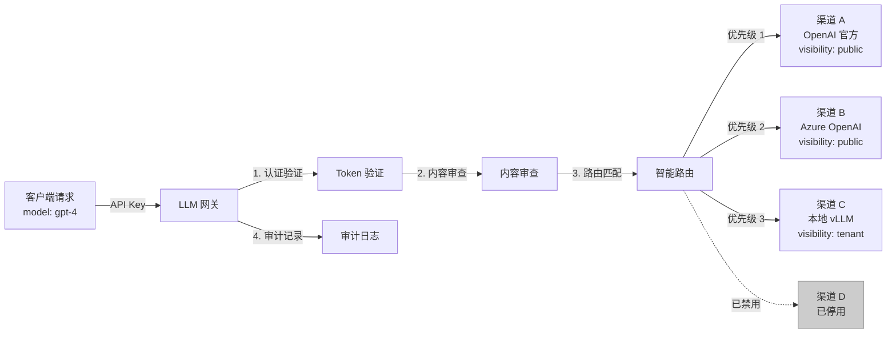
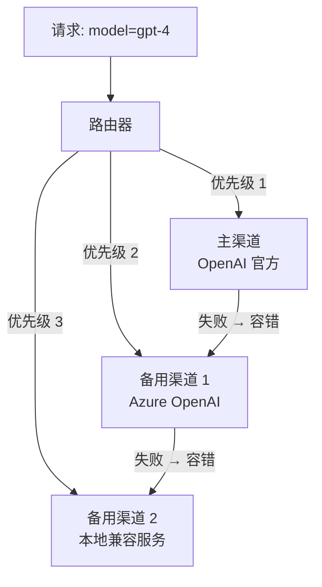

# 模型渠道管理

## 功能简介

模型渠道（Channel）是 LLM 网关的核心概念——每个渠道代表一个**上游模型服务端点**，可以是外部 API 提供商（如 OpenAI、阿里云百炼）、第三方平台或平台内部的自建推理服务。网关根据路由策略将用户的 API 请求智能分发到合适的渠道进行处理。

渠道管理页面允许系统管理员配置和管理所有上游模型渠道，包括添加、编辑、启用/禁用、可见性控制和路由优先级设置。

> 💡 提示: 渠道是连接客户端请求与上游推理服务的桥梁。合理配置多个渠道可实现负载均衡、故障容错和多模型统一接入。

## 进入路径

BOSS → LLM 网关 → **模型列表**

路径：`/boss/gateway/channels`

## 渠道路由架构



## 渠道列表


| 列 | 字段 | 说明 | 备注 |
|----|------|------|------|
| 可见性 + 名称 | `visibility` + `name` | 渠道名称，前缀彩色可见性标签 | 标签颜色：`public`=绿色(success)、`tenant`=橙色(warning)、`private`=默认色 |
| 提供商 + API 地址 | `provider` + `apiBase` | 模型提供商名称和 API 基础地址 | — |
| 支持模型 | `supportedModels` | 该渠道支持的模型列表 | 使用 `CollapseItem` 折叠展示多个模型 |
| RPM | `rateLimitRPM` | 每分钟请求数限制 | 0 表示不限制 |
| TPM | `rateLimitTPM` | 每分钟 Token 数限制 | 0 表示不限制 |
| 启用状态 | `enabled` | 渠道是否启用 | 使用 `Label` 组件显示 |
| 租户/工作空间 | `tenant` / `workspace` | 所属租户和工作空间 | 仅 tenant/private 可见性时有值 |
| 创建者 | `owner` | 渠道创建者 | — |
| 创建时间 | `createdAt` | 渠道创建时间 | 时间戳格式 |
| 操作 | — | 启用/禁用、修改可见性、编辑、删除 | — |

### 可见性标签颜色

| 可见性 | 标签颜色 | 含义 |
|--------|---------|------|
| `public` | 🟢 绿色（success） | 公共渠道，所有用户可用 |
| `tenant` | 🟠 橙色（warning） | 租户级渠道，仅指定租户可用 |
| `private` | ⚪ 默认色 | 私有渠道，仅指定工作空间可用 |

## 筛选条件

页面提供以下筛选器，帮助快速定位目标渠道：

| 筛选器 | 说明 | 选项 |
|--------|------|------|
| 可见性 | 按可见性级别筛选 | `public` / `tenant` / `private` |
| 提供商 | 按模型提供商筛选 | 见下方支持列表 |

## 支持的模型提供商

平台内置支持以下 9 种模型提供商：

| 提供商 | 标识 | 说明 | API 格式 |
|--------|------|------|---------|
| **OpenAI** | `openai` | OpenAI 官方 API | OpenAI 标准 |
| **OpenAI Compatible** | `openai-compatible` | 兼容 OpenAI 格式的第三方服务 | OpenAI 标准 |
| **阿里云百炼（DashScope）** | `dashscope` | 阿里云大模型服务 | DashScope |
| **百度文心** | `baidu` | 百度文心一言 API | 百度专有 |
| **月之暗面（Moonshot）** | `moonshot` | Kimi 大模型 API | OpenAI 兼容 |
| **智谱 AI** | `zhipu` | 智谱 GLM 系列 API | 智谱专有 |
| **硅基流动（SiliconFlow）** | `siliconflow` | 硅基流动推理平台 | OpenAI 兼容 |
| **OpenRouter** | `openrouter` | OpenRouter 聚合平台 | OpenAI 兼容 |
| **火山引擎（Doubao）** | `doubao` | 字节跳动豆包大模型 | 火山引擎 |

> 💡 提示: 对于平台内部署的推理服务（如 vLLM、TGI），通常选择 `openai-compatible` 提供商类型，因为这些服务一般都提供 OpenAI 兼容的 API 接口。

## 创建渠道

点击 **添加渠道** 按钮打开创建表单：


### 基本信息

| 字段 | 类型 | 必填 | 说明 |
|------|------|------|------|
| 名称 | 文本 | ✅ | 渠道唯一名称 |
| 描述 | 文本域 | — | 渠道描述信息 |
| 提供商 | 选择 | ✅ | 模型提供商（9 种可选） |
| API 地址 | URL | ✅ | 推理服务的 API 基础地址 |
| API Keys | 密码列表 | — | 上游服务的 API Key（支持多个，轮询使用） |

### 可见性与归属

| 字段 | 类型 | 必填 | 说明 |
|------|------|------|------|
| 可见性 | 选择 | ✅ | `public` / `tenant` / `private` |
| 租户 | 租户选择 | 条件必填 | 当可见性为 `tenant` 或 `private` 时必填 |
| 工作空间 | 工作空间选择 | 条件必填 | 当可见性为 `private` 时必填 |
| 启用 | 开关 | ✅ | 创建后是否立即启用 |
| 优先级 | 数字 | — | 路由优先级（数值越大优先级越高） |

### 模型配置

| 字段 | 类型 | 必填 | 说明 |
|------|------|------|------|
| 支持的模型 | 标签输入 | ✅ | 该渠道支持的模型名称列表 |
| 模型别名映射 | Key-Value 表 | — | 将请求模型名映射为实际模型名 |

**模型别名映射**（`modelAliasMap`）示例：

```json
{
  "gpt-4": "gpt-4-turbo-preview",
  "claude-3": "claude-3-opus-20240229"
}
```

当用户请求 `gpt-4` 时，网关会将其映射为 `gpt-4-turbo-preview` 再发送到上游渠道。

### 模型元数据

| 字段 | 类型 | 说明 |
|------|------|------|
| `supportsThinking` | Boolean | 模型是否支持思考链（Thinking/Reasoning） |
| `maxContextTokens` | Number | 模型最大上下文 Token 数量 |

### 速率限制

| 字段 | 类型 | 说明 |
|------|------|------|
| RPM | 数字 | 该渠道每分钟最大请求数（0 = 不限制） |
| TPM | 数字 | 该渠道每分钟最大 Token 数（0 = 不限制） |

> ⚠️ 注意: 渠道的 RPM/TPM 限制用于保护上游服务不被过载，与 API Key 的限流是独立的两层限流机制。

### 高级配置

| 字段 | 类型 | 说明 |
|------|------|------|
| 引擎 | 文本 | 推理引擎标识 |
| 适配器 | 列表 | 请求/响应适配器配置 |

## 渠道操作

### 启用 / 禁用

点击列表中的启用/禁用切换，可快速控制渠道的可用状态：

- **禁用**：渠道将不再接收路由请求，已在处理中的请求不受影响
- **启用**：渠道恢复接收路由请求

> 💡 提示: 临时维护上游服务时，可先禁用对应渠道，待维护完成后再启用，避免用户请求被路由到不可用的服务。

### 修改可见性

点击操作菜单中的 **修改可见性**，弹出选择框切换渠道的可见性级别：

- **public → tenant**：从公共变为租户级，需指定所属租户
- **tenant → private**：从租户级变为私有，需指定所属工作空间
- **private → public**：从私有变为公共

> ⚠️ 注意: 缩小可见性范围后，之前能使用该渠道的用户将无法再路由到此渠道。

### 编辑

修改渠道的所有可编辑字段，包括 API 地址、API Keys、模型列表等。

### 删除

确认弹窗后删除渠道。

> ⚠️ 注意: 删除渠道后，使用该渠道模型的请求可能会因为没有可用渠道而失败。删除前请确认有其他渠道能够提供相同模型的服务。

## 渠道数据结构

完整的渠道（Channel）对象包含以下字段：

```typescript
interface Channel {
  id: string;                    // 渠道唯一 ID
  name: string;                  // 渠道名称
  description: string;           // 描述
  provider: string;              // 模型提供商
  apiBase: string;               // API 基础地址
  apiKeys: string[];             // API Key 列表（轮询使用）
  owner: string;                 // 创建者
  tenant: string;                // 所属租户
  workspace: string;             // 所属工作空间
  visibility: 'public' | 'tenant' | 'private'; // 可见性
  priority: number;              // 路由优先级
  enabled: boolean;              // 是否启用
  supportedModels: string[];     // 支持的模型列表
  modelAliasMap: Record<string, string>; // 模型别名映射
  modelMetadata: {               // 模型元数据
    supportsThinking: boolean;
    maxContextTokens: number;
  };
  rateLimitRPM: number;          // RPM 限制
  rateLimitTPM: number;          // TPM 限制
  engine: string;                // 推理引擎
  adapters: any[];               // 适配器列表
}
```

## 最佳实践

### 多渠道冗余

为关键模型配置多个渠道，利用网关的 [容错机制](./config.md#容错配置) 实现自动故障转移：



### 内外渠道分流

通过可见性和优先级实现内外部服务的合理分流：

- **公共渠道**：面向所有用户，使用外部 API（如 OpenAI）
- **租户渠道**：面向特定租户，使用该租户专属的推理服务
- **私有渠道**：面向特定工作空间，使用内部部署的推理实例

## 权限要求

需要 **系统管理员** 角色。系统管理员可以创建和管理所有渠道。推理服务注册（从 Console 侧创建）的渠道也会出现在此列表中。
