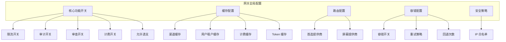
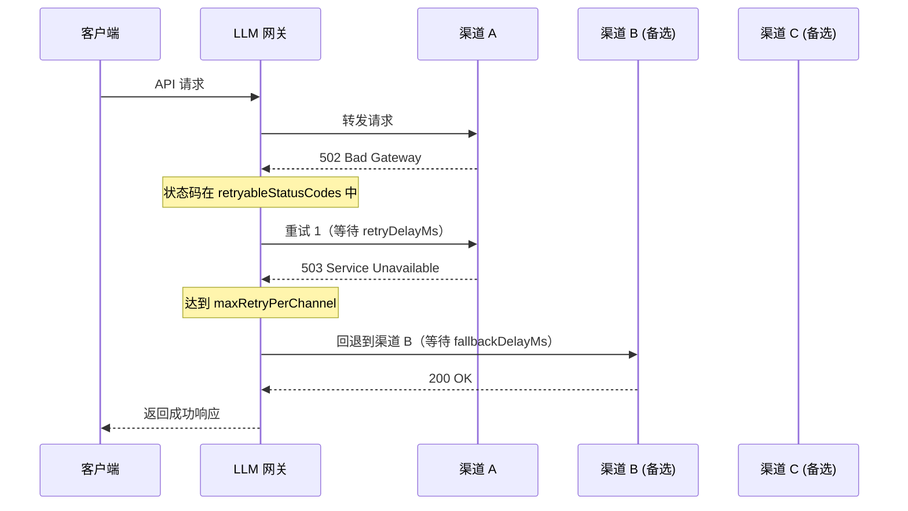

# 网关配置

## 功能简介

网关配置页面提供对 LLM 网关全局运行时参数的集中管理。管理员可以在此配置网关的核心功能开关、缓存策略、路由规则、故障容错、安全策略等关键参数，所有配置修改实时生效。

网关配置是 LLM 网关行为的核心控制中心，合理的配置可以显著提升网关的性能、安全性和可靠性。

> ⚠️ 注意: 网关配置的修改会立即影响所有通过网关的 API 请求。建议在业务低峰期修改关键配置，并在修改后观察一段时间确认无异常。

## 进入路径

BOSS → LLM 网关 → **网关配置**

路径：`/boss/gateway/config`

## 配置架构总览



## 核心功能开关

核心功能开关控制网关各子系统的启用/关闭状态。


| 配置项 | 字段名 | 类型 | 默认值 | 说明 |
|--------|--------|------|--------|------|
| **限流开关** | `rateLimitEnabled` | Boolean | `true` | 是否启用 API 请求速率限制（RPM/TPM）。关闭后所有 Token 和渠道的限流规则将不生效。 |
| **审计开关** | `auditEnabled` | Boolean | `true` | 是否启用请求审计日志记录。关闭后将不再记录 API 请求的详细信息到审计日志。 |
| **审查开关** | `moderationEnabled` | Boolean | `true` | 是否启用内容安全审查。关闭后所有内容审查策略将暂停执行。 |
| **计费开关** | `billingEnabled` | Boolean | `false` | 是否启用 Token 用量计费功能。启用后将按租户/用户维度统计和限制 Token 使用量。 |
| **允许透支** | `billingAllowOverdraft` | Boolean | `false` | 计费启用时，是否允许超出配额继续使用。启用后用户可以超限使用，但会产生超额记录。 |

> 💡 提示: 在平台初始化阶段，建议先关闭计费功能（`billingEnabled=false`），待业务稳定后再启用计费和配额管理。

> ⚠️ 注意: 关闭审计和审查开关会降低平台的安全合规能力。除非有明确原因，否则建议保持开启状态。

## 缓存配置

网关使用内存缓存提升查询性能，减少对后端数据库的频繁访问。合理配置缓存 TTL 可以在性能和数据一致性之间取得平衡。


| 配置项 | 字段名 | 类型 | 默认值 | 说明 |
|--------|--------|------|--------|------|
| **渠道缓存开关** | `cacheChannelEnabled` | Boolean | `true` | 是否缓存渠道信息 |
| **渠道缓存 TTL** | `cacheChannelTTL` | Duration | `5m` | 渠道信息缓存有效期 |
| **用户租户缓存开关** | `cacheUserTenantEnabled` | Boolean | `true` | 是否缓存用户-租户关联关系 |
| **用户租户缓存 TTL** | `cacheUserTenantTTL` | Duration | `5m` | 用户-租户缓存有效期 |
| **计费缓存开关** | `cacheBillingEnabled` | Boolean | `true` | 是否缓存计费额度信息 |
| **计费缓存 TTL** | `cacheBillingTTL` | Duration | `1m` | 计费额度缓存有效期 |
| **Token 缓存 TTL** | `cacheTokenTTL` | Duration | `5m` | API Token 缓存有效期 |
| **Token 绑定缓存 TTL** | `cacheTokenBindingTTL` | Duration | `5m` | Token 与用户/租户绑定关系的缓存有效期 |

> 💡 提示: 缓存 TTL 越短，数据一致性越好（修改渠道/Token 后更快生效），但数据库查询压力越大。建议：
> - 生产环境：渠道缓存 5-10 分钟，Token 缓存 5 分钟
> - 开发测试：缓存 1 分钟或关闭缓存，便于调试

### 缓存重建

当修改了渠道、用户等核心数据后，如需立即生效而不等待缓存过期，可手动触发缓存重建。

**操作方式**：点击页面上的 **重建缓存** 按钮

**API 端点**：`POST /api/airouter/v1/cache/rebuild`

**返回信息**：

```json
{
  "channels": 42,    // 重新加载的渠道数量
  "users": 156       // 重新加载的用户数量
}
```

> ⚠️ 注意: 缓存重建期间可能有短暂的性能抖动。在高并发场景下，建议在业务低峰期执行。

## 路由配置

路由配置控制网关在多渠道环境下的路由偏好，影响请求被分发到哪个上游渠道。


| 配置项 | 字段名 | 类型 | 说明 |
|--------|--------|------|------|
| **首选提供商** | `routingPreferredProviders` | String[] | 路由优先使用的提供商列表。当多个渠道都支持所请求的模型时，优先路由到此列表中的提供商渠道。|
| **屏蔽提供商** | `routingBlockedProviders` | String[] | 禁止路由的提供商列表。即使渠道存在，也不会将请求路由到此列表中的提供商。|

**配置示例**：

```yaml
# 优先使用自建推理服务，避免使用外部 API
routingPreferredProviders: ["local-inference", "siliconflow"]
routingBlockedProviders: ["openai"]
```

> 💡 提示: 首选提供商设置不是排他的——当首选提供商的渠道不可用时，请求仍会路由到其他可用渠道。屏蔽提供商则是硬性限制，被屏蔽的提供商渠道完全不会被路由。

## 容错配置

容错配置定义网关在上游渠道请求失败时的重试和回退策略，确保 API 服务的高可用性。


| 配置项 | 字段名 | 类型 | 默认值 | 说明 |
|--------|--------|------|--------|------|
| **容错开关** | `fallbackEnabled` | Boolean | `true` | 是否启用容错机制 |
| **可重试状态码** | `retryableStatusCodes` | Number[] | `[500, 502, 503, 504, 429]` | 触发重试的 HTTP 状态码列表 |
| **单渠道最大重试** | `maxRetryPerChannel` | Number | `2` | 同一渠道的最大重试次数（0-5） |
| **最大回退次数** | `maxFallbackCount` | Number | `3` | 切换到备用渠道的最大次数（0-10） |
| **重试延迟** | `retryDelayMs` | Number | `100` | 同一渠道重试的等待间隔（毫秒） |
| **回退延迟** | `fallbackDelayMs` | Number | `200` | 切换渠道的等待间隔（毫秒） |

### 容错流程



> ⚠️ 注意: 容错机制会增加请求的总延迟。在延迟敏感的场景中，建议适当降低 `maxRetryPerChannel` 和 `maxFallbackCount` 的值。

> 💡 提示: 状态码 `429`（Too Many Requests）默认包含在可重试列表中，因为限流通常是临时性的，稍后重试通常可以成功。

## 安全策略

### 全局 IP 白名单

配置允许访问 LLM 网关 API 的 IP 地址白名单。启用后，只有白名单中的 IP 地址或 CIDR 网段才能访问网关。


| 配置项 | 字段名 | 类型 | 说明 |
|--------|--------|------|------|
| **全局白名单** | `globalWhitelist` | String[] | IP 地址或 CIDR 网段列表 |

**支持的格式**：

| 格式 | 示例 | 说明 |
|------|------|------|
| 单个 IPv4 | `192.168.1.100` | 精确匹配一个 IP |
| IPv4 CIDR | `10.0.0.0/8` | 匹配 CIDR 范围内的所有 IP |
| 单个 IPv6 | `::1` | IPv6 环回地址 |
| IPv6 CIDR | `2001:db8::/32` | IPv6 网段 |

> ⚠️ 注意: 输入 CIDR 时，系统会自动进行 CIDR 规范化校验。如果输入的 IP 地址不是 CIDR 网段的网络地址（如输入 `192.168.1.100/24` 而非 `192.168.1.0/24`），系统会显示规范化警告，提示正确的网段地址。

> ⚠️ 注意: 配置白名单前，请确保管理节点的 IP 已包含在内，否则可能导致管理员自身也无法访问网关 API。

## 配置最佳实践

### 生产环境推荐配置

| 配置组 | 推荐设置 | 原因 |
|--------|---------|------|
| 限流 | ✅ 开启 | 防止 API 滥用 |
| 审计 | ✅ 开启 | 满足合规要求 |
| 审查 | ✅ 开启 | 内容安全保障 |
| 计费 | 按需开启 | 正式商用后启用 |
| 渠道缓存 TTL | 5-10 分钟 | 平衡性能与一致性 |
| 计费缓存 TTL | 1 分钟 | 配额数据需较高一致性 |
| 容错重试 | 2 次 | 避免过度延迟 |
| 最大回退 | 3 次 | 保证可用性 |

### 开发环境推荐配置

| 配置组 | 推荐设置 | 原因 |
|--------|---------|------|
| 限流 | ❌ 关闭 | 避免开发调试被限流阻断 |
| 审计 | ✅ 开启 | 便于问题排查 |
| 审查 | ❌ 关闭 | 简化调试流程 |
| 缓存 TTL | 1 分钟 | 快速看到配置变更效果 |
| 容错 | ✅ 开启 | 验证容错逻辑 |

### 配置变更检查清单

修改网关配置前，建议按以下清单确认：

1. ✅ 是否了解配置项的影响范围
2. ✅ 是否在低峰期操作
3. ✅ 修改白名单时，是否包含了管理节点 IP
4. ✅ 是否需要手动重建缓存
5. ✅ 修改后是否观察了一段时间的请求成功率和延迟

## 常见问题

### 修改配置后多久生效？

核心功能开关和安全策略修改后**立即生效**。缓存相关的配置修改后，需要等待当前缓存过期或手动触发缓存重建才能完全生效。

### 容错重试会增加多少延迟？

最坏情况下的额外延迟 = `maxRetryPerChannel × retryDelayMs + maxFallbackCount × fallbackDelayMs`。使用默认值（重试 2 次 × 100ms + 回退 3 次 × 200ms），最大额外延迟约 800ms。

### IP 白名单误配置导致无法访问怎么办？

如果管理员因白名单配置错误导致无法访问网关 API，需要通过以下方式恢复：
1. 通过 Kubernetes 直接访问 API 服务的 Pod
2. 使用 kubectl 修改配置
3. 或联系运维人员从集群内部修复

## 权限要求

需要 **系统管理员** 角色。网关配置的修改会影响整个平台的 API 服务行为，仅系统管理员可执行。
