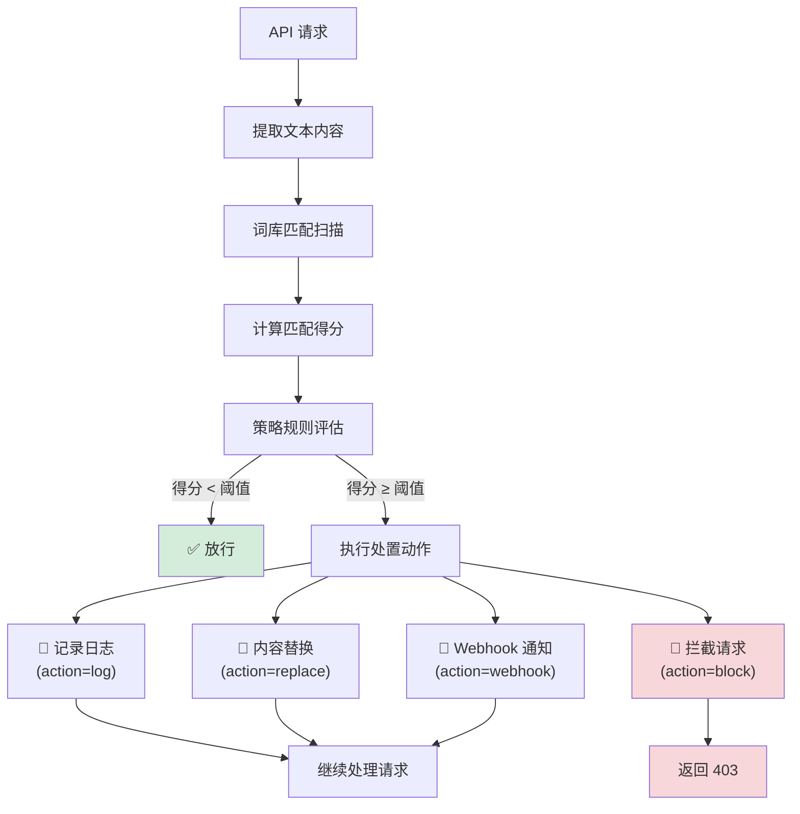
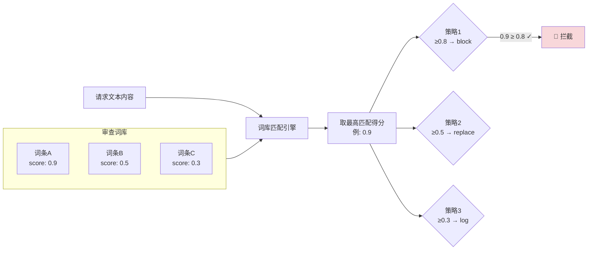

# 内容审查

## 功能简介

内容审查是 LLM 网关的**内容安全防线**，对通过网关的 API 请求和响应进行实时内容安全检查。系统通过**审查策略**和**审查词库**两套机制协同工作，实现对敏感内容的检测、记录、替换和拦截。

内容审查功能包含两大管理模块：

- **审查策略（Policies）**：定义审查规则、判断阈值和处置动作
- **审查词库（Lexicon）**：管理敏感词条、分类和评分

> 💡 提示: 内容审查功能通过 [网关配置](./config.md) 中的 `moderationEnabled` 开关控制全局启用/关闭。关闭后所有审查策略将暂停执行，但策略配置不会丢失。

## 进入路径

BOSS → LLM 网关 → **审查策略** / **审查词库**

路径：`/boss/gateway/moderation`

## 审查处理流程



---

## 审查策略

### 概述

审查策略定义了**何种内容、达到什么程度、应该如何处理**的完整规则链。每条策略包含匹配规则、判断阈值和处置动作。

### 策略列表


| 列 | 说明 | 备注 |
|----|------|------|
| 名称 | 策略名称 + 描述 | 名称与描述在同一列展示 |
| 运算符 + 阈值 | 匹配判断条件 | 如 `≥ 0.8`（得分大于等于 0.8 触发） |
| 处置动作 | 触发后的执行动作 | `log` / `replace` / `webhook` / `block` |
| 优先级 | 策略执行优先级 | 数值越大优先级越高 |
| 启用状态 | 是否启用 | 开关状态 |
| 更新时间 | 最后修改时间 | 时间戳 |
| 操作 | 启用/禁用、编辑、删除 | — |

#### 筛选

- **启用状态**：可按已启用 / 已禁用筛选策略列表

### 创建策略

点击 **创建策略** 按钮打开创建表单：


#### 基本信息

| 字段 | 类型 | 必填 | 说明 |
|------|------|------|------|
| 名称 | 文本 | ✅ | 策略唯一名称 |
| 描述 | 文本域 | — | 策略描述 |
| 优先级 | 数字 | ✅ | 执行优先级（数值越大越先执行） |
| 启用 | 开关 | ✅ | 创建后是否立即启用 |

#### 匹配规则

| 字段 | 类型 | 必填 | 说明 |
|------|------|------|------|
| 运算符 | 选择 | ✅ | 比较运算符（如 `≥`、`>`、`=` 等） |
| 阈值 | 数字 | ✅ | 触发阈值（如 `0.8`），与词库匹配得分比较 |

**运算逻辑**：当内容匹配的敏感词得分 `运算符` `阈值` 条件成立时，触发策略的处置动作。例如「得分 ≥ 0.8」表示匹配得分达到 0.8 及以上时触发。

#### 处置动作

策略支持以下四种处置动作：

| 动作 | 标识 | 说明 | 请求是否继续 |
|------|------|------|------------|
| **记录日志** | `log` | 仅记录到审计日志，不影响请求 | ✅ 继续 |
| **内容替换** | `replace` | 将匹配的敏感内容替换后继续处理 | ✅ 继续（内容已修改） |
| **Webhook 通知** | `webhook` | 调用外部 Webhook 通知后继续处理 | ✅ 继续 |
| **拦截请求** | `block` | 直接拦截请求，返回 403 错误 | ❌ 终止 |

> 💡 提示: 建议采用分级策略——低风险内容使用 `log` 记录观察，中风险使用 `replace` 脱敏处理，高风险使用 `block` 直接拦截。

### 策略规则配置（PolicyRuleConfig）

根据选择的处置动作不同，需要配置不同的规则参数：

#### Replace（替换）配置

| 字段 | 类型 | 说明 |
|------|------|------|
| `maskChar` | 文本 | 替换使用的掩码字符（如 `*`） |
| `maskMode` | 选择 | 掩码模式 |

**掩码模式**：

| 模式 | 标识 | 效果示例 |
|------|------|---------|
| 字符逐一替换 | `char_repeat` | `敏感词` → `***` |
| 固定长度替换 | `fixed_length` | `敏感词` → `****`（固定 4 个） |
| 单字符替换 | `single_char` | `敏感词` → `*` |

#### Webhook 配置

| 字段 | 类型 | 说明 |
|------|------|------|
| `webhookUrl` | URL | Webhook 回调地址 |
| `webhookMethod` | 选择 | HTTP 方法（GET/POST） |
| `webhookHeaders` | Key-Value | 自定义请求头 |
| `webhookTimeout` | 数字 | 请求超时时间（秒） |
| `webhookResponse` | 文本 | 期望的响应格式 |

#### 通知配置

| 字段 | 类型 | 说明 |
|------|------|------|
| `notification` | 开关 | 是否发送邮件通知 |
| `notifyEmails` | 邮箱列表 | 通知邮件接收地址列表 |

> 💡 提示: Webhook 和邮件通知可同时启用。对于高风险策略，建议配置邮件通知以便安全团队及时响应。

### 启用 / 禁用策略

点击列表中的启用/禁用开关，可快速切换策略状态：

- **禁用**：策略暂停执行，但配置保留，可随时重新启用
- **启用**：策略立即生效，开始参与内容审查

### 编辑策略

修改策略的所有可编辑字段（名称、描述、阈值、动作、规则配置等）。

### 删除策略

点击 **删除** 按钮后，系统会要求**二次确认——输入策略名称**才能执行删除。

> ⚠️ 注意: 策略删除需要在确认弹窗中**手动输入策略名称**进行二次验证，防止误删。此操作不可撤销。

---

## 审查词库

### 概述

审查词库管理平台的敏感词条库，每个词条包含关键词文本、匹配得分、分类和标签。词库是审查策略匹配判断的基础数据来源。

### 词库列表


| 列 | 说明 | 备注 |
|----|------|------|
| 词条 | `term` | 敏感词文本 |
| 得分 | `score` | 匹配得分（0-1），用于与策略阈值比较 |
| 分类 | `category` | 词条分类 | 使用 `Chip` 标签展示 |
| 标签 | `tags` | 自定义标签 | 使用 `Chip`（outlined 样式）展示，支持多个 |
| 更新时间 | `updatedAt` | 最后修改时间 | — |
| 操作 | — | 编辑 / 删除 | 支持批量选择 |

### 创建词条

点击 **创建** 按钮添加新的敏感词条：

| 字段 | 类型 | 必填 | 说明 |
|------|------|------|------|
| 词条 | 文本 | ✅ | 敏感词文本 |
| 得分 | 数字 | ✅ | 匹配得分（0-1 之间），得分越高表示风险越大 |
| 分类 | 文本/选择 | — | 词条分类（如：暴力、色情、政治、欺诈等） |
| 标签 | 标签输入 | — | 自定义标签，支持多个 |

**得分设计建议**：

| 得分范围 | 风险等级 | 建议策略动作 |
|----------|---------|------------|
| 0.0 - 0.3 | 低风险 | `log`（仅记录） |
| 0.3 - 0.6 | 中风险 | `replace`（替换脱敏） |
| 0.6 - 0.8 | 高风险 | `webhook`（通知 + 记录） |
| 0.8 - 1.0 | 极高风险 | `block`（直接拦截） |

### 批量导入

点击 **导入** 按钮打开 `LexiconImportDialog`，支持从文件批量导入敏感词条。

**支持的导入格式**：

```json
[
  {
    "term": "敏感词1",
    "score": 0.9,
    "category": "暴力",
    "tags": ["tag1", "tag2"]
  },
  {
    "term": "敏感词2",
    "score": 0.7,
    "category": "欺诈",
    "tags": ["tag3"]
  }
]
```

> 💡 提示: 批量导入时，如果词条已存在，将更新其得分、分类和标签信息。

### 导出

点击 **导出** 按钮，将当前词库以 JSON 格式导出，用于备份或迁移到其他环境。

### 编辑词条

点击词条的 **编辑** 按钮，修改得分、分类和标签。

### 删除词条

支持两种删除方式：

- **单条删除**：点击词条行的删除按钮
- **批量删除**：通过复选框多选后，点击批量删除按钮

> ⚠️ 注意: 删除词条会立即影响审查策略的匹配行为。如果不确定词条是否仍需保留，建议先降低其得分而非直接删除。

---

## 策略与词库协同



**执行逻辑**：

1. 对请求文本进行词库扫描，找到所有匹配的敏感词条
2. 取匹配词条的最高得分
3. 按优先级从高到低依次评估各策略
4. 第一个满足条件的策略触发其处置动作
5. 如果动作为 `block`，立即终止；其他动作执行后继续评估

> 💡 提示: 策略优先级决定了评估顺序。建议将 `block` 类策略设为最高优先级，确保极高风险内容优先被拦截。

## 最佳实践

### 分级防护策略

建议设置多层级的审查策略：

| 优先级 | 策略名称 | 阈值 | 动作 | 用途 |
|--------|---------|------|------|------|
| 100 | 严重违规拦截 | ≥ 0.9 | `block` | 拦截极高风险内容 |
| 80 | 高风险通知 | ≥ 0.7 | `webhook` | 通知安全团队 |
| 60 | 中风险替换 | ≥ 0.5 | `replace` | 敏感内容脱敏替换 |
| 40 | 低风险记录 | ≥ 0.3 | `log` | 记录以供人工复核 |

### 词库维护

1. **定期更新**：根据业务需求和合规要求定期更新敏感词库
2. **分类管理**：使用分类和标签对词条进行组织，便于维护
3. **得分校准**：根据实际误判/漏判情况调整词条得分
4. **备份导出**：定期导出词库 JSON 文件作为备份

### 监控与调优

1. 关注 [审计日志](./audit.md) 中 `blocked` 结果的记录，分析是否存在误拦截
2. 通过 [运营概览](./operations.md) 查看被拦截请求的占比趋势
3. 根据实际业务反馈调整策略阈值和词库得分

## 权限要求

需要 **系统管理员** 角色。审查策略和词库的管理涉及平台内容安全体系，仅系统管理员可操作。
