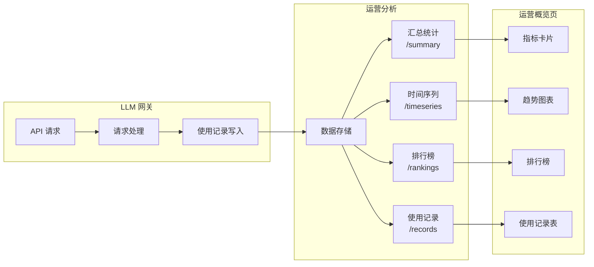

# 运营概览

## 功能简介

运营概览是 LLM 网关的**全方位运营分析仪表盘**，为平台管理员提供 API 调用量、Token 消耗、请求延迟、用户排行等多维度运营数据。通过丰富的可视化图表和详细的使用记录表，管理员可以深入了解平台的使用情况、识别性能瓶颈、优化资源分配。

> 💡 提示: 运营概览页面数据来自网关的实时统计引擎，支持按分钟、小时、天三种粒度的时间序列分析，满足不同场景的运营分析需求。

## 进入路径

BOSS → LLM 网关 → **运营概览**

路径：`/boss/gateway/operations`

## 数据流架构

## 筛选条件

页面顶部提供多维度筛选器，支持灵活组合查询：

| 筛选器 | 类型 | 说明 |
|--------|------|------|
| 时间范围 | 日期范围选择器 | 选择统计的起止时间，支持快捷选项（今天、近7天、近30天） |
| 租户 | 下拉选择 | 筛选特定租户的使用数据 |
| Token | 下拉选择 | 筛选特定 API Token 的使用数据 |
| 用户 | 下拉选择 | 筛选特定用户的使用数据 |
| 提供商 | 下拉选择 | 筛选特定模型提供商（如 OpenAI、DashScope 等） |

> 💡 提示: 多个筛选条件可以组合使用。例如，选择特定租户 + 近7天，可以快速了解该租户近一周的 API 使用情况。

## 汇总指标

页面顶部以指标卡片形式展示三个核心汇总指标：

| 指标 | 字段名 | 说明 | 展示形式 |
|------|--------|------|---------|
| **总 Token 数** | `totalTokens` | 筛选时间范围内的 Token 总消耗量 | 数值（自动换算 K/M 单位） |
| **请求总数** | `requestCount` | 筛选时间范围内的 API 请求总次数 | 数值 |
| **平均延迟** | `averageLatencyMillis` | 所有请求的平均响应延迟 | 毫秒（ms） |

> 💡 提示: 汇总指标会根据筛选条件实时计算。当平均延迟显著升高时，可能说明下游推理服务负载过高，需关注渠道健康状态。

## 趋势图表

### 请求量与 Token 使用趋势

页面中部以**面积图（Area Chart）**展示按时间的使用趋势，支持按小时粒度查看：

图表包含两条数据线：

| 数据系列 | 颜色 | 说明 |
|----------|------|------|
| **Requests（请求量）** | 主色调 | 每小时的 API 请求次数 |
| **Tokens（Token 量）** | 辅色调 | 每小时的 Token 消耗总量 |

图表交互功能：
- **悬停提示**：鼠标悬停显示该时间点的详细数值
- **缩放**：支持框选缩放查看细粒度数据
- **时间粒度**：根据选择的时间范围自动调整（分钟/小时/天）

### Top 10 用户排行

右侧展示 Token 消耗量排名前 10 的用户：

| 列 | 说明 |
|----|------|
| 排名 | 1-10 名次序号 |
| 用户 | 用户名/用户 ID |
| Total Tokens | 该用户的 Token 消耗总量 |

排行榜数据按 `total_tokens` 降序排列，帮助管理员快速识别高消耗用户。

> 💡 提示: 排行榜支持按不同维度切换，可查看按 Token、租户、用户、渠道、提供商、模型等维度的排行数据。

## 使用记录表

页面下方展示详细的 API 使用记录表，记录每一次 API 请求的完整信息：

| 列 | 字段名 | 说明 | 备注 |
|----|--------|------|------|
| 发生时间 | `occurredAt` | 请求发生的时间戳 | 精确到秒 |
| 用户 ID | `userId` | 发起请求的用户标识 | — |
| Token 名称 | `tokenName` | 使用的 API Token 名称 | — |
| 请求 ID | `requestId` | 唯一请求标识 | 可用于关联审计日志 |
| 租户 ID | `tenantId` | 所属租户标识 | — |
| 渠道名称 | `channelName` | 路由到的渠道名称 | — |
| 模型 | `model` | 请求的模型名称 | — |
| Prompt Tokens | `promptTokens` | 输入 Token 数量 | — |
| Completion Tokens | `completionTokens` | 输出 Token 数量 | — |
| 延迟 | `latencyMillis` | 请求延迟（毫秒） | — |
| 结果 | `result` | 请求处理结果 | 彩色标签，见下方说明 |

### 结果状态颜色编码

| 结果 | 颜色 | 说明 |
|------|------|------|
| `success` | 🟢 绿色 | 请求成功完成 |
| `blocked` | 🟠 橙色 | 被内容审查策略拦截 |
| `quota_exceeded` | 🔴 红色 | 超出配额限制 |
| `error` | 🔴 红色 | 请求处理出错 |

> ⚠️ 注意: 如果出现大量 `blocked` 状态的记录，建议检查 [内容审查策略](./moderation.md) 是否配置过于严格；大量 `quota_exceeded` 则需检查用户或租户的 Token 配额设置。

## API 参考

运营概览页面使用以下 API 端点获取数据：

| 操作 | 方法 | 端点 | 说明 |
|------|------|------|------|
| 使用记录列表 | GET | `/api/airouter/v1/usage/records` | 分页查询使用记录 |
| 汇总统计 | GET | `/api/airouter/v1/usage/summary` | 获取汇总指标 |
| 时间序列 | GET | `/api/airouter/v1/usage/timeseries` | 获取时间序列数据 |
| 排行榜 | GET | `/api/airouter/v1/usage/rankings` | 获取排行榜数据 |

### 时间序列参数

`/api/airouter/v1/usage/timeseries` 支持 `interval` 参数，控制数据聚合粒度：

| 值 | 说明 | 适用场景 |
|----|------|---------|
| `minute` | 按分钟聚合 | 查看实时流量波动 |
| `hour` | 按小时聚合 | 查看当天使用趋势（默认） |
| `day` | 按天聚合 | 查看长期使用趋势 |

### 排行榜维度

`/api/airouter/v1/usage/rankings` 支持 `dimension` 参数，指定排行维度：

| 值 | 说明 |
|----|------|
| `token` | 按 API Token 排行 |
| `tenant` | 按租户排行 |
| `user` | 按用户排行 |
| `channel` | 按渠道排行 |
| `provider` | 按提供商排行 |
| `model` | 按模型排行 |

## 运营分析场景

### 成本分析

通过筛选特定租户或用户，查看其 Token 消耗趋势，结合模型定价计算使用成本。

### 容量规划

关注请求量趋势和平均延迟变化。当请求量持续增长且延迟上升时，需要考虑：
- 扩容下游推理服务
- 增加更多渠道分流
- 调整路由策略

### 异常检测

关注以下异常信号：
- 某时段突然出现大量 `error` 或 `blocked` 记录
- 平均延迟突然飙升
- 特定用户的 Token 消耗异常激增

## 数据导出

使用记录支持导出功能，管理员可将筛选后的记录导出为文件，用于离线分析和报表制作。

## 指标含义详解

### Prompt Tokens vs Completion Tokens

| 类型 | 说明 | 成本影响 |
|------|------|----------|
| Prompt Tokens | 用户输入（包括 system prompt 和上下文）的 Token 数 | 通常占总 Token 的 30-60% |
| Completion Tokens | 模型生成输出的 Token 数 | 通常成本高于 Prompt Tokens |
| Total Tokens | 两者之和 | 决定计费金额 |

### 延迟（Latency）分析

| 延迟范围 | 评价 | 可能原因 |
|----------|------|----------|
| < 500ms | 优秀 | 本地推理、轻量模型 |
| 500ms - 2s | 正常 | 远程 API、中等复杂度请求 |
| 2s - 10s | 偏高 | 长文本生成、模型负载高 |
| > 10s | 需关注 | 服务过载、网络问题 |

## 常见运营场景

### 月度运营报告

1. 设置时间范围为上月整月
2. 查看汇总指标：总请求数、总 Token 消耗、平均延迟
3. 查看用户排行榜，识别 Top 用户
4. 按租户维度查看排行，分析各租户使用情况
5. 导出使用记录用于详细分析

### 异常流量监控

1. 设置时间粒度为「分钟」
2. 关注请求量突增或骤降
3. 检查是否有大量 `error` 或 `quota_exceeded` 状态
4. 结合审计日志排查根因

### 用户用量分析

1. 选择特定用户筛选
2. 查看该用户的 Token 消耗趋势
3. 分析使用的模型分布
4. 评估是否需要调整配额

## 权限要求

需要 **系统管理员** 角色。运营概览数据涉及全平台的敏感使用信息，仅系统管理员可查看。
