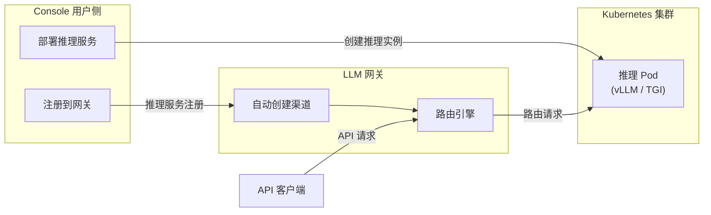
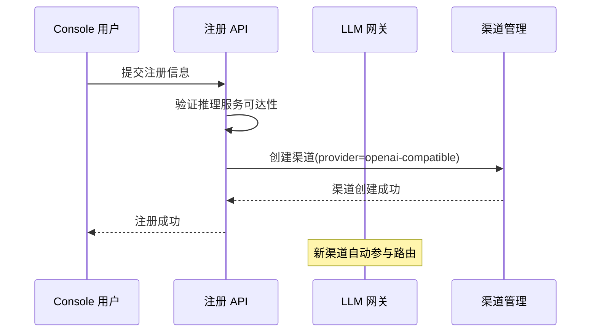

# 推理服务注册

## 功能简介

推理服务注册是连接 **Rune 推理服务** 与 **LLM 网关** 的桥梁。当用户在 Console 中部署推理服务（如 vLLM、TGI 推理实例）后，可以将其注册到 LLM 网关，使该推理服务能够通过网关统一的 API 端点对外提供服务。

注册完成后，推理服务会自动在网关中创建对应的 [渠道（Channel）](./channels.md)，从而被纳入网关的路由、负载均衡、限流、审计和内容审查体系中。

> 💡 提示: 推理服务注册简化了「部署推理服务 → 注册到网关 → 对外提供 API」的流程，用户无需手动配置渠道参数，系统会自动完成关联。

## 整体架构

## 进入路径

BOSS → LLM 网关 → **推理服务注册**

路径：`/boss/service-registrations`

## 注册列表

注册列表展示所有从 Console 侧注册到网关的推理服务：

| 列 | 说明 | 备注 |
|----|------|------|
| 名称 | 注册名称 | 由用户在注册时指定 |
| 服务端点 | 推理服务的内部地址 | 集群内部 Service URL |
| 模型名称 | 网关中暴露的模型名称 | 用户通过此名称调用 |
| 关联渠道 | 自动创建的网关渠道 | 链接到渠道详情 |
| 所属租户/工作空间 | 注册来源 | — |
| 状态 | 注册状态 | 启用 / 禁用 |
| 创建时间 | 注册时间 | 时间戳格式 |
| 操作 | 查看详情 / 编辑 / 删除 | — |

## 注册流程

### 用户侧流程

推理服务注册通常由用户在 Console 中发起：

1. 用户在 Console 中部署推理服务实例
2. 推理服务启动并通过健康检查
3. 用户点击「注册到网关」操作
4. 填写注册信息（模型名称、描述等）
5. 提交注册，系统自动在网关中创建渠道

### 注册信息

| 字段 | 类型 | 必填 | 说明 |
|------|------|------|------|
| 名称 | 文本 | ✅ | 注册名称，用于标识 |
| 服务端点 | URL | ✅ | 推理服务的 Kubernetes Service 内部地址 |
| 模型名称 | 文本 | ✅ | 在网关中暴露的模型名称（用户通过此名称调用） |
| 描述 | 文本域 | — | 注册描述信息 |

> 💡 提示: 服务端点通常是 Kubernetes Service 的集群内地址（如 `http://my-inference-svc.namespace.svc.cluster.local:8080/v1`），由系统在部署推理服务时自动生成。

### 与渠道的关联

注册成功后，系统会自动创建一个对应的网关渠道（Channel），参数映射如下：

| 注册字段 | 渠道字段 | 说明 |
|----------|----------|------|
| 服务端点 | `apiBase` | API 基础地址 |
| 模型名称 | `supportedModels` | 支持的模型列表 |
| 所属租户 | `tenant` | 渠道归属租户 |
| 所属工作空间 | `workspace` | 渠道归属工作空间 |
| — | `provider` | 自动设置为 `openai-compatible` |
| — | `visibility` | 根据工作空间设置为 `tenant` 或 `private` |

## 管理注册

### 查看详情

点击注册名称查看详细信息：

- **基本信息**：名称、服务端点、模型名称、创建时间
- **关联渠道**：查看自动创建的渠道配置
- **推理服务状态**：底层推理服务的运行状态

### 编辑注册

可修改注册的描述信息和部分配置。修改会同步更新关联的渠道。

### 启用 / 禁用

- **禁用**：暂停该注册，关联的渠道也会被禁用，请求将不再路由到此推理服务
- **启用**：恢复注册和关联渠道

### 删除注册

删除注册将同时删除关联的网关渠道。

> ⚠️ 注意: 删除注册不会删除底层的推理服务实例。如需同时清理，请在 Console 中也删除对应的推理服务。

## 管理员视角

作为平台管理员，在此页面可以：

1. **全局视图**：查看所有租户注册的推理服务，了解平台内推理服务的整体部署情况
2. **状态管控**：在必要时禁用或删除某个注册，控制其对网关的暴露
3. **故障排查**：当 API 请求路由异常时，检查注册的服务端点是否可用
4. **容量评估**：了解各租户/工作空间注册的推理服务数量和类型

> 💡 提示: 注册创建的渠道也会出现在 [渠道管理](./channels.md) 列表中，管理员可以在渠道管理页面进一步调整其路由优先级、限流参数等配置。

## 权限要求

需要 **系统管理员** 角色。系统管理员可以查看和管理所有租户的推理服务注册。用户在 Console 侧仅可管理自己的注册。
