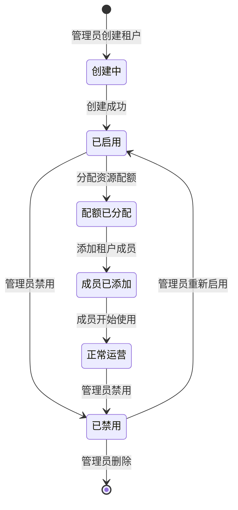
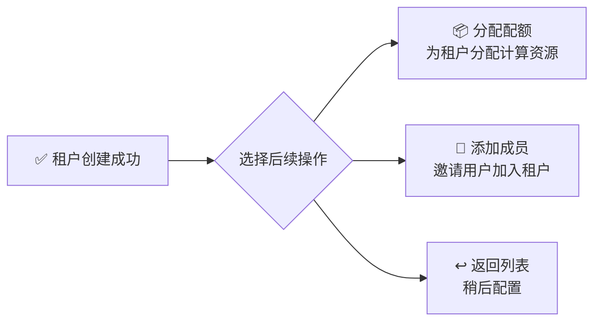
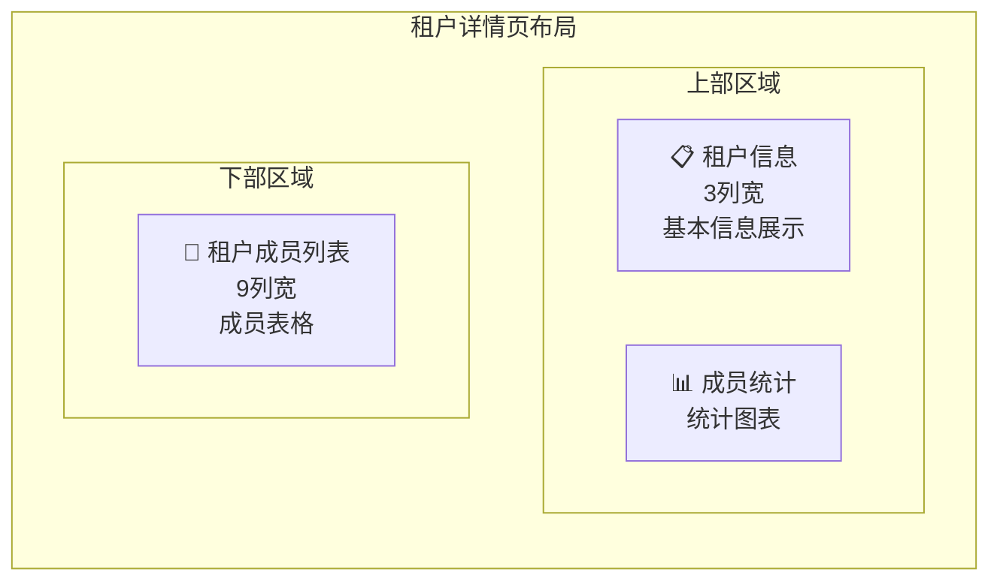
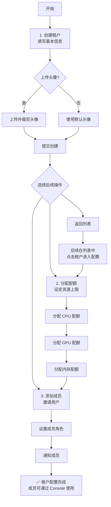

# 租户管理

## 功能简介

租户（Tenant）是 Rune 平台的**组织隔离单元**，是资源分配、权限管理和计费核算的基础边界。每个租户拥有独立的成员体系、资源配额和工作空间。系统管理员通过 BOSS 的租户管理模块对全平台的租户进行全生命周期管理，包括**创建租户**、**编辑信息**、**管理成员**、**启用/禁用**等操作。

## 进入路径

BOSS → 账户中心 → **租户管理**

路径：`/boss/iam/tenants`

## 租户生命周期



---

## 租户列表


租户列表以表格形式展示平台中所有租户的概要信息。

### 列字段说明

| 列 | 字段名 | 展示方式 | 说明 |
|----|--------|----------|------|
| **名称** | `name` | 头像 + 租户名（链接） | 显示租户头像和名称，点击名称可进入租户详情页。名称下方显示租户 ID |
| **邮箱** | `email` | 文本 | 租户的管理联系邮箱 |
| **成员数** | `userCount` | 数字 | 当前租户下的成员总数 |
| **创建时间** | `creationTimestamp` | 格式化时间 | 租户的创建时间 |
| **操作** | — | 操作按钮 | 编辑、查看详情 |

> 💡 提示: 点击租户名称列的链接可直接跳转到该租户的详情概览页面，快速查看成员分布和资源使用情况。

---

## 创建租户


### 操作步骤

1. 在租户列表页面，点击右上角 **新建租户** 按钮
2. 在弹出的创建表单中填写租户信息
3. 点击 **创建** 按钮提交

### 表单字段

| 字段 | 字段名 | 类型 | 必填 | 验证规则 | 说明 |
|------|--------|------|------|----------|------|
| **头像** | `avatar` | 图片上传 | — | 最大 3MB，支持裁剪 | 租户的头像图标，上传后可在裁剪框中调整显示区域 |
| **租户 ID** | `id` | IdField | ✅ | 唯一性校验，仅允许小写字母、数字和连字符 | 租户的唯一标识，**创建后不可修改**，用于 API 调用和系统内部引用 |
| **邮箱** | `email` | 邮箱输入 | ✅ | 必须符合标准邮箱格式 | 租户的管理联系邮箱 |
| **手机号** | `phone` | 电话输入 | ✅ | 6-16 位数字（正则: `^\d{6,16}$`） | 租户的管理联系电话 |
| **描述** | `description` | 文本域 (4行) | — | 无特殊限制 | 租户的补充描述信息，如组织类型、业务方向等 |

### 头像上传说明

- 支持 JPG / PNG / GIF 格式
- 文件大小不超过 **3MB**
- 上传后会弹出**裁剪工具**，可调整头像的显示区域和缩放
- 如果不上传头像，系统将使用默认的租户图标


### 创建后操作

租户创建成功后，系统会弹出**后续操作引导**，提供三个快捷选项：



| 选项 | 说明 |
|------|------|
| **分配配额** | 跳转到租户资源页面，为新租户分配 CPU / GPU / 内存等资源配额 |
| **添加成员** | 跳转到租户成员管理页面，邀请用户加入该租户并分配角色 |
| **返回列表** | 返回租户列表页面，后续再进行配置 |

> 💡 提示: 新创建的租户默认没有任何资源配额和成员。建议创建后立即分配配额并添加至少一名租户管理员，否则租户成员将无法使用任何计算资源。

### 对应 API

```
POST /api/iam/tenant-register
```

---

## 编辑租户

### 操作步骤

1. 在租户列表中找到目标租户
2. 点击该租户行的 **编辑** 按钮
3. 在弹出的编辑表单中修改信息
4. 点击 **保存** 按钮提交修改

### 可编辑字段

| 字段 | 是否可编辑 | 说明 |
|------|-----------|------|
| **头像** | ✅ | 可重新上传和裁剪头像 |
| **租户 ID** | ❌ 不可编辑 | 创建后锁定 |
| **邮箱** | ✅ | 可修改管理联系邮箱 |
| **手机号** | ✅ | 可修改管理联系电话 |
| **描述** | ✅ | 可修改租户描述 |

### 头像更新 API

```
PUT /api/iam/tenants/:id/avatar
```

> ⚠️ 注意: 租户 ID 是租户的唯一标识，一旦在创建时确定便不可修改。如需变更租户 ID，只能删除后重新创建，但这将丢失原租户下的所有成员关系和资源分配。

---

## 启用 / 禁用租户

管理员可以临时禁用某个租户，禁用后该租户下的所有成员将无法访问该租户的资源。

| 操作 | 效果 | 对应 API |
|------|------|----------|
| **禁用** | 租户下所有成员无法访问租户内资源，进行中的任务不受影响 | `PUT /api/iam/tenants/:id/disable` |
| **启用** | 恢复租户访问权限 | `PUT /api/iam/tenants/:id/enable` |

> ⚠️ 注意: 当前版本中，租户的启用/禁用功能处于**开发中**状态，界面上可能暂未显示对应按钮。该功能将在后续版本中正式上线。

---

## 租户详情页

点击租户名称进入租户详情页面，详情页采用多区域布局展示租户的全方位信息。

路径：`/boss/iam/tenants/:id`


### 页面布局

详情页分为三个主要区域：



### 租户信息区域（TenantInfo）

位于页面上部左侧（3列宽），展示租户基本信息：

| 显示项 | 说明 |
|--------|------|
| 租户头像 | 大尺寸头像展示 |
| 租户名称 | 租户的显示名称 |
| 租户 ID | 租户的唯一标识 |
| 邮箱 | 管理联系邮箱 |
| 手机号 | 管理联系电话 |
| 描述 | 租户描述信息 |
| 创建时间 | 租户创建时间 |
| 状态 | 当前启用/禁用状态 |

### 成员统计区域（TenantMemberStats）

位于页面上部右侧，以数据图表形式展示租户内各角色成员的数量分布：

- **管理员**数量
- **普通成员**数量
- 角色分布图（如饼图或环形图）

### 租户成员列表（TenantMembers）

位于页面下部（9列宽），以表格形式展示租户中的所有成员：

| 列 | 字段名 | 展示方式 | 说明 |
|----|--------|----------|------|
| **姓名** | `name` | 头像 + 显示名称 | 成员的用户名，附带头像图标 |
| **邮箱** | `email` | 文本 | 成员的注册邮箱 |
| **角色** | `role` | 翻译标签 | 在该租户中的角色（已翻译为当前语言） |
| **加入时间** | `joinedAt` | 格式化时间 | 成员加入该租户的时间 |
| **操作** | — | 操作按钮 | 编辑角色、移除成员 |

---

## 租户成员管理

路径：`/boss/iam/tenants/:id/members`


### 添加成员

1. 在租户详情页的成员列表区域，点击 **添加成员** 按钮
2. 在弹出的对话框中搜索并选择要添加的用户
3. 为用户分配在该租户中的角色
4. 点击 **确认** 完成添加

| 字段 | 说明 |
|------|------|
| 用户 | 从平台用户列表中搜索选择，支持按用户名或邮箱搜索 |
| 角色 | 选择用户在该租户中的角色（如租户管理员、普通成员） |

> 💡 提示: 一个用户可以同时属于多个租户，在不同租户中可以拥有不同的角色。

### 编辑成员角色

1. 在成员列表中找到目标成员
2. 点击 **编辑角色** 按钮
3. 在弹出的选择框中修改角色
4. 点击 **保存** 确认修改

### 移除成员

1. 在成员列表中找到要移除的成员
2. 点击 **删除** 按钮
3. 在确认对话框中确认移除操作

> ⚠️ 注意: 移除成员会立即取消该用户对该租户下所有资源的访问权限。如果该成员是租户中唯一的管理员，系统会阻止删除操作并提示需要先指定其他管理员。

---

## 租户创建完整流程



## API 参考

| 操作 | 方法 | 路径 | 说明 |
|------|------|------|------|
| 获取租户列表 | `GET` | `/api/iam/tenants` | 支持分页和搜索参数 |
| 获取单个租户 | `GET` | `/api/iam/tenants/:id` | 返回租户详细信息 |
| 创建租户 | `POST` | `/api/iam/tenant-register` | 创建新租户 |
| 更新租户 | `PUT` | `/api/iam/tenants/:id` | 更新租户基本信息 |
| 删除租户 | `DELETE` | `/api/iam/tenants/:id` | 需要确认操作 |
| 上传头像 | `PUT` | `/api/iam/tenants/:id/avatar` | 最大 3MB |
| 启用租户 | `PUT` | `/api/iam/tenants/:id/enable` | 恢复访问 |
| 禁用租户 | `PUT` | `/api/iam/tenants/:id/disable` | 暂停访问 |
| 获取成员列表 | `GET` | `/api/iam/tenants/:id/members` | 租户成员 |
| 添加成员 | `POST` | `/api/iam/tenants/:id/members` | 邀请用户 |
| 更新成员角色 | `PUT` | `/api/iam/tenants/:id/members/:uid` | 修改角色 |
| 移除成员 | `DELETE` | `/api/iam/tenants/:id/members/:uid` | 移除成员 |

## 最佳实践

### 租户规划建议

- **按组织结构划分租户**：建议每个部门或团队对应一个租户，避免跨部门共用租户导致资源和权限混乱
- **合理设置配额**：根据团队实际需求分配资源配额，避免过度分配导致资源浪费，也避免过少分配影响使用
- **指定多名管理员**：每个租户建议至少有 2 名管理员，避免单一管理员离职导致租户无人管理

### 命名规范

- 租户 ID 建议使用有意义的缩写，如 `team-ai-research`、`dept-engineering`
- 保持命名风格一致，便于管理和查找

### 安全建议

1. **定期审查成员列表**，移除不再需要访问权限的成员
2. **使用最小权限原则**，仅授予必要的角色
3. **监控配额使用情况**，及时调整以避免资源不足或浪费

## 权限要求

| 操作 | 所需角色 |
|------|----------|
| 查看租户列表 | 系统管理员 |
| 创建租户 | 系统管理员 |
| 编辑租户 | 系统管理员 |
| 启用/禁用租户 | 系统管理员 |
| 管理租户成员 | 系统管理员 |
| 删除租户 | 系统管理员 |
