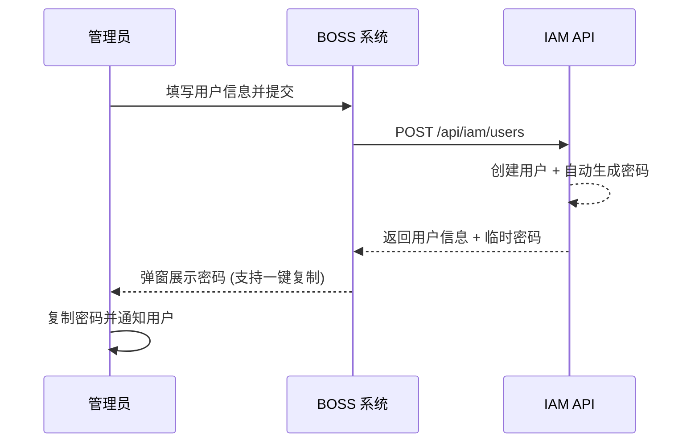
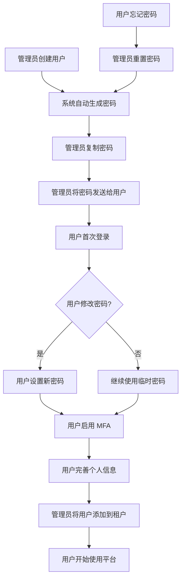

# 用户管理

## 功能简介

用户管理是 BOSS 账户中心的核心模块之一，系统管理员可以在此对平台中所有注册用户进行全生命周期管理，包括**创建用户**、**编辑信息**、**重置密码**、**删除用户**等操作。用户是平台身份体系的基础单元，每个用户通过唯一的用户名标识，并关联邮箱、手机号等联系方式。

## 进入路径

BOSS → 账户中心 → **用户管理**

路径：`/boss/iam/users`

## 用户列表


用户列表以表格形式展示平台所有用户，支持按关键词搜索和分页浏览。

### 列字段说明

| 列 | 字段名 | 展示方式 | 说明 |
|----|--------|----------|------|
| **用户名** | `name` | 头像 + 显示名称 | 用户的唯一标识（登录名），附带头像图标和 `displayName` 显示名称 |
| **邮箱** | `email` | 文本 | 用户的注册邮箱地址 |
| **手机号** | `phone` | 文本 | 用户的手机号码 |
| **MFA 状态** | `mfa.enabled` | 图标标记 | 多因素认证是否已启用 ✅/❌ |
| **创建时间** | `creationTimestamp` | 格式化时间 | 用户账户的创建时间 |
| **操作** | — | 操作按钮 | 编辑、重置密码、删除 |

### 搜索与筛选

在列表顶部的搜索框中，可以按以下字段搜索用户：

- **用户名** — 精确或模糊匹配
- **邮箱** — 精确或模糊匹配
- **显示名称** — 模糊匹配

> 💡 提示: 搜索支持实时过滤，输入关键词后列表会自动刷新匹配结果，无需手动点击搜索按钮。

---

## 创建用户


### 操作步骤

1. 在用户列表页面，点击右上角 **新建用户** 按钮
2. 在弹出的表单中填写用户信息
3. 点击 **创建** 按钮完成操作

### 表单字段

| 字段 | 字段名 | 类型 | 必填 | 验证规则 | 说明 |
|------|--------|------|------|----------|------|
| **用户名** | `name` | 文本输入 | ✅ | 唯一性校验，仅允许字母数字和连字符 | 用户的唯一登录标识，**创建后不可修改** |
| **显示名称** | `displayName` | 文本输入 | — | 无特殊限制 | 用户的显示名称，可在个人设置中自行修改 |
| **邮箱** | `email` | 邮箱输入 | ✅ | 必须符合标准邮箱格式 (RFC 5322) | 用户的联系邮箱 |
| **手机号** | `phone` | 电话输入 | ✅ | 必须符合电话号码格式 | 用户的联系手机号 |

### 密码自动生成

> ⚠️ 注意: 创建用户时**不需要手动设置密码**。系统将自动生成一个随机强密码，并在创建成功后通过弹窗展示。

创建成功后的密码展示弹窗包含：

- 自动生成的临时密码（明文展示）
- **一键复制** 按钮（剪贴板复制）
- 安全提醒：建议立即将密码发送给用户，并提醒用户首次登录后修改密码




> 💡 提示: 自动生成的密码仅在创建时展示一次。如果管理员关闭弹窗后忘记密码，只能通过「重置密码」功能重新生成。

---

## 编辑用户


### 操作步骤

1. 在用户列表中找到目标用户
2. 点击该用户行的 **编辑** 按钮
3. 在弹出的编辑表单中修改信息
4. 点击 **保存** 按钮提交修改

### 可编辑字段

| 字段 | 是否可编辑 | 说明 |
|------|-----------|------|
| **用户名** (`name`) | ❌ 不可编辑 | 用户唯一标识，创建后锁定，表单中显示为禁用状态 |
| **显示名称** (`displayName`) | ✅ | 可修改用户的显示名称 |
| **邮箱** (`email`) | ✅ | 可修改用户邮箱，需符合邮箱格式 |
| **手机号** (`phone`) | ✅ | 可修改用户手机号，需符合电话格式 |

> 💡 提示: 编辑用户信息不会影响用户的密码和 MFA 设置。密码修改请使用「重置密码」功能。

### 对应 API

```
PUT /api/iam/users/:name
```

---

## 重置密码

当用户忘记密码或账户需要安全重置时，管理员可以为用户重置密码。

### 操作步骤

1. 在用户列表中找到目标用户
2. 点击该用户行的操作菜单中的 **重置密码**
3. 系统会自动生成新的随机密码
4. 在弹窗中查看并复制新密码
5. 将新密码安全地发送给用户

### 密码重置注意事项

- 重置密码后，用户当前的所有活跃会话**不会**被立即终止
- 新密码同样是自动生成的，通过剪贴板复制按钮获取
- 建议通知用户登录后立即修改为自己的密码

### 对应 API

```
PUT /api/iam/users/:name/password
```

> ⚠️ 注意: 密码重置操作不可撤销。重置后旧密码将立即失效，请确保已将新密码安全传达给用户。

---

## 删除用户

### 操作步骤

1. 在用户列表中找到要删除的用户
2. 点击该用户行的操作菜单中的 **删除**
3. 系统弹出**确认对话框**，显示用户名并要求确认
4. 点击 **确认删除** 完成操作


### 删除影响

> ⚠️ 注意: 删除用户是**不可恢复**的操作。删除后：
> - 用户将无法登录平台
> - 用户在各租户中的成员关系将被移除
> - 用户创建的资源（模型、数据集等）不会被自动删除，但所有权将标记为已删除用户
> - 用户的 API Key 将全部失效

### 对应 API

```
DELETE /api/iam/users/:name
```

---

## MFA 状态说明

用户列表中的 **MFA 状态** 列展示用户是否已启用多因素认证（Multi-Factor Authentication）：

| 状态 | 图标 | 说明 |
|------|------|------|
| 已启用 | ✅ | 用户已绑定 MFA 设备（如 TOTP 验证器），登录时需输入动态验证码 |
| 未启用 | ❌ | 用户仅使用密码登录，未配置 MFA |

> 💡 提示: MFA 状态由用户自行在 Console 的个人安全设置中管理。管理员在 BOSS 中只能查看 MFA 状态，不能代替用户开启或关闭 MFA。出于安全考虑，建议管理员通过公告或通知鼓励所有用户启用 MFA。

---

## 用户管理工作流



## API 参考

| 操作 | 方法 | 路径 | 说明 |
|------|------|------|------|
| 获取用户列表 | `GET` | `/api/iam/users` | 支持分页和搜索参数 |
| 获取单个用户 | `GET` | `/api/iam/users/:name` | 返回用户详细信息 |
| 创建用户 | `POST` | `/api/iam/users` | 自动生成密码 |
| 更新用户 | `PUT` | `/api/iam/users/:name` | 更新用户基本信息 |
| 删除用户 | `DELETE` | `/api/iam/users/:name` | 需要确认操作 |
| 重置密码 | `PUT` | `/api/iam/users/:name/password` | 自动生成新密码 |

## 最佳实践

### 用户命名规范

- 使用**工号**或**邮箱前缀**作为用户名，确保全局唯一
- 用户名建议仅使用小写字母、数字和连字符（`-`）
- 避免使用中文或特殊字符作为用户名

### 安全建议

1. **定期审查用户列表**，及时删除离职人员账户
2. **鼓励用户启用 MFA**，提升账户安全性
3. **密码传递应使用安全通道**（如加密邮件、企业 IM 私聊），避免明文发送
4. **避免共享账户**，每个人应使用独立的用户账户

### 批量操作建议

当前版本不支持用户的批量创建或导入。如需批量创建大量用户，建议：

1. 通过 API `/api/iam/users` 编写脚本批量调用
2. 记录所有自动生成的密码，统一通知用户

## 权限要求

| 操作 | 所需角色 |
|------|----------|
| 查看用户列表 | 系统管理员 |
| 创建用户 | 系统管理员 |
| 编辑用户 | 系统管理员 |
| 重置密码 | 系统管理员 |
| 删除用户 | 系统管理员 |
