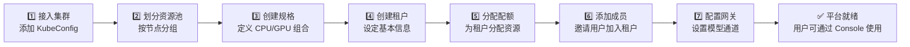

# BOSS 管理门户概览

## 简介

**BOSS**（Backend Operation & Service System）是 Rune 平台的**管理员专属门户**，为系统管理员提供对整个平台的全局管控能力。相比面向普通用户的 Console 控制台，BOSS 承担着平台基础设施管理、用户身份治理、资源分配调配、LLM 网关运营以及全局配置等核心管理职责。

BOSS 是平台运维的中枢控制系统——所有的集群接入、租户创建、资源配额、网关策略、模型仓库管理等操作均在此完成。

## 谁应该使用 BOSS

| 角色 | 使用场景 | 推荐入口 |
|------|----------|----------|
| **系统管理员** | 平台基础设施管理、集群接入、资源分配 | BOSS |
| **运维工程师** | 集群监控、日志排查、节点管理 | BOSS |
| **安全管理员** | 用户管理、MFA 策略、审计日志 | BOSS |
| **网关管理员** | API Key 管理、模型通道、内容审查 | BOSS |
| **普通开发者** | 模型训练、推理部署、开发环境 | Console |
| **租户管理员** | 工作空间管理、成员管理 | Console |

> 💡 提示: BOSS 与 Console 使用同一套账户体系，但 BOSS 仅对拥有**系统管理员**角色的用户开放。普通用户访问 BOSS 地址将看到 403 权限不足页面。

## 进入路径

访问 `https://your-domain/boss/`，使用系统管理员账号登录即可进入 BOSS 门户。

## BOSS 与 Console 的区别

| 维度 | BOSS 管理门户 | Console 控制台 |
|------|---------------|----------------|
| **目标用户** | 系统管理员、运维人员 | 开发者、租户管理员 |
| **访问权限** | 仅系统管理员 | 所有注册用户 |
| **管理范围** | 全平台、跨租户 | 当前租户/工作空间 |
| **集群管理** | 完整的集群生命周期管理 | 仅查看已分配的资源 |
| **用户管理** | 创建/编辑/删除任何用户 | 管理个人资料 |
| **租户管理** | 创建/配置/启停所有租户 | 管理当前租户成员 |
| **资源管理** | 资源池、规格、配额全局管理 | 在配额内使用资源 |
| **网关管理** | 通道配置、审查策略、审计 | 通过 API Key 调用网关 |
| **数据仓库** | 管理全平台模型/数据集/镜像 | 在权限范围内使用 |

## 功能模块架构

```mermaid
graph TB
    BOSS["🏢 BOSS 管理门户"]
    
    BOSS --> Dashboard["📊 平台仪表盘"]
    BOSS --> IAM["👥 账户中心 IAM"]
    BOSS --> RuneAdmin["⚙️ Rune 计算管理"]
    BOSS --> Gateway["🔑 LLM 网关管理"]
    BOSS --> Moha["📚 Moha 数据仓库"]
    BOSS --> Settings["🛠️ 平台设置"]
    
    Dashboard --> MohaCard["Moha 资源卡片"]
    Dashboard --> GatewayCard["网关运营卡片"]
    Dashboard --> MgmtCard["平台管理卡片"]
    
    IAM --> Users["用户管理"]
    IAM --> Tenants["租户管理"]
    
    RuneAdmin --> Clusters["集群管理"]
    RuneAdmin --> ResPools["资源池"]
    RuneAdmin --> Flavors["规格管理"]
    RuneAdmin --> Systems["系统实例"]
    RuneAdmin --> SysMarket["系统市场"]
    RuneAdmin --> Templates["产品模板"]
    RuneAdmin --> TenantRes["租户资源"]
    
    Gateway --> Ops["运营概览"]
    Gateway --> ApiKeys["API Key 管理"]
    Gateway --> Channels["模型通道"]
    Gateway --> Moderation["内容审查"]
    Gateway --> GWConfig["网关配置"]
    Gateway --> Audit["审计日志"]
    
    Moha --> Models["模型库"]
    Moha --> Datasets["数据集"]
    Moha --> Images["镜像仓库"]
    Moha --> Spaces["Space 应用"]
    Moha --> Mirrors["数据镜像"]
    
    Settings --> Platform["平台设置"]
    Settings --> Members["系统成员"]
    Settings --> RuneSet["Rune 设置"]
    Settings --> MohaSet["Moha 设置"]
    Settings --> ChatSet["ChatApp 设置"]
    Settings --> DynDash["动态仪表板"]

    style BOSS fill:#1a73e8,color:#fff
    style Dashboard fill:#e8f0fe
    style IAM fill:#fce8e6
    style RuneAdmin fill:#e6f4ea
    style Gateway fill:#fef7e0
    style Moha fill:#f3e8fd
    style Settings fill:#e8eaed
```

## 管理员典型工作流

以下是系统管理员在 BOSS 中完成平台初始化的典型工作流：

> 💡 提示: 建议按照上述顺序完成平台初始化。集群是所有计算资源的基础，租户是用户组织的基本单元，网关是 AI 模型服务的入口。

## 顶部导航

BOSS 顶部有 6 个模块快速链接，可快速在各管理模块之间切换：

| 导航链接 | 目标路径 | 说明 |
|----------|----------|------|
| 首页 | `/boss/dashboard` | 平台仪表盘，总览全局状态 |
| Rune | `/boss/rune/clusters` | 计算集群管理模块 |
| Moha | `/boss/moha/models` | 数据仓库管理模块 |
| LLM 网关 | `/boss/gateway/operations` | 网关运营管理模块 |
| 账户中心 | `/boss/iam/users` | 用户和租户管理 |
| 平台设置 | `/boss/settings/platform` | 全局平台配置 |

## 侧边栏导航结构

侧边栏按功能域分组，提供所有管理页面的快速入口：

### 📊 概览
- **仪表盘** — 平台全局统计与健康状态

### 🔑 LLM 网关
- **运营概览** — 网关请求量、延迟等运营指标
- **API Key** — 管理全平台的 API Key
- **模型列表** — 管理可用模型通道
- **审查策略** — 配置内容安全审查规则
- **审查词库** — 管理敏感词词库
- **网关配置** — 网关全局参数配置
- **审计日志** — 网关请求的完整审计记录

### 📚 数据仓库
- **模型库** — 管理平台模型资源
- **数据集** — 管理训练数据集
- **镜像仓库** — 管理容器运行时镜像
- **Space** — 管理 Space 应用
- **镜像** — 管理数据镜像同步

### ⚙️ Rune
- **集群管理** — 管理 Kubernetes 计算集群
- **租户资源** — 管理租户的配额和资源分配
- **模板** — 管理系统应用和产品模板

### 👥 账户中心
- **用户管理** — 管理平台所有用户账户
- **租户管理** — 管理所有租户组织

### 🛠️ 平台管理
- **系统成员** — 管理系统级管理员
- **平台设置** — Logo、域名等基本配置
- **Rune 设置** — 计算平台特定配置
- **Moha 设置** — 数据仓库特定配置
- **ChatApp 设置** — 对话应用特定配置
- **动态仪表板** — 自定义监控面板模板

## 权限要求

| 操作 | 所需角色 | 说明 |
|------|----------|------|
| 访问 BOSS | 系统管理员 | 基本访问权限 |
| 集群管理 | 系统管理员 | 完整的集群 CRUD |
| 用户管理 | 系统管理员 | 创建 / 编辑 / 删除用户 |
| 租户管理 | 系统管理员 | 创建 / 配置 / 启停租户 |
| 网关管理 | 系统管理员 | 通道 / 审查 / 配置管理 |
| 平台设置 | 系统管理员 | 全局配置修改 |

> ⚠️ 注意: 如果您不是系统管理员但需要访问 BOSS，请联系现有系统管理员为您分配相应角色。未授权访问 BOSS 将返回 **403 权限不足**页面。

## 快速开始

如果您是首次使用 BOSS，建议按以下顺序阅读文档：

1. [平台仪表盘](./dashboard.md) — 了解平台全局状态
2. [集群管理](./rune/clusters.md) — 接入计算集群
3. [资源池管理](./rune/resource-pools.md) — 划分集群资源
4. [规格管理](./rune/flavors.md) — 定义计算规格
5. [租户管理](./iam/tenants.md) — 创建和配置租户
6. [用户管理](./iam/users.md) — 管理平台用户
