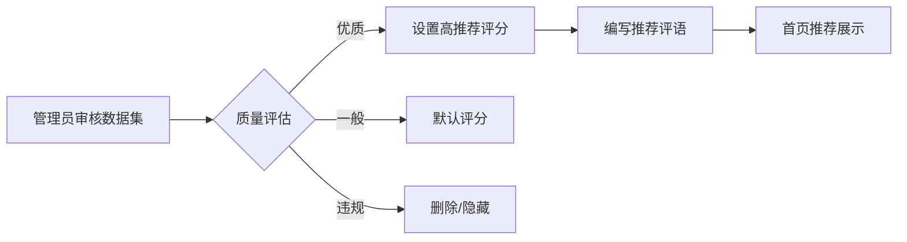
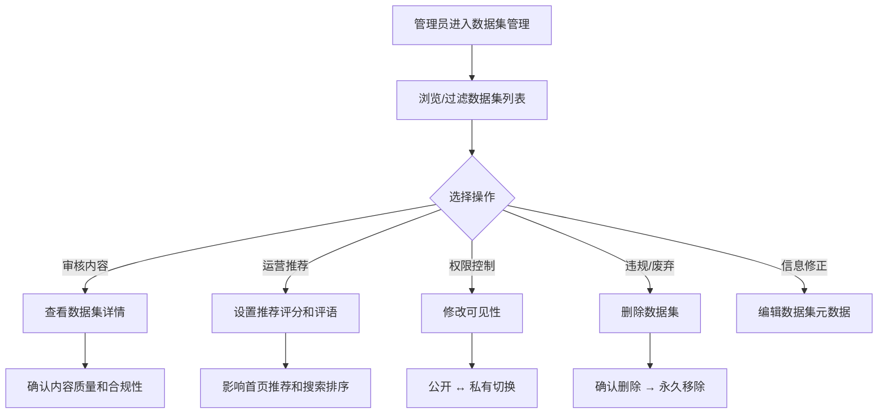

# 数据集管理

## 功能简介

BOSS 端的数据集管理提供 **平台级别** 的数据集仓库全局管理能力。系统管理员可以查看和管理平台上所有租户、用户和组织创建的数据集仓库（包括私有数据集），执行可见性变更、推荐评分、内容审核等管理操作。

> 💡 提示: 数据集管理与模型库管理共享相同的数据仓库管理界面，通过顶部标签页切换。数据集同样支持任务类别标签和推荐评分功能。

## 进入路径

BOSS → 数据仓库 → **数据集**

路径：`/boss/moha/datasets`

## 页面说明

### 数据标签页

数据集管理位于 BOSS 数据仓库管理页面的 **数据集** 标签页下，与模型库、镜像仓库、工作空间、Space 等并列展示。

### 过滤栏（FilterBar）

页面顶部提供 FilterBar 组件，支持多维度快速定位：

- **名称搜索**：按数据集名称模糊搜索
- **租户/组织筛选**：按所属租户或组织过滤
- **可见性筛选**：公开 / 私有
- **任务类别筛选**：按数据集适用的任务类别（如文本分类、图像标注等）过滤
- **许可证筛选**：按开源许可类型筛选

### 数据集列表表格

| 列 | 说明 | 详细描述 |
|----|------|----------|
| 名称 | 数据集名称 | 显示格式为 `组织/数据集名`，名称旁可能附带 **镜像标签**（🔄 表示来自镜像同步）和说明描述 |
| 租户/组织 | 所属租户或组织 | 显示组织头像（Avatar）及名称 |
| 可见性 | 公开 / 私有 | 显示公开（🌐）或私有（🔒）图标，旁边标注创建者用户名 |
| 任务类别 | 数据集任务分类 | 如：文本分类、图像识别、语音转文字、翻译等标签 |
| 库/框架 | 兼容框架 | 数据集兼容的框架和加载库标签 |
| 许可证 | 开源许可 | 如：Apache-2.0、CC-BY-4.0、自定义许可等 |
| 推荐评分 | 管理员推荐分 | 包含推荐分数和推荐评语，影响平台首页推荐排序 |
| 加密状态 | 是否加密 | 标识数据集文件是否启用了加密存储 |
| 操作 | 管理操作按钮 | 编辑、删除、修改可见性、管理推荐 |

> ⚠️ 注意: 带有镜像标签的数据集来自外部平台同步，此类数据集的内容会定期自动更新，手动编辑可能被覆盖。

## 管理操作

### 编辑数据集

点击操作列的 **编辑** 按钮，可修改数据集的基本信息：

- 数据集描述和说明
- 任务类别标签
- 兼容框架/库标签
- 许可证信息

### 修改可见性

管理员可以将任意数据集在 **公开** 和 **私有** 之间切换：

- **设为公开**：数据集将对平台所有用户可见和可下载
- **设为私有**：数据集将仅对所属组织/用户可见

> ⚠️ 注意: 修改可见性会立即生效，正在使用该数据集的训练任务不会受影响，但其他用户将无法新建对该数据集的引用。

### 推荐管理

推荐管理用于控制优质数据集在平台首页和搜索中的展示优先级：

| 字段 | 说明 |
|------|------|
| 推荐评分 | 数值型评分，分数越高越靠前展示 |
| 推荐评语 | 对该数据集的推荐理由，用户侧可见 |

### 删除数据集

点击 **删除** 按钮，确认后将永久移除：

- 数据集仓库及所有版本文件
- 关联的下载记录和统计数据
- 此操作不可撤销

> ⚠️ 注意: 删除数据集前，建议确认没有正在运行的训练任务引用该数据集，否则可能导致任务失败。

### 查看数据集详情

点击数据集名称进入详情页，可查看：

- 数据集文件列表和版本历史
- README 文档渲染预览
- 数据集卡片信息（大小、格式、样本数等）
- 下载统计

## 数据集管理流程

## 权限要求

需要 **系统管理员** 角色才能访问 BOSS 数据集管理页面。

> 💡 提示: 普通用户和租户管理员应通过 Console → Moha → 数据集 来管理自己的数据集仓库。
