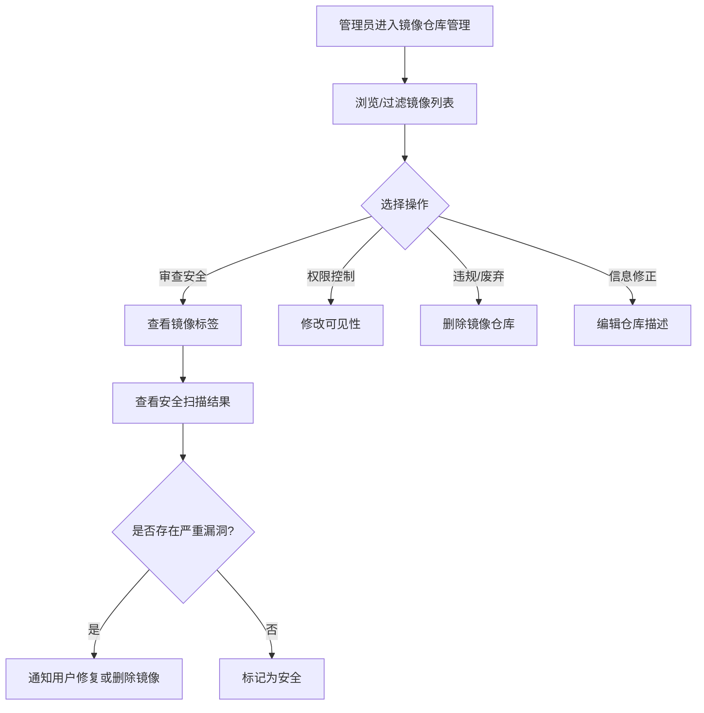

# 镜像仓库管理

## 功能简介

BOSS 端的镜像仓库管理提供 **平台级别** 的容器镜像仓库全局管理能力。系统管理员可以查看和管理平台上所有租户、用户和组织创建的容器镜像仓库，包括查看镜像标签（Tag）列表、安全扫描结果、修改可见性以及删除违规镜像等操作。

> 💡 提示: 此处的镜像仓库指容器镜像（Container Image），用于 AI 训练和推理任务的运行环境，与数据镜像同步（Mirrors）不同。

## 进入路径

BOSS → 数据仓库 → **镜像仓库**

路径：`/boss/moha/images`

## 页面说明

### 数据标签页

镜像仓库管理位于 BOSS 数据仓库管理页面的 **镜像仓库** 标签页下，与模型库、数据集、工作空间、Space 等并列展示。

### 过滤栏（FilterBar）

页面顶部提供 FilterBar 组件，支持多维度过滤：

- **名称搜索**：按镜像仓库名称模糊搜索
- **租户/组织筛选**：按所属租户或组织过滤
- **可见性筛选**：公开 / 私有

### 镜像仓库列表表格

| 列 | 说明 | 详细描述 |
|----|------|----------|
| 名称 | 镜像仓库名称 | 显示格式为 `组织/镜像名`，附带说明描述 |
| 租户/组织 | 所属租户或组织 | 显示组织头像（Avatar）及名称 |
| 可见性 | 公开 / 私有 | 显示公开（🌐）或私有（🔒）图标，旁边标注创建者用户名 |
| 许可证 | 镜像许可协议 | 镜像的使用许可类型 |
| 加密状态 | 是否加密 | 标识镜像是否启用了加密存储 |
| 操作 | 管理操作按钮 | 编辑、删除、修改可见性 |

> ⚠️ 注意: 镜像仓库不同于模型和数据集，不支持推荐评分和任务类别标签。

## 管理操作

### 查看镜像标签（Tags）

点击镜像仓库名称进入详情页，可查看该仓库下所有镜像标签：

| 信息 | 说明 |
|------|------|
| Tag 名称 | 镜像版本标签，如 `latest`、`v1.0`、`cuda11.8-py3.10` |
| 镜像大小 | 该标签对应的镜像压缩大小 |
| 推送时间 | 标签最后推送/更新的时间 |
| 摘要（Digest） | 镜像内容的 SHA256 摘要 |

### 安全扫描结果

管理员可查看镜像的安全扫描结果，了解镜像中存在的漏洞信息：

| 扫描信息 | 说明 |
|----------|------|
| 漏洞等级 | 严重（Critical）、高（High）、中（Medium）、低（Low） |
| 漏洞数量 | 各等级漏洞的数量统计 |
| 扫描时间 | 最近一次自动扫描的时间 |
| 修复建议 | 部分漏洞提供的修复指引 |

> 💡 提示: 安全扫描由平台自动触发，管理员可根据扫描结果决定是否允许该镜像继续使用，或通知用户修复漏洞。

### 编辑镜像仓库

点击 **编辑** 按钮，可修改镜像仓库的：

- 仓库描述信息
- 许可证信息

### 修改可见性

管理员可以将镜像仓库在 **公开** 和 **私有** 之间切换：

- **设为公开**：所有用户均可拉取该镜像
- **设为私有**：仅所属组织/用户可拉取

> ⚠️ 注意: 修改可见性会立即影响其他用户的镜像拉取权限。如有正在运行的容器引用了该镜像，不会受到影响（镜像已缓存），但新的部署请求将受到限制。

### 删除镜像仓库

点击 **删除** 按钮，将弹出确认对话框。删除后：

- 镜像仓库及所有标签（Tags）将被永久移除
- 引用该镜像的运行环境配置将失效
- 此操作 **不可撤销**

## 镜像仓库管理流程

## 常见场景

| 场景 | 操作 |
|------|------|
| 发现镜像存在严重漏洞 | 通知用户修复或删除镜像，设为私有限制使用 |
| 用户申请公开其镜像 | 审核镜像内容后修改可见性为公开 |
| 清理废弃镜像 | 检查引用情况后删除无用镜像释放存储空间 |
| 审计镜像安全合规 | 批量查看安全扫描结果，排查高风险镜像 |

> 💡 提示: 建议定期扫描所有公开镜像的安全漏洞，特别关注 Critical 和 High 级别的漏洞。

## 权限要求

需要 **系统管理员** 角色才能访问 BOSS 镜像仓库管理页面。

> 💡 提示: 普通用户和租户管理员应通过 Console → Moha → 镜像仓库 来管理自己的容器镜像。
