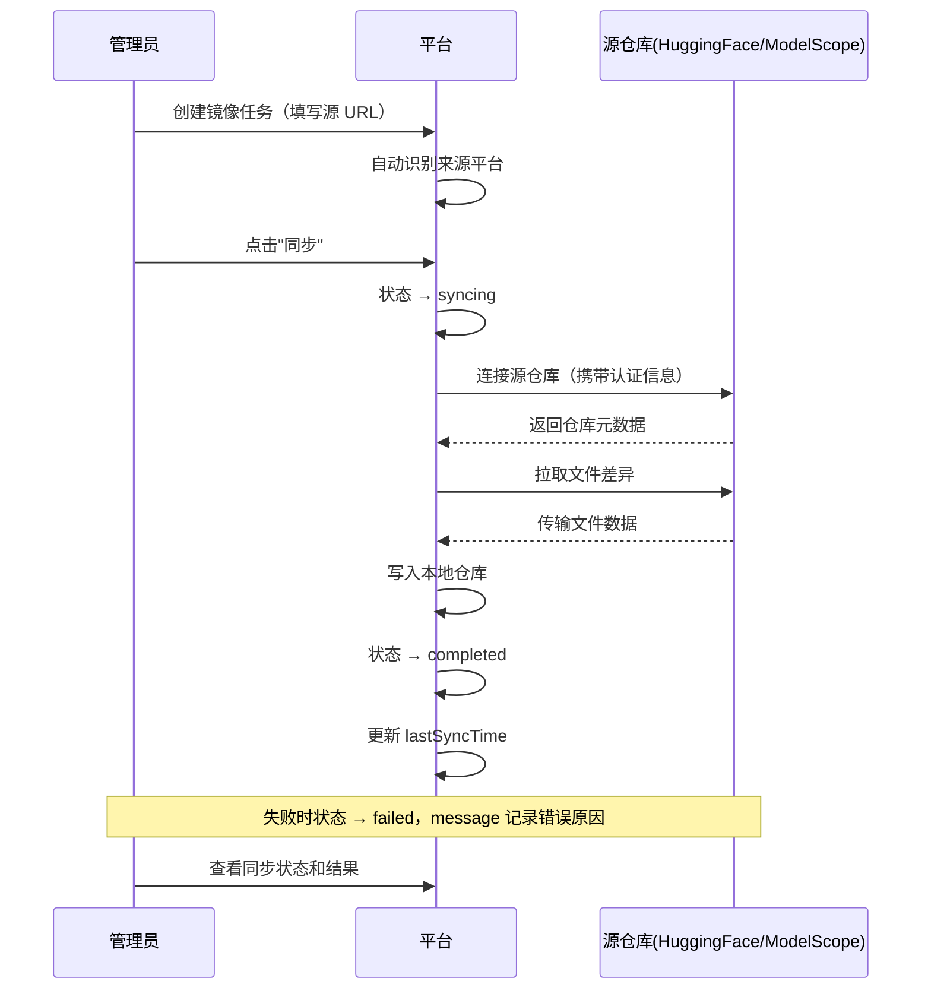

# 数据镜像管理

## 功能简介

数据镜像功能用于管理 Moha 数据的镜像和同步任务，支持从外部平台（如 HuggingFace、ModelScope）将模型和数据集自动同步到本平台。管理员可以创建镜像任务、监控同步状态、管理同步生命周期，实现数据资产的跨平台统一管理。

> 💡 提示: 数据镜像是平台数据丰富度的核心保障机制。通过配置镜像任务，可以将外部开源社区的优质模型和数据集自动引入本平台，无需用户手动上传。

## 进入路径

BOSS → 数据仓库 → **镜像**

路径：`/boss/moha/mirrors`

## 页面说明


### 标签页

数据镜像管理页面提供两个标签页：

| 标签页 | 说明 |
|--------|------|
| **模型** | 管理模型类型的镜像同步任务 |
| **数据集** | 管理数据集类型的镜像同步任务 |

### 镜像列表表格

| 列 | 说明 | 详细描述 |
|----|------|----------|
| 名称 | 镜像任务名称 | 镜像同步后在本平台的名称 |
| 来源（Source） | 数据来源平台 | 系统根据源 URL 自动识别来源平台（见下方说明） |
| 租户/组织 | 所属租户或组织 | 显示组织头像（Avatar）及名称 |
| 状态（Status） | 同步状态 | 使用 ObjectStatus 组件展示当前同步阶段（见下方状态说明） |
| 最后同步时间 | 上次成功同步时间 | `lastSyncTime` 字段，展示最近一次完成同步的时间 |
| 操作 | 管理操作按钮 | 同步/停止（动态）、编辑、删除 |

### 来源自动识别

系统会根据镜像源的 URL 地址自动检测来源平台并显示对应的标签：

| URL 域名 | 识别结果 | 显示标签 |
|----------|----------|----------|
| `modelscope.cn` | ModelScope（魔搭社区） | ![ModelScope] modelscope |
| `huggingface.co` | HuggingFace | ![HuggingFace] huggingface |
| 其他域名 | 自定义来源 | 显示原始域名 |

> 💡 提示: 来源自动识别仅影响显示标签，不影响同步逻辑。无论来源平台是什么，同步机制均通过 Git 协议完成。

### 同步状态说明

镜像任务的同步状态由 `status.phase` 字段决定：

| 状态（Phase） | 说明 | 操作按钮 |
|---------------|------|----------|
| `idle` | 空闲，等待下次同步 | 显示 **同步** 按钮 |
| `syncing` | 正在同步中 | 显示 **停止** 按钮 |
| `completed` | 上次同步已完成 | 显示 **同步** 按钮 |
| `failed` | 上次同步失败 | 显示 **同步** 按钮 |
| `stopped` | 已手动停止 | 显示 **同步** 按钮 |

> ⚠️ 注意: 操作按钮会根据当前状态动态切换 —— 仅在 `syncing`（同步中）状态时显示 **停止** 按钮，其他状态均显示 **同步** 按钮。

## 镜像数据结构

完整的镜像任务对象包含以下字段：

```yaml
name: "qwen2-7b"                    # 镜像任务名称
organization: "ai-lab"              # 所属组织
requestCount: 0                     # 请求计数
type: "model"                       # 类型：model / dataset
status:
  lastSyncTime: "2025-01-15T10:30:00Z"  # 最后同步时间
  phase: "completed"                     # 当前阶段
  message: ""                            # 状态消息（失败时包含错误信息）
source:
  url: "https://huggingface.co/Qwen/Qwen2-7B"   # 源地址
  allRefs: false                                  # 是否同步所有分支和标签
  username: ""                                    # 认证用户名（可选）
  password: ""                                    # 认证密码（可选）
  token: ""                                       # 认证令牌（可选）
paused: false                       # 是否暂停自动同步
```

## 创建镜像任务

点击 **创建镜像** 按钮，填写以下信息：

| 字段 | 类型 | 必填 | 说明 |
|------|------|------|------|
| 名称 | 文本 | ✅ | 镜像后在本平台的名称 |
| 组织 | 选择 | ✅ | 存储到哪个组织下 |
| 类型 | 选择 | ✅ | 模型 / 数据集 |
| 源地址（URL） | URL | ✅ | 外部平台的仓库地址 |
| 同步所有引用（allRefs） | 开关 | — | 是否同步所有分支和标签，默认仅主分支 |
| 用户名 | 文本 | — | 源仓库需要认证时填写 |
| 密码 | 密码 | — | 源仓库的密码（与 Token 二选一） |
| 令牌（Token） | 密码 | — | 源仓库的访问令牌（与密码二选一） |


> 💡 提示: 对于公开仓库（如 HuggingFace 上的公开模型），无需填写认证信息。对于受限访问的仓库（Gated Models），需要提供有效的访问令牌。

> ⚠️ 注意: 启用"同步所有引用"（allRefs）会同步源仓库的所有分支和标签，对于大型模型仓库（如多个量化版本），这可能需要大量存储空间和同步时间。

## 管理操作

### 触发同步

点击 **同步** 按钮可手动触发一次同步任务：

1. 系统连接源仓库
2. 比较本地和远程的差异
3. 拉取新增或变更的文件
4. 更新本地仓库状态
5. 记录同步时间和结果

### 停止同步

在同步进行中（`phase = syncing`）时，点击 **停止** 按钮可中断当前同步：

- 已下载的文件会保留
- 任务状态变为 `stopped`
- 可随时重新触发同步

### 编辑镜像任务

点击 **编辑** 按钮可修改：

- 源地址 URL
- 认证信息（用户名/密码/令牌）
- 是否同步所有引用
- 暂停/恢复自动同步

### 删除镜像任务

删除镜像任务后：

- 镜像配置信息被移除
- 已同步的本地数据 **不会** 被自动删除
- 后续不再自动同步更新

## 同步流程



## 监控同步状态

管理员应定期检查镜像任务的同步状态：

| 检查项 | 正常 | 异常处理 |
|--------|------|----------|
| 同步状态 | `completed` | `failed` → 检查 `status.message` 中的错误信息 |
| 最后同步时间 | 定期更新 | 长时间未更新 → 检查网络连通性和认证有效性 |
| 源仓库可达性 | URL 可访问 | 连接超时 → 检查防火墙或代理设置 |
| 认证有效性 | Token 未过期 | 认证失败 → 更新 Token 或密码 |

> ⚠️ 注意: HuggingFace 的访问令牌（Token）可能会过期或被撤销，请注意定期更新。ModelScope 的令牌管理方式可能不同，请参考对应平台的文档。

## 权限要求

需要 **系统管理员** 角色才能访问 BOSS 数据镜像管理页面。

> 💡 提示: 数据镜像管理是平台级别的核心功能，请确保只有可信赖的管理员能访问此功能，避免同步不合规的外部数据。
