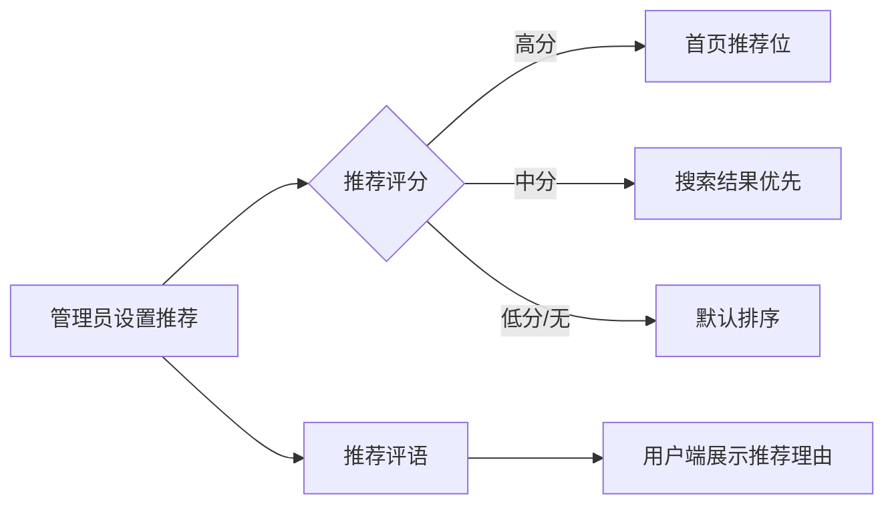
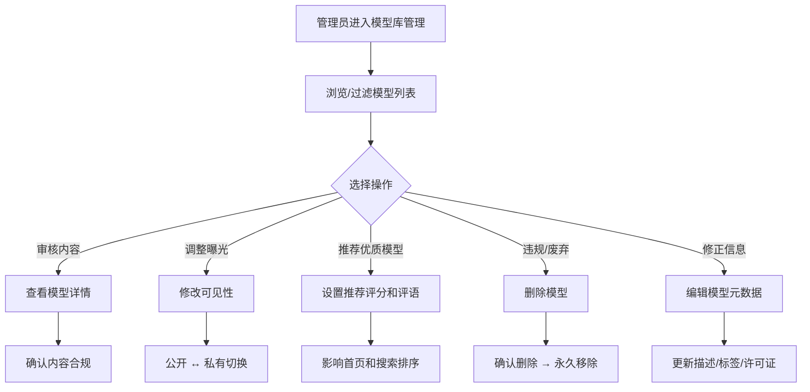

# 模型库管理

## 功能简介

BOSS 端的模型库管理提供 **平台级别** 的模型仓库全局管理能力。与 Console 端的 Moha 模型管理不同，BOSS 端面向系统管理员，可查看、审核和管理 **所有租户、用户和组织** 创建的模型仓库——包括私有模型。管理员可在此执行可见性变更、推荐评分、加密状态审查等高级管理操作。

> 💡 提示: BOSS 模型库管理是平台运营的核心入口。Console 端用户只能看到自己有权限的模型，而 BOSS 端管理员可以看到全平台所有模型。

## 进入路径

BOSS → 数据仓库 → **模型库**

路径：`/boss/moha/models`

## 与 Console Moha 视图的区别

| 维度 | BOSS 模型管理 | Console 模型管理 |
|------|--------------|-----------------|
| 数据范围 | 全平台所有模型（含私有） | 仅当前用户/组织有权限的模型 |
| 可见性管理 | 可修改任意模型的公开/私有状态 | 仅能管理自己创建的模型 |
| 推荐管理 | 可设置推荐评分和推荐语 | 无此功能 |
| 加密状态 | 可查看和管理加密状态标签 | 仅查看 |
| 删除权限 | 可删除任意模型仓库 | 仅能删除自己的模型 |

## 页面说明

### 数据标签页

模型库管理位于 BOSS 数据仓库管理的 **模型** 标签页下，与数据集、镜像仓库、工作空间、Space 等并列。

### 过滤栏（FilterBar）

页面顶部提供 FilterBar 组件，支持多维度过滤：

- **名称搜索**：按模型名称模糊搜索
- **租户/组织筛选**：按所属租户或组织过滤
- **可见性筛选**：公开 / 私有
- **任务类别筛选**：按模型适用的任务类别（如文本生成、图像分类等）过滤
- **框架筛选**：按模型使用的框架（如 PyTorch、TensorFlow）过滤

### 模型列表表格

| 列 | 说明 | 详细描述 |
|----|------|----------|
| 名称 | 模型名称 | 显示格式为 `组织/模型名`，名称旁可能附带 **镜像标签**（🔄 表示来自镜像同步）和 **说明描述** |
| 租户/组织 | 所属租户或组织 | 显示组织头像（Avatar）及名称 |
| 可见性 | 公开 / 私有 | 显示公开（🌐）或私有（🔒）图标，旁边标注创建者用户名 |
| 任务类别 | 模型任务分类 | 如：文本生成、图像分类、语音识别等标签 |
| 库/框架 | 技术框架 | 如：PyTorch、TensorFlow、JAX、Transformers 等 |
| 许可证 | 开源许可 | 如：Apache-2.0、MIT、自定义许可 等 |
| 推荐评分 | 管理员推荐分 | 包含推荐分数和推荐评语，用于平台首页展示排序 |
| 加密状态 | 是否加密 | 标识模型文件是否启用了加密存储 |
| 操作 | 管理操作按钮 | 编辑、删除、修改可见性、管理推荐 |

> ⚠️ 注意: 镜像标签表示该模型是通过镜像同步功能从外部平台（如 HuggingFace、ModelScope）同步而来的，此类模型的编辑可能受到限制。

## 管理操作

### 编辑模型

点击操作列的 **编辑** 按钮，可修改模型的基本信息：

- 模型描述
- 任务类别
- 框架/库标签
- 许可证信息

### 修改可见性

管理员可以将任意模型在 **公开** 和 **私有** 之间切换：

- **设为公开**：模型将对平台所有用户可见
- **设为私有**：模型将仅对所属组织/用户可见

> ⚠️ 注意: 将公开模型设为私有后，已经引用该模型的其他用户可能会受到影响，请谨慎操作。

### 推荐管理

推荐管理是 BOSS 独有的功能，用于控制模型在平台首页、搜索结果中的推荐展示：

| 字段 | 说明 |
|------|------|
| 推荐评分 | 数值型评分，分数越高在推荐列表中排序越靠前 |
| 推荐评语 | 管理员对该模型的推荐理由说明，展示给用户参考 |

### 删除模型

点击 **删除** 按钮，将弹出确认对话框。删除后：

- 模型仓库及所有版本文件将被永久移除
- 引用该模型的推理服务可能会失败
- 此操作不可撤销

### 查看模型详情

点击模型名称可进入模型详情页，查看：

- 模型文件列表和版本历史
- README 文档渲染
- 模型卡片信息
- 下载统计和使用情况

## 数据管理流程

## 常见场景

| 场景 | 操作 |
|------|------|
| 发现违规模型 | 修改为私有或直接删除 |
| 推广优质开源模型 | 设置高推荐评分并编写推荐评语 |
| 用户反馈模型信息错误 | 编辑模型的任务类别、框架标签或许可证 |
| 审查加密模型 | 查看加密状态标识，确认加密策略合规 |
| 镜像模型出现问题 | 检查镜像标签，前往镜像管理查看同步状态 |

## 权限要求

需要 **系统管理员** 角色才能访问 BOSS 模型库管理页面。

> 💡 提示: 普通用户和租户管理员应通过 Console → Moha → 模型 来管理自己的模型仓库。
