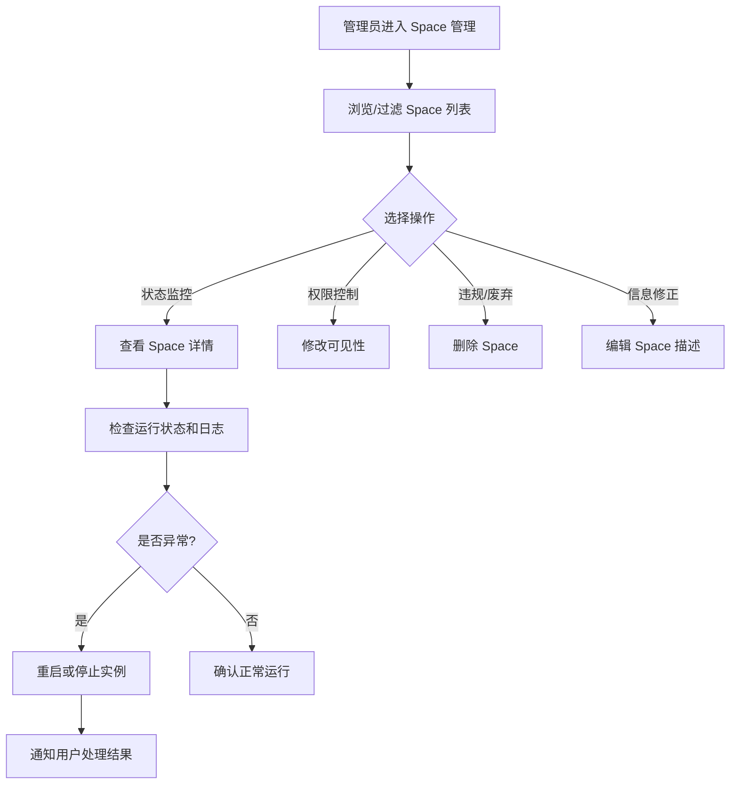

# Space 管理

## 功能简介

BOSS 端的 Space 管理提供 **平台级别** 的 Space 应用全局管理能力。Space 是基于代码仓库构建的交互式 Web 应用（如 Gradio、Streamlit 应用），用于模型演示和体验。系统管理员可以查看和管理平台上所有租户和组织创建的 Space，包括监控运行状态、管理可见性、处理异常实例等。

> 💡 提示: Space 类似于 HuggingFace Spaces，是面向用户的模型演示入口。BOSS 端管理员可以全局调度和管理所有 Space 实例。

## 进入路径

BOSS → 数据仓库 → **Space**

路径：`/boss/moha/spaces`

## 页面说明

### 数据标签页

Space 管理位于 BOSS 数据仓库管理页面的 **Space** 标签页下，与模型库、数据集、镜像仓库、工作空间等并列展示。

### 过滤栏（FilterBar）

页面顶部提供 FilterBar 组件，支持快速定位：

- **名称搜索**：按 Space 名称模糊搜索
- **租户/组织筛选**：按所属租户或组织过滤
- **可见性筛选**：公开 / 私有
- **状态筛选**：按 Space 运行状态过滤

### Space 列表表格

| 列 | 说明 | 详细描述 |
|----|------|----------|
| 名称 | Space 名称 | 显示格式为 `组织/Space名`，附带说明描述 |
| 租户/组织 | 所属租户或组织 | 显示组织头像（Avatar）及名称 |
| 可见性 | 公开 / 私有 | 显示公开（🌐）或私有（🔒）图标，旁边标注创建者用户名 |
| 部署状态 | Space 运行状态 | 显示当前部署阶段和运行状况 |
| 许可证 | 代码许可协议 | Space 源代码的许可类型 |
| 加密状态 | 是否加密 | 标识 Space 是否启用了加密存储 |
| 操作 | 管理操作按钮 | 编辑、删除、修改可见性 |

### Space 部署状态

Space 的部署状态（ObjectStatus）反映了实例的生命周期阶段：

| 状态 | 说明 | 图标 |
|------|------|------|
| Building | 正在构建容器镜像 | 🔨 |
| Running | 已启动并正常运行 | ✅ |
| Stopped | 已停止运行 | ⏹️ |
| Error | 构建或运行出错 | ❌ |
| Sleeping | 空闲超时，自动休眠 | 😴 |

> 💡 提示: Space 在长时间无访问后可能自动进入 Sleeping 状态以节省资源。用户再次访问时会自动唤醒。

## 管理操作

### 查看 Space 详情

点击 Space 名称进入详情页，可查看：

- Space 应用的实时预览
- 代码仓库文件列表
- 运行日志和构建日志
- 资源使用情况（CPU、内存、GPU）
- 环境变量配置

### 编辑 Space

点击 **编辑** 按钮，可修改 Space 的基本信息：

- Space 描述信息
- 许可证信息

### 修改可见性

管理员可以将 Space 在 **公开** 和 **私有** 之间切换：

- **设为公开**：所有用户均可访问该 Space 应用
- **设为私有**：仅所属组织/用户可访问

### 管理 Space 实例

管理员可以对 Space 实例执行以下管理操作：

- **重启**：重新构建并启动 Space
- **停止**：强制停止运行中的 Space 实例
- **查看日志**：排查构建或运行异常

> ⚠️ 注意: 停止或删除正在被用户使用的 Space 会立即中断用户的使用体验，建议提前通知用户。

### 删除 Space

点击 **删除** 按钮，确认后将永久移除：

- Space 代码仓库和所有文件
- 运行中的容器实例
- 相关的构建缓存和日志
- 此操作 **不可撤销**

## Space 管理流程

## 常见场景

| 场景 | 操作 |
|------|------|
| Space 持续报错 | 查看运行日志，必要时重启或停止实例 |
| Space 占用过多资源 | 检查资源使用情况，通知用户优化或停止实例 |
| 违规 Space 被举报 | 审核内容后设为私有或删除 |
| 空闲 Space 占用资源 | 批量检查 Sleeping 状态的 Space，清理长期未使用的实例 |

> 💡 提示: 建议定期巡查 Error 状态的 Space，及时通知用户处理异常，保持平台整体健康。

## 权限要求

需要 **系统管理员** 角色才能访问 BOSS Space 管理页面。

> 💡 提示: 普通用户和租户管理员应通过 Console → Moha → Space 来创建和管理自己的 Space 应用。
