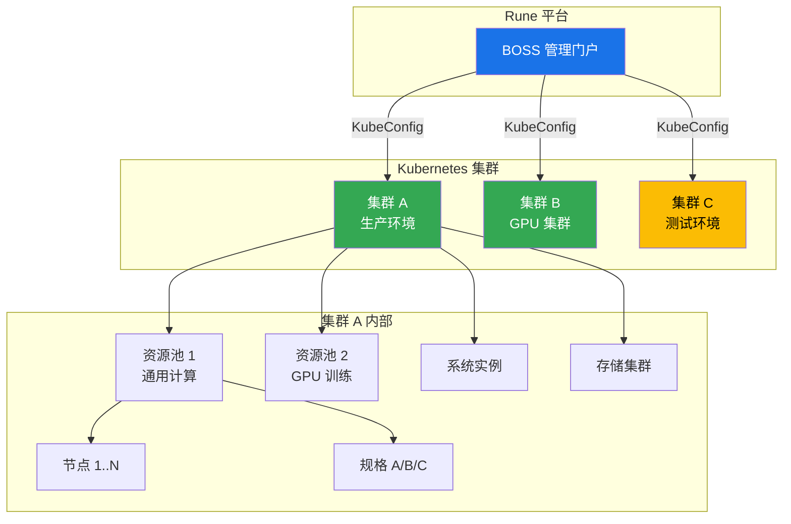
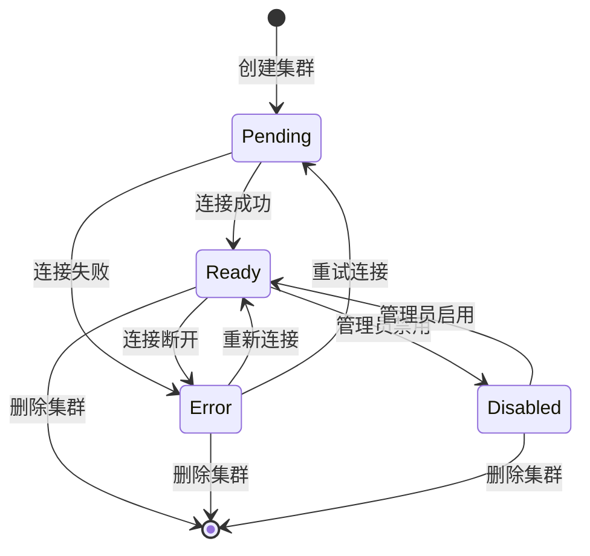
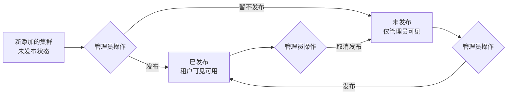
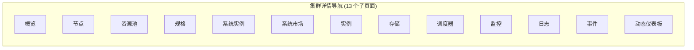
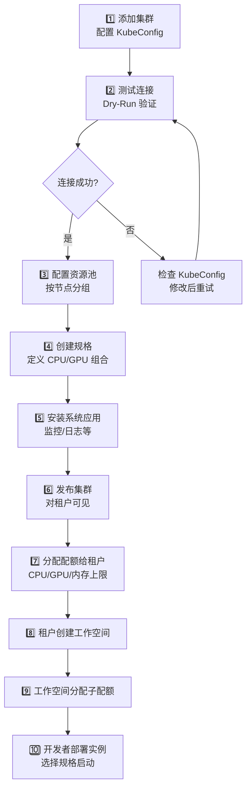

# 集群管理

## 功能简介

集群管理是 BOSS 中最核心的基础设施管理功能。Rune 平台的所有计算能力都来自于通过 BOSS 接入的 Kubernetes 集群。系统管理员在此可以完成集群的**添加接入**、**连接测试**、**发布上线**、**详情监控**和**终端操作**等全生命周期管理。

每个集群下包含 **13 个详情子页面**，涵盖了从节点管理、资源池、规格配置到监控指标、日志查询、事件追踪等方方面面，是管理员进行基础设施运维的核心入口。

## 进入路径

BOSS → Rune → **集群管理**

路径：`/boss/rune/clusters`

## 集群架构概览



---

## 集群列表


集群列表以表格形式展示所有已接入的 Kubernetes 集群。

### 列字段说明

| 列 | 字段名 | 展示方式 | 说明 |
|----|--------|----------|------|
| **名称** | `name` | 链接文本 | 集群名称，点击进入集群详情页 |
| **版本** | `gitVersion` | 文本标签 | Kubernetes 版本号（如 `v1.28.4`），来自集群状态信息 |
| **已发布** | `published` | 图标 | 集群是否已发布上线 ✅/❌，仅已发布集群对租户可见 |
| **连接状态** | `connect_status` | ObjectStatus 状态标签 | 集群的实时连接状态，以颜色标签展示 |
| **创建时间** | `creationTimestamp` | 格式化时间 | 集群添加到平台的时间 |
| **操作** | — | 操作按钮组 | 测试连接、发布/取消发布、终端、编辑、删除 |

### 集群连接状态

连接状态通过 `ObjectStatus` 组件以彩色标签展示：

| 状态 | 颜色 | 含义 |
|------|------|------|
| **Ready** | 🟢 绿色 | 集群连接正常，所有服务可用 |
| **Pending** | 🟡 黄色 | 集群正在连接或初始化中 |
| **Error** | 🔴 红色 | 集群连接失败或出现错误 |
| **Disabled** | ⚪ 灰色 | 集群已被手动禁用 |
| **Unknown** | 🔵 蓝色 | 无法获取集群状态 |

### 集群状态生命周期



---

## 添加集群


### 操作步骤

1. 在集群列表页面，点击右上角 **添加集群** 按钮
2. 在弹出的表单中填写集群信息
3. 建议先点击 **测试连接**，确认配置正确
4. 点击 **创建** 按钮完成添加

### 表单字段

| 字段 | 字段名 | 类型 | 必填 | 说明 |
|------|--------|------|------|------|
| **集群 ID** | `id` | IdField | ✅ | 集群的唯一标识，创建后不可修改。建议使用有意义的短标识，如 `prod-gpu-01` |
| **集群名称** | `name` | 文本输入 | ✅ | 集群的显示名称，用于界面展示 |
| **描述** | `description` | 文本域 (4行) | — | 集群的补充描述信息，如用途、地理位置等 |
| **集群类型** | `type` | 固定值 | — | 固定为 **Kubernetes**（当前仅支持 K8s 集群） |
| **KubeConfig** | `kube.config` | 文本域 (8行, 等宽字体) | ✅ | Kubernetes 集群的连接配置，即 kubeconfig YAML 内容 |

### KubeConfig 配置说明

KubeConfig 是连接 Kubernetes 集群的核心配置，需包含以下关键信息：

```yaml
apiVersion: v1
kind: Config
clusters:
  - cluster:
      server: https://your-k8s-api-server:6443
      certificate-authority-data: <base64-encoded-ca-cert>
    name: my-cluster
contexts:
  - context:
      cluster: my-cluster
      user: admin
    name: my-context
current-context: my-context
users:
  - name: admin
    user:
      client-certificate-data: <base64-encoded-cert>
      client-key-data: <base64-encoded-key>
```

> ⚠️ 注意: KubeConfig 中的证书和密钥是高度敏感的信息，请确保：
> - 使用专用的服务账户（Service Account），不要使用个人账户
> - 授予最小必要权限
> - 不要在不安全的渠道中传输 KubeConfig 内容

---

## 测试连接（Dry-Run）

在创建或编辑集群时，可以通过 **测试连接** 功能验证 KubeConfig 配置是否正确。

### 操作方式

1. 在集群创建/编辑表单中填写 KubeConfig
2. 点击 **测试连接** 按钮
3. 系统会以 Dry-Run 模式尝试连接集群
4. 显示连接测试结果

### 测试结果

| 结果 | 状态 | 说明 |
|------|------|------|
| ✅ 连接成功 | 成功 | KubeConfig 有效，可以正常访问集群 API |
| ❌ 连接失败 | 失败 | 显示错误信息，如证书过期、地址不可达等 |
| ⚠️ 部分可用 | 警告 | 可连接但权限不足，建议检查 RBAC 配置 |

> 💡 提示: 强烈建议在创建集群前先进行连接测试。如果跳过测试直接创建，集群可能处于 Error 状态，需要后续修改 KubeConfig 重新连接。

---

## 发布 / 取消发布

集群的**发布状态**决定了该集群是否对租户可见、是否可用于资源分配。

| 操作 | 效果 |
|------|------|
| **发布** | 集群对租户可见，租户管理员可在该集群上分配资源和部署实例 |
| **取消发布** | 集群对租户隐藏，已部署的实例不受影响，但不允许新的部署 |



> 💡 提示: 建议新集群在完成连接测试、资源池划分和规格配置后再执行发布操作，避免租户看到尚未准备好的集群。

---

## kubectl 终端

BOSS 提供内置的 **kubectl 终端**功能，允许管理员直接在浏览器中对集群执行 kubectl 命令，无需在本地配置 kubeconfig。


### 使用方式

1. 在集群列表中，点击目标集群操作列的 **终端** 按钮
2. 系统会在页面底部或新窗口中打开一个 Web 终端
3. 终端已自动配置好目标集群的连接上下文
4. 可直接执行 `kubectl` 命令

### 常用命令示例

```bash
# 查看集群节点状态
kubectl get nodes

# 查看所有命名空间的 Pod
kubectl get pods -A

# 查看集群资源使用
kubectl top nodes

# 查看特定命名空间的事件
kubectl get events -n rune-system
```

> ⚠️ 注意: 终端中执行的命令具有集群管理员权限，请谨慎操作。避免在生产集群中执行破坏性命令（如 `kubectl delete`），建议先在测试集群中验证。

---

## 编辑集群

1. 在集群列表中点击操作列的 **编辑** 按钮
2. 可修改集群名称、描述和 KubeConfig
3. 修改 KubeConfig 后建议重新进行连接测试
4. 点击 **保存** 提交修改

> 💡 提示: 集群 ID 和类型创建后不可修改。如需更换集群，建议创建新集群后迁移资源，再删除旧集群。

---

## 删除集群

1. 在集群列表中点击操作列的 **删除** 按钮
2. 系统弹出确认对话框
3. 确认后执行删除操作

> ⚠️ 注意: 删除集群是**不可逆**操作。删除前请确保：
> - 集群上没有正在运行的实例
> - 已迁移所有重要数据
> - 已通知使用该集群的所有租户
> - 已释放该集群关联的资源池和配额

---

## 集群详情页

点击集群名称进入集群详情页。详情页通过 **13 个子页面** 提供集群的全方位管理和监控能力。

路径：`/boss/rune/clusters/:cluster`


### 子页面导航



---

### 1. 概览（Overview）

路径：`/boss/rune/clusters/:cluster/overview`


集群概览以**动态仪表板**形式展示集群的核心信息，包括：

| 区域 | 内容 |
|------|------|
| 基本信息 | 集群名称、ID、版本、类型、创建时间、连接状态 |
| 资源汇总 | 总节点数、总 CPU、总内存、总 GPU 数量 |
| 使用率 | CPU/内存/GPU 的当前使用率和趋势 |
| 节点状态分布 | Ready/NotReady/Unknown 节点数量 |

概览页的面板布局可通过动态仪表板配置自定义。

### 集群数据模型

集群资源对象的完整数据结构如下：

| 字段 | 路径 | 说明 |
|------|------|------|
| 集群类型 | `type` | 固定为 Kubernetes |
| 是否发布 | `published` | 布尔值 |
| KubeConfig | `kube.config` | 集群连接配置 |
| 命名空间 | `kube.namespace` | 默认操作命名空间 |
| 服务地址 | `kube.service` | 集群内部服务地址 |
| 端口 | `kube.port` | 服务端口 |
| 连接状态 | `status.connected` | 是否已连接 |
| 阶段 | `status.phase` | 当前状态阶段 |
| K8s 版本 | `status.version.gitVersion` | Kubernetes 版本 |
| 供应商 | `status.version.vendor` | 集群供应商标识 |
| 构建日期 | `status.version.buildDate` | 版本构建日期 |
| Agent 版本 | `status.agentVersion` | Rune Agent 版本 |
| 状态条件 | `status.conditions` | 详细状态条件列表 |

---

### 2. 节点（Nodes）

路径：`/boss/rune/clusters/:cluster/nodes`


展示集群中所有 Kubernetes 节点的详细信息：

| 列 | 说明 |
|----|------|
| 节点名称 | 节点的主机名 |
| 状态 | Ready / NotReady / SchedulingDisabled |
| 角色 | master / worker |
| IP 地址 | 节点的内网 IP |
| CPU | 总量 / 已用 / 可分配 |
| 内存 | 总量 / 已用 / 可分配 |
| GPU | GPU 型号和数量（如有） |
| Pod 数量 | 当前运行的 Pod 数量 |
| 标签 | 节点标签列表 |
| 污点 | 节点污点配置 |

> 💡 提示: 节点的标签（Labels）是资源池划分的基础。管理员可以通过 kubectl 为节点添加自定义标签，然后在资源池中通过标签选择器筛选节点。

---

### 3. 资源池（Resource Pools）

路径：`/boss/rune/clusters/:cluster/resource-pools`

管理集群中的资源池。资源池是将节点进行逻辑分组的机制，用于实现资源隔离。

详细文档参见 [资源池管理](./resource-pools.md)。

---

### 4. 规格（Flavors）

路径：`/boss/rune/clusters/:cluster/flavors`

管理集群中可用的计算规格。规格定义了部署实例时可选的 CPU/GPU/内存组合。

详细文档参见 [规格管理](./flavors.md)。

---

### 5. 系统实例（Systems）

路径：`/boss/rune/clusters/:cluster/systems`


管理集群级别的系统应用，这些是支撑平台运行的基础服务组件：

- **查看**已部署的系统实例列表
- **安装**新的系统应用（如监控组件、日志采集器等）
- **升级**已安装的系统实例版本
- **卸载**不再需要的系统实例
- 查看系统实例的**运行状态**和**资源使用**

---

### 6. 系统市场（System Market）

路径：`/boss/rune/clusters/:cluster/system-market`


系统市场是平台提供的**系统应用模板商城**，管理员可以从模板库中一键部署系统应用到集群中：

- 浏览可用的系统应用模板
- 查看模板详情（描述、版本、配置参数）
- 一键**部署到当前集群**
- 部署时可自定义配置参数

> 💡 提示: 系统市场中的模板由平台全局管理，管理员可以在 BOSS → Rune → 模板 中管理所有可用的系统应用模板。

---

### 7. 实例（Instances）

路径：`/boss/rune/clusters/:cluster/instances`


展示集群上所有运行的工作负载实例（包括各租户的实例）：

| 列 | 说明 |
|----|------|
| 实例名称 | 工作负载的名称 |
| 租户 | 实例所属的租户 |
| 工作空间 | 实例所属的工作空间 |
| 类型 | 开发环境 / 训练任务 / 推理服务 |
| 状态 | Running / Pending / Failed |
| 资源 | 使用的 CPU/GPU/内存 |
| 创建时间 | 实例的创建时间 |

> ⚠️ 注意: 此页面展示的是集群上所有租户的实例，管理员可以进行全局监控但不应随意操作其他租户的实例。

---

### 8. 存储集群（Storages）

路径：`/boss/rune/clusters/:cluster/storages`


管理和查看集群关联的存储集群配置：

- 存储集群的连接信息
- 存储容量和使用率
- StorageClass 配置
- PV/PVC 使用情况

---

### 9. 调度器（Schedulers）

路径：`/boss/rune/clusters/:cluster/schedulers`

查看和配置集群的调度器资源和策略：

- 查看调度器列表及状态
- 配置调度策略参数
- 调度器的资源分配和优先级配置

---

### 10. 监控指标（Metrics）

路径：`/boss/rune/clusters/:cluster/metrics`


集群资源监控仪表板，以可视化图表展示关键指标：

| 指标分类 | 图表内容 |
|----------|----------|
| **CPU** | CPU 总量、使用率、分配率、使用趋势 |
| **内存** | 内存总量、使用率、分配率、使用趋势 |
| **GPU** | GPU 数量、使用率、显存使用、温度 |
| **网络** | 网络 I/O 速率、丢包率 |
| **磁盘** | 磁盘 I/O、存储使用率 |

支持功能：
- 自定义时间范围（1小时 / 6小时 / 24小时 / 7天 / 30天）
- 自动刷新（可选间隔）
- 图表放大查看
- 数据导出

---

### 11. 日志（Logs）

路径：`/boss/rune/clusters/:cluster/logs`


基于 **Loki** 的集群级日志查询系统：

- **日志搜索**：支持关键词搜索和正则表达式
- **标签筛选**：按命名空间、Pod、容器等标签过滤
- **时间范围**：自定义日志查询的时间区间
- **实时追踪**：支持实时 tail 模式查看最新日志
- **日志下载**：将查询结果导出为文件

> 💡 提示: 日志功能依赖集群中已部署的 Loki 日志采集系统。如果日志页面无数据，请检查集群是否已通过系统市场安装 Loki 组件。

---

### 12. 事件（Events）

路径：`/boss/rune/clusters/:cluster/events`

查看集群中的 Kubernetes 事件：

| 列 | 说明 |
|----|------|
| 类型 | Normal / Warning |
| 原因 | 事件原因（如 Scheduled, Pulled, Created, Started, Failed） |
| 对象 | 事件关联的 K8s 对象 |
| 消息 | 事件的详细信息 |
| 次数 | 事件发生的次数 |
| 首次时间 | 事件首次发生时间 |
| 最近时间 | 事件最近发生时间 |

支持按时间范围和事件类型过滤。

---

### 13. 动态仪表板（Dynamic Dashboard）

路径：`/boss/rune/clusters/:cluster/dynamic-dashboard`


动态仪表板是一个可自定义的监控面板编辑器，管理员可以根据需要创建个性化的集群监控视图：

- **添加面板**：从预定义的图表类型中选择
- **删除面板**：移除不需要的图表
- **编辑面板**：修改图表的数据源、样式和显示参数
- **拖拽排列**：自由调整面板的位置和大小
- **保存布局**：保存当前仪表板配置

---

## 集群资源管理流程

从集群接入到租户使用的完整资源管理流程：



## API 参考

| 操作 | 方法 | 路径 | 说明 |
|------|------|------|------|
| 获取集群列表 | `GET` | `/api/rune/clusters` | 支持分页和状态过滤 |
| 获取集群详情 | `GET` | `/api/rune/clusters/:id` | 包含状态信息 |
| 创建集群 | `POST` | `/api/rune/clusters` | 需提供 KubeConfig |
| 更新集群 | `PUT` | `/api/rune/clusters/:id` | 可更新 KubeConfig |
| 删除集群 | `DELETE` | `/api/rune/clusters/:id` | 不可逆操作 |
| 测试连接 | `POST` | `/api/rune/clusters/:id/dry-run` | Dry-Run 验证 |
| 发布集群 | `PUT` | `/api/rune/clusters/:id/publish` | 对租户可见 |
| 取消发布 | `PUT` | `/api/rune/clusters/:id/unpublish` | 对租户隐藏 |
| kubectl 执行 | `POST` | `/api/rune/clusters/:id/exec` | 执行 kubectl 命令 |

## 最佳实践

### 集群规划建议

- **生产/测试分离**：建议接入独立的生产集群和测试集群，避免测试任务影响生产业务
- **按资源类型划分**：GPU 密集型和 CPU 密集型工作负载建议使用不同集群
- **预留资源余量**：集群资源使用率建议控制在 80% 以下，保留容量应对突发需求

### KubeConfig 安全

1. 使用**专用服务账户**连接集群，不要使用个人 kubeconfig
2. 定期**轮换凭证**，避免证书过期导致连接中断
3. 确保服务账户具有**必要且最小的 RBAC 权限**

### 监控告警

1. **定期检查**集群连接状态，确保所有集群处于 Ready 状态
2. **配置资源告警**，当 CPU/内存/GPU 使用率超过阈值时通知管理员
3. **关注集群事件**，特别是 Warning 类型事件可能预示潜在问题

## 权限要求

| 操作 | 所需角色 |
|------|----------|
| 查看集群列表 | 系统管理员 |
| 添加集群 | 系统管理员 |
| 测试连接 | 系统管理员 |
| 发布/取消发布 | 系统管理员 |
| kubectl 终端 | 系统管理员 |
| 编辑集群 | 系统管理员 |
| 删除集群 | 系统管理员 |
| 查看集群详情（所有子页面） | 系统管理员 |
