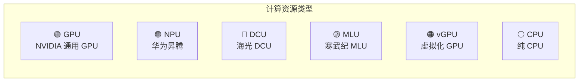
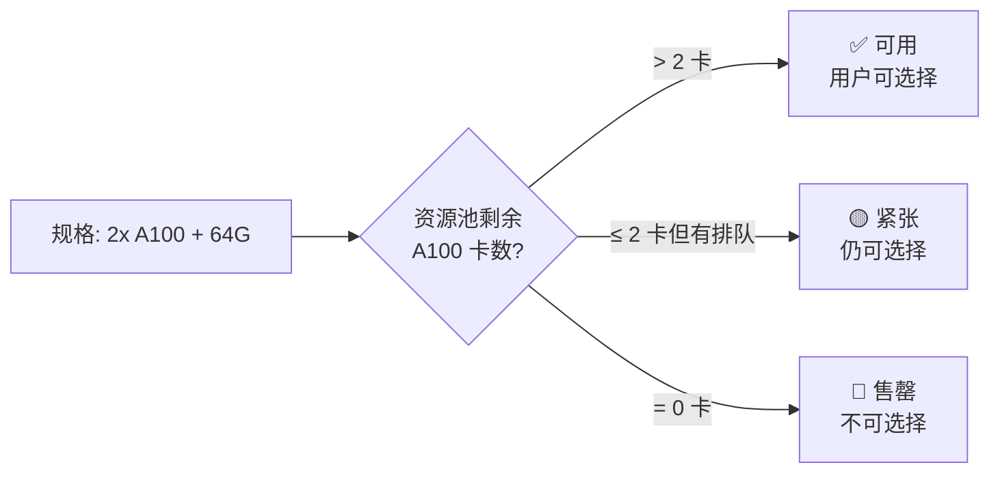
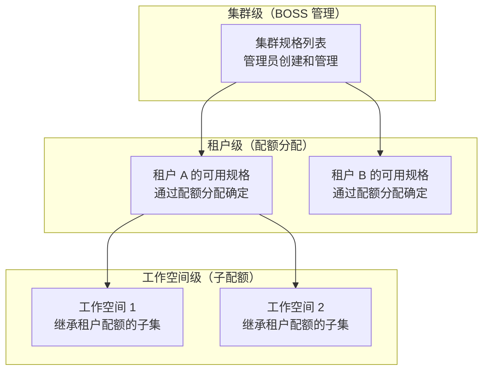

# 规格管理（管理员）

## 功能简介

规格（Flavor）定义了部署实例时可选的**计算资源组合**——包括 CPU 核心数、内存容量、GPU/NPU 类型和数量等。管理员通过 BOSS 的规格管理功能创建、配置和管理全平台可用的规格，这些规格最终会以选项的形式展示给租户用户，用户在创建开发环境、训练任务或推理服务时从中选择合适的规格。

> 💡 提示: BOSS 中的规格管理是**管理员视角**，拥有完整的创建、编辑、启用/禁用等管理能力。普通用户在 Console 中只能**查看和选择**已启用的规格，无法创建或修改规格。

## 进入路径

BOSS → 集群详情 → **规格**

路径：`/boss/rune/clusters/:cluster/flavors`

## 管理员视角 vs 用户视角

| 维度 | BOSS 管理员视角 | Console 用户视角 |
|------|----------------|------------------|
| **操作权限** | 创建 / 编辑 / 启用 / 禁用 / 删除 | 仅查看和选择 |
| **可见范围** | 所有规格（包括禁用的） | 仅已启用且有配额的规格 |
| **资源池关联** | 可配置规格绑定的资源池 | 不可见资源池信息 |
| **售罄状态** | 可查看售罄原因和调整 | 仅看到「不可用」标记 |
| **多级作用域** | 可配置集群→租户→工作空间的可见性 | 仅看到当前工作空间可用的规格 |

---

## 规格列表


规格列表以表格形式展示当前集群中所有已创建的规格。

### 列字段说明

| 列 | 字段名 | 展示方式 | 说明 |
|----|--------|----------|------|
| **名称** | `name` | 文本 + 描述 | 规格名称，下方显示描述信息 |
| **资源类型** | `type` | QuotaResourceType 标签 | 资源的类别，如 GPU、NPU、DCU 等 |
| **资源型号** | `model` | QuotaResourceModel 标签 | 具体的硬件型号，如 A100、H100 等 |
| **资源配置** | `resources` | FlavorResources 标签组 | 以多个标签展示 CPU/内存/GPU 等资源配置详情 |
| **资源池** | `resourcePool` | 链接 | 规格关联的资源池名称，点击可跳转到资源池详情 |
| **启用状态** | `enabled` | 开关/标签 | 规格是否已启用，禁用的规格不会对用户展示 |
| **操作** | — | 操作按钮 | 启用/禁用、编辑、删除 |

### 资源配置标签（FlavorResources）

资源配置列以彩色标签组的形式直观展示规格的具体配置：

```
[CPU: 16核]  [内存: 64Gi]  [GPU: 2x A100]  [显存: 160GB]
```

每个标签包含资源类别和数量，颜色按资源类型区分，一目了然。

---

## 筛选与过滤


规格列表提供 **FlavorFilterBar** 过滤组件，支持多维度筛选：

### 过滤条件

| 过滤项 | 类型 | 可选值 | 说明 |
|--------|------|--------|------|
| **状态** | 下拉选择 | 可用（available）/ 不可用（unavailable） | 按规格当前是否可分配过滤 |
| **资源类型** | 下拉选择 | GPU / NPU / DCU / MLU / vGPU / CPU | 按计算资源类型过滤 |
| **资源型号** | 下拉选择 | 根据类型动态变化 | 按具体硬件型号过滤 |
| **资源池** | 下拉选择 | 当前集群的所有资源池 | 按关联的资源池过滤 |
| **关键词** | 文本输入 | 自由输入 | 按名称模糊搜索 |

> 💡 提示: 多个过滤条件可以组合使用。例如，选择「资源类型: GPU」+「状态: 可用」可以快速找到所有可用的 GPU 规格。

---

## 创建规格


### 操作步骤

1. 在规格列表页面，点击右上角 **创建规格** 按钮
2. 在弹出的表单中配置规格参数
3. 点击 **创建** 按钮完成操作

### 表单字段

| 字段 | 字段名 | 类型 | 必填 | 说明 |
|------|--------|------|------|------|
| **名称** | `name` | 文本输入 | ✅ | 规格名称，建议描述性命名如 `gpu-a100-2x-64g` |
| **描述** | `description` | 文本域 | — | 规格的详细描述，如适用场景说明 |
| **资源类型** | `type` | 下拉选择 | ✅ | 计算资源类型（详见下方资源类型表） |
| **资源型号** | `model` | 下拉选择 | ✅ | 具体硬件型号（根据类型动态变化） |
| **CPU** | `cpu` | 数字输入 | ✅ | CPU 核心数 |
| **内存** | `memory` | 数字 + 单位 | ✅ | 内存大小（如 `64Gi`） |
| **GPU/加速器数量** | `accelerator` | 数字输入 | — | GPU/NPU 等加速器的卡数 |
| **资源池** | `resourcePool` | 下拉选择 | ✅ | 关联的资源池，决定实例将调度到哪些节点 |
| **启用状态** | `enabled` | 开关 | — | 创建后是否立即启用，默认启用 |

---

## 资源类型详解

Rune 平台支持多种计算资源类型，覆盖了主流的 AI 加速硬件：

| 资源类型 | 类型标识 | 说明 | 典型型号 |
|----------|----------|------|----------|
| **GPU** | `GPU` | NVIDIA GPU 通用计算加速卡 | A100、H100、V100、A10、L40S、RTX 4090 |
| **NPU** | `NPU` | 华为昇腾 AI 处理器 | Ascend 910B、Ascend 310P |
| **DCU** | `DCU` | 海光 DCU 加速卡 | DCU Z100 |
| **MLU** | `MLU` | 寒武纪 MLU 智能加速卡 | MLU370-X8、MLU590 |
| **vGPU** | `vGPU` | 虚拟化 GPU（GPU 分片） | vGPU（基于 NVIDIA MIG 或时间片共享） |
| **CPU** | `CPU` | 纯 CPU 计算资源 | 通用 x86/ARM CPU |



> 💡 提示: 资源类型决定了规格可以被调度到哪些节点上。管理员需确保所选资源池中的节点安装了对应类型的加速器驱动和设备插件。

---

## 启用 / 禁用规格

管理员可以控制规格的启用状态，以管理规格对用户的可见性。

| 操作 | 效果 |
|------|------|
| **启用** | 规格对有配额的用户可见，用户可选择该规格部署实例 |
| **禁用** | 规格对所有用户隐藏，系统不会将其显示在规格选择列表中。已使用该规格运行的实例不受影响 |

### 禁用规格的场景

- 硬件维护或故障时临时禁用对应规格
- 规格配置有误需要修改（先禁用→修改→重新启用）
- 资源紧张时临时下架部分规格

> ⚠️ 注意: 禁用规格不会影响已经使用该规格创建的运行中实例。但用户将无法使用已禁用的规格创建新的实例。

---

## 售罄机制

当某个规格对应的物理资源已全部被分配（配额已用尽），系统会自动将该规格标记为**售罄（Sold Out）**状态：



| 状态 | 显示 | 用户操作 |
|------|------|----------|
| **可用** | 正常显示 | 可选择该规格部署实例 |
| **售罄** | 标记为不可用，灰显 | 无法选择，需等待资源释放或联系管理员扩容 |

> 💡 提示: 售罄是系统根据资源实际使用情况自动判断的，管理员不需要手动设置。当有实例释放资源后，售罄状态会自动解除。

---

## 多级作用域

规格的可见性和可用性遵循**集群 → 租户 → 工作空间**的多级作用域配置体系：



| 层级 | 管理者 | 说明 |
|------|--------|------|
| **集群级** | 系统管理员 (BOSS) | 在集群上创建规格，定义系统中所有可能的资源组合 |
| **租户级** | 系统管理员 (BOSS) | 通过为租户分配配额时选择规格，决定租户可以使用哪些规格 |
| **工作空间级** | 租户管理员 (Console) | 在工作空间中分配子配额时选择规格，决定工作空间成员可用的规格 |

> ⚠️ 注意: 一个规格即使在集群级已启用，如果管理员没有在租户配额中分配该规格，租户用户也无法看到和使用它。规格的可用性需要在每个层级都得到授权。

---

## 编辑规格

1. 在规格列表中点击 **编辑** 按钮
2. 可修改规格的描述、资源配置、关联资源池等
3. 点击 **保存** 完成修改

> ⚠️ 注意: 修改规格不会影响已使用该规格创建的运行中实例。修改只对新创建的实例生效。建议在修改前先禁用规格，修改完成后再重新启用。

---

## 删除规格

1. 在规格列表中点击 **删除** 按钮
2. 系统弹出确认对话框
3. 确认后执行删除

> ⚠️ 注意: 删除规格前请确保：
> - 没有租户配额引用该规格
> - 没有工作空间正在使用该规格
> - 该规格已被禁用

---

## 最佳实践

### 命名规范

建议使用描述性命名，包含关键资源信息：

| 推荐命名 | 说明 |
|----------|------|
| `gpu-a100-1x-32g` | 1 块 A100 GPU + 32GB 内存 |
| `gpu-a100-8x-256g` | 8 块 A100 GPU + 256GB 内存 |
| `cpu-16c-64g` | 16 核 CPU + 64GB 内存 |
| `npu-910b-4x-128g` | 4 块昇腾 910B NPU + 128GB 内存 |

### 规格设计建议

1. **覆盖常见场景**：至少提供小（开发调试）、中（小规模训练）、大（大规模训练）三个梯度的规格
2. **避免过多规格**：规格数量控制在 10-15 个以内，过多的规格会增加用户选择困难
3. **与资源池匹配**：确保规格的资源要求与资源池中节点的实际配置匹配
4. **合理设置 CPU/内存比**：GPU 规格建议 CPU:GPU 比为 8:1 或 16:1，内存:GPU 比为 32GB:1 或更高

### 容量管理

1. **监控售罄率**：如果某规格频繁售罄，说明该类资源供不应求，考虑增加节点或创建更小粒度的规格
2. **定期审查使用率**：低使用率的规格可以考虑合并或删除
3. **提前规划扩容**：当 GPU 使用率超过 70% 时，应开始规划新硬件采购

## 权限要求

| 操作 | 所需角色 |
|------|----------|
| 查看规格列表 | 系统管理员 |
| 创建规格 | 系统管理员 |
| 编辑规格 | 系统管理员 |
| 启用/禁用规格 | 系统管理员 |
| 删除规格 | 系统管理员 |
