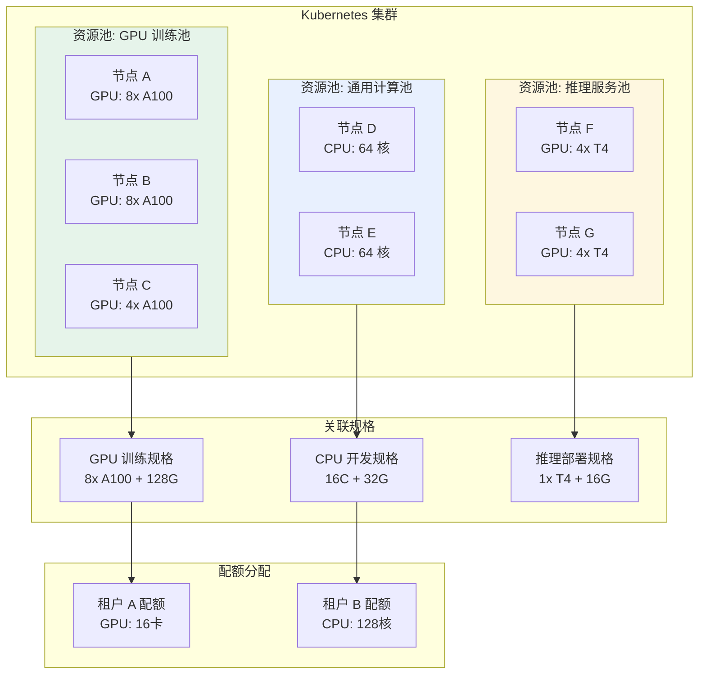
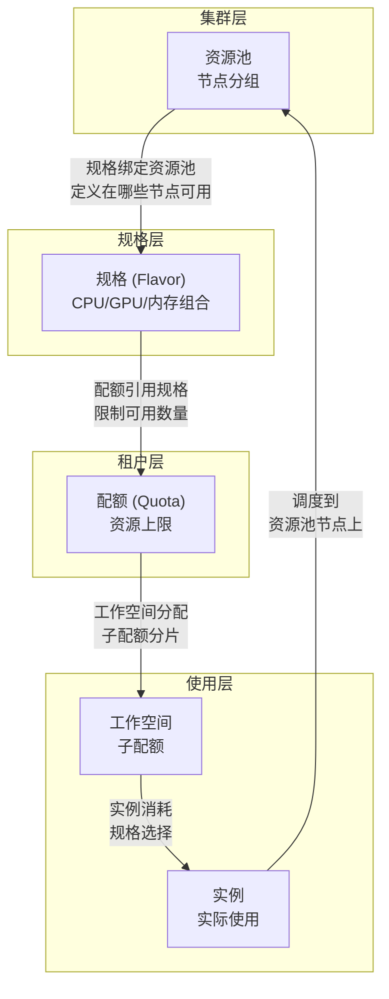

# 资源池管理

## 功能简介

资源池（Resource Pool）是 Rune 平台中实现**计算资源隔离和调度控制**的核心机制。通过将集群中的节点划分为不同的资源池，管理员可以实现节点级别的资源分组，确保不同类型的工作负载运行在合适的节点上。

例如，一个集群中可以将配备 GPU 的节点划入「GPU 训练池」，将普通 CPU 节点划入「通用计算池」，从而实现训练任务和推理服务的物理隔离。

## 进入路径

BOSS → 集群详情 → **资源池**

路径：`/boss/rune/clusters/:cluster/resource-pools`

## 资源池在平台中的位置



---

## 资源池列表


资源池列表以表格形式展示当前集群中所有已创建的资源池。

### 列字段说明

| 列 | 字段名 | 展示方式 | 说明 |
|----|--------|----------|------|
| **名称** | `name` | 文本 + 描述 + StatusWrapped | 资源池名称，下方显示描述文本。名称附带状态包装组件，展示资源池的当前状态 |
| **节点** | `nodes` | CollapseItem 折叠列表 | 资源池包含的节点列表，以可折叠的方式展示每个节点名称。点击展开可查看所有节点 |
| **创建时间** | `creationTimestamp` | 格式化时间 | 资源池的创建时间 |
| **操作** | — | 操作按钮 | 编辑、删除 |

> 💡 提示: 节点列字段使用折叠展示方式（CollapseItem），当资源池包含大量节点时，默认只显示前几个节点名称，点击「展开」可查看完整列表。

---

## 创建资源池


### 操作步骤

1. 在资源池列表页面，点击右上角 **创建资源池** 按钮
2. 在弹出的表单中填写资源池信息
3. 从节点列表中选择要纳入资源池的节点
4. 点击 **创建** 按钮完成操作

### 表单字段

| 字段 | 字段名 | 类型 | 必填 | 说明 |
|------|--------|------|------|------|
| **名称** | `name` | 文本输入 | ✅ | 资源池的唯一标识名称 |
| **描述** | `description` | 文本域 | — | 资源池的描述信息，如用途说明 |
| **节点选择** | `nodes` | 节点多选列表 | ✅ | 从集群可用节点中选择要纳入此资源池的节点 |

### 节点选择

创建资源池时，系统会列出当前集群中所有可用的节点，管理员可以通过以下方式选择节点：

- **逐个选择**：在节点列表中勾选目标节点
- **全选**：选中所有可用节点
- **搜索过滤**：按节点名称搜索后再选择

### 资源池数据结构

```json
{
  "name": "gpu-training-pool",
  "description": "A100 GPU 训练资源池",
  "nodes": [
    { "name": "gpu-node-01" },
    { "name": "gpu-node-02" },
    { "name": "gpu-node-03" }
  ]
}
```

> ⚠️ 注意: 每个节点只能属于一个资源池。如果某个节点已被其他资源池使用，则在创建新资源池时该节点不会出现在可选列表中。

---

## 编辑资源池

1. 在资源池列表中点击 **编辑** 按钮
2. 可修改资源池的描述和节点列表
3. 可添加新节点或移除已有节点
4. 点击 **保存** 完成修改

> 💡 提示: 编辑资源池中的节点时，移除节点不会影响该节点上已运行的工作负载，但新的工作负载将不再被调度到被移除的节点上。

---

## 删除资源池

1. 在资源池列表中点击 **删除** 按钮
2. 系统弹出确认对话框
3. 确认后执行删除

> ⚠️ 注意: 删除资源池前请确保：
> - 资源池中的节点上没有正在运行的关键工作负载
> - 没有规格（Flavor）引用该资源池
> - 没有配额分配依赖该资源池
> 删除后，资源池中的节点将回到「未分配」状态，可被其他资源池重新选择。

---

## 资源池与规格、配额的关系

资源池、规格和配额是 Rune 平台资源管理的三个核心概念，它们之间存在紧密的关联：



| 概念 | 作用 | 关系 |
|------|------|------|
| **资源池** | 将集群节点分组 | 规格引用资源池，决定在哪些节点上部署 |
| **规格** | 定义 CPU/GPU/内存组合 | 绑定到特定资源池，限定可用的物理资源 |
| **配额** | 限制租户可以使用的资源上限 | 引用规格，定义配额数量 |
| **工作空间配额** | 细分租户配额给工作空间 | 不能超过租户配额总量 |
| **实例** | 实际消耗资源 | 选择规格，被调度到对应资源池的节点 |

> 💡 提示: 在创建规格时需要指定关联的资源池，这决定了使用该规格创建的实例将被调度到哪些节点上运行。

---

## 最佳实践

### 资源池划分策略

| 策略 | 适用场景 | 示例 |
|------|----------|------|
| **按硬件类型** | 集群包含异构硬件 | GPU 池、CPU 池、高内存池 |
| **按业务用途** | 需要隔离不同类型工作负载 | 训练池、推理池、开发池 |
| **按租户隔离** | 需要物理级别的租户隔离 | 租户A专用池、租户B专用池 |
| **按优先级** | 区分优先级不同的任务 | 高优先级池（SLA 保障）、弹性池 |

### 命名建议

- 使用有意义的名称，如 `gpu-a100-training`、`cpu-general`
- 保持命名风格一致
- 建议包含硬件类型或用途信息

### 容量规划

1. **预留系统资源**：每个节点建议预留 10%-15% 的资源给 Kubernetes 系统组件
2. **避免单点故障**：每个资源池建议包含 2 个以上节点，避免单节点故障导致整个资源池不可用
3. **监控使用率**：定期检查资源池的整体使用率，使用率长期超过 80% 时应考虑扩容

## 权限要求

| 操作 | 所需角色 |
|------|----------|
| 查看资源池列表 | 系统管理员 |
| 创建资源池 | 系统管理员 |
| 编辑资源池 | 系统管理员 |
| 删除资源池 | 系统管理员 |
