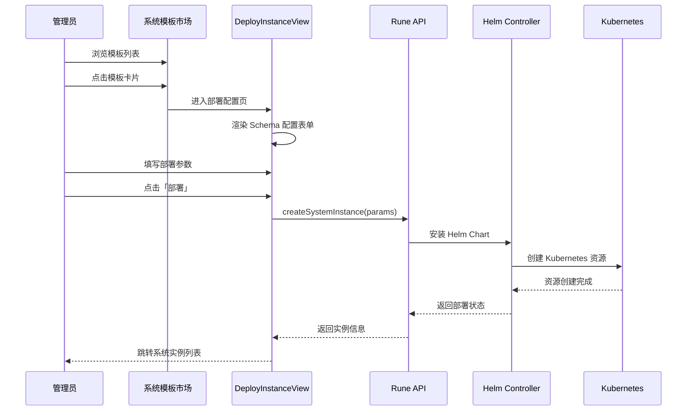

# 系统模板市场

## 功能简介

系统模板市场是集群级别的**基础设施应用商店**，为平台管理员提供预制的系统级应用模板。管理员可以在此浏览、筛选和一键部署集群所需的各类基础设施组件，如监控系统、日志管道、对象存储等。

系统模板市场中的模板由 [模板管理](./templates.md) 中 `domain=system` 类型的已发布产品模板构成，每个模板背后是一个经过验证的 Helm Chart 包。

> 💡 提示: 系统模板市场与用户侧的「应用市场」不同——系统模板专注于集群基础设施组件，仅对系统管理员可见；用户应用市场面向所有用户，提供推理、微调等业务应用模板。

## 进入路径

BOSS → Rune → 集群 → 选择集群 → **系统模板**

路径：`/boss/rune/clusters/:cluster/system-market`

## 模板浏览

系统模板市场使用 `ProductListView` 组件以**卡片形式**展示所有可用的系统模板，每张卡片包含：

- **模板图标**：直观标识模板类型
- **模板名称**：如 Prometheus、Grafana、MinIO 等
- **模板描述**：简要说明模板的功能与用途
- **分类标签**：所属分类（监控、日志、存储等）
- **最新版本**：当前可部署的最新版本号

### 模板分类

系统模板涵盖以下基础设施类别：

| 分类 | 说明 | 典型模板 |
|------|------|---------|
| 监控（Monitoring） | 指标采集、告警与可视化 | Prometheus、Grafana、Alertmanager |
| 日志（Logging） | 日志采集、聚合与查询 | Loki、Promtail、Fluentd |
| 存储（Storage） | 对象存储与数据持久化 | MinIO、NFS Provisioner |
| 网络（Networking） | 流量管理与入口控制 | Ingress NGINX、Cert Manager |
| GPU（Accelerator） | GPU 驱动与设备管理 | GPU Operator、Device Plugin |
| 安全（Security） | 证书管理与密钥存储 | Cert Manager、Vault |

> 💡 提示: 模板列表由平台管理员在 [模板管理](./templates.md) 中维护和发布。如果市场中缺少需要的组件模板，请联系模板管理员创建并发布。

## 一键部署流程

### 操作步骤

1. **选择模板**：在模板市场中点击目标模板卡片
2. **查看模板详情**：阅读 README 文档和版本说明，了解模板功能与使用方式
3. **选择版本**：从可用版本列表中选择要部署的版本
4. **填写配置参数**：根据模板 Schema 表单填写部署参数（命名空间、副本数、存储大小等）
5. **提交部署**：点击「部署」按钮，系统通过 `createSystemInstance` API 创建系统实例
6. **等待就绪**：部署完成后跳转至 [系统实例](./systems.md) 列表查看运行状态

### 部署流程图

### 部署配置说明

部署配置页（`DeployInstanceView`）根据模板定义的 Schema 动态生成表单，常见配置项包括：

| 配置项 | 说明 | 示例 |
|--------|------|------|
| 实例名称 | 系统实例命名 | `prometheus-cluster01` |
| 命名空间 | 部署的 Kubernetes 命名空间 | `monitoring` |
| 副本数 | Pod 副本数量 | `1` ~ `3` |
| 存储大小 | 持久化存储卷大小 | `10Gi` ~ `500Gi` |
| 资源限制 | CPU / 内存请求与上限 | `cpu: 500m, memory: 2Gi` |
| 自定义配置 | 模板特有的业务配置 | 各模板不同 |

> ⚠️ 注意: 部署参数由模板的 Schema 定义决定，不同模板的可配置项不同。请仔细阅读模板 README 了解各参数含义，错误的配置可能导致部署失败或功能异常。

## 模板详情

点击模板卡片可查看模板的详细信息：

### README 文档

模板的详细使用文档，以 Markdown 格式渲染，通常包含：

- 组件功能介绍
- 架构说明
- 配置参数表
- 使用示例
- 注意事项与已知限制

### 版本列表

展示模板的所有已发布版本，包含：

| 字段 | 说明 |
|------|------|
| 版本号 | Chart 版本号（SemVer） |
| 应用版本 | 上游应用版本号 |
| 更新日志 | 该版本的变更说明 |
| 发布时间 | 版本发布时间 |

> 💡 提示: 建议优先选择最新的稳定版本进行部署。如需使用特定版本，可以在版本列表中展开查看该版本的 changelog 确认变更内容。

## 常见部署场景

### 新集群初始化

新集群接入平台后，推荐按以下顺序部署系统组件：

1. **Ingress Controller** — 流量入口（如已有可跳过）
2. **Cert Manager** — TLS 证书管理
3. **Prometheus + Grafana** — 监控体系
4. **Loki + Promtail** — 日志体系
5. **MinIO** — 对象存储（模型/数据集存储）
6. **GPU Operator** — GPU 集群必装

### 组件升级

当模板发布新版本后，可通过 [系统实例](./systems.md) 页面对已部署的实例进行版本更新。

## 与用户应用市场的区别

| 对比项 | 系统模板市场 | 用户应用市场 |
|--------|-----------|-------------|
| 面向角色 | 系统管理员 | 普通用户 |
| 模板域 | `domain=system` | `domain=user` |
| 部署范围 | 集群级别 | 工作空间级别 |
| 典型模板 | 监控、日志、存储 | 推理、微调、开发环境 |
| 入口位置 | BOSS → 集群 → 系统模板 | Console → 应用市场 |

## 权限要求

需要 **系统管理员** 角色。仅系统管理员可以浏览系统模板市场并部署系统实例。
