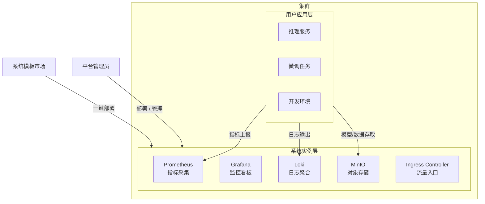
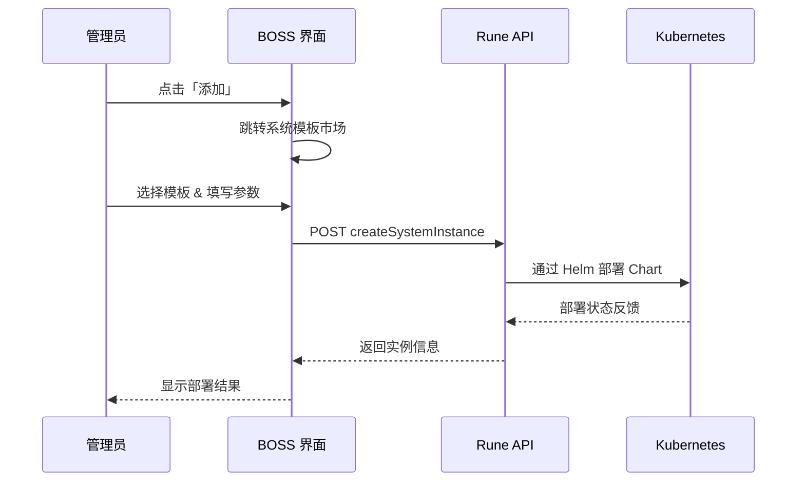

# 系统实例管理

## 功能简介

系统实例（System Instance）是部署在集群中的**基础设施级组件**，为平台的正常运行提供关键支撑服务。与用户应用不同，系统实例服务于整个集群的运维与管理需求，包括但不限于：

- **监控采集**：Prometheus、Node Exporter 等指标采集组件
- **可视化看板**：Grafana 监控面板
- **日志采集与查询**：Loki、Promtail 日志管道
- **对象存储**：MinIO 分布式存储
- **网络与入口**：Ingress Controller、Cert Manager
- **GPU 管理**：GPU Operator、Device Plugin

系统实例通过 [系统模板市场](./system-market.md) 中的模板一键部署，底层基于 Helm Chart 管理生命周期。

> 💡 提示: 系统实例仅对平台管理员可见，普通用户无法查看或操作集群级别的系统组件。

## 进入路径

BOSS → Rune → 集群 → 选择集群 → **系统实例**

路径：`/boss/rune/clusters/:cluster/systems`

## 整体架构

## 系统实例列表

系统实例列表使用 `InstanceListView` 组件渲染，固定 `category='system'` 过滤，仅展示系统级别的实例。

| 列 | 说明 | 备注 |
|----|------|------|
| 名称 | 实例名称（含图标） | 点击可进入实例详情 |
| 状态 | 运行状态 | Running / Pending / Failed / Stopped 等 |
| 模板 | 部署所用的系统模板名称 | 关联到模板详情 |
| 版本 | 当前部署的 Chart 版本 | — |
| 创建时间 | 实例部署时间 | 时间戳格式 |
| 操作 | 查看详情 / 删除 | — |

> ⚠️ 注意: 删除系统实例可能导致集群监控或日志功能不可用，请在确认无依赖后再执行删除操作。

## 部署系统实例

### 从系统模板市场部署

1. 在系统实例列表页面，点击 **添加** 按钮
2. 系统将导航至 [系统模板市场](./system-market.md) 页面
3. 在模板市场中选择目标模板（如 Prometheus）
4. 填写部署参数（命名空间、配置项等）
5. 提交部署，等待实例启动

> 💡 提示: 部署前请确认集群有足够的可用资源（CPU、内存），尤其是监控类组件通常需要较大的内存配额。

### 部署流程

## 管理系统实例

### 查看详情

点击实例名称进入详情页，可查看：

- **基本信息**：实例名称、所属集群、部署模板、版本号、创建时间
- **运行状态**：当前 Pod 数量、副本状态、资源使用率
- **Pod 列表**：各 Pod 的运行状态、所在节点、重启次数
- **事件日志**：Kubernetes 事件流，帮助排查启动失败等问题
- **配置详情**：当前生效的 Helm values 配置

### 删除实例

1. 在列表页或详情页，点击 **删除** 操作
2. 在确认弹窗中确认删除
3. 系统将通过 Helm uninstall 卸载实例，并清理相关资源

> ⚠️ 注意: 删除操作不可撤销。对于存储类组件（如 MinIO），删除后其中的数据将**永久丢失**，建议先做好数据备份。

## 常见系统组件

| 组件 | 用途 | 典型资源需求 |
|------|------|------------|
| **Prometheus** | 指标采集与存储，提供 PromQL 查询能力 | CPU: 500m, 内存: 2Gi+ |
| **Grafana** | 监控数据可视化看板，支持自定义 Dashboard | CPU: 200m, 内存: 512Mi |
| **Loki** | 轻量级日志聚合系统，与 Grafana 集成 | CPU: 500m, 内存: 1Gi+ |
| **Promtail** | 日志采集 Agent，将日志推送至 Loki | CPU: 100m, 内存: 128Mi |
| **MinIO** | S3 兼容的高性能对象存储 | CPU: 500m, 内存: 1Gi+ |
| **Ingress NGINX** | Kubernetes Ingress 控制器 | CPU: 200m, 内存: 256Mi |
| **Cert Manager** | TLS 证书自动管理与签发 | CPU: 100m, 内存: 128Mi |
| **GPU Operator** | NVIDIA GPU 驱动与设备插件管理 | 依据 GPU 数量而定 |

> 💡 提示: 以上资源需求为参考值，实际需求取决于集群规模和负载情况。生产环境建议根据实际监控数据调整资源配额。

## 故障排查

当系统实例状态异常时，可按以下步骤排查：

1. **检查 Pod 状态**：进入实例详情，查看 Pod 是否处于 `CrashLoopBackOff` 或 `Pending` 状态
2. **查看事件日志**：关注 `FailedScheduling`（资源不足）、`ImagePullBackOff`（镜像拉取失败）等事件
3. **检查资源配额**：确认集群剩余资源是否满足组件要求
4. **查看容器日志**：通过 Pod 详情查看容器输出日志，定位具体错误
5. **检查存储卷**：存储类组件需确认 PVC 是否正常绑定

## 与应用市场实例的区别

| 对比项 | 系统实例 | 应用实例 |
|--------|---------|----------|
| 部署来源 | 系统模板市场 | 用户应用市场 |
| 所属范围 | 集群级别 | 工作空间级别 |
| 可见性 | 仅系统管理员 | 租户/工作空间用户 |
| 用途 | 基础设施支撑 | 业务应用（推理/微调等） |
| 管理路径 | BOSS → 集群 → 系统实例 | Console → 应用 |

## 权限要求

需要 **系统管理员** 角色。仅具有该角色的用户可以查看、部署和管理集群级别的系统实例。
