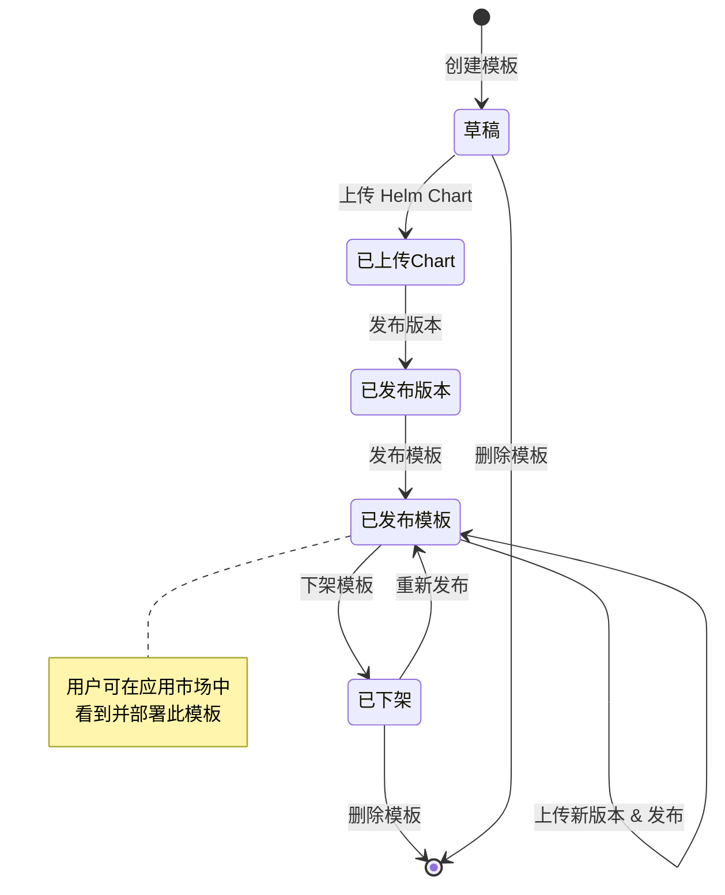
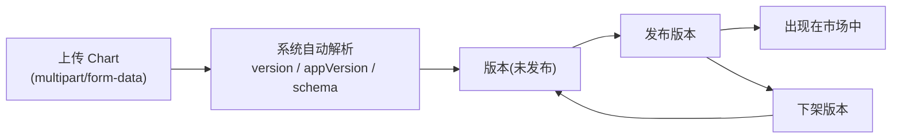

# 产品模板管理

## 功能简介

产品模板（Product/Template）是 Rune 平台应用部署的基础单元。模板定义了应用的部署配置规范，包括 Helm Chart 包、配置表单 Schema、README 文档、版本历史等。模板发布后将出现在应用市场或系统模板市场中，供用户或管理员一键部署。

模板管理页面允许系统管理员对平台中所有产品模板进行全生命周期管理：创建、编辑、上传 Chart、版本管理、发布 / 下架、删除。

> 💡 提示: 模板分为两大域（Domain）：**系统模板** 出现在集群的系统模板市场中，面向管理员部署基础设施；**用户模板** 出现在用户侧的应用市场中，面向用户部署推理、微调等业务应用。

## 进入路径

BOSS → Rune → **模板**

路径：`/boss/rune/products`

API 基路径：`/api/cloud/admin-products`

## 模板生命周期



## 模板列表


模板列表以表格形式展示所有产品模板，支持搜索与筛选。

| 列 | 说明 | 备注 |
|----|------|------|
| 名称 | 模板名称（头像 + 链接 + ID） | 含模板图标，点击名称跳转详情；鼠标悬停显示模板 ID |
| 域 | 模板所属域 | `system`（系统）或 `user`（用户） |
| 分类 | 模板类别 | 8 种分类，见下表 |
| 已发布 | 是否已发布到市场 | ✅ 是 / ❌ 否 |
| 创建时间 | 模板创建时间戳 | — |
| 操作 | 发布/下架、编辑、删除 | — |

### 模板分类（Category）

平台支持以下 8 种模板分类，覆盖 AI 平台的全场景需求：

| 分类 | 标识 | 说明 | 典型模板 |
|------|------|------|---------|
| 推理 | `inference` | 模型推理服务部署 | vLLM、TGI、Triton |
| 微调 | `tune` | 模型微调训练任务 | LLaMA-Factory、DeepSpeed |
| 系统 | `system` | 集群基础设施组件 | Prometheus、Grafana、MinIO |
| 存储 | `storage` | 数据存储与管理 | MinIO、NFS |
| 即时通讯 | `im` | 通讯与协作服务 | — |
| 应用 | `app` | 通用应用部署 | 自定义业务应用 |
| 实验 | `experiment` | 实验管理与跟踪 | MLflow、Weights & Biases |
| 评估 | `evaluation` | 模型评估与基准测试 | — |

### 域类型（Domain）

| 域 | 说明 | 可见范围 |
|----|------|---------|
| `system` | 系统模板 | 仅管理员可见，出现在集群的系统模板市场 |
| `user` | 用户模板 | 所有用户可见，出现在用户侧应用市场 |

## 操作详解

### 发布 / 下架

- **发布模板**：将模板设为可见状态，出现在对应的市场中。需确认弹窗后执行。
- **下架模板**：将模板从市场中隐藏，已部署的实例不受影响。需确认弹窗后执行。

> ⚠️ 注意: 发布模板前，请确保至少有一个已发布的版本，否则用户无法正常部署。

### 创建模板

点击 **创建** 按钮打开创建表单：

| 字段 | 类型 | 必填 | 说明 |
|------|------|------|------|
| 名称 | 文本 | ✅ | 模板唯一名称，创建后不可修改 |
| 显示名称 | 文本 | ✅ | 市场中展示的名称 |
| 域 | 选择 | ✅ | `system` 或 `user` |
| 分类 | 选择 | ✅ | 8 种分类之一 |
| 描述 | 文本域 | — | 模板简短描述 |
| 图标 | 图片上传 | — | 模板头像，上传至 `/api/iam/products/:product/avatar` |
| README | Markdown 编辑器 | — | 详细的产品介绍文档 |


### 编辑模板

点击列表中的 **编辑** 按钮，可修改模板的显示名称、描述、分类、README 等字段。

> 💡 提示: 模板的唯一名称（ID）和域类型在创建后不可修改。如需更改，请创建新模板后迁移。

### 删除模板

点击 **删除** 按钮，确认弹窗后删除模板及其所有版本和 Chart 包。

> ⚠️ 注意: 删除操作不可撤销。如果有基于此模板部署的实例，删除模板不会影响已运行的实例，但将无法再基于此模板进行新的部署或升级。

## 版本管理

进入模板详情页，切换到 **版本** 标签页，可管理模板的所有版本。


### 版本数据结构

每个模板版本（`TemplateVersion`）包含以下字段：

| 字段 | 说明 |
|------|------|
| `name` | 版本名称 |
| `version` | Chart 版本号（SemVer 格式） |
| `appVersion` | 上游应用版本号 |
| `chart` | 关联的 Helm Chart |
| `changelog` | 版本变更日志 |
| `releaseNote` | 发布说明 |
| `url` | Chart 包下载地址 |
| `schema` | 配置表单 JSON Schema |
| `i18nSchema` | 多语言 Schema（国际化） |
| `metadata` | 额外元数据 |
| `raw` | 原始 Chart 信息 |
| `readme` | 版本专属 README |
| `values` | 默认 values.yaml 内容 |

### 上传 Helm Chart

版本的核心是 Helm Chart 包。上传操作使用 `multipart/form-data` 格式：

**API 端点**：`POST /api/cloud/admin-products/:product/charts`

**请求格式**：
```
Content-Type: multipart/form-data

file: <chart.tgz>    // Helm Chart 压缩包（.tgz 格式）
```

**Chart 包要求**：

- 必须是标准的 Helm Chart 打包格式（`.tgz`）
- Chart.yaml 中的 `name` 应与模板名称一致
- 建议包含 `values.yaml`（默认配置）和 `values.schema.json`（配置表单 Schema）
- README.md 将自动提取为版本文档

> 💡 提示: 上传 Chart 后系统会自动解析版本号、应用版本、Schema、README 和默认 values，无需手动填写。

### 发布 / 下架版本

- **发布版本**：使该版本在市场中可选。一个模板可以同时有多个已发布版本。
- **下架版本**：从市场中隐藏该版本，用户将无法再选择此版本进行新部署。

### 版本管理流程



## 模板详情页

点击模板名称进入详情页，包含以下标签页：

### 概览

- 模板基本信息（名称、分类、域、状态）
- README 文档渲染（Markdown）
- 模板图标

### 版本

- 版本列表（版本号、应用版本、状态、发布时间）
- 版本详情（changelog、releaseNote、values、schema）
- Chart 上传入口
- 版本发布 / 下架操作

### Schema 与 Values

- **Schema**：JSON Schema 定义了部署时的配置表单结构，系统根据 Schema 自动生成可视化配置表单
- **i18nSchema**：多语言 Schema，支持配置表单的国际化
- **Values**：默认的 Helm values 配置，用户部署时可在此基础上修改

## API 参考

| 操作 | 方法 | 端点 |
|------|------|------|
| 获取模板列表 | GET | `/api/cloud/admin-products` |
| 创建模板 | POST | `/api/cloud/admin-products` |
| 获取模板详情 | GET | `/api/cloud/admin-products/:product` |
| 更新模板 | PUT | `/api/cloud/admin-products/:product` |
| 删除模板 | DELETE | `/api/cloud/admin-products/:product` |
| 发布模板 | POST | `/api/cloud/admin-products/:product/publish` |
| 下架模板 | POST | `/api/cloud/admin-products/:product/unpublish` |
| 上传 Chart | POST | `/api/cloud/admin-products/:product/charts` |
| 获取 Chart 列表 | GET | `/api/cloud/admin-products/:product/charts` |
| 删除 Chart | DELETE | `/api/cloud/admin-products/:product/charts/:chart` |
| 获取版本列表 | GET | `/api/cloud/admin-products/:product/versions` |
| 发布版本 | POST | `/api/cloud/admin-products/:product/versions/:version/publish` |
| 下架版本 | POST | `/api/cloud/admin-products/:product/versions/:version/unpublish` |
| 上传模板图标 | POST | `/api/iam/products/:product/avatar` |

## 最佳实践

1. **命名规范**：模板名称建议使用小写字母和连字符（如 `prometheus-stack`），便于在 Helm 和 Kubernetes 中使用
2. **版本管理**：遵循 SemVer 语义化版本规范，重大变更升主版本号
3. **Schema 设计**：为配置表单提供合理的默认值和校验规则，降低用户部署出错的概率
4. **README 文档**：详细说明模板用途、配置参数、部署前提条件和注意事项
5. **分类准确**：确保模板分类与实际用途一致，方便用户在市场中筛选
6. **测试验证**：新版本发布前，建议先在测试集群中验证部署流程

## 常见问题

### 上传 Chart 后版本不显示？

确认 Chart.yaml 的格式正确，且 `version` 字段遵循 SemVer 规范（如 `1.0.0`）。

### 模板发布后用户看不到？

检查以下事项：
1. 模板是否已发布（`published=yes`）
2. 是否有至少一个已发布的版本
3. 模板域（domain）是否为 `user`（系统模板不会出现在用户市场）

### 如何更新已部署实例的模板版本？

上传新版本 Chart 并发布后，已部署的实例不会自动升级。用户需在实例管理页面手动执行版本升级操作。

## 权限要求

需要 **系统管理员** 角色。仅系统管理员可以创建、编辑、发布和删除产品模板。
