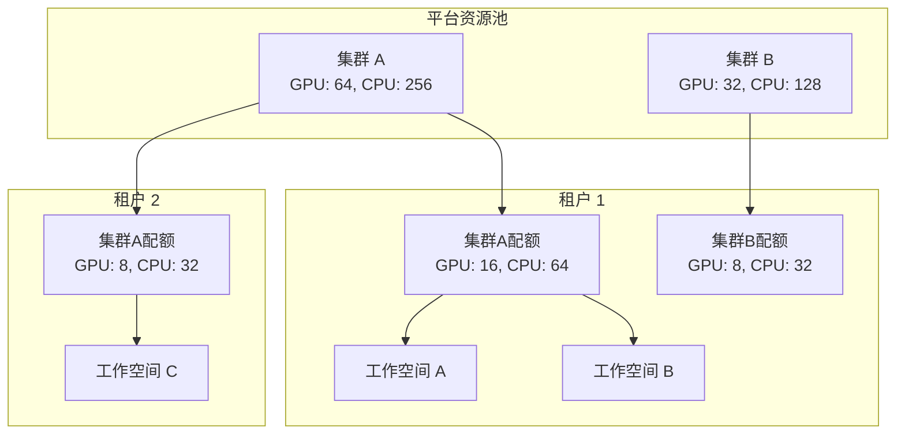

# 租户资源管理

## 功能简介

Rune 租户资源管理是 IAM 租户管理的**扩展视图**，在标准的租户信息基础上增加了集群资源配额、工作空间管理和租户级别算力规格管理等功能。通过此页面，平台管理员可以全面管控每个租户在各集群中的资源分配与使用情况。

与 [IAM 租户管理](../iam/tenants.md) 不同，Rune 租户管理聚焦于**计算资源层面**——管理员在此为租户分配 GPU、CPU、内存等配额，管理工作空间和算力规格，确保资源在多租户之间合理分配。

> 💡 提示: Rune 租户列表复用了 IAM 租户列表数据，并在此基础上扩展了 **TenantQuota**（租户配额）列，直观展示各租户在每个集群中的资源配额分配情况。

## 进入路径

BOSS → Rune → **租户资源**

路径：`/boss/rune/tenants`

## 租户列表


租户列表在标准 IAM 租户列表基础上额外增加了 TenantQuota 列（宽度 600px），展示各租户的资源配额概况。

| 列 | 说明 | 备注 |
|----|------|------|
| 租户名称 | 租户显示名称 | 点击进入租户资源详情 |
| 租户 ID | 租户唯一标识 | — |
| 成员数 | 租户下的用户数量 | — |
| 资源配额 | 各集群的资源配额概况 | **TenantQuota 组件**，宽度 600px，显示各集群的 GPU/CPU/内存配额 |
| 创建时间 | 租户创建时间 | — |
| 操作 | 概览 / 配额管理 / 工作空间 / 算力规格 | — |

### TenantQuota 列

TenantQuota 列在列表中直接以紧凑格式展示每个租户在各集群中分配的资源配额，例如：

```
集群A: GPU 8/16 | CPU 32/64 | Mem 128/256Gi
集群B: GPU 4/8  | CPU 16/32 | Mem 64/128Gi
```

> 💡 提示: 配额列中的数值格式为「已使用 / 总配额」，便于管理员快速识别各租户的资源使用率。

## 租户详情子页面

点击租户名称或操作按钮进入租户资源详情，包含以下四个子页面：

### 概览（Overview）

路径：`/boss/rune/tenants/:tenant`


概览页由四个组件组成，全面展示租户的资源使用全貌：

| 组件 | 说明 |
|------|------|
| **TenantInfo** | 租户基本信息：名称、ID、描述、创建时间、管理员等 |
| **TenantWorkspaces** | 租户下的工作空间列表与状态汇总 |
| **TenantQuota** | 各集群的资源配额使用详情（图表形式） |
| **TenantEvents** | 租户相关的最近事件流（创建/修改/配额调整等） |

### 配额管理（Quotas）

路径：`/boss/rune/tenants/:tenant/quotas`


配额管理页面允许管理员为租户在不同集群中分配和调整资源配额。

#### 筛选与过滤

- **集群筛选**：下拉选择目标集群，查看该集群下的配额列表
- **FlavorFilterBar**：按算力规格（Flavor）筛选配额，快速定位特定资源类型的配额

#### 配额列表

| 字段 | 说明 |
|------|------|
| 集群 | 配额所属的集群名称 |
| 算力规格 | 关联的 Flavor（GPU 类型、规格等） |
| 配额上限 | 该资源类型的最大可用数量 |
| 已使用 | 当前已占用的数量 |
| 使用率 | 百分比展示 |
| 操作 | 编辑 / 删除 |

#### 创建配额

1. 点击 **创建配额** 按钮
2. 选择目标集群
3. 选择算力规格（Flavor）
4. 设置配额上限（最大可使用数量）
5. 点击提交


#### 编辑配额

点击配额列表中的 **编辑** 按钮，可调整配额上限。

> ⚠️ 注意: 降低配额上限时，如果当前使用量已超过新的上限，现有工作负载不会受影响，但租户将无法申请新的资源，直到使用量降至配额以下。

#### 删除配额

点击 **删除** 按钮并确认，可移除该配额限制。

> ⚠️ 注意: 删除配额后，租户在该集群中将无法使用对应的算力规格，可能导致现有工作负载调度失败。

### 工作空间管理（Workspaces）

路径：`/boss/rune/tenants/:tenant/workspaces`


工作空间是租户内部的资源隔离单元。管理员可以在此创建、管理和删除工作空间。

#### 工作空间列表

| 列 | 说明 | 备注 |
|----|------|------|
| 名称 | 工作空间名称 + 描述 | 名称与描述同列展示 |
| 命名空间 | Kubernetes Namespace | 自动生成的 K8s 命名空间 |
| 状态 | 工作空间状态 | Active / Terminating 等 |
| 创建时间 | 工作空间创建时间 | 时间戳格式 |
| 操作 | 编辑 / 删除 / 配额管理 | — |

#### 创建工作空间

| 字段 | 类型 | 必填 | 说明 |
|------|------|------|------|
| 名称 | 文本 | ✅ | 工作空间名称（英文，小写字母和连字符） |
| 描述 | 文本域 | — | 工作空间描述信息 |

#### 编辑工作空间

可修改工作空间的描述信息。

#### 删除工作空间

> ⚠️ 注意: 删除工作空间将同时删除该命名空间下的所有资源（应用实例、任务、数据等），此操作不可撤销。

#### 工作空间配额管理

点击工作空间的 **配额管理** 操作，可为工作空间分配从租户配额中划分的子配额，实现租户内部的资源精细化分配。

### 算力规格管理（Flavors）

路径：`/boss/rune/tenants/:tenant/flavors`


租户级别的算力规格管理，控制租户可以使用哪些算力规格（Flavor）。

> 💡 提示: 此处管理的是租户**可见**的算力规格列表。只有在此处启用的 Flavor，租户用户才能在创建应用时选择。全局算力规格的管理请参见 [算力规格管理](./flavors.md)。

## 资源分配架构



## 典型操作流程

### 新租户资源初始化

1. 在 [IAM 租户管理](../iam/tenants.md) 中创建租户
2. 进入 Rune 租户资源管理，找到新创建的租户
3. **创建配额**：为租户在目标集群中分配资源配额
4. **启用算力规格**：为租户启用可使用的算力规格
5. **创建工作空间**：为租户创建至少一个工作空间
6. **分配工作空间配额**：从租户配额中为工作空间分配子配额

### 资源扩容

1. 进入目标租户的配额管理页面
2. 编辑需要扩容的配额，调高上限
3. 通知租户管理员新的配额已生效

## 常见问题

### 租户配额与工作空间配额的关系？

租户配额是集群维度的总配额，工作空间配额是从租户配额中细分出来的子配额。所有工作空间配额之和不应超过租户配额上限。

### 租户已有运行中任务，可以降低配额吗？

可以降低，但已运行的任务不受影响。只是在当前使用量降至新配额以下之前，租户无法创建新的工作负载。

### 工作空间删除后配额是否自动释放？

是的，工作空间删除后其占用的配额会自动释放回租户配额池。

## 权限要求

需要 **系统管理员** 角色。系统管理员可以查看所有租户的资源分配情况，并进行配额和工作空间的管理操作。
