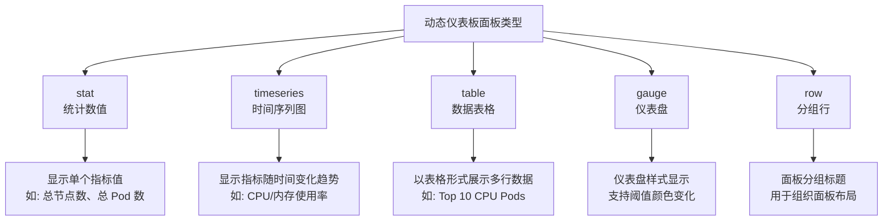
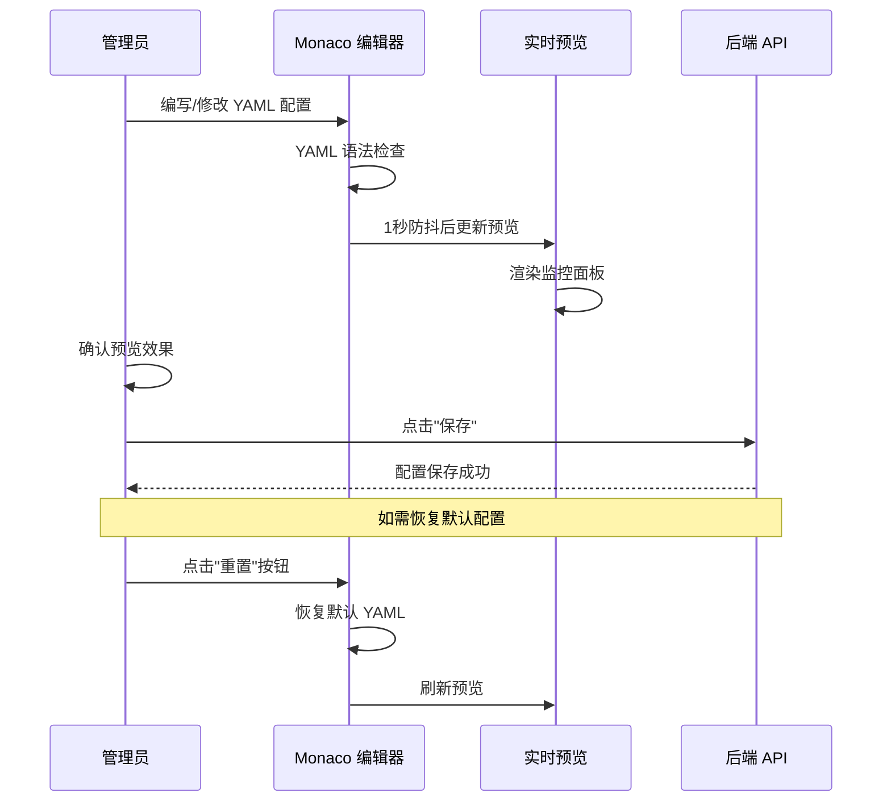

# 动态仪表板

## 功能简介

动态仪表板提供基于 **YAML 配置** 的可视化集群监控面板编辑器。管理员可以使用内置的 Monaco 代码编辑器编写 YAML 配置，定义监控面板的类型、查询表达式和布局，并通过 **实时预览** 功能即刻查看效果。系统提供了一套默认的 Kubernetes 集群概览配置，管理员也可以完全自定义监控内容。

> 💡 提示: 动态仪表板类似于 Grafana Dashboard 的概念，但使用更简洁的 YAML 配置方式，无需额外部署 Grafana 服务即可实现集群监控可视化。

## 进入路径

BOSS → 集群详情 → **动态仪表板**

路径：`/boss/rune/clusters/:cluster/dynamic-dashboard`

## 页面说明


页面分为左右两栏布局：

| 区域 | 说明 |
|------|------|
| **左侧**：YAML 编辑器 | 基于 Monaco Editor 的 YAML 配置编辑器，支持语法高亮和自动缩进 |
| **右侧**：实时预览 | 根据 YAML 配置实时渲染的监控面板预览 |

> 💡 提示: 编辑器内容变更后，预览区域会在 **1 秒（1000ms）** 的防抖延迟后自动更新，避免频繁的渲染开销。

## YAML 编辑器（Monaco Editor）

### 编辑器特性

- **语法高亮**：YAML 语法着色
- **自动缩进**：保持 YAML 缩进结构
- **错误提示**：YAML 语法错误实时标注
- **实时预览**：修改后 1 秒自动刷新预览
- **全屏编辑**：支持编辑器区域扩展


### 重置按钮

页面提供 **重置** 按钮，点击后可恢复到系统默认的 YAML 配置：

> ⚠️ 注意: 重置操作会覆盖当前编辑器中的所有自定义配置，恢复为系统默认的 Kubernetes 集群概览配置。此操作不可撤销，请在重置前确认已备份自定义配置。

---

## 面板类型

动态仪表板支持以下面板类型：



### stat（统计数值）

显示单个聚合数值，适用于展示关键指标的当前值。

```yaml
- title: "总节点数"
  type: stat
  query: "count(kube_node_info)"
```

| 属性 | 说明 |
|------|------|
| title | 面板标题 |
| type | `stat` |
| query | Prometheus 查询表达式 |
| unit | 数值单位（可选，如 `cores`、`bytes`） |

### timeseries（时间序列图）

显示指标随时间变化的趋势折线图，适用于监控变化趋势。

```yaml
- title: "节点 CPU 使用率"
  type: timeseries
  query: "avg(rate(node_cpu_seconds_total{mode!='idle'}[5m])) by (instance)"
```

| 属性 | 说明 |
|------|------|
| title | 面板标题 |
| type | `timeseries` |
| query | Prometheus 查询表达式 |
| legend | 图例格式（可选） |

### table（数据表格）

以表格形式展示多行多列数据，适用于排行榜类展示。

```yaml
- title: "Top 10 CPU 使用 Pods"
  type: table
  query: "topk(10, sum(rate(container_cpu_usage_seconds_total[5m])) by (pod))"
```

| 属性 | 说明 |
|------|------|
| title | 面板标题 |
| type | `table` |
| query | Prometheus 查询表达式 |
| columns | 列配置（可选） |

### gauge（仪表盘）

以仪表盘/环形图样式显示，支持阈值配置实现颜色变化。

```yaml
- title: "节点磁盘使用率"
  type: gauge
  query: "1 - (node_filesystem_avail_bytes / node_filesystem_size_bytes)"
  thresholds:
    - value: 0.7
      color: green
    - value: 0.9
      color: yellow
    - value: 1.0
      color: red
```

| 属性 | 说明 |
|------|------|
| title | 面板标题 |
| type | `gauge` |
| query | Prometheus 查询表达式 |
| thresholds | 阈值配置数组 |

#### 阈值配置说明

阈值用于 gauge 面板的颜色变化，按照递增顺序设置：

| 阈值范围 | 颜色 | 含义 |
|----------|------|------|
| `< 70%` | 🟢 绿色（green） | 正常范围 |
| `70% ~ 90%` | 🟡 黄色（yellow） | 警告范围 |
| `≥ 90%` | 🔴 红色（red） | 危险范围 |

> 💡 提示: 阈值配置中的 `value` 字段使用小数表示百分比，如 0.7 表示 70%、0.9 表示 90%。颜色支持常见的颜色名称。

### row（分组行）

用于对面板进行分组，显示一个标题行来组织面板布局。

```yaml
- title: "节点监控"
  type: row
```

---

## 默认配置

系统默认提供 **Kubernetes 集群概览** 仪表板配置，包含以下面板：

### 概览统计（stat 面板组）

| 面板 | 指标 | 类型 |
|------|------|------|
| 总节点数 | Total Nodes | stat |
| 总 Pod 数 | Total Pods | stat |
| 总 CPU 核心数 | Total CPU Cores | stat |
| 总内存容量 | Total Memory | stat |

### 趋势监控（timeseries 面板组）

| 面板 | 指标 | 类型 |
|------|------|------|
| 节点 CPU 使用率 | 各节点 CPU 使用趋势 | timeseries |
| 节点内存使用率 | 各节点内存使用趋势 | timeseries |

### 排行榜（table 面板）

| 面板 | 指标 | 类型 |
|------|------|------|
| Top 10 CPU 使用 Pods | 按 CPU 使用率排序的前 10 个 Pod | table |

### 健康指标

| 面板 | 指标 | 类型 |
|------|------|------|
| Pod 重启率 | Pod 重启次数统计 | stat |
| 节点磁盘使用率 | 各节点磁盘使用百分比 | gauge（含阈值） |


---

## 自定义示例

### 添加 GPU 监控面板

```yaml
- title: "GPU 监控"
  type: row

- title: "GPU 使用率"
  type: timeseries
  query: "avg(DCGM_FI_DEV_GPU_UTIL) by (gpu, instance)"
  legend: "{{instance}} - GPU{{gpu}}"

- title: "GPU 显存使用率"
  type: gauge
  query: "DCGM_FI_DEV_FB_USED / (DCGM_FI_DEV_FB_USED + DCGM_FI_DEV_FB_FREE)"
  thresholds:
    - value: 0.7
      color: green
    - value: 0.9
      color: yellow
    - value: 1.0
      color: red
```

### 添加网络流量面板

```yaml
- title: "网络监控"
  type: row

- title: "节点网络接收流量"
  type: timeseries
  query: "rate(node_network_receive_bytes_total{device='eth0'}[5m])"

- title: "节点网络发送流量"
  type: timeseries
  query: "rate(node_network_transmit_bytes_total{device='eth0'}[5m])"
```

---

## 编辑流程



## 注意事项

> ⚠️ 注意: YAML 配置中的 `query` 字段使用 PromQL（Prometheus Query Language）语法。请确保查询表达式正确且目标 Prometheus 实例中存在对应的指标数据，否则面板将显示空数据。

> 💡 提示: 在编辑复杂配置前，建议先将当前配置复制保存为备份。如果编辑出错导致面板无法渲染，可以使用 **重置** 按钮恢复默认配置，然后重新开始自定义。

## 权限要求

需要 **系统管理员** 角色才能编辑动态仪表板配置。
