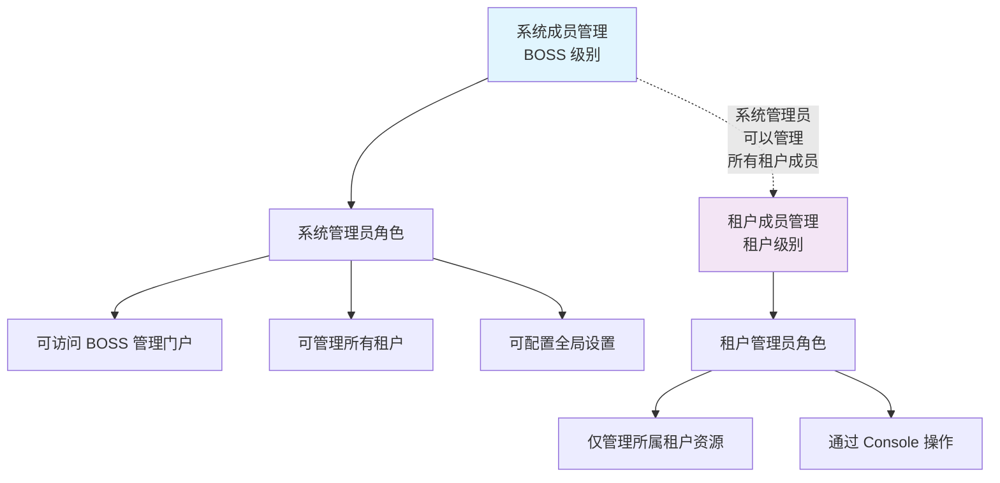
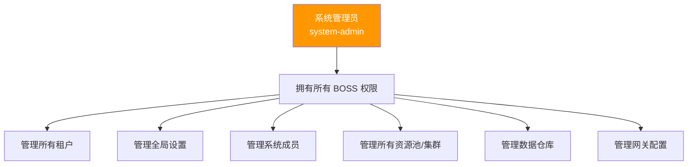
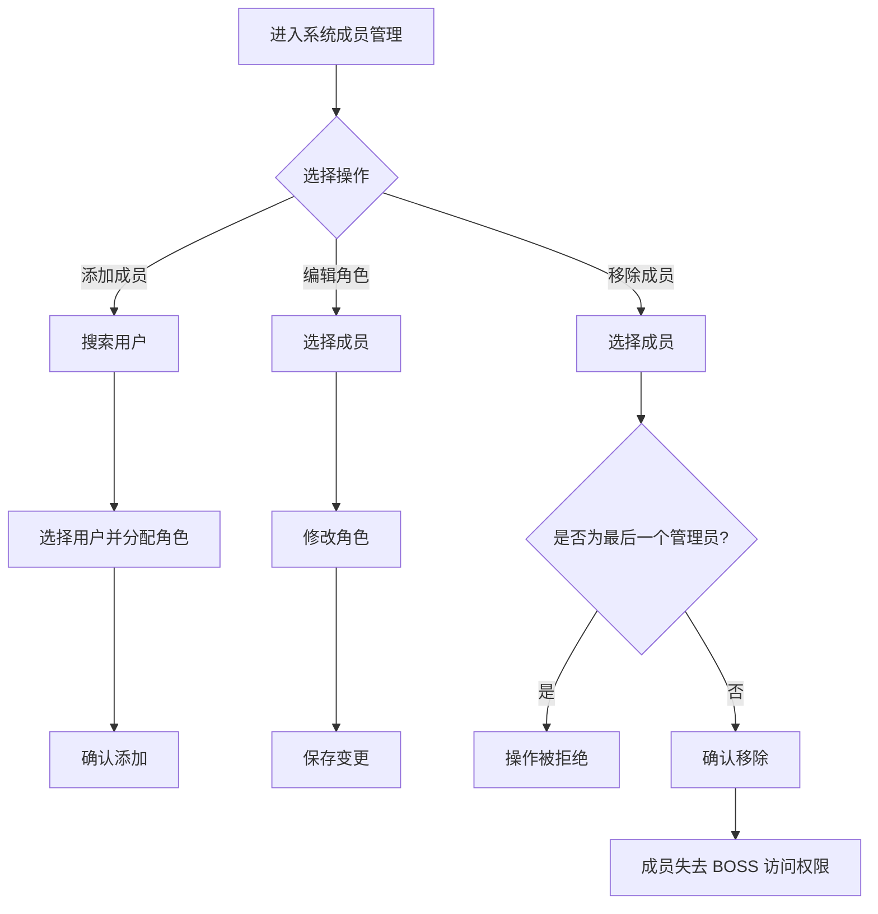

# 系统成员管理

## 功能简介

系统成员管理用于维护拥有 **系统级管理权限** 的成员列表。这些成员可以访问 BOSS 管理门户并执行所有平台管理操作，包括租户管理、资源调度、全局配置等。系统成员管理与租户级别的成员管理相互独立，属于平台最高权限层级。

> 💡 提示: 系统成员（系统管理员）拥有平台最高权限，可以管理所有租户和资源。请严格控制系统成员的数量和人选，遵循最小权限原则。

## 进入路径

BOSS → 平台设置 → **系统成员**

路径：`/boss/settings/members`

## 与租户级成员管理的关系

| 维度 | 系统成员管理（BOSS） | 租户成员管理（Console） |
|------|---------------------|----------------------|
| 管理级别 | 平台级 | 租户级 |
| 管理入口 | BOSS → 平台设置 → 系统成员 | Console → IAM → 租户成员 |
| 角色范围 | 系统角色（如 system-admin） | 租户角色（如 tenant-admin, member） |
| 权限范围 | 全平台所有资源 | 仅所属租户资源 |
| API 路径 | `/api/iam/members` | `/api/iam/tenants/:id/members` |

## 页面说明

### 成员列表表格

| 列 | 说明 | 详细描述 |
|----|------|----------|
| 名称 | 成员用户名 | 显示用户头像（Avatar）和用户名 |
| 邮箱 | 成员邮箱 | 该成员注册时使用的邮箱地址 |
| 角色 | 系统角色 | 角色名称通过 `role:` 命名空间进行多语言翻译显示 |
| 加入时间 | 成为系统成员的时间 | 对应 `creationTimestamp`（`joinedAt`）字段 |
| 操作 | 管理按钮 | 编辑角色、移除成员 |

> 💡 提示: 角色列显示的是翻译后的角色名称。例如系统中的 `system-admin` 角色会通过 `role:` 命名空间翻译为中文"系统管理员"。

## 管理操作

### 添加系统成员

点击 **添加成员** 按钮，在弹出的对话框中操作：

1. **搜索用户**：输入用户名或邮箱搜索已注册用户
2. **选择用户**：从搜索结果中选择要添加的用户
3. **分配角色**：为该用户选择系统角色
4. **确认添加**：点击确认完成添加

> ⚠️ 注意: 只能添加已在平台注册的用户为系统成员。如需添加新用户，请先通过 BOSS → IAM → 用户管理 创建用户账号。

### 编辑角色

点击成员列表中的 **编辑** 按钮，可修改该成员的系统角色：

1. 在角色下拉列表中选择新角色
2. 确认变更

角色数据通过 `/api/iam/roles` 接口获取可用的系统角色列表。

### 移除成员

点击成员列表中的 **删除** 按钮，将弹出二次确认对话框：

1. 确认要移除的成员信息
2. 点击 **确认** 完成移除

移除系统成员后：

- 该用户将失去 BOSS 管理门户的访问权限
- 该用户的普通账号不受影响，仍可通过 Console 正常使用平台
- 该用户在各租户中的角色不受影响

> ⚠️ 注意: 系统必须至少保留 **一个系统管理员**。如果尝试移除最后一个系统管理员，操作将被拒绝。

## 角色层级

> 💡 提示: 当前系统成员管理主要管理"系统管理员"角色。未来版本可能引入更细粒度的系统角色（如只读审计角色），届时角色层级将更加丰富。

## API 接口

| 接口 | 方法 | 说明 |
|------|------|------|
| `/api/iam/members` | `GET` | 获取系统成员列表 |
| `/api/iam/members` | `POST` | 添加系统成员 |
| `/api/iam/members/:id` | `PUT` | 修改成员角色 |
| `/api/iam/members/:id` | `DELETE` | 移除系统成员 |
| `/api/iam/roles` | `GET` | 获取可用系统角色列表 |

## 最佳实践

1. **最小权限原则**：仅为必要人员分配系统管理员角色
2. **定期审查**：定期检查系统成员列表，移除不再需要管理权限的人员
3. **至少两人**：建议保留至少两名系统管理员，避免单人不可用时无法管理平台
4. **记录变更**：通过审计日志跟踪系统成员的添加和移除操作

## 成员管理流程

## 常见问题

| 问题 | 解决方案 |
|------|----------|
| 无法移除最后一个管理员 | 系统强制保留至少一名管理员，需先添加新管理员再移除 |
| 找不到要添加的用户 | 确认用户已在平台注册，或先通过用户管理创建账号 |
| 成员角色显示为英文 | 检查 `role:` 命名空间的翻译配置是否完整 |

## 权限要求

需要 **系统管理员** 角色才能访问系统成员管理页面。

> ⚠️ 注意: 系统成员管理本身也需要系统管理员权限。请确保至少一名可信赖的管理员持有此权限，以避免管理权限丢失。
