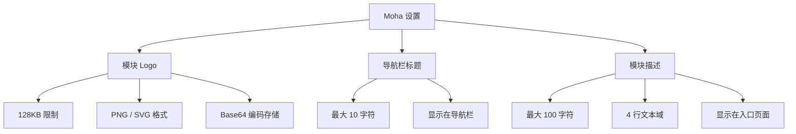

# Moha 设置

## 功能简介

Moha 设置用于自定义 **Moha 模型中心** 子系统的品牌展示信息，包括模块 Logo、导航栏标题和模块描述。其配置结构与 Rune 设置完全一致，配置保存在 `config.moha` 命名空间下，修改后会立即反映在 Moha 模块的导航栏和入口页面中。

> 💡 提示: Moha 设置与 Rune 设置、ChatApp 设置采用相同的配置结构，但各自保存在独立的命名空间中，互不影响。

## 进入路径

BOSS → 平台设置 → **Moha 设置**

路径：`/boss/settings/moha`

## 页面说明


## 配置项

### 模块 Logo

| 属性 | 说明 |
|------|------|
| 字段名 | `logo` |
| 文件大小限制 | 最大 **128KB** |
| 编码方式 | **Base64** 编码存储 |
| 支持格式 | **PNG**、**SVG** |
| 用途 | 显示在 Moha 模块的导航栏和入口页面 |

操作步骤：

1. 点击 Logo 上传区域
2. 选择本地 PNG 或 SVG 文件（不超过 128KB）
3. 预览 Logo 效果
4. 确认后点击 **保存**

> ⚠️ 注意: 模块 Logo 以 Base64 形式直接存储在配置数据库中，大小限制为 128KB，请使用 SVG 矢量格式或压缩后的 PNG 以控制文件大小。

### 导航栏标题

| 属性 | 说明 |
|------|------|
| 字段名 | `navbar_title` |
| 最大长度 | **10 个字符** |
| 用途 | 显示在 Moha 模块导航栏 Logo 旁边的标题文字 |

默认值为 "Moha"，管理员可将其自定义为组织或产品对应的名称，如 "模型中心"、"AI 资产库" 等。

### 模块描述

| 属性 | 说明 |
|------|------|
| 字段名 | `description` |
| 最大长度 | **100 个字符** |
| 输入框行数 | **4 行** 文本域 |
| 用途 | 显示在 Moha 模块入口页面或关于页面的简介文字 |

描述文字用于向用户说明 Moha 模块的功能定位，例如："Moha 模型中心提供企业级的模型、数据集和镜像托管服务..."

## 配置存储

所有 Moha 设置保存在 `config.moha` 命名空间中：

```yaml
# config.moha 命名空间
logo: "data:image/svg+xml;base64,PHN2ZyB..."    # Base64 编码的 Logo
navbar_title: "Moha"                              # 导航栏标题
description: "Moha 模型中心提供..."                # 模块描述
```

## 设置效果展示

配置保存后，Moha 模块中以下位置会受到影响：

| 展示位置 | 受影响的配置项 |
|----------|---------------|
| 导航栏左上角 | Logo + 导航栏标题 |
| 模块入口首页 | Logo + 描述 |
| 浏览器标签页 | 导航栏标题（作为标签页前缀） |
| 平台模块切换菜单 | Logo + 导航栏标题 |


> 💡 提示: 修改保存后，已打开 Moha 模块的用户需要刷新页面才能看到最新配置。

## 操作步骤

1. 进入 BOSS → 平台设置 → Moha 设置
2. 根据需要修改 Logo、标题和描述
3. 在页面中预览修改效果
4. 点击 **保存** 按钮提交变更
5. 确认变更已生效（刷新 Moha 模块页面查看）

> ⚠️ 注意: Logo 文件超过 128KB 会被拒绝上传。建议优先使用 SVG 格式，通常只有几 KB，且在不同分辨率下均能清晰显示。

## 配置结构概览



## 常见问题

| 问题 | 解决方案 |
|------|----------|
| Logo 上传失败 | 检查文件大小是否超过 128KB，格式是否为 PNG 或 SVG |
| 标题过长被截断 | 减少字符数至 10 个以内 |
| 修改未生效 | 确认点击保存后刷新 Moha 模块页面 |
| Logo 显示模糊 | 建议使用 SVG 矢量格式替代 PNG |

## 权限要求

需要 **系统管理员** 角色才能访问 Moha 设置页面。
