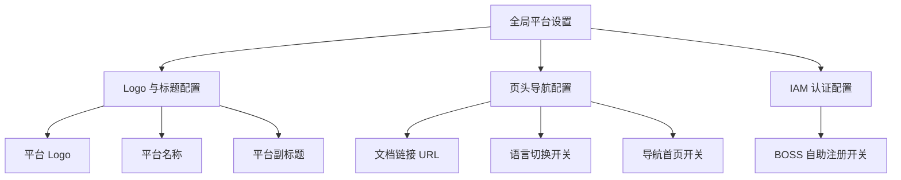
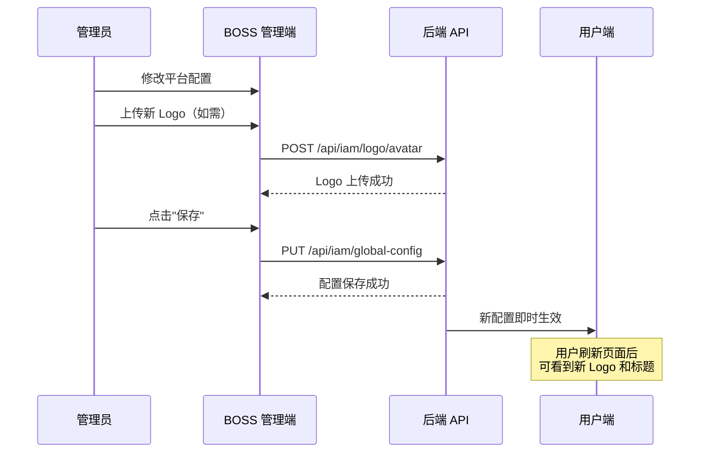

# 全局平台设置

## 功能简介

全局平台设置是 BOSS 管理门户的核心配置页面，管理员可以在此自定义平台的品牌展示（Logo、名称、副标题）、页头导航行为、IAM 认证策略等全局参数。所有设置保存后将立即作用于整个平台的所有用户界面。

> 💡 提示: 平台设置的修改会影响所有用户的界面体验，请在修改前确认变更方案，部分配置可能需要用户刷新页面才能看到效果。

## 进入路径

BOSS → 平台设置 → **平台设置**

路径：`/boss/settings/platform`

## 设置结构总览



## 页面说明


---

## Logo 与标题配置（LogoAndTitleConfig）

Logo 与标题配置控制平台的品牌展示，包括登录页、导航栏和浏览器标签页中展示的内容。

### 平台 Logo

| 属性 | 说明 |
|------|------|
| 文件大小限制 | 最大 **3MB** |
| 支持格式 | **PNG**、**SVG** |
| 上传方式 | 点击上传区域选择文件，支持裁剪（Crop）调整 |
| API 接口 | `POST /api/iam/logo/avatar` |

操作步骤：

1. 点击 Logo 上传区域
2. 选择本地 PNG 或 SVG 文件（不超过 3MB）
3. 在裁剪对话框中调整 Logo 显示区域
4. 确认裁剪后点击 **保存**


> ⚠️ 注意: Logo 建议使用透明背景的 PNG 或 SVG 格式，以确保在不同主题（亮色/暗色）下均有良好的显示效果。

### 平台名称

| 属性 | 说明 |
|------|------|
| 字段名 | `title` |
| 最大长度 | **10 个字符** |
| 用途 | 显示在导航栏 Logo 旁边，以及浏览器标签页标题 |

### 平台副标题

| 属性 | 说明 |
|------|------|
| 字段名 | `subTitle` |
| 最大长度 | **10 个字符** |
| 用途 | 显示在登录页面 Logo 下方的说明文字 |

> 💡 提示: 名称和副标题的字符限制为 10 个字符，中文字符同样算 1 个字符。请确保名称简洁有力。

---

## 页头导航配置（HeaderConfig）

页头导航配置控制平台顶部导航栏的行为和功能开关。

### 文档链接 URL

| 属性 | 说明 |
|------|------|
| 字段名 | `documentUrl` |
| 类型 | URL 文本输入 |
| 用途 | 设置导航栏 **帮助文档** 按钮点击后跳转的地址 |

用户点击导航栏的文档/帮助图标时，将在新标签页中打开此 URL。留空则隐藏帮助按钮。

### 语言切换开关

| 属性 | 说明 |
|------|------|
| 字段名 | `enableLanguageSwitch` |
| 类型 | 开关（Switch） |
| 默认值 | 开启 |
| 用途 | 控制导航栏是否显示语言切换按钮（中文/英文） |

> 💡 提示: 如果平台仅面向中文用户，可以关闭语言切换以简化界面。

### 导航首页开关

| 属性 | 说明 |
|------|------|
| 字段名 | `enableNavbarIndex` |
| 类型 | 开关（Switch） |
| 默认值 | 开启 |
| 用途 | 控制导航栏是否显示返回首页（Index）入口 |

---

## IAM 认证配置（IamConfig）

IAM 认证配置控制平台的身份认证相关策略。

### BOSS 自助注册开关

| 属性 | 说明 |
|------|------|
| 字段名 | `enableBossSignup` |
| 类型 | 开关（Switch） |
| 默认值 | 关闭 |
| 用途 | 控制是否允许用户通过注册页面自助注册账号 |

> ⚠️ 注意: 在企业私有化部署场景下，建议关闭自助注册功能，改为由管理员手动创建用户账号以确保安全可控。

---

## API 接口

| 接口 | 方法 | 说明 |
|------|------|------|
| `/api/iam/global-config` | `PUT` | 保存所有平台配置（标题、页头配置、IAM 配置） |
| `/api/iam/logo/avatar` | `POST` | 上传平台 Logo 文件（表单上传） |

### 请求示例

```json
// PUT /api/iam/global-config
{
  "title": "AI 平台",
  "subTitle": "智能计算",
  "documentUrl": "https://docs.example.com",
  "enableLanguageSwitch": true,
  "enableNavbarIndex": true,
  "enableBossSignup": false
}
```

---

## 应用变更流程



## 权限要求

需要 **系统管理员** 角色才能访问全局平台设置页面。

> 💡 提示: 平台设置会影响所有子系统（Rune、Moha、ChatApp）的公共部分。各子系统的专属配置请在对应的模块设置中管理。
