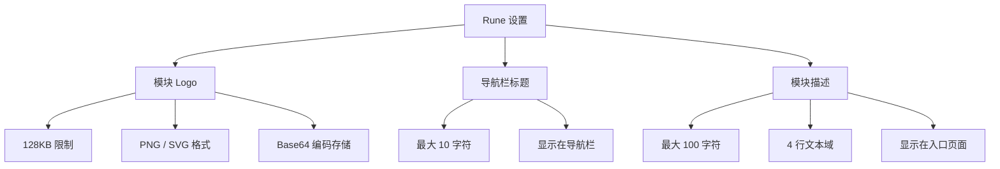

# Rune 设置

## 功能简介

Rune 设置用于自定义 **Rune AI 工作台** 子系统的品牌展示信息，包括模块 Logo、导航栏标题和模块描述。配置保存在 `config.rune` 命名空间下，修改后会立即反映在 Rune 模块的导航栏和入口页面中。

> 💡 提示: Rune 设置与全局平台设置（Platform Settings）互相独立。全局设置控制整个平台的品牌展示，而 Rune 设置仅影响 Rune AI 工作台模块自身的展示内容。

## 进入路径

BOSS → 平台设置 → **Rune 设置**

路径：`/boss/settings/rune`

## 页面说明


## 配置项

### 模块 Logo

| 属性 | 说明 |
|------|------|
| 字段名 | `logo` |
| 文件大小限制 | 最大 **128KB** |
| 编码方式 | **Base64** 编码存储 |
| 支持格式 | **PNG**、**SVG** |
| 用途 | 显示在 Rune 模块的导航栏和入口页面 |

操作步骤：

1. 点击 Logo 上传区域
2. 选择本地 PNG 或 SVG 文件（不超过 128KB）
3. 预览 Logo 效果
4. 确认后点击 **保存**

> ⚠️ 注意: Rune 模块 Logo 的大小限制（128KB）远小于平台全局 Logo（3MB），因为模块 Logo 以 Base64 形式直接存储在配置数据库中，过大的文件会影响配置加载性能。

### 导航栏标题

| 属性 | 说明 |
|------|------|
| 字段名 | `navbar_title` |
| 最大长度 | **10 个字符** |
| 用途 | 显示在 Rune 模块导航栏 Logo 旁边的标题文字 |

默认值为 "Rune"，管理员可将其自定义为组织或产品对应的名称，如 "AI 算力平台"、"智算中心" 等。

### 模块描述

| 属性 | 说明 |
|------|------|
| 字段名 | `description` |
| 最大长度 | **100 个字符** |
| 输入框行数 | **4 行** 文本域 |
| 用途 | 显示在 Rune 模块入口页面或关于页面的简介文字 |

描述文字用于向用户说明 Rune 模块的功能定位和用途概要。

## 配置存储

所有 Rune 设置保存在 `config.rune` 命名空间中：

```yaml
# config.rune 命名空间
logo: "data:image/png;base64,iVBORw0KGgo..."   # Base64 编码的 Logo
navbar_title: "Rune"                             # 导航栏标题
description: "Rune AI 工作台提供..."              # 模块描述
```

## 设置效果展示

配置保存后，Rune 模块中以下位置会受到影响：

| 展示位置 | 受影响的配置项 |
|----------|---------------|
| 导航栏左上角 | Logo + 导航栏标题 |
| 模块入口页面 | Logo + 描述 |
| 浏览器标签页 | 导航栏标题（作为标签页前缀） |


> 💡 提示: 修改保存后，已打开 Rune 模块的用户需要刷新页面才能看到最新配置。新打开页面的用户将直接看到更新后的内容。

## 操作步骤

1. 进入 BOSS → 平台设置 → Rune 设置
2. 根据需要修改 Logo、标题和描述
3. 在页面中预览修改效果
4. 点击 **保存** 按钮提交变更
5. 确认变更已生效（刷新 Rune 模块页面查看）

> ⚠️ 注意: 如果上传的 Logo 文件超过 128KB，系统会提示错误并拒绝上传。请提前压缩图片或使用 SVG 矢量格式以控制文件大小。

## 配置结构概览



## 常见问题

| 问题 | 解决方案 |
|------|----------|
| Logo 上传失败 | 检查文件大小是否超过 128KB，格式是否为 PNG 或 SVG |
| 标题过长被截断 | 减少字符数至 10 个以内 |
| 修改未生效 | 确认点击保存后刷新 Rune 模块页面 |

## 权限要求

需要 **系统管理员** 角色才能访问 Rune 设置页面。
