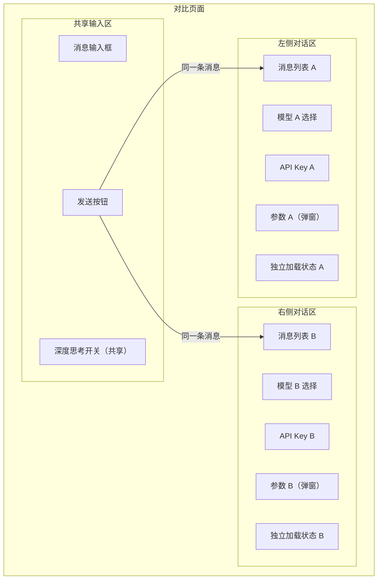
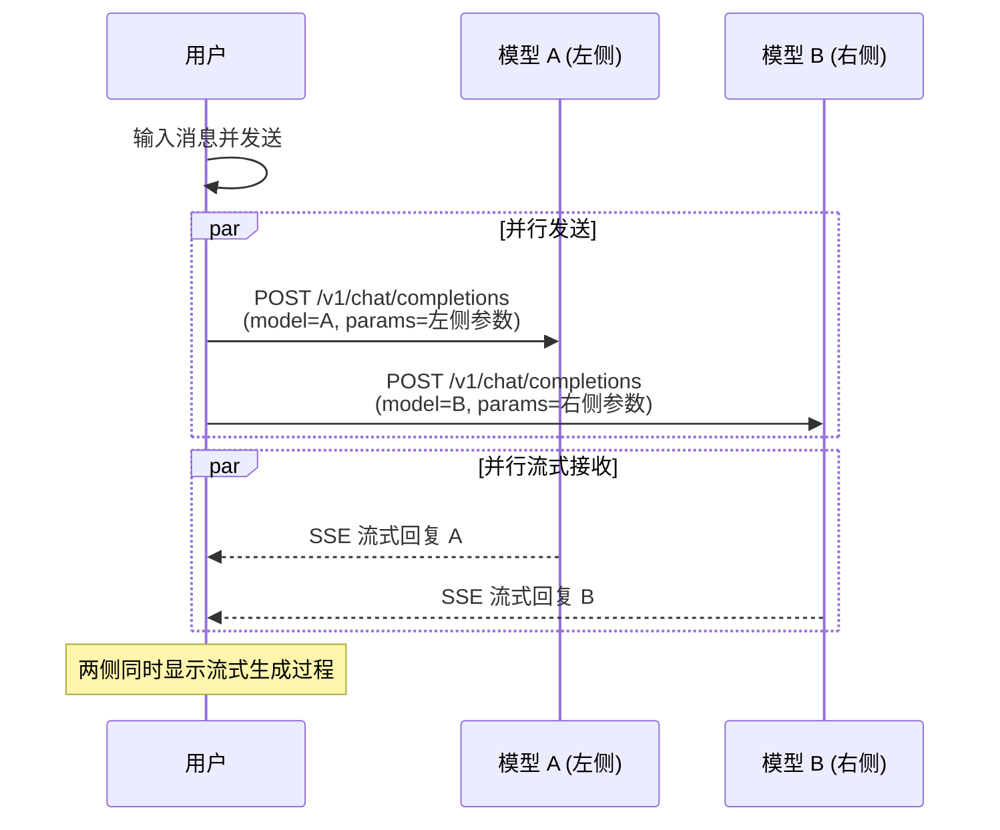

# 多模型对比

## 功能简介

多模型对比页面提供**对称双栏（Split-Screen）** 布局，允许您同时向两个不同的模型发送**同一条消息**，并行观察两侧的生成结果。通过直观的对比，您可以高效地评估不同模型在回复质量、响应速度、推理能力等维度的表现差异。

这是进行模型选型、版本评估和参数对比的核心工具。

## 进入路径

ChatApp → **对比**

路径：`/chatapp/compare`

## 页面布局

页面采用**左右对称**的双栏布局，底部共享一个消息输入区：

### 各区域说明

| 区域 | 说明 |
|------|------|
| **左侧对话区** | 独立的模型 A 的完整对话视图 |
| **右侧对话区** | 独立的模型 B 的完整对话视图 |
| **共享输入区** | 统一的消息输入框和深度思考开关 |

---

## 独立配置

对比页面的两侧拥有**完全独立**的配置，互不影响：

| 配置项 | 左侧 | 右侧 | 备注 |
|--------|------|------|------|
| 模型选择 | 独立选择 | 独立选择 | 可以选择不同模型或相同模型的不同版本 |
| API Key | 独立选择 | 独立选择 | 可以使用不同的 Key |
| 对话参数 | 独立配置（弹窗） | 独立配置（弹窗） | 点击参数图标打开配置弹窗 |
| 消息列表 | 独立维护 | 独立维护 | 两侧的对话历史互不干扰 |
| 加载状态 | 独立管理 | 独立管理 | 一侧生成完毕不影响另一侧 |
| 错误状态 | 独立处理 | 独立处理 | 一侧出错不影响另一侧正常运行 |

### 参数配置弹窗

每侧顶部都有一个参数配置按钮，点击后弹出参数配置面板，可独立设置：

- **Temperature**（0 ~ 1.999，默认 0.7）
- **Top-P**（0.1 ~ 1.0，默认 0.8）
- **Max Tokens**（0 ~ 32768，默认 4096）
- **System Prompt**
- **Stop 序列**

> 💡 提示: 参数弹窗设计方式使页面整洁，当需要调参时可以快速打开修改而不遮挡对话内容。

---

## 同时发送机制

输入消息后点击发送（或按 Enter），系统会**同时**将消息发送到左右两侧的模型：

### 独立流式控制

- 每侧拥有独立的 **AbortController**，可以单独停止某一侧的生成
- 一侧的网络错误或超时不会影响另一侧
- 两侧的流式传输完全并行，生成速度差异会直观体现

### 共享深度思考开关

深度思考（Deep Thinking）开关是**两侧共享**的唯一配置项：

- 开启后，两侧模型都会启用深度思考（`reasoning_effort: 'high'`）
- 关闭后，两侧都不启用

> ⚠️ 注意: 如果某个模型不支持深度思考功能，开启后该侧可能不会产生思考内容，但不会报错。

---

## 对比维度

使用对比页面时，您可以从以下维度观察模型差异：

| 对比维度 | 观察方法 |
|----------|----------|
| **回复质量** | 阅读两侧回复内容，比较准确性、完整性和相关性 |
| **响应速度** | 观察两侧流式生成的实时进度差异 |
| **推理能力** | 启用深度思考后，对比两侧的推理过程和最终结论 |
| **Token 效率** | 对比两侧回复底部的 Token 消耗统计 |
| **指令遵循** | 使用相同 System Prompt，比较两侧对指令的遵循程度 |
| **输出格式** | 比较两侧在格式化输出（JSON、表格、代码）上的表现 |

---

## 使用场景

### 场景一：模型选型

在多个候选模型中选择最适合业务需求的模型：

1. 左侧选择模型 A，右侧选择模型 B
2. 使用相同参数，发送业务相关的典型问题
3. 对比回复质量、速度和 Token 成本
4. 更换模型后继续测试，逐步缩小选择范围

### 场景二：版本评估

对比同一模型的不同版本：

1. 左侧选择旧版本，右侧选择新版本
2. 复现生产环境中的典型对话场景
3. 确认新版本在关键场景下的表现是否提升

### 场景三：参数对比

对比不同参数配置下同一模型的表现：

1. 两侧选择相同模型
2. 左侧 Temperature=0.3，右侧 Temperature=1.0
3. 发送相同消息，观察输出风格差异

> 💡 提示: 对比时建议每次只改变一个变量（模型或参数），这样能更准确地判断差异来源。

---

## 操作步骤

1. 进入 ChatApp → **对比** 页面
2. 在左侧选择模型 A 和对应的 API Key
3. 在右侧选择模型 B 和对应的 API Key
4. （可选）分别点击两侧的参数按钮配置独立参数
5. 在底部输入框中输入消息
6. 按 Enter 或点击发送按钮，观察两侧同时生成回复
7. 对比两侧的输出、速度和 Token 用量
8. 继续发送更多消息进行多轮对比

> ⚠️ 注意: 对比页面的对话历史在页面刷新后会清除。建议对重要的对比结果进行截图或记录。
