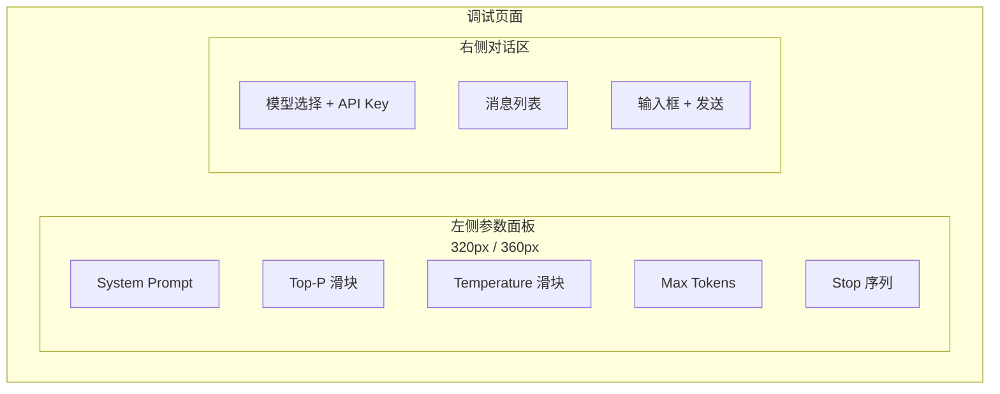
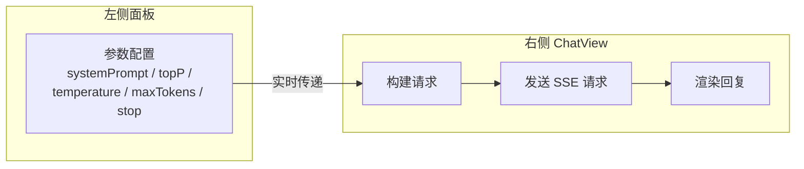

# 对话调试

## 功能简介

对话调试页面为开发者和 Prompt 工程师提供专业的**参数调优环境**。页面采用**左右分栏布局**，左侧为参数面板，右侧为完整的对话视图。您可以实时修改推理参数，立即观察参数变化对模型输出的影响，快速找到最佳的参数配置。

与 [对话体验](./experience.md) 页面相比，调试页面将参数面板独立呈现、始终可见，更适合需要频繁调整参数并观察效果的调优场景。

## 进入路径

ChatApp → **调试**

路径：`/chatapp/debug`

## 页面布局


页面采用水平分栏设计：



| 区域 | 宽度 | 说明 |
|------|------|------|
| **左侧参数面板** | 320px ~ 360px | 展示所有可调节的对话参数，修改后实时生效 |
| **右侧对话区** | 自适应剩余空间 | 完整的 ChatView 对话视图，接收左侧参数 |

---

## 参数面板详情

左侧参数面板包含以下可配置项，参数修改后会**实时传递**到右侧的对话视图，下一次发送消息时生效：

### System Prompt（系统提示词）

| 属性 | 值 |
|------|-----|
| 控件类型 | 多行文本域 |
| 默认值 | 空（无系统提示词） |
| 用途 | 设定模型角色、行为边界和输出格式 |

常见用法示例：

```
你是一个专业的技术文档翻译助手。请将用户输入的英文技术文档翻译成中文，保持专业术语准确，语句通顺。
```

### Top-P（核采样概率）

| 属性 | 值 |
|------|-----|
| 控件类型 | 滑块 |
| 默认值 | `0.8` |
| 取值范围 | 0.1 ~ 1.0 |
| 步长 | 0.1 |
| 用途 | 控制候选 Token 的采样范围。值越小，模型越倾向于选择高概率 Token |

### Temperature（采样温度）

| 属性 | 值 |
|------|-----|
| 控件类型 | 滑块 |
| 默认值 | `0.7` |
| 取值范围 | 0 ~ 1.999 |
| 步长 | 0.1 |
| 用途 | 控制输出的随机性。值越低越确定，值越高越多样 |

### Max Tokens（最大生成长度）

| 属性 | 值 |
|------|-----|
| 控件类型 | 数字输入 |
| 默认值 | `4096` |
| 取值范围 | 0 ~ 32768 |
| 步长 | 10 |
| 用途 | 限制模型单次回复的最大 Token 数量 |

### Stop（停止序列）

| 属性 | 值 |
|------|-----|
| 控件类型 | 文本输入 |
| 默认值 | 空 |
| 用途 | 指定停止生成的字符序列，模型遇到该序列时将立即停止输出 |

> 💡 提示: 参数修改后不会影响已发送的消息。只有后续新发送的消息才会使用更新后的参数值。

---

## 参数如何传递到对话视图



右侧对话视图（ChatView）是与 [对话体验](./experience.md) 页面相同的组件，具备完整的对话能力：

- 模型选择与 API Key 选择
- 深度思考模式开关
- 流式消息渲染（Markdown、代码块、思考过程折叠）
- 消息复制、重试、Token 用量显示
- 自动滚动

---

## 移动端适配

在移动设备或窄屏幕下，调试页面会自动切换为**响应式布局**：

| 屏幕宽度 | 布局方式 |
|----------|----------|
| ≥ 768px | 左右分栏并排显示 |
| < 768px | 参数面板可折叠，默认收起。点击按钮展开/收起参数面板 |

> 💡 提示: 在移动端，可以先展开参数面板调整配置，收起后进行对话，再展开调整——如此反复进行调优。

---

## 调试工作流

以下是推荐的参数调优工作流：

1. **设定基线**：保持默认参数，先发送几轮对话，了解模型的基础输出风格
2. **调整 Temperature**：
   - 如果回答过于发散 → 降低 Temperature（如 0.3）
   - 如果回答过于单一 → 提高 Temperature（如 1.0）
3. **调整 System Prompt**：添加角色设定或输出格式约束，观察模型是否遵循指令
4. **调整 Max Tokens**：
   - 如果回答被截断 → 增大 Max Tokens
   - 如果回答过于冗长 → 减小 Max Tokens 或在 System Prompt 中要求简洁
5. **微调 Top-P**：在 Temperature 确定后，进一步微调 Top-P 以平衡质量和多样性
6. **记录最佳参数**：找到满意的参数组合后，记录下来用于 API 集成

### 使用场景

| 场景 | 推荐参数配置 |
|------|-------------|
| 精准问答 / FAQ | Temperature=0.1, Top-P=0.5, 无 System Prompt |
| 代码生成 | Temperature=0.3, Top-P=0.8, System Prompt 指定语言和风格 |
| 创意写作 | Temperature=1.0~1.5, Top-P=0.9, System Prompt 设定角色 |
| 文档翻译 | Temperature=0.2, Top-P=0.8, System Prompt 指定翻译方向 |
| 多轮对话助手 | Temperature=0.7, Top-P=0.8, System Prompt 设定助手行为 |

> ⚠️ 注意: 调试页面的对话历史在页面刷新后将清除。如果找到了满意的参数组合，请及时记录下来。
