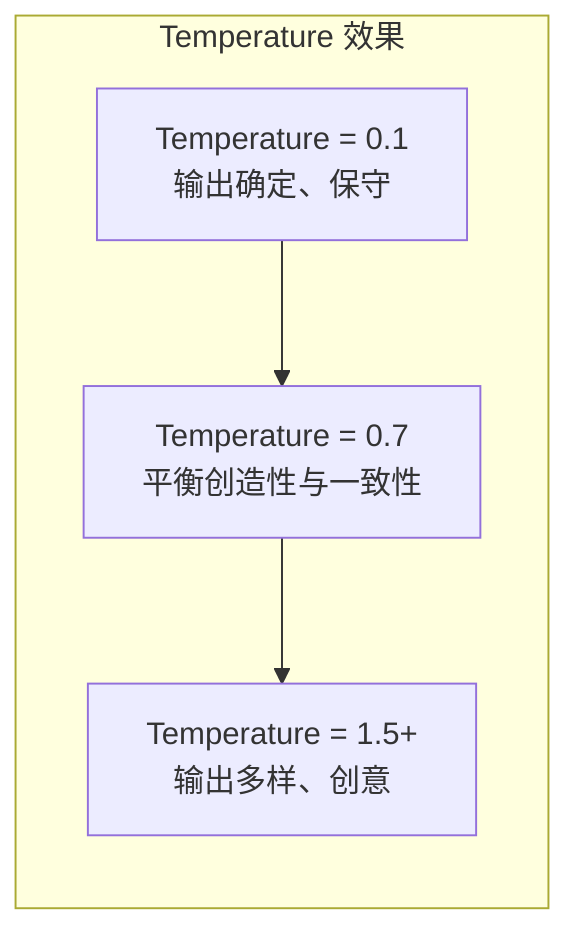
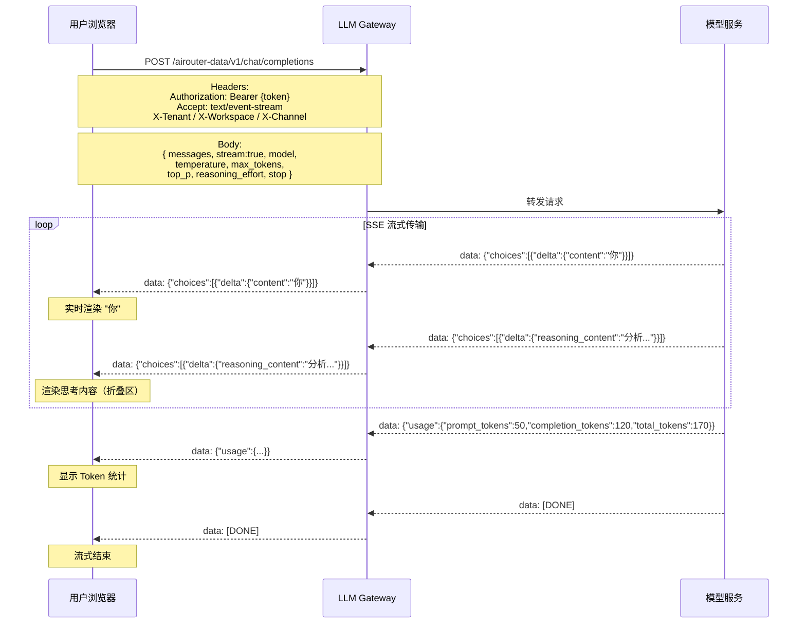

# AI 对话体验

## 功能简介

对话体验页面是 ChatApp 的核心交互界面，提供与已部署 AI 大语言模型的**实时流式对话**能力。通过该页面，您可以选择不同的模型和 API Key，调整对话参数，并以 Markdown 富文本格式查看模型输出，是验证模型能力、调试 Prompt 的首选入口。

## 进入路径

ChatApp → **对话体验**

路径：`/chatapp/experience`

## 页面概览

页面整体为**单栏对话布局**，主要包含以下区域：

| 区域 | 位置 | 功能说明 |
|------|------|----------|
| 模型选择器 | 顶部左侧 | 选择对话目标模型，按可见性分 Tab 展示 |
| API Key 选择器 | 顶部右侧 | 选择调用所用的 API Key |
| 对话参数 | 顶部 | 配置 Temperature、Top-P 等推理参数 |
| 消息列表 | 中间主体 | 展示对话历史，包括用户消息和模型回复 |
| 输入区 | 底部 | 消息输入框、深度思考按钮、发送/停止按钮 |

---

## 模型选择

点击顶部的模型选择器，弹出模型选择面板。模型按**可见性**分为三个 Tab 页签：

| Tab 页签 | 说明 |
|----------|------|
| **公开（Public）** | 平台预设的通用模型，所有租户可用 |
| **租户（Tenant）** | 当前租户内部署的模型，仅租户内成员可见 |
| **私有（Private）** | 当前工作空间私有的模型 |

### 筛选功能

- **搜索**：输入模型名称关键字实时过滤
- **类型筛选**：仅显示 **Generate（生成类）** 类型的模型，自动过滤 Embedding 等非对话类模型

### 模型条目信息

选择的每个模型条目包含以下信息：

| 字段 | 说明 |
|------|------|
| `id` | 模型唯一标识 |
| `tenant` | 所属租户 |
| `workspace` | 所属工作空间 |
| `channel` / `channelId` | 模型接入的渠道信息 |
| `visibility` | 可见性级别（public / tenant / private） |
| `provider` | 模型提供商 |

> 💡 提示: 如果模型列表为空，请确认当前租户/工作空间下是否已配置模型渠道。可联系管理员在 Boss 后台配置。

---

## API Key 选择

在模型选择器旁边的 API Key 选择器中，选择用于身份认证的 API Key。列表中的每个 Key 条目显示：

- **名称**：Key 的自定义名称
- **遮罩值**：Key 值的脱敏展示（如 `sk-****abcd`）
- **过期时间**：Key 的到期日期

> ⚠️ 注意: 如果您还没有可用的 API Key，请先前往 [Token 管理](./token.md) 创建。过期的 Key 将无法用于发起对话请求。

---

## 对话参数配置

对话参数控制模型的推理行为。您可以在顶部参数区域调整以下参数：

| 参数 | 默认值 | 取值范围 | 步长 | 说明 |
|------|--------|----------|------|------|
| **Temperature** | `0.7` | 0 ~ 1.999 | 0.1 | 采样温度。值越高输出越随机多样，值越低输出越确定集中 |
| **Top-P** | `0.8` | 0.1 ~ 1 | 0.1 | 核采样概率。模型仅从累积概率达到 Top-P 的候选 Token 中采样 |
| **Max Tokens** | `4096` | 0 ~ 32768 | 10 | 模型单次回复的最大 Token 数量 |
| **System Prompt** | `""` (空) | 文本 | — | 系统提示词，用于设定模型的角色和行为约束 |
| **Stop** | `""` (空) | 文本 | — | 停止序列，模型遇到该序列时停止生成 |

### 参数效果说明

- **Temperature 与 Top-P 的关系**：通常建议只调整其中一个参数。如果同时调整，两者会叠加影响采样过程的随机性。
- **Max Tokens**：设置为 0 时表示不限制（使用模型默认上限）。建议根据场景合理设置，避免浪费 Token 配额。
- **System Prompt**：常用于角色设定（如 "你是一个专业的翻译助手"）或输出格式约束（如 "请以 JSON 格式回答"）。

> 💡 提示: 对于事实性问答场景，建议使用低 Temperature（0.1~0.3）；对于创意写作、头脑风暴场景，建议使用较高 Temperature（0.8~1.2）。

---

## 深度思考模式

对话体验支持**深度思考（Deep Thinking）** 模式，启用后模型会在生成最终回答前进行链式推理思考。

| 设置项 | 说明 |
|--------|------|
| 深度思考按钮 | 位于输入框区域，默认**开启** |
| API 参数 | `reasoning_effort` 字段：`'high'`（开启）/ `'none'`（关闭） |

启用深度思考后，模型的回复会包含两部分内容：

- **思考过程（Reasoning Content）**：模型的推理链，以可折叠区域展示
- **最终回答（Content）**：模型的最终输出

> 💡 提示: 深度思考模式会消耗更多 Token，但在复杂推理、数学计算、代码分析等场景下能显著提升回答质量。

---

## 对话交互

### 发送消息

| 操作 | 快捷键 |
|------|--------|
| 发送消息 | **Enter** |
| 换行 | **Shift + Enter** |
| 输入法输入中 | IME 激活状态下 Enter 不会发送（兼容中文输入法） |

输入框支持**多行输入**，您可以使用 Shift+Enter 换行后编写较长的 Prompt。

### 消息列表

消息列表区域展示完整的对话历史，每条消息包含以下功能：

| 功能 | 说明 |
|------|------|
| **Markdown 渲染** | 模型回复支持完整的 Markdown 格式渲染，包括代码块、表格、列表等 |
| **思考内容折叠** | 深度思考模式下，思考过程以可展开/折叠区域显示，默认折叠 |
| **复制** | 一键复制消息内容 |
| **重试** | 重新发送上一条消息，获取新的模型回复 |
| **Token 用量** | 每条模型回复底部显示本次请求的 Token 消耗统计 |

### Token 用量显示

每条模型回复会展示以下 Token 统计信息：

| 指标 | 说明 |
|------|------|
| `prompt_tokens` | 输入（Prompt）消耗的 Token 数 |
| `completion_tokens` | 输出（Completion）消耗的 Token 数 |
| `total_tokens` | 总 Token 消耗 |

### 自动滚动

消息列表支持**智能自动滚动**：

- 当用户滚动位置距离底部 **≤ 150px** 时，新消息到达会自动滚动到底部
- 当用户已向上滚动超过 150px 时，自动滚动暂停，不打断用户阅读
- 点击底部的"回到最新"按钮可手动跳转到最新消息

### 新建对话

点击**新建对话**按钮可清空当前对话历史，开始一段全新的会话。当前对话的参数配置和模型选择会保留。

---

## 流式对话机制

ChatApp 采用 **SSE（Server-Sent Events）** 实现流式输出，用户可以实时看到模型逐字生成的回复过程。

### 停止生成

在模型生成过程中，输入框区域会显示**停止按钮**，点击后会中断当前的 SSE 连接（通过 AbortController 实现），已生成的内容会保留。

---

## 错误处理

当对话请求遇到异常时，系统会显示对应的错误提示。常见错误码如下：

| 错误码 | 说明 | 常见原因与解决方法 |
|--------|------|-------------------|
| `rate_limit_exceeded` | 请求频率超限 | Token 或渠道的 TPM/RPM 限流被触发，请等待后重试 |
| ↳ `token_tpm_penalty` | Token 级 TPM 限流 | 当前 API Key 的 Token 每分钟用量超限 |
| ↳ `channel_tpm_penalty` | 渠道级 TPM 限流 | 整个渠道的 Token 每分钟用量超限 |
| `policy_violation` | 内容策略违规 | 请求内容触发了内容审核规则，请修改内容后重试 |
| `context_length_exceeded` | 上下文长度超限 | 对话历史过长，超过模型上下文窗口。请新建对话或缩短历史 |
| `invalid_api_key` | API Key 无效 | API Key 不存在、已过期或已删除。请更换有效的 Key |
| `insufficient_quota` | 配额不足 | 当前账户或租户的 Token 配额已用尽，请联系管理员 |

> ⚠️ 注意: 遇到 `rate_limit_exceeded` 错误时，系统通常会在几秒到一分钟后自动恢复。频繁触发限流可能需要联系管理员调整限流策略。

---

## 完整操作流程

1. **选择模型**：在顶部模型选择器中，切换到对应的 Tab 页签（公开/租户/私有），搜索并选择目标模型
2. **选择 API Key**：在 API Key 选择器中选择一个有效的访问令牌
3. **配置参数**（可选）：根据需要调整 Temperature、Top-P、Max Tokens 等参数
4. **编写 System Prompt**（可选）：设置系统提示词以约束模型行为
5. **开启/关闭深度思考**（可选）：根据任务复杂度决定是否启用深度思考模式
6. **输入消息**：在底部输入框中输入您的问题或指令
7. **发送**：按 Enter 键或点击发送按钮
8. **查看回复**：观察模型的流式生成过程，查看最终回复和 Token 用量
9. **继续对话**：基于上下文继续提问，或点击新建对话重新开始

> 💡 提示: 对话体验中确定的最佳参数组合，可以直接用于 API 集成。参数名称和取值范围与 API 请求体完全一致。
