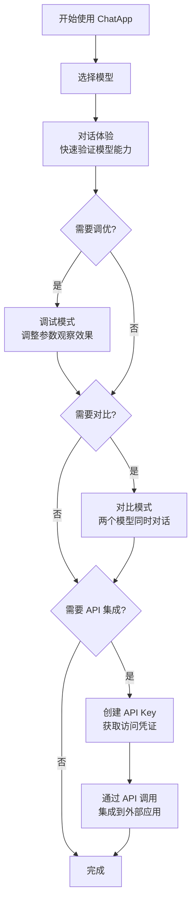
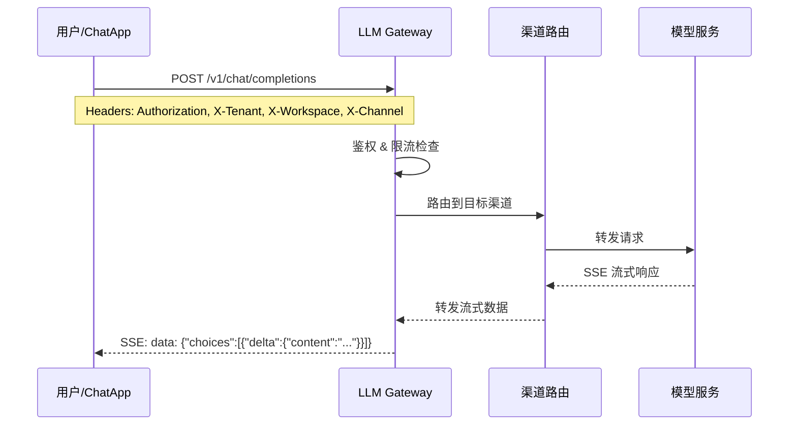

# ChatApp 概览

## 简介

ChatApp 是 Rune Console 内置的 **LLM Playground**（大语言模型游乐场），为开发者和业务用户提供一站式的 AI 大模型交互体验。通过 ChatApp，您可以直接与平台上已部署的各类大语言模型进行实时对话、参数调试、多模型横向对比，并通过 API Key 机制将能力集成到外部应用中。

ChatApp 底层对接 **LLM Gateway（AI Router）** 服务，所有请求均通过统一的 OpenAI 兼容 API 端点进行路由和管控，支持流式输出（SSE）、速率限制、内容审核、多渠道分发等企业级特性。


## 进入路径

Console 首页 → 点击 **ChatApp** 卡片，或通过顶部导航栏 → **ChatApp**

## 核心概念

### OpenAI 兼容 API

ChatApp 的所有对话请求均通过 OpenAI 兼容的 Chat Completions 端点完成：

```
POST /airouter-data/v1/chat/completions
```

请求和响应格式与 OpenAI API 完全一致，支持流式（`stream: true`）和非流式两种模式。这意味着您可以使用任何兼容 OpenAI SDK 的客户端与平台模型交互。

### 模型可见性

平台上的模型按可见性分为三类：

| 可见性 | 说明 |
|--------|------|
| **公开（Public）** | 所有租户均可使用的通用模型 |
| **租户（Tenant）** | 仅当前租户内可见的模型 |
| **私有（Private）** | 仅特定工作空间内可见的模型 |

### LLM Gateway 服务

ChatApp 通过 LLM Gateway 进行请求路由，Gateway 提供以下核心能力：

- **渠道（Channel）管理**：多模型提供商的统一接入
- **速率限制**：按 Token（TPM）和请求数（RPM）维度进行限流
- **内容审核**：基于策略的请求/响应审核
- **审计日志**：完整的请求链路追踪

## 功能模块

| 模块 | 入口 | 说明 |
|------|------|------|
| [AI 对话体验](./experience.md) | ChatApp → 对话体验 | 与模型进行实时对话，支持深度思考、参数调优和 Markdown 渲染 |
| [对话调试](./debug.md) | ChatApp → 调试 | 左右分栏布局，实时调整参数并观察模型输出变化 |
| [多模型对比](./compare.md) | ChatApp → 对比 | 对称双栏布局，同时向两个模型发送相同消息进行对比 |
| [API Key 管理](./token.md) | ChatApp → Token 管理 | 创建和管理 ChatApp API 访问令牌，配置限流和 IP 白名单 |

## 典型工作流



## 请求流转架构



> 💡 提示: ChatApp 中的所有对话参数和模型选择经验，可以直接应用到 API 集成中，参数名称和取值范围完全一致。

> ⚠️ 注意: 使用 ChatApp 前需确保当前租户/工作空间下已有可用的模型渠道，否则模型列表将为空。如需配置渠道，请联系平台管理员在 Boss 后台的 [Gateway 管理](../boss/gateway/channels.md) 中添加。

## 快速开始

1. 进入 ChatApp → **对话体验**
2. 从顶部模型选择器中选择一个可用模型
3. 在输入框中输入您的问题，按 **Enter** 发送
4. 查看模型的流式回复
5. 根据需要，切换到 **调试** 或 **对比** 模式深入评估模型
6. 如需 API 集成，前往 **Token 管理** 创建访问密钥
