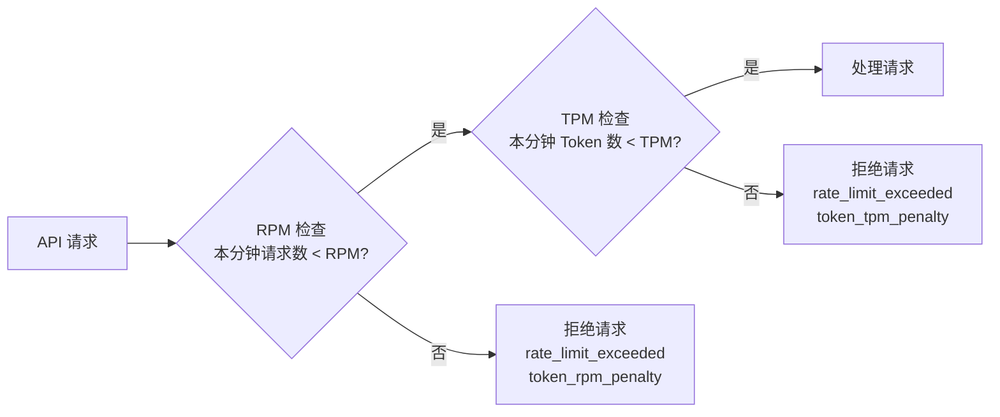

# ChatApp Token 管理

## 功能简介

Token 管理页面用于创建和管理 **ChatApp API 访问令牌（API Key）**。这些令牌是调用 ChatApp 对话 API 的身份凭证，每个令牌都可独立配置速率限制、IP 白名单和过期策略，为 API 集成提供灵活的安全管控能力。

> ⚠️ 注意: ChatApp Token 与 [IAM API Key](../iam/api-key.md) 是不同的凭证体系。ChatApp Token 专用于对话 API 调用（`/airouter-data/v1/chat/completions`），而 IAM API Key（AK/SK）用于平台级 API 操作。

## 进入路径

ChatApp → **Token 管理**

路径：`/chatapp/token`

## Token 数据结构

每个 ChatApp Token 包含以下字段：

| 字段 | 类型 | 说明 |
|------|------|------|
| `id` | string | Token 唯一标识（系统生成） |
| `name` | string | Token 名称（用户自定义） |
| `apiKey` | string | Token 值（仅创建时完整展示） |
| `account` | string | 创建者账户 |
| `belongTo` | string | 归属信息 |
| `expiresAt` | datetime | 过期时间 |
| `rateLimitRPM` | number | 每分钟最大请求数限制 |
| `rateLimitTPM` | number | 每分钟最大 Token 用量限制 |
| `allowedIPs` | string[] | IP 白名单列表 |
| `status` | string | 状态：`active`（有效）/ `expired`（已过期，前端根据 expiresAt 计算） |

---

## Token 列表


Token 列表页展示所有已创建的 Token，包含以下列：

| 列 | 说明 |
|----|------|
| **名称** | Token 名称，可点击进入详情页 |
| **Token 值** | 脱敏展示（如 `sk-****abcd`），附带复制按钮 |
| **RPM** | 每分钟请求数限制 |
| **TPM** | 每分钟 Token 用量限制 |
| **允许的 IP** | 已配置的 IP 白名单 |
| **过期时间** | Token 过期日期 |
| **创建时间** | Token 创建时间 |

---

## 创建 Token

点击页面右上角的 **创建 Token** 按钮，打开创建表单。


### 表单字段

| 字段 | 类型 | 必填 | 验证规则 | 说明 |
|------|------|------|----------|------|
| **名称** | 文本输入 | ✅ | 必填，编辑时不可修改 | Token 的自定义名称，用于标识用途 |
| **RPM 限制** | 数字输入 | 否 | 0 ~ 10000 | 每分钟最大请求数。`0` 或留空表示不限制 |
| **TPM 限制** | 数字输入 | 否 | 0 ~ 100000 | 每分钟最大 Token 用量。`0` 或留空表示不限制 |
| **允许的 IP** | 多行文本域 | 否 | 每行一个 IP/CIDR | IP 白名单，留空表示不限制 |
| **永不过期** | 开关 | 否 | — | 开启后 Token 永不过期 |
| **过期时间** | 日期时间选择器 | 当关闭"永不过期"时必填 | — | Token 的到期时间 |

### IP 白名单格式

允许的 IP 字段支持以下格式，每行一条：

| 格式 | 示例 | 说明 |
|------|------|------|
| IPv4 地址 | `192.168.1.100` | 单个 IP 地址 |
| CIDR 网段 | `10.0.0.0/24` | IP 网段（CIDR 掩码范围 0~32） |
| 通配符 | `*` | 允许所有 IP（等同于不限制） |

IP 验证规则：
- 标准 IPv4 格式（4 组 0~255 数字，用 `.` 分隔）
- 不允许前导零（如 `01.02.03.04` 无效）
- CIDR 掩码位数范围为 0~32
- 支持 `*` 通配符表示不限制

```
# 示例 IP 白名单
192.168.1.0/24
10.0.0.100
172.16.0.0/16
```

> 💡 提示: 如果您的应用部署在固定 IP 的服务器上，建议配置 IP 白名单以增强安全性。

---

## 编辑 Token

在 Token 列表中点击操作按钮或进入详情页后，可以编辑 Token 的配置：

- **名称**：创建后**不可修改**（编辑表单中为禁用状态）
- 其他字段（RPM、TPM、IP 白名单、过期设置）均可修改

---

## Token 详情

点击 Token 列表中的名称链接，进入 Token 详情页面。


详情页包含两部分：

### 1. Token 基本信息

展示 Token 的所有配置字段，包括名称、Token 值（脱敏）、RPM/TPM 限制、IP 白名单、过期时间、创建时间等。

### 2. 使用日志

详情页下方展示 Token 的**使用日志表格**（Usage Logs），记录每一次 API 调用的详细信息：

| 列 | 字段名 | 说明 |
|----|--------|------|
| **时间** | `timestamp` | 请求发生的时间戳 |
| **模型** | `model` | 调用的模型名称 |
| **提供商** | `provider` | 模型提供商 |
| **渠道** | `channelName` | 请求经过的渠道名称 |
| **请求 ID** | `requestId` | 唯一的请求追踪 ID |
| **延迟** | `latencyMillis` | 请求耗时（毫秒） |
| **状态** | `status` | `success`（成功）或 `blocked`（被阻止） |
| **Prompt Tokens** | `promptTokens` | 输入消耗的 Token 数 |
| **Completion Tokens** | `completionTokens` | 输出消耗的 Token 数 |
| **Total Tokens** | `totalTokens` | 总 Token 消耗 |

> 💡 提示: 使用日志可以帮助您追踪 Token 的调用情况，识别异常请求，监控 Token 用量趋势。`blocked` 状态的记录通常表示请求被限流或内容审核拦截。

---

## 速率限制

ChatApp Token 支持两种维度的速率限制：

| 限制类型 | 简称 | 含义 | 取值范围 |
|----------|------|------|----------|
| **RPM** | Requests Per Minute | 每分钟最大请求数 | 0 ~ 10000 |
| **TPM** | Tokens Per Minute | 每分钟最大 Token 用量 | 0 ~ 100000 |



当限制值设为 `0` 或留空时，表示不启用该维度的限流。

> ⚠️ 注意: Token 级限流与渠道级限流是独立的。即使 Token 级别未触发限流，渠道级别仍可能限流。请求被限流时会返回 `rate_limit_exceeded` 错误。

---

## 过期管理

| 过期策略 | 说明 |
|----------|------|
| **永不过期** | 开启"永不过期"开关，Token 长期有效 |
| **指定过期时间** | 关闭"永不过期"开关，设置具体的过期日期时间 |

Token 状态由前端根据 `expiresAt` 字段实时计算：

- 当前时间 < `expiresAt` → 状态为 `active`
- 当前时间 ≥ `expiresAt` → 状态为 `expired`

已过期的 Token 将无法用于 API 调用。

---

## 删除 Token

在 Token 列表中点击删除操作，确认后 Token 将被永久删除。删除后：

- 使用该 Token 的所有 API 请求将立即失败
- 删除操作不可撤销

> ⚠️ 注意: 删除 Token 前，请确保没有正在使用该 Token 的应用或服务，否则将导致服务中断。

---

## API 集成示例

使用 ChatApp Token 调用对话 API：

### 基础对话请求

```bash
curl -X POST https://your-domain/airouter-data/v1/chat/completions \
  -H "Authorization: Bearer YOUR_CHATAPP_TOKEN" \
  -H "Content-Type: application/json" \
  -H "Accept: text/event-stream" \
  -H "X-Tenant: your-tenant" \
  -H "X-Workspace: your-workspace" \
  -H "X-Channel: your-channel" \
  -d '{
    "model": "your-model-name",
    "messages": [
      {"role": "system", "content": "你是一个有帮助的助手。"},
      {"role": "user", "content": "请介绍一下量子计算。"}
    ],
    "stream": true,
    "temperature": 0.7,
    "max_tokens": 4096,
    "top_p": 0.8,
    "reasoning_effort": "none",
    "stop": ""
  }'
```

### 非流式请求

```bash
curl -X POST https://your-domain/airouter-data/v1/chat/completions \
  -H "Authorization: Bearer YOUR_CHATAPP_TOKEN" \
  -H "Content-Type: application/json" \
  -H "X-Tenant: your-tenant" \
  -H "X-Workspace: your-workspace" \
  -d '{
    "model": "your-model-name",
    "messages": [
      {"role": "user", "content": "Hello!"}
    ],
    "stream": false,
    "temperature": 0.7,
    "max_tokens": 1024
  }'
```

---

## Token 安全最佳实践

| 最佳实践 | 说明 |
|----------|------|
| **最小权限原则** | 为每个应用或服务创建独立的 Token，避免共享 |
| **配置 IP 白名单** | 限制 Token 仅能从指定 IP 或网段调用 |
| **设置过期时间** | 除非必要，避免创建永不过期的 Token |
| **定期轮换** | 定期创建新 Token 并替换旧 Token |
| **设置合理限流** | 根据实际需求配置 RPM/TPM 限制，防止滥用 |
| **监控使用日志** | 定期检查 Token 使用日志，发现异常调用 |
| **及时清理** | 不再使用的 Token 应立即删除 |
| **安全存储** | Token 值仅在创建时完整显示，请立即复制并安全存储 |

> ⚠️ 注意: Token 值一旦关闭创建弹窗后将无法再次查看完整值。请务必在创建时立即复制并安全存储到密钥管理系统中。

---

## 相关 API 接口

| 操作 | 方法 | 路径 |
|------|------|------|
| 获取 Token 列表 | GET | `/api/airouter/v1/me/tokens` |
| 创建 Token | POST | `/api/airouter/v1/me/tokens` |
| 获取 Token 详情 | GET | `/api/airouter/v1/tokens/{token}` |
| 更新 Token | PUT | `/api/airouter/v1/tokens/{token}` |
| 删除 Token | DELETE | `/api/airouter/v1/tokens/{token}` |
| 获取使用日志 | GET | `/api/airouter/v1/tokens/{token}/usage-logs` |
