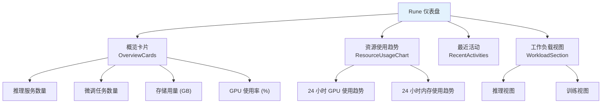

# 首页与仪表盘

## 首页

Console 首页是用户登录后看到的第一个页面，以醒目的轮播卡片展示三大子产品的入口，帮助用户快速导航到目标功能模块。

### 子产品入口

| 卡片 | 说明 | 点击后 |
|------|------|--------|
| **Rune** | AI 工作台 — 推理、微调、开发、部署全链路 | 进入 Rune 仪表盘 |
| **Moha** | 模型中心 — 模型、数据集、镜像、Space 管理 | 进入 Moha 首页 |
| **ChatApp** | 对话体验 — AI 对话、调试、评测 | 进入 ChatApp 对话页 |

---

## Rune 仪表盘

进入 Rune 工作台后的默认页面，提供当前工作空间的全局资源概览和运行状态监控。

**进入路径**：首页 → Rune → 自动跳转仪表盘，或左侧导航 → 仪表盘

### 仪表盘组件架构

---

### 概览卡片（OverviewCards）

仪表盘顶部展示 **4 张概览卡片**，以大数字和图标直观呈现关键指标：

| 卡片 | 指标 | 说明 | 交互 |
|------|------|------|------|
| 🔮 推理服务 | 推理实例数量 | 显示当前工作空间中运行中的推理服务总数 | 点击跳转到推理服务列表 |
| 🔧 微调任务 | 微调实例数量 | 显示当前运行中和已完成的微调任务总数 | 点击跳转到微调服务列表 |
| 💾 存储用量 | 已使用 GB | 显示工作空间的持久化存储已使用量 | 点击跳转到存储卷管理 |
| 🎮 GPU 使用率 | 百分比 (%) | 显示工作空间 GPU 配额的当前使用率 | 点击跳转到配额页面 |

> 💡 提示: 概览卡片的数据范围受当前选择的工作空间和集群上下文影响。切换工作空间后，卡片数据会自动刷新。

---

### 资源使用趋势图（ResourceUsageChart）

展示过去 **24 小时**内的资源使用变化趋势，采用面积图（Area Chart）形式：

| 图表 | 数据源 | 展示方式 |
|------|--------|---------|
| GPU 使用趋势 | Prometheus 指标 | 蓝色面积图，Y 轴为使用率百分比 |
| 内存使用趋势 | Prometheus 指标 | 绿色面积图，Y 轴为使用量 GiB |

**图表特性**：

- 时间轴跨度：最近 24 小时
- 数据粒度：5 分钟一个数据点
- 鼠标悬停：显示精确时间点的具体数值
- 支持缩放：选区放大查看特定时间段
- 双 Y 轴：GPU 使用率和内存使用量分别使用独立的 Y 轴

> ⚠️ 注意: 资源使用趋势仅展示当前工作空间范围内的资源使用情况。如需查看租户或集群级别的全局资源趋势，请前往 BOSS 端仪表盘。

---

### 最近活动（RecentActivities）

以表格形式展示工作空间内最近创建或状态变更的实例活动记录：

| 列 | 说明 | 示例 |
|----|------|------|
| 名称 | 实例名称，点击可跳转详情 | `llama3-70b-chat` |
| 类型 | 实例类型 | 推理 / 微调 / 开发 / 应用 |
| 用户 | 操作者用户名 | `zhang.san` |
| 状态 | 当前运行状态 | 🟢 running / ✅ completed / 🔴 failed / ⏳ pending |
| 时间 | 最近活动时间 | `2 分钟前` |

#### 活动状态说明

| 状态 | 含义 | 颜色 |
|------|------|------|
| running | 实例正在运行中 | 🟢 绿色 |
| completed | 任务已完成（通常用于微调任务） | ✅ 灰色/蓝色 |
| failed | 实例运行失败 | 🔴 红色 |
| pending | 实例等待资源调度 | ⏳ 黄色 |

---

### 工作负载视图（WorkloadSection）

展示推理服务和训练任务两个维度的详细运行指标，支持视图切换。

#### 推理视图（Inference View）

| 指标 | 说明 | 展示形式 |
|------|------|---------|
| 请求成功率 | 推理 API 请求的成功率百分比 | 环形进度条 |
| 平均延迟 | 推理请求的平均响应时间 (ms) | 数值 + 趋势箭头 |
| 活跃服务 | 运行中的推理服务列表 | 服务列表 + 健康条 |
| 7 天请求趋势 | 最近 7 天的请求量变化 | 折线图 |

**活跃服务健康条**说明：

- 🟢 绿色段：健康状态的副本
- 🔴 红色段：异常状态的副本
- 占比直观展示每个推理服务的健康程度

#### 训练视图（Training View）

| 指标 | 说明 | 展示形式 |
|------|------|---------|
| 训练成功率 | 微调任务的成功完成率 | 环形进度条 |
| 活跃任务数 | 当前正在运行的微调任务数 | 数值 |
| GPU 时长 | 已消耗的 GPU 计算时长 | 数值（GPU·小时） |
| 任务列表 | 运行中和最近完成的训练任务 | 状态列表 |

---

## 实例监控面板

每个 Instance 的详情页都提供 **Prometheus/Grafana 风格的监控面板**，展示实例运行时的各项指标。

### 面板类型

监控面板支持多种可视化组件类型：

| 面板类型 | 说明 | 典型用途 |
|---------|------|---------|
| timeseries | 时间序列曲线图 | CPU 使用率趋势、请求量趋势 |
| gauge | 仪表盘/刻度盘 | 当前 CPU/内存使用比例 |
| stat | 单值统计 | 当前总请求数、在线 Pod 数 |
| bargauge | 水平/垂直条形仪表 | 多节点资源使用对比 |
| graph | 折线图 / 面积图 | 多指标时序对比 |
| table | 数据表格 | 详细指标数据列表 |
| heatmap | 热力图 | 请求延迟分布 |
| piechart | 饼图 | 资源占比分布 |
| text | 纯文本 | 面板标题、说明信息 |
| row | 行分组 | 面板行分隔器 |
| singlestat | 单值（旧版） | 兼容旧版面板 |
| logs | 日志面板 | 嵌入日志查看 |
| trace | 链路追踪 | 请求链路分析 |
| dashlist | 面板列表 | 子面板导航 |
| alertlist | 告警列表 | 告警规则和触发记录 |

### 监控面板 API

| API | 说明 |
|-----|------|
| 面板列表 | 获取实例关联的所有监控面板（内置 + 动态） |
| 面板查询 | 查询指定面板的数据，根据 Prometheus 数据源渲染各面板 |
| 面板参数 | 获取面板可用的模板变量和参数 |
| 实例指标 | 获取实例级别的 Prometheus 指标 |

> 💡 提示: 监控面板的数据来源于 Prometheus 时序数据库。面板支持时间范围选择和自动刷新，可以回溯历史数据进行问题排查。

---

## 集群级仪表盘

在 BOSS 端，平台管理员可以访问集群级别的仪表盘，提供全局视角的资源监控：

| 仪表盘类型 | 说明 |
|-----------|------|
| 内置仪表盘 | 平台预置的标准监控面板，覆盖集群健康、资源使用等 |
| 动态仪表盘 | 管理员通过 BOSS 设置 → 动态仪表盘 配置的自定义面板 |

集群级面板通常包含：

- **集群资源总览**：CPU/GPU/内存/存储的总量、已用、可用
- **节点状态**：各节点的健康状态和负载
- **租户分布**：各租户的资源使用占比
- **告警信息**：当前活跃的告警规则和触发历史

---

## 权限要求

| 功能 | 所需角色 |
|------|---------|
| 查看 Console 首页 | ALL |
| 查看 Rune 仪表盘 | ALL |
| 查看概览卡片 / 趋势图 | ALL |
| 查看工作负载视图 | ADMIN / DEVELOPER |
| 查看实例监控面板 | ADMIN / DEVELOPER |
| 查看集群级仪表盘 | 平台管理员（BOSS 端） |
