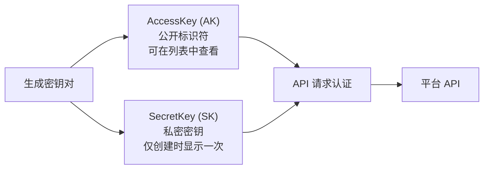

# IAM API Key（AK/SK）

## 功能简介

IAM API Key 是平台级的**访问密钥对**，由 **AccessKey（AK）** 和 **SecretKey（SK）** 组成。它是您通过 API 方式与平台进行身份认证和交互的凭证，适用于自动化脚本、CI/CD 流水线、第三方应用集成等场景。

> ⚠️ 注意: IAM API Key（AK/SK）与 [ChatApp Token](../chatapp/token.md) 是完全不同的凭证体系，请勿混淆。

| 凭证类型 | 格式 | 用途 | 管理入口 |
|----------|------|------|----------|
| **IAM API Key** | AccessKey + SecretKey 密钥对 | 平台级 API 认证（管理资源、配置等） | 个人中心 → API Key |
| **ChatApp Token** | Bearer Token（单个密钥串） | ChatApp 对话 API 调用 | ChatApp → Token 管理 |

## 进入路径

右上角头像 → 个人中心 → **API Key**

路径：`/iam/account/api-key`

## 页面概览


---

## 密钥对概念



| 密钥 | 说明 |
|------|------|
| **AccessKey（AK）** | 公开的访问标识符，类似于用户名。可在列表中随时查看 |
| **SecretKey（SK）** | 私密的签名密钥，类似于密码。**仅在创建时显示一次**，之后无法再次查看 |

两者配合使用，共同完成 API 请求的身份认证。

---

## 生成密钥对

### 操作步骤

1. 点击页面右上角的 **创建 API Key** 按钮
2. 系统调用 `POST /api/iam/current/apikeys` 生成新的密钥对
3. 弹窗中显示生成的 **AccessKey** 和 **SecretKey**
4. 点击 SecretKey 旁的 **复制** 按钮，将其复制到安全的位置


> ⚠️ 注意: SecretKey 仅在此刻显示一次！关闭弹窗后将永远无法再次查看。请务必在关闭前将其复制并安全存储到密钥管理系统（如 Vault、1Password 等）中。

### 创建后的确认

创建成功后，弹窗会显示：

| 信息 | 说明 |
|------|------|
| AccessKey | 可随时在列表中查看 |
| SecretKey | **仅此次显示**，附带复制按钮 |

点击复制按钮后，建议立即粘贴到安全的存储位置进行验证。

---

## 密钥列表

API Key 列表页面展示所有已创建的密钥：

| 列 | 说明 |
|----|------|
| **AccessKey** | 密钥的公开标识符（完整显示） |
| **创建时间** | 密钥的创建日期和时间 |
| **操作** | 删除按钮 |

> 💡 提示: 列表中只能看到 AccessKey，无法查看 SecretKey。如果遗忘了 SecretKey，只能删除该密钥对并重新创建。

---

## 删除密钥

在密钥列表中，点击对应条目的 **删除** 按钮：

1. 系统弹出确认对话框
2. 确认删除后，密钥对立即失效
3. 所有使用该密钥对的 API 请求将返回认证失败

> ⚠️ 注意: 删除操作不可撤销。请在删除前确保没有正在使用该密钥的服务或脚本，否则将导致服务中断。

---

## 使用场景

### 场景一：API 自动化脚本

在自动化脚本中使用 AK/SK 进行 API 认证：

```bash
# 使用 API Key 调用平台 API
curl -X GET https://your-domain/api/resource \
  -H "X-Access-Key: YOUR_ACCESS_KEY" \
  -H "X-Secret-Key: YOUR_SECRET_KEY"
```

### 场景二：CI/CD 流水线

将 AK/SK 配置为 CI/CD 系统的密钥变量：

```yaml
# GitLab CI 示例
variables:
  RUNE_AK: $RUNE_ACCESS_KEY    # 存储在 CI/CD Variables 中
  RUNE_SK: $RUNE_SECRET_KEY    # 存储在 CI/CD Variables 中（标记为 Masked）

deploy:
  script:
    - curl -X POST https://your-domain/api/deploy \
        -H "X-Access-Key: $RUNE_AK" \
        -H "X-Secret-Key: $RUNE_SK"
```

### 场景三：第三方应用集成

在第三方应用中集成平台 API 时，使用 AK/SK 进行身份认证。建议将密钥存储在环境变量中，而非硬编码在代码中。

---

## 安全最佳实践

| 最佳实践 | 说明 |
|----------|------|
| **立即保存 SK** | SecretKey 创建后仅显示一次，立即复制并安全存储 |
| **使用密钥管理服务** | 将 SK 存储在 Vault、AWS Secrets Manager 等密钥管理系统中 |
| **不要硬编码** | 永远不要将 AK/SK 写在源代码中，使用环境变量或配置文件 |
| **最小权限** | 为不同用途创建不同的密钥对 |
| **定期轮换** | 定期创建新密钥对并淘汰旧密钥 |
| **及时清理** | 不再使用的密钥应立即删除 |
| **监控使用** | 关注密钥的使用情况，发现异常及时处理 |
| **不要共享** | 每个用户或服务应使用独立的密钥对 |

> 💡 提示: 如果怀疑 SecretKey 已泄露，请立即删除该密钥对并创建新的。同时检查是否有异常的 API 调用记录。

---

## 相关 API 接口

| 操作 | 方法 | 路径 |
|------|------|------|
| 获取 API Key 列表 | GET | `/api/iam/current/apikeys` |
| 创建 API Key | POST | `/api/iam/current/apikeys` |
