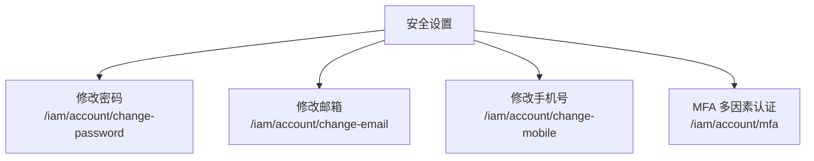
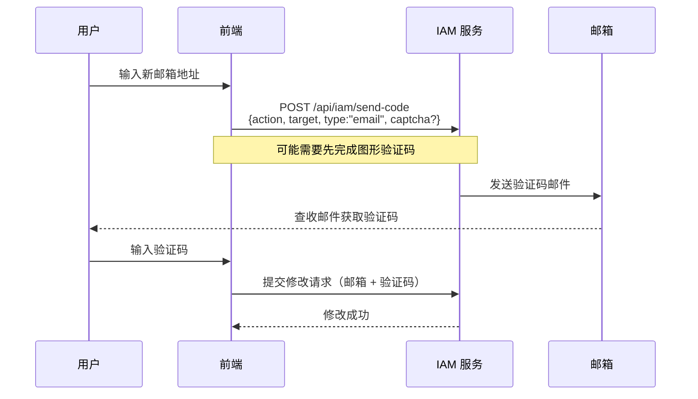
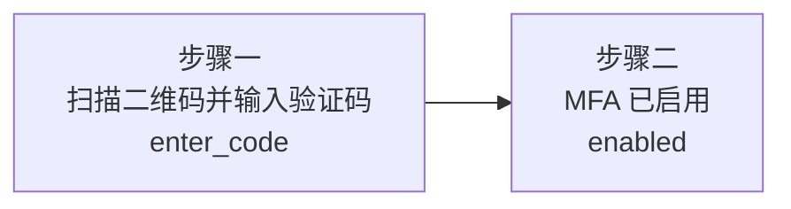

# 安全设置

## 功能简介

安全设置页面集中管理您账户的安全相关配置，包括**修改密码**、**修改邮箱**、**修改手机号**和**多因素认证（MFA）** 四大功能。这些安全操作涉及敏感的身份信息变更，均需要通过验证码或密码校验确认身份。

## 进入路径

右上角头像 → 个人中心 → **安全设置**

## 安全功能总览



---

## 修改密码

路径：`/iam/account/change-password`


### 表单字段

| 字段 | 类型 | 必填 | 说明 |
|------|------|------|------|
| **当前密码** | 密码输入框 | ✅ | 输入当前的登录密码以验证身份 |
| **新密码** | 密码输入框 | ✅ | 设置新的登录密码 |
| **确认新密码** | 密码输入框 | ✅ | 再次输入新密码，确保一致 |

每个密码字段都配有**可见性切换按钮**（眼睛图标），点击可切换密码的明文/密文显示。

### 密码强度要求

新密码会在输入时实时进行**强度检测**，通常需要满足以下条件：

| 要求 | 说明 |
|------|------|
| 最小长度 | 不少于 8 个字符 |
| 字符多样性 | 建议包含大小写字母、数字和特殊字符 |
| 不可与旧密码相同 | 新密码必须与当前密码不同 |

密码强度指示器会显示为 **弱 / 中 / 强** 三个等级，建议设置强度为"强"的密码。

### 操作步骤

1. 输入当前密码
2. 输入新密码并观察强度指示
3. 确认新密码（必须与新密码一致）
4. 点击 **保存** 按钮
5. 修改成功后，下次登录需使用新密码

> ⚠️ 注意: 修改密码后，当前会话不会立即失效。但其他设备上的会话可能会被要求重新登录。

---

## 修改邮箱

路径：`/iam/account/change-email`


修改邮箱需要通过验证码确认新邮箱的有效性。

### 表单字段

| 字段 | 类型 | 必填 | 说明 |
|------|------|------|------|
| **新邮箱** | 邮箱输入框 | ✅ | 输入新的邮箱地址，需符合标准邮箱格式 |
| **验证码** | 验证码输入框 | ✅ | 输入发送到新邮箱的验证码 |

### 验证流程



### 操作步骤

1. 输入新的邮箱地址
2. 点击 **发送验证码** 按钮
3. 如果触发图形验证码，完成图形验证
4. 到新邮箱中查收验证码邮件
5. 输入 6 位数字验证码
6. 点击 **保存** 确认修改

> 💡 提示: 验证码有效期通常为 5 分钟。如果未收到验证码，请检查垃圾邮件文件夹，或等待倒计时结束后重新发送。

---

## 修改手机号

路径：`/iam/account/change-mobile`


修改手机号的流程与修改邮箱类似，通过短信验证码确认新手机号。

### 表单字段

| 字段 | 类型 | 必填 | 说明 |
|------|------|------|------|
| **新手机号** | 手机号输入框 | ✅ | 输入新的手机号码，需符合手机号格式 |
| **验证码** | 验证码输入框 | ✅ | 输入发送到新手机的短信验证码 |

### 操作步骤

1. 输入新的手机号码
2. 点击 **发送验证码** 按钮
3. 如果触发图形验证码，完成图形验证
4. 查收手机短信中的验证码
5. 输入验证码
6. 点击 **保存** 确认修改

---

## 验证码机制

修改邮箱和修改手机号均使用**验证码组件（VerifyCode）**，其工作流程如下：

### 发送验证码

| 参数 | 说明 |
|------|------|
| `action` | 验证动作类型 |
| `target` | 接收目标（邮箱或手机号） |
| `type` | 验证码类型：`email`（邮箱）或 `phone`（手机） |
| `captcha` | 图形验证码信息（如果需要） |

API：`POST /api/iam/send-code`

### 图形验证码（Captcha）

在某些安全策略下，发送验证码前需要先完成图形验证码验证：

| 操作 | API |
|------|-----|
| 获取图形验证码 | `GET /api/iam/captcha` |
| 返回数据 | `{ action, key, provider, params: { image } }` |

系统会返回一张 Base64 编码的验证码图片，用户输入图片中的字符后方可发送验证码。

> ⚠️ 注意: 图形验证码不是每次都会出现，通常在频繁请求验证码或系统检测到异常行为时触发。

---

## MFA 多因素认证

路径：`/iam/account/mfa`


多因素认证（MFA）为账户提供额外的安全保护层。启用后，登录时除了输入密码外，还需要输入由认证器应用生成的动态验证码。

### MFA 启用流程

MFA 的启用采用**分步向导（Stepper）** 方式，共两步：



#### 步骤一：扫描二维码

1. 点击 **启用 MFA** 按钮
2. 系统调用 `POST /api/iam/init-mfa` 初始化 MFA 配置
3. 返回 MFA 配置信息（MFAConf）：

| 字段 | 类型 | 说明 |
|------|------|------|
| `provider` | string | 认证提供商（如 `app`） |
| `recoveryCodes` | string[] | 恢复码列表（用于无法使用认证器时的备用验证） |
| `secret` | string | TOTP 密钥（可手动输入到认证器） |
| `url` | string | otpauth:// 格式的 URL |
| `username` | string | 关联的用户名 |

4. 页面通过 `qrcode` 库将 `url` 渲染为 **QR 二维码**（Canvas 渲染）
5. 使用认证器应用（如 Google Authenticator、Microsoft Authenticator 等）扫描二维码
6. 认证器应用会开始生成 6 位动态验证码（每 30 秒更新）
7. 在输入框中输入当前显示的验证码

> 💡 提示: 如果无法扫描二维码，可以点击"手动输入"查看密钥（Secret），将其手动添加到认证器应用中。

#### 步骤二：验证并启用

1. 输入认证器中的 6 位验证码
2. 系统调用 `POST /api/iam/verify-mfa` 进行验证：

```json
{
  "code": "123456",
  "action": "bind",
  "provider": "app"
}
```

3. 验证成功后，MFA 正式启用
4. 页面显示**恢复码（Recovery Codes）** 列表

### 恢复码

恢复码是在您无法使用认证器应用时的**备用登录方式**。每个恢复码只能使用一次。

> ⚠️ 注意: 恢复码仅在 MFA 启用时显示一次。请务必将其复制并安全存储在独立于认证器设备的位置（如密码管理器或打印保存）。丢失恢复码且无法使用认证器时，将无法登录账户。

### 禁用 MFA

如果已启用 MFA，页面会显示当前 MFA 状态和**禁用**按钮。禁用 MFA 需要输入当前的认证器验证码以确认身份。

---

## 安全设置总结

| 功能 | 身份验证方式 | 安全等级 |
|------|-------------|---------|
| 修改密码 | 输入当前密码 | ⭐⭐⭐ |
| 修改邮箱 | 新邮箱验证码 + 可能的图形验证码 | ⭐⭐⭐ |
| 修改手机号 | 新手机验证码 + 可能的图形验证码 | ⭐⭐⭐ |
| 启用 MFA | TOTP 验证码 | ⭐⭐⭐⭐ |
| 禁用 MFA | 当前 TOTP 验证码 | ⭐⭐⭐⭐ |

> 💡 提示: 强烈建议启用 MFA 以增强账户安全性。这可以有效防止即使密码泄露后的未授权登录。
