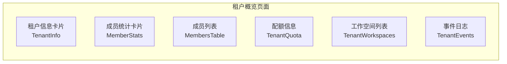
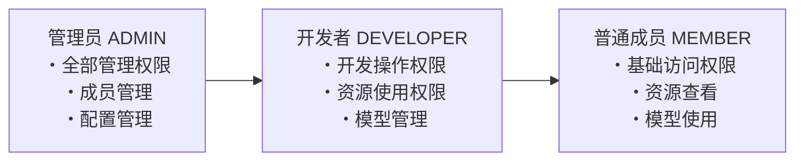
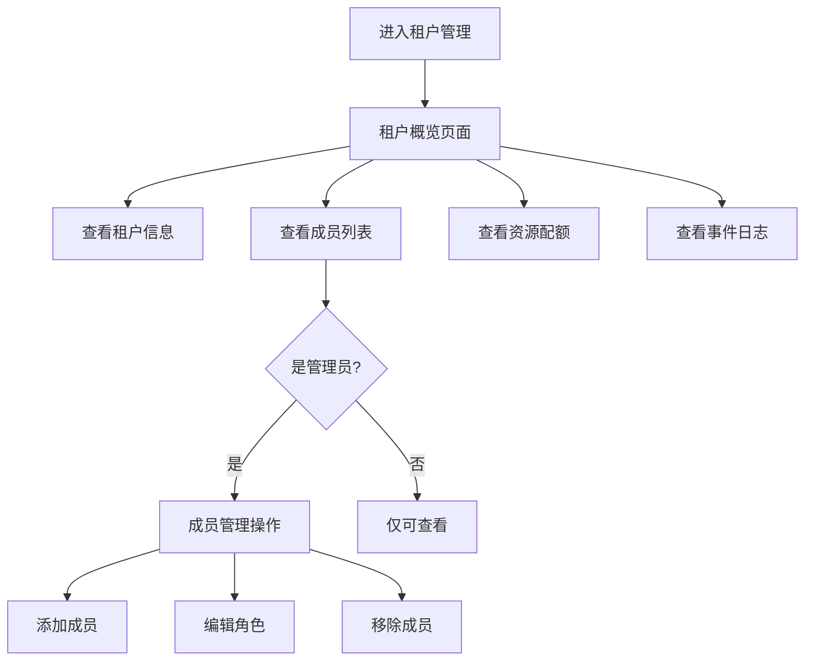

# 租户管理

## 功能简介

租户管理页面提供当前租户的**全面概览**和**成员管理**功能。在此页面中，您可以查看租户的基本信息、成员统计、资源配额、工作空间列表和事件日志，还可以管理租户成员（添加、编辑角色、移除）。

## 进入路径

右上角头像 → 个人中心 → **租户管理**

## 租户数据结构

| 字段 | 类型 | 说明 |
|------|------|------|
| `id` | string | 租户唯一标识 |
| `name` | string | 租户名称 |
| `userCount` | number | 租户内成员数量 |
| `avatar` | string | 租户头像/图标 |
| `email` | string | 租户联系邮箱 |
| `enabled` | boolean | 租户是否启用 |
| `phone` | string | 租户联系电话 |
| `lang` | string | 租户默认语言 |

---

## 租户概览

路径：`/iam/tenants/:tenant/overview`

概览页面由多个信息卡片组成，全面展示租户状态：

### 1. 租户信息卡片（TenantInfo）

展示租户的核心信息：

| 信息 | 说明 |
|------|------|
| 租户名称 | 租户的显示名称 |
| 租户 ID | 唯一标识符 |
| 租户头像 | 租户的图标/Logo |
| 联系邮箱 | 管理员联系邮箱 |
| 联系电话 | 管理员联系电话 |
| 启用状态 | 租户是否处于启用状态 |
| 默认语言 | 租户的界面默认语言 |

### 2. 成员统计卡片（MemberStats）

以图表方式展示租户内各角色的成员分布：

| 角色 | 英文 | 说明 |
|------|------|------|
| **管理员** | ADMIN | 拥有租户的全部管理权限 |
| **开发者** | DEVELOPER | 拥有开发相关的操作权限 |
| **普通成员** | MEMBER | 基础的资源访问权限 |

### 3. 成员列表（MembersTable）

以表格形式展示租户内的所有成员。详见下方 [成员管理](#成员管理) 部分。

### 4. 租户配额（TenantQuota）

展示当前租户的资源配额分配和使用情况：

| 配额项 | 说明 |
|--------|------|
| 集群资源 | 分配的计算资源配额 |
| 工作空间数量 | 可创建的工作空间数量上限 |
| Token 配额 | LLM 调用的 Token 总量限制 |

### 5. 工作空间列表（TenantWorkspaces）

展示租户下所有工作空间的概要信息，可以快速了解各工作空间的状态和资源使用情况。

### 6. 事件日志（TenantEvents）

展示租户内的近期操作事件，便于管理员审计和追踪重要操作：

| 事件字段 | 说明 |
|----------|------|
| 时间 | 事件发生的时间 |
| 操作者 | 执行操作的用户 |
| 操作类型 | 具体的操作描述 |
| 目标资源 | 被操作的资源 |

---

## 成员管理

路径：`/iam/tenants/:tenant/members`

### 成员列表

成员表格包含以下列：

| 列 | 说明 |
|----|------|
| **用户名** | 成员的用户名（附带头像） |
| **邮箱** | 成员的联系邮箱 |
| **角色** | 租户内的角色（已翻译显示：管理员/开发者/成员） |
| **加入时间** | 成员加入租户的时间 |
| **操作** | 编辑角色、移除成员（需 ADMIN 权限） |

### 租户角色说明

| 角色 | 英文 | 成员管理 | 资源管理 | 开发操作 | 基础访问 |
|------|------|---------|---------|---------|---------|
| **管理员** | ADMIN | ✅ | ✅ | ✅ | ✅ |
| **开发者** | DEVELOPER | ❌ | ✅ | ✅ | ✅ |
| **普通成员** | MEMBER | ❌ | ❌ | ❌ | ✅ |

### 添加成员

> ⚠️ 注意: 添加成员需要 **ADMIN** 角色权限。

1. 点击页面右上角的 **添加成员** 按钮
2. 在弹出的表单中：
   - **搜索用户**：输入用户名关键字，从搜索结果中选择用户
   - **选择角色**：从下拉菜单中选择角色（管理员 / 开发者 / 成员）
3. 确认添加

> 💡 提示: 只能添加已在平台注册的用户。如果对方尚未注册，需要先完成注册流程。

### 编辑成员角色

1. 在成员列表中找到目标成员
2. 点击 **编辑** 按钮（或角色列的编辑图标）
3. 从下拉菜单中选择新的角色
4. 确认保存

> ⚠️ 注意: 不能修改自己的角色。如果是租户内唯一的管理员，也不能将自己降级为其他角色。

### 移除成员

1. 在成员列表中找到要移除的成员
2. 点击 **删除** 按钮
3. 在确认对话框中确认移除

移除后：
- 该成员将失去对租户内所有资源的访问权限
- 该成员创建的资源不会被删除
- 该成员可以被重新添加回租户

> ⚠️ 注意: 不能移除自己。如果需要退出租户，请联系其他管理员操作。

---

## 租户仪表盘

路径：`/iam/tenants/:tenant/dashboard`

仪表盘页面目前显示为 **Coming Soon**（即将上线）状态。后续版本将提供租户级的数据看板，包括资源使用趋势、成员活跃度、API 调用统计等指标。

---

## 权限要求

| 操作 | 所需角色 |
|------|---------|
| 查看租户概览 | ALL（所有成员） |
| 查看成员列表 | ALL（所有成员） |
| 添加成员 | ADMIN |
| 编辑成员角色 | ADMIN |
| 移除成员 | ADMIN |
| 查看配额信息 | ALL（所有成员） |
| 查看工作空间列表 | ALL（所有成员） |
| 查看事件日志 | ALL（所有成员） |

---

## 租户切换

如果您同时属于多个租户，可以通过以下方式切换当前活跃租户：

1. 点击顶部导航栏中的**租户名称**
2. 在下拉菜单中选择目标租户
3. 页面刷新，切换到所选租户的上下文

切换租户后，所有页面将显示新租户下的资源和数据。

> 💡 提示: 不同租户之间的数据和资源是完全隔离的。切换租户后，您的角色和权限可能不同（例如在 A 租户是管理员，在 B 租户是普通成员）。

---

## 操作流程

