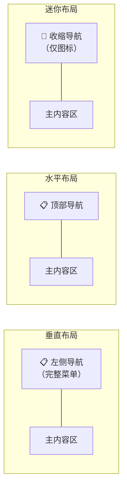
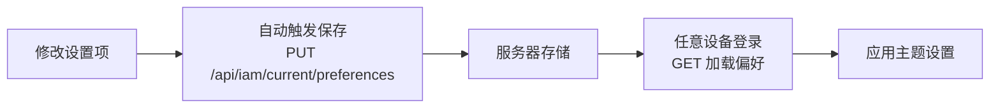

# 主题设置

## 功能简介

主题设置页面允许您全面自定义平台的界面外观，包括**颜色模式**、**对比度**、**导航布局**、**主题色**、**字体**等维度。所有设置修改后会**自动保存到服务器**，在任意设备登录后都能获得一致的界面体验。

## 进入路径

右上角头像 → 个人中心 → **主题设置**

路径：`/iam/account/theme`

## 页面概览

---

## 所有可配置项

### 颜色模式（Mode）

| 选项 | 说明 |
|------|------|
| **亮色（Light）** | 浅色背景，适合光线充足的环境 |
| **暗色（Dark）** | 深色背景，适合低光环境或减少眼睛疲劳 |

> 💡 提示: 也可以通过顶部导航栏右侧的主题切换按钮快速切换亮/暗模式，无需进入设置页面。

### 对比度（Contrast）

| 选项 | 说明 |
|------|------|
| **默认（Default）** | 标准对比度，适合大多数用户 |
| **高对比度（High）** | 增强的对比度，边框和分隔线更加明显，提升可读性 |

高对比度模式适合需要更清晰视觉区分的用户，或在某些显示器上颜色差异不够明显的场景。

### 导航布局（Nav Layout）

| 选项 | 说明 |
|------|------|
| **垂直（Vertical）** | 左侧垂直导航栏，展示完整的菜单标签，是默认布局 |
| **水平（Horizontal）** | 顶部水平导航栏，适合宽屏显示器 |
| **迷你（Mini）** | 收缩的垂直导航栏，仅显示图标，最大化内容区域 |

> 💡 提示: 迷你布局适合在笔记本电脑等较小屏幕上工作，可以最大化利用屏幕空间显示内容。鼠标悬停在图标上时会显示菜单标签。

### 主题色（Primary Color）

平台提供多种预设主题色（ThemeColorPreset），点击对应的色块即可切换：

| 预设色 | 适用场景 |
|--------|----------|
| 默认蓝 | 专业、稳重 |
| 青色 | 清新、技术感 |
| 紫色 | 创意、现代 |
| 绿色 | 自然、可持续 |
| 橙色 | 活力、热情 |
| 红色 | 醒目、警示 |

主题色会影响按钮、链接、选中状态、进度条等所有交互元素的颜色。

### 导航栏颜色（Nav Color）

| 选项 | 说明 |
|------|------|
| **融合（Integrate）** | 导航栏颜色与页面背景融为一体 |
| **突出（Apparent）** | 导航栏使用独立的深色背景，与内容区形成鲜明对比 |

### 紧凑模式（Compact Layout）

| 选项 | 说明 |
|------|------|
| **关闭** | 标准间距，元素之间有充足的留白 |
| **开启** | 减少元素间距和内边距，在同一屏内展示更多内容 |

紧凑模式适合需要同时查看大量信息的高级用户。

### 字体大小（Font Size）

| 属性 | 值 |
|------|-----|
| 范围 | **12px ~ 20px** |
| 默认值 | **16px** |
| 控件 | 滑块 |

调整字体大小会影响整个平台的文字显示大小。

> 💡 提示: 如果觉得默认字体偏小或偏大，可以在此调整到舒适的大小。建议范围为 14px ~ 18px。

### 字体族（Font Family）

| 选项 | 风格 |
|------|------|
| **Inter** | 现代无衬线字体，适合界面文字（默认） |
| **DM Sans** | 几何风格无衬线字体，简洁明快 |
| **Nunito Sans** | 圆润风格无衬线字体，友好温和 |

### 文字方向（Direction）

| 选项 | 说明 |
|------|------|
| **LTR** | 从左到右（Left-to-Right），适用于中文、英文等 |
| **RTL** | 从右到左（Right-to-Left），适用于阿拉伯语、希伯来语等 |

---

## 设置持久化

主题设置采用**自动保存**机制：

| 特性 | 说明 |
|------|------|
| **自动保存** | 修改任何设置后自动保存到服务器，无需手动点击保存按钮 |
| **跨设备同步** | 在不同设备/浏览器登录后会自动加载已保存的主题偏好 |
| **启动时加载** | 用户登录时通过 `GET` 请求加载偏好设置，立即应用主题 |

### 设置数据结构

完整的主题设置状态（SettingsState）：

| 字段 | 类型 | 默认值 | 说明 |
|------|------|--------|------|
| `mode` | string | `'light'` | 颜色模式：`light` / `dark` |
| `contrast` | string | `'default'` | 对比度：`default` / `high` |
| `navLayout` | string | `'vertical'` | 导航布局：`vertical` / `horizontal` / `mini` |
| `primaryColor` | ThemeColorPreset | — | 主题色预设值 |
| `navColor` | string | `'integrate'` | 导航栏颜色：`integrate` / `apparent` |
| `compactLayout` | boolean | `false` | 是否启用紧凑模式 |
| `fontSize` | number | `16` | 字体大小（12~20） |
| `fontFamily` | string | `'Inter'` | 字体族：`Inter` / `DM Sans` / `Nunito Sans` |
| `direction` | string | `'ltr'` | 文字方向：`ltr` / `rtl` |

---

## 相关 API 接口

| 操作 | 方法 | 路径 |
|------|------|------|
| 加载主题偏好 | GET | `/api/iam/current/preferences` |
| 保存主题偏好 | PUT | `/api/iam/current/preferences` |

> ⚠️ 注意: 如果清除浏览器数据后主题恢复为默认，请重新登录，系统会从服务器加载您保存的主题偏好。
