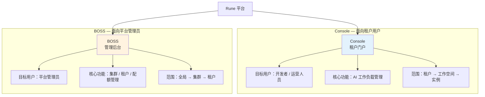
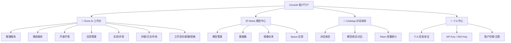

# Console 概览

## 简介

**Console** 是 Rune 平台的租户门户，面向工作区运营人员、AI 工程师和开发者，提供完整的 AI 工作负载管理能力、模型资产管理和 AI 对话体验。Console 是用户日常使用 Rune 平台的主要入口，涵盖了从模型开发、训练、部署到运维的完整 AI 工程生命周期。

### 双控制面板架构

Rune 平台采用 **Console + BOSS 双控制面板**架构，分别面向不同的用户群体：

| 对比维度 | Console（租户门户） | BOSS（管理后台） |
|---------|-------------------|------------------|
| 目标用户 | 租户管理员、开发者、普通成员 | 平台管理员（超级管理员） |
| 访问范围 | 自己所属租户内的资源 | 全平台所有租户和集群的资源 |
| 核心职责 | AI 工作负载操作（推理、微调、部署等） | 集群管理、租户配置、配额分配、网关管理 |
| 资源管理 | 工作空间级配额使用和成员管理 | 集群级资源池和租户级配额分配 |
| 可观测性 | 实例级和工作空间级监控/日志 | 集群级全局监控和日志 |

## 功能架构

---

## 首页

登录后的首页以轮播形式展示三大子产品入口，帮助用户快速导航：

- **Rune** — 进入 AI 工作台，管理推理/微调/开发/应用等 AI 工作负载
- **Moha** — 进入模型中心，管理模型、数据集和镜像等 AI 资产
- **ChatApp** — 进入对话体验，与已部署的 AI 模型进行交互式对话和调试

---

## 子平台功能概览

### Rune AI 工作台

Rune 是 Console 中功能最丰富的核心模块，提供完整的 AI 工作负载管理：

| 功能 | 说明 |
|------|------|
| 推理服务 | 将训练好的模型部署为在线 API 服务，支持 vLLM 等推理引擎 |
| 微调服务 | 对预训练模型进行领域微调训练 |
| 开发环境 | 启动 Jupyter Notebook / VS Code 交互式开发环境 |
| 应用管理 | 部署各类 AI 应用（数据标注、可视化等） |
| 实验管理 | 部署 MLflow / Aim 等实验跟踪服务 |
| 评测管理 | 模型性能基准评测 |
| 存储卷 | 管理持久化存储卷（PVC） |
| 日志 | 工作负载日志查询和实时流 |
| 应用市场 | 浏览和管理 Helm Chart 部署模板 |
| 工作空间 | 资源隔离单元管理和成员管理 |
| 配额/规格 | 资源配额查看和计算规格查看 |

### Moha 模型中心

Moha 是 AI 资产的统一管理平台：

| 功能 | 说明 |
|------|------|
| 模型管理 | 上传、版本化、共享 AI 模型 |
| 数据集管理 | 上传、版本化、共享训练数据集 |
| 镜像仓库 | 管理 Docker 镜像 |
| Space 应用 | 基于模型构建和分享 Demo 应用 |
| 组织管理 | 管理模型和数据集的组织 |

### ChatApp 对话体验

ChatApp 面向 AI 对话场景的调试和体验平台：

| 功能 | 说明 |
|------|------|
| 对话体验 | 与已部署的 AI 模型进行交互式对话 |
| 模型调试 | 调整推理参数（温度、Top-P 等），观察输出变化 |
| 模型对比 | 同时与多个模型对话，对比输出质量 |
| Token 用量 | 统计对话的 Token 消耗量 |

### 个人中心（IAM）

个人账户管理和安全设置：

| 功能 | 说明 |
|------|------|
| 个人信息 | 查看和编辑用户资料 |
| 安全设置 | 修改密码、MFA 配置 |
| API Key | 管理 API 访问密钥 |
| SSH Key | 管理 SSH 公钥 |
| 租户切换 | 在不同租户间切换 |
| 主题设置 | 亮色/暗色主题切换 |

---

## 顶部导航

Console 顶部导航栏包含以下元素：

| 元素 | 位置 | 说明 |
|------|------|------|
| Logo | 左侧 | 平台 Logo，点击返回首页 |
| 子产品链接 | 左侧 | Rune / Moha / ChatApp 快速切换 |
| 搜索 | 右侧 | 全局资源搜索 |
| 语言切换 | 右侧 | 中 / 英文切换 |
| 主题切换 | 右侧 | 亮 / 暗主题切换 |
| 账户菜单 | 右侧 | 个人中心、切换租户、退出登录 |

---

## 典型用户工作流

以下是不同角色用户在 Console 中的典型操作流程：

```mermaid
flowchart TB
    subgraph "租户管理员"
        A1["创建工作空间"] --> A2["分配配额"]
        A2 --> A3["添加成员"]
        A3 --> A4["权限配置"]
    end

    subgraph "AI 工程师"
        B1["选择工作空间"] --> B2["上传模型/数据到 Moha"]
        B2 --> B3["启动开发环境<br/>编写训练代码"]
        B3 --> B4["提交微调任务"]
        B4 --> B5["查看实验结果"]
        B5 --> B6["运行模型评测"]
        B6 --> B7{评测通过?}
        B7 -->|否| B4
        B7 -->|是| B8["部署为推理服务"]
    end

    subgraph "应用开发者"
        C1["浏览推理服务 API"] --> C2["获取 API 端点"]
        C2 --> C3["集成到业务系统"]
        C3 --> C4["通过 ChatApp 调试"]
    end

    subgraph "运营人员"
        D1["查看仪表盘"] --> D2["监控服务状态"]
        D2 --> D3["排查日志"]
        D3 --> D4["管理配额"]
    end
```

---

## 权限体系

Console 门户需要用户至少属于一个租户。不同角色可见的功能不同：

| 角色 | 可见功能 | 管理权限 |
|------|---------|---------|
| 租户管理员 | 全部功能 | 工作空间管理、成员管理、配额管理 |
| 开发者 | 推理/微调/开发/应用/实验/评测/存储/日志/市场 | 实例的创建、编辑、启停、删除 |
| 普通成员 | 列表和详情查看 | 仅查看，无编辑权限 |

> 💡 提示: 角色权限在工作空间级别管理。同一用户在不同工作空间中可以拥有不同角色。例如，在开发工作空间中是 DEVELOPER，在生产工作空间中可能只是 MEMBER。

---

## 子产品文档

- [Rune AI 工作台](./rune/) — AI 工作负载全生命周期管理
- [Moha 模型中心](./moha/) — 模型与数据资产管理
- [ChatApp 对话体验](./chatapp/) — AI 对话调试与体验
- [个人中心](./iam/profile.md) — 账户设置与安全管理
- [首页与仪表盘](./dashboard.md) — 首页和仪表盘功能详解
