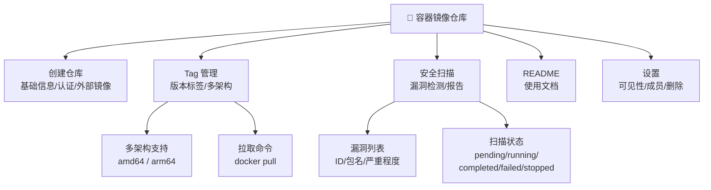
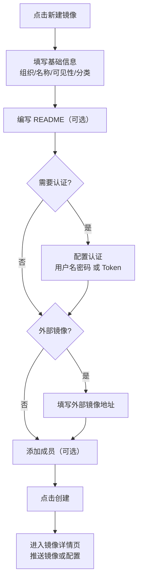
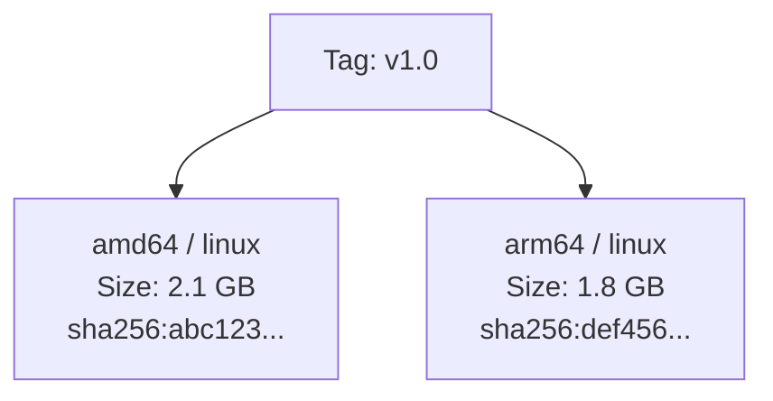
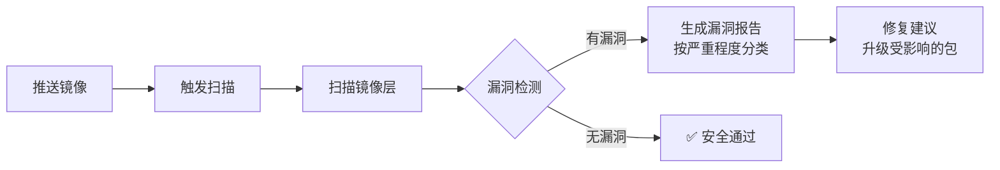

# 镜像仓库

## 功能简介

镜像仓库用于管理容器镜像（Container Image），支持镜像的创建、版本管理（Tag）、多架构支持、安全漏洞扫描和访问控制。您可以将容器镜像推送到 Moha 镜像仓库，方便团队共享和部署 AI 推理服务、训练环境等容器化应用。

### 镜像管理能力总览



## 进入路径

Moha → **镜像**

## 镜像列表


镜像列表页展示当前用户有权限查看的所有镜像仓库：

| 列 | 说明 |
|----|------|
| 名称 | 镜像仓库名称，格式为 `组织名/镜像名` |
| 可见性 | 🔓 公开（Public）/ 🔒 私有（Private）/ 🏢 内部（Internal） |
| 分类 | 镜像用途分类（如推理、训练、开发环境等） |
| 标签数 | 镜像仓库中包含的 Tag 数量 |
| 更新时间 | 最后一次推送镜像的时间 |
| 操作 | 查看详情 / 删除 |

### 列表操作

- **搜索**：按镜像名称关键词搜索
- **分类过滤**：按分类筛选镜像
- **排序**：按更新时间排序

## 创建镜像仓库


点击列表页右上角的 **新建镜像** 按钮，打开创建表单。镜像创建表单比模型/数据集多出一些特有字段。

### 表单字段详解

#### 基础信息

| 字段 | 类型 | 必填 | 说明 |
|------|------|------|------|
| 所属组织 | 下拉选择 | ✅ | 选择镜像所属的组织 |
| 名称 | 文本输入 | ✅ | 镜像仓库名称，规则 `^[a-zA-Z0-9][a-zA-Z0-9._-]*$` |
| 可见性 | 单选按钮组 | ✅ | `Private` / `Internal` / `Public` |
| 描述 | 多行文本域 | — | 镜像的简要描述 |
| 分类 | 选择 | — | 镜像用途分类（如推理、训练、工具链等） |
| 加速 | 选择 | — | 是否启用镜像拉取加速 |

#### 文档与 README

| 字段 | 类型 | 必填 | 说明 |
|------|------|------|------|
| README | 富文本编辑器 | — | 使用富文本编辑器编写镜像使用文档 |

#### 认证配置

| 字段 | 类型 | 必填 | 说明 |
|------|------|------|------|
| 认证开关 | Switch | — | 是否需要认证才能拉取镜像 |
| 认证类型 | 选择 | 启用认证时必填 | `username_password`（用户名密码）/ `token`（令牌） |

当启用认证并选择 `username_password` 时，需提供用户名和密码；选择 `token` 时，需提供访问令牌。

#### 外部镜像配置

| 字段 | 类型 | 必填 | 说明 |
|------|------|------|------|
| 外部镜像开关 | Switch | — | 是否为外部镜像源的代理 |
| 外部地址 | URL 输入 | 启用外部时必填 | 外部镜像仓库的完整地址 |

> 💡 提示: 外部镜像功能允许将其他镜像仓库（如 Docker Hub、NGC 等）的镜像代理到 Moha 平台，方便统一管理和加速拉取。

#### 成员管理

| 字段 | 类型 | 必填 | 说明 |
|------|------|------|------|
| 成员 | 成员管理组件 | — | 添加仓库级别的成员，角色为 `admin` 或 `member` |

> ⚠️ 注意: 当组织类型为 `internal` 时，可见性默认值为 `Internal`。

### 创建流程



## 镜像详情

创建或进入镜像后，将展示镜像的详情页面：


### 镜像基本信息

详情页顶部展示镜像的基本元数据：

| 字段 | 说明 |
|------|------|
| `repo` | 镜像仓库完整路径 |
| `visibility` | 当前可见性 |
| `mediaType` | 镜像的媒体类型 |
| `readme` | README 文档内容 |

### Tag 列表


Tag 列表展示镜像仓库中的所有版本标签：

| 列 | 说明 |
|----|------|
| Tag 名称 | 镜像版本标签名，如 `latest`、`v1.0`、`cuda12.1-py3.10` |
| 多架构 | 该 Tag 支持的架构列表 |
| 推送时间 | Tag 最后一次推送的时间 |

#### 多架构支持

每个 Tag 可以包含多个架构变体（Multi-Architecture），详细信息如下：

| 字段 | 说明 |
|------|------|
| `arch` | CPU 架构，如 `amd64`、`arm64` |
| `os` | 操作系统，如 `linux` |
| `size` | 该架构下镜像的大小 |
| `digest` | 镜像层的摘要哈希值 |



> 💡 提示: 多架构镜像允许用户在不同平台（如 x86 服务器和 ARM 设备）上使用同一个 Tag 名称拉取适配的镜像。

### 拉取命令

镜像详情页会自动生成拉取命令示例：

```bash
# 拉取最新版本
docker pull moha-registry.your-domain/org-name/image-name:latest

# 拉取指定版本
docker pull moha-registry.your-domain/org-name/image-name:v1.0

# 拉取特定架构（多架构镜像）
docker pull --platform linux/arm64 moha-registry.your-domain/org-name/image-name:v1.0
```

### 推送镜像

```bash
# 登录到 Moha 镜像仓库
docker login moha-registry.your-domain

# 为本地镜像打标签
docker tag my-image:latest moha-registry.your-domain/org-name/image-name:v1.0

# 推送镜像
docker push moha-registry.your-domain/org-name/image-name:v1.0
```

> ⚠️ 注意: 推送镜像前需要先登录到镜像仓库。如果镜像启用了认证，需要使用对应的凭据。

## 安全扫描


Moha 提供内置的容器镜像安全扫描功能，自动检测镜像中的已知漏洞：

### 扫描状态

| 状态 | 说明 |
|------|------|
| `pending` | 扫描任务等待执行 |
| `running` | 正在扫描中 |
| `completed` | 扫描完成，可查看结果 |
| `failed` | 扫描失败 |
| `stopped` | 扫描已停止 |

### 漏洞报告

扫描完成后，会生成详细的漏洞报告：

| 字段 | 说明 |
|------|------|
| `vulnerabilityID` | 漏洞 ID（如 CVE-2024-xxxx） |
| `pkgName` | 受影响的软件包名称 |
| `severity` | 严重程度：`CRITICAL` / `HIGH` / `MEDIUM` / `LOW` / `UNKNOWN` |
| 已安装版本 | 当前镜像中安装的版本 |
| 修复版本 | 已修复该漏洞的版本 |



> ⚠️ 注意: 安全扫描会检测操作系统包和应用依赖中的已知漏洞。建议定期扫描并及时修复 CRITICAL 和 HIGH 级别的漏洞。

> 💡 提示: 可以在推送新的 Tag 后手动触发安全扫描，确保新版本镜像的安全性。

## README 编辑

镜像仓库支持通过富文本编辑器编写和编辑 README 文档，用于说明镜像的使用方法、环境依赖和配置参数等信息。


建议 README 包含以下内容：

- 镜像功能概述
- 预装软件和环境信息
- 使用示例（docker run 命令）
- 环境变量说明
- 端口映射说明
- 注意事项和已知限制

## 镜像设置


在镜像详情页的 **设置** 标签中，管理员可以进行以下操作：

| 设置项 | 说明 |
|--------|------|
| 可见性变更 | 切换 Public / Internal / Private |
| 封面图片 | 上传或修改镜像的封面展示图片 |
| README 编辑 | 更新镜像使用文档 |
| 认证配置 | 修改认证方式和凭据 |
| 成员管理 | 添加或移除仓库成员，设置角色 |
| 删除镜像 | 永久删除镜像仓库（不可恢复） |

> ⚠️ 注意: 删除镜像仓库将同时删除所有 Tag 和镜像层数据，且不可恢复。请确保没有正在使用该镜像的服务。

## 权限要求

| 操作 | 要求 |
|------|------|
| 浏览公开镜像 | 所有用户 |
| 浏览内部镜像 | 同组织成员 |
| 浏览私有镜像 | 仓库成员 |
| 创建镜像仓库 | 登录用户，拥有组织成员以上权限 |
| 推送镜像 | 仓库成员以上权限 |
| 触发安全扫描 | 仓库管理员 |
| 修改镜像设置 | 仓库管理员或组织管理员 |
| 删除镜像仓库 | 仓库管理员或组织管理员 |
