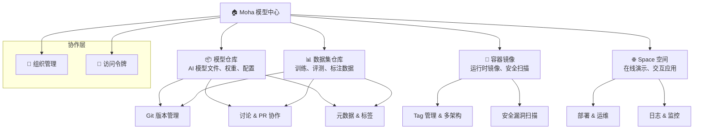
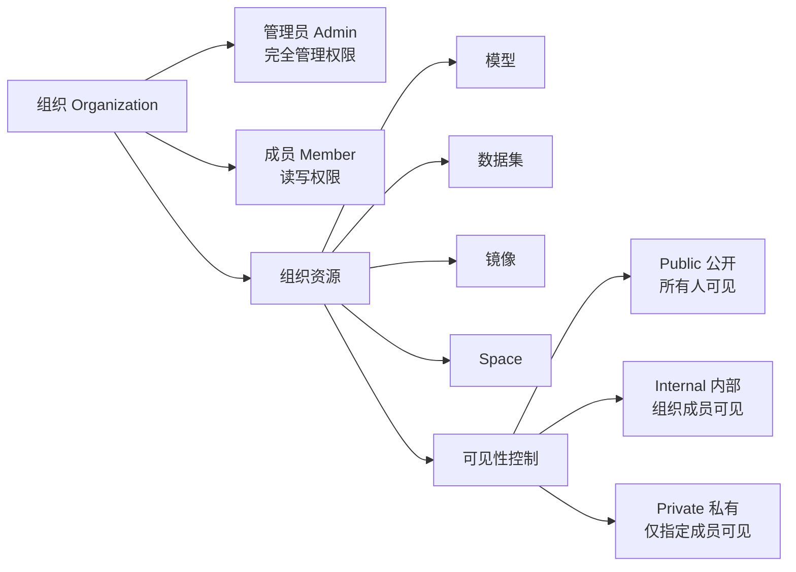

# Moha 模型中心

## 简介

Moha 是 Rune Console 内置的 **AI 模型中心**子产品，灵感来自 HuggingFace，为团队和个人提供一站式的 AI 资产管理体验。Moha 将模型、数据集、容器镜像和交互式 Space 统一在一个平台中，并以 **组织** 为协作单元，通过 Git 式的版本管理和 Pull Request 协作流程，实现 AI 资产的全生命周期管理。

### 核心设计理念

Moha 中所有资源（模型、数据集、镜像、Space）均基于统一的 **DataManager** 数据结构：

| 统一字段 | 说明 |
|----------|------|
| `name` | 资源名称（仓库级别唯一） |
| `organization` | 所属组织 |
| `description` | 资源描述 |
| `visibility` | 可见性：`private`（私有）/ `public`（公开）/ `internal`（组织内部） |
| `type` | 资源类型：`model` / `dataset` / `workspace` |
| `creator` | 创建者 |
| `annotations` | 注解信息 |
| `metadata` | 元数据：许可证、任务类型、标签、语言、框架 |
| `genealogy` | 血缘关系：上游父模型 / 下游子模型（仅模型） |

> 💡 提示: 四种资源类型对应的 DataManagerType 为 `'models'` | `'datasets'` | `'images'` | `'spaces'`，在 API 和界面中统一使用。

## 进入路径

Console 首页 → 点击 **Moha** 卡片，或顶部导航栏 → **Moha**

## Moha 首页

进入 Moha 后，首页为您提供一个全局视图，包含以下内容：

### 个人统计面板

- **模型数量**：您创建和参与的模型仓库总数
- **数据集数量**：您创建和参与的数据集仓库总数
- **收藏数量**：您收藏（Star）的所有资源数
- **下载量**：您的资源被下载的总次数

### 最近动态

按时间倒序展示您最近操作过的仓库，包含最后一次 Commit 信息和更新时间。

### 推荐与热门

平台根据下载量、收藏量和评分推荐的热门模型和数据集。

## 四大资源类型

### 资源类型对比

| 特性 | 模型 | 数据集 | 镜像 | Space |
|------|------|--------|------|-------|
| Git 版本管理 | ✅ | ✅ | — | ✅ |
| LFS 大文件支持 | ✅ | ✅ | — | ✅ |
| Pull Request | ✅ | ✅ | — | — |
| 讨论系统 | ✅ | ✅ | — | — |
| 安全扫描 | — | — | ✅ | — |
| 在线部署 | — | — | — | ✅ |
| 收藏 & 评分 | ✅ | ✅ | — | ✅ |
| 血缘追溯 | ✅ | — | — | — |
| 加密文件支持 | ✅ | ✅ | — | — |

## 功能模块导航

| 模块 | 说明 | 详情 |
|------|------|------|
| [模型管理](./model.md) | 创建、上传、版本管理 AI 模型，支持模型血缘追溯 | 完整的 Git 工作流 |
| [数据集管理](./dataset.md) | 管理训练、评测数据集，支持多种数据格式 | Git 版本控制 |
| [镜像仓库](./image.md) | 管理容器镜像，多架构支持，安全扫描 | OCI 标准兼容 |
| [Space 管理](./space.md) | 在线部署交互式演示应用 | 一键部署运维 |
| [组织管理](./organization.md) | 团队协作，成员权限管理 | 管理员/成员角色 |
| [个人访问令牌](./token.md) | 管理 Git/API 访问令牌 | 身份验证凭据 |

## 组织化访问控制

Moha 以组织为基本协作单元，所有资源归属于特定组织或个人：

- **公开（Public）**：所有平台用户均可查看和克隆
- **内部（Internal）**：仅同组织成员可访问，组织资源的默认可见性
- **私有（Private）**：仅仓库所有者和被授权成员可访问

> ⚠️ 注意: 组织类型为 `internal` 时，新创建的资源默认可见性为 `internal`。请根据数据敏感度合理设置可见性。

## Git 式版本管理

模型和数据集仓库均采用 Git 进行版本管理，支持以下核心操作：

| 操作 | API 路径 | 说明 |
|------|----------|------|
| 文件列表 | `GET /api/moha/organizations/{org}/{type}/{repo}/contents/{ref}/{path}` | 浏览仓库文件内容 |
| 原始内容 | `GET .../raw/{ref}/{file}` | 获取文件原始内容 |
| 分支/标签 | `GET .../refs` | 列出所有分支和标签 |
| 提交历史 | `GET .../commits/{ref}/{file}` | 查看提交记录 |
| 提交详情 | `GET .../commit/{ref}` | 查看提交差异（diff） |
| README | `GET .../readme` | 获取 README 渲染内容 |

> 💡 提示: Moha 支持 Git LFS（Large File Storage），适合管理大型模型权重文件。LFS 文件在文件列表中会显示 `oid` 和 `size` 信息。

## 社区功能

Moha 内置完善的社区协作功能：

- **收藏（Star）**：一键收藏感兴趣的资源，方便后续查找
- **评分（Rating）**：对模型和数据集进行评分，帮助社区筛选优质资源
- **下载统计**：自动统计每个资源的下载次数
- **讨论系统**：在仓库中发起和参与讨论
- **Pull Request**：通过 PR 进行代码审查和协作

## 快速开始

1. **加入或创建组织** → 前往 [组织管理](./organization.md)
2. **获取访问令牌** → 前往 [个人令牌](./token.md)
3. **创建第一个模型仓库** → 前往 [模型管理](./model.md)
4. **上传数据集** → 前往 [数据集管理](./dataset.md)
5. **推送容器镜像** → 前往 [镜像仓库](./image.md)
6. **部署交互演示** → 前往 [Space 管理](./space.md)
