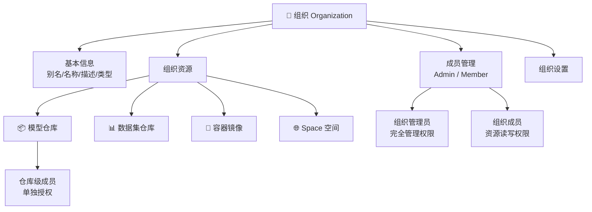
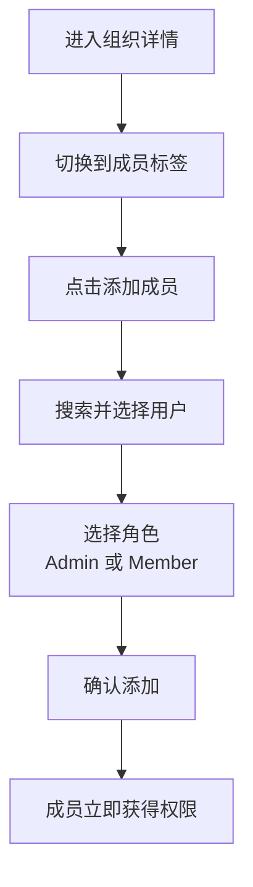
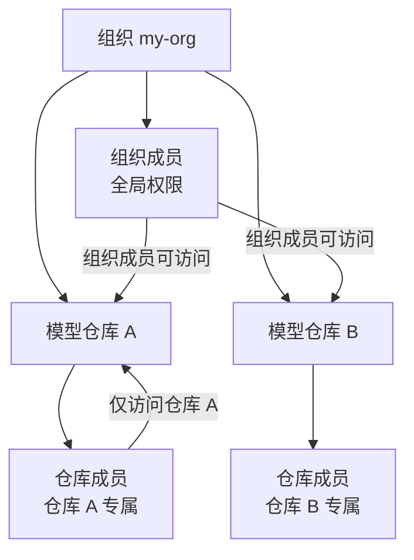

# 组织管理

## 功能简介

组织（Organization）是 Moha 中的 **协作单元**，允许多个用户共同管理模型、数据集、镜像和 Space 等 AI 资源。每个资源都归属于一个组织或个人空间，组织提供统一的成员管理、权限控制和资源可见性设置，是团队协作的基础。

### 组织结构概览

## 进入路径

Moha → 通过以下方式进入组织管理：

- 个人头像菜单 → **我的组织**
- 仓库详情页 → 点击组织名称
- Moha 首页 → 组织列表

## 组织数据结构

组织包含以下核心字段：

| 字段 | 类型 | 说明 |
|------|------|------|
| `alias` | 字符串 | 组织别名，用于 URL 路径标识 |
| `name` | 字符串 | 组织显示名称 |
| `creator` | 字符串 | 组织创建者 |
| `description` | 字符串 | 组织描述信息 |
| `profile` | 字符串 | 组织简介/头像 |
| `type` | 字符串 | 组织类型 |
| `members` | 数组 | 成员列表（含角色和加入时间） |

## 组织列表

组织列表页展示当前用户所属的所有组织。

> 💡 提示: 您可以同时属于多个组织，并在不同组织中拥有不同的角色。

## 创建组织

### 创建步骤

1. 点击 **创建组织** 按钮
2. 填写组织信息：

| 字段 | 类型 | 必填 | 说明 |
|------|------|------|------|
| 组织别名 | 文本输入 | ✅ | 唯一标识，用于 URL 路径（如 `moha.domain/my-org/...`） |
| 组织名称 | 文本输入 | ✅ | 显示名称 |
| 描述 | 多行文本域 | — | 组织的简要描述 |
| 类型 | 选择 | — | 组织类型设置 |

3. 点击 **创建** 完成

创建者自动成为组织的 **Admin（管理员）**。

> ⚠️ 注意: 组织别名创建后不可修改，请仔细确认。它将作为该组织下所有资源的 URL 前缀。

## 组织详情

进入组织后，展示组织的详情页面：

### 组织资源一览

组织详情页按资源类型展示该组织下的所有仓库：

| 标签 | 说明 |
|------|------|
| 模型 | 组织下的所有模型仓库 |
| 数据集 | 组织下的所有数据集仓库 |
| 镜像 | 组织下的所有镜像仓库 |
| Space | 组织下的所有 Space |
| 成员 | 组织成员列表和管理 |
| 设置 | 组织设置（仅管理员可见） |

## 成员管理

### 成员角色

Moha 支持两种组织角色：

| 角色 | 权限 | 说明 |
|------|------|------|
| **Admin**（管理员） | 完全管理权限 | 管理成员、修改设置、创建/删除资源、管理所有仓库 |
| **Member**（成员） | 资源读写权限 | 创建资源、访问组织内部资源、参与协作 |

### 成员操作

| 操作 | 说明 | 权限要求 |
|------|------|----------|
| 添加成员 | 邀请用户加入组织 | Admin |
| 移除成员 | 将成员从组织中移除 | Admin |
| 变更角色 | 将成员角色在 Admin 和 Member 之间切换 | Admin |
| 查看成员 | 浏览组织成员列表 | 所有组织成员 |

### 成员列表详情

成员列表中每条记录包含：

| 字段 | 说明 |
|------|------|
| `name` | 成员用户名 |
| `role` | 当前角色（admin / member） |
| `created` | 加入组织的时间 |

### 添加成员流程

> 💡 提示: 建议组织至少保留两名管理员，以防止管理权限意外丢失。

## 仓库级成员

除了组织级别的成员管理外，Moha 还支持 **仓库级别的成员管理**。这允许您对单个仓库进行更精细的权限控制：

- 组织成员默认可以访问组织下所有 Internal 和 Public 资源
- 仓库级成员可以独立于组织成员，仅对特定仓库授权
- 私有仓库可以通过仓库级成员单独授权访问

> 💡 提示: 当您需要将某个私有仓库对外部协作者开放时，可以使用仓库级成员功能，无需将其加入整个组织。

## 资源可见性与组织

组织类型会影响其下资源的默认可见性：

| 组织类型 | 默认资源可见性 | 说明 |
|----------|----------------|------|
| 普通组织 | Private | 新建资源默认私有 |
| Internal 组织 | Internal | 新建资源默认组织内部可见 |

可见性控制的详细规则：

| 可见性 | 访问权限 | 适用场景 |
|--------|----------|----------|
| **Public** | 平台所有用户可见 | 公开的开源模型和数据集 |
| **Internal** | 同组织成员可见 | 组织内部共享的资源 |
| **Private** | 仅仓库所有者和授权成员可见 | 敏感数据和私有模型 |

> ⚠️ 注意: 将资源从 Private 改为 Public 后，所有平台用户都将能够查看和克隆该资源。请确认资源中不包含敏感信息。

## 组织设置

组织管理员可以在设置页面中管理以下内容：

| 设置项 | 说明 |
|--------|------|
| 组织名称 | 修改组织的显示名称 |
| 组织描述 | 更新组织的描述信息 |
| 组织头像 | 上传或修改组织的头像/Logo |
| 组织类型 | 查看或修改组织类型 |

> ⚠️ 注意: 组织别名（alias）创建后不可修改。如需变更组织标识，需要创建新组织并迁移资源。

## 权限汇总

| 操作 | Admin | Member | 非成员 |
|------|-------|--------|--------|
| 查看组织信息 | ✅ | ✅ | ✅（公开组织） |
| 查看成员列表 | ✅ | ✅ | — |
| 添加成员 | ✅ | — | — |
| 移除成员 | ✅ | — | — |
| 变更成员角色 | ✅ | — | — |
| 修改组织设置 | ✅ | — | — |
| 创建资源 | ✅ | ✅ | — |
| 管理所有仓库 | ✅ | — | — |
| 访问 Internal 资源 | ✅ | ✅ | — |
| 访问 Public 资源 | ✅ | ✅ | ✅ |
