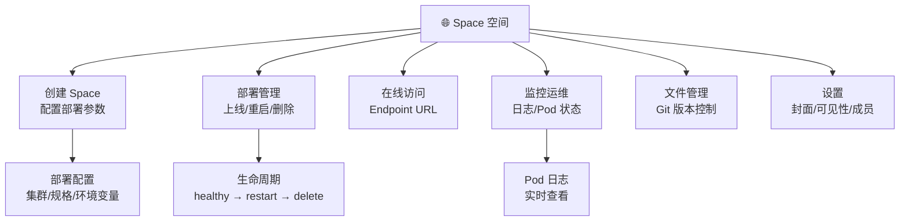
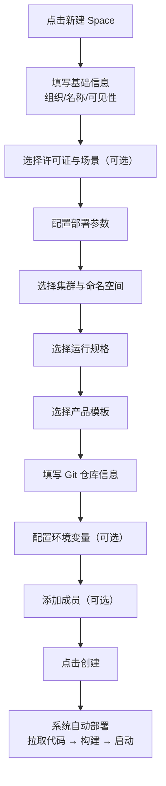
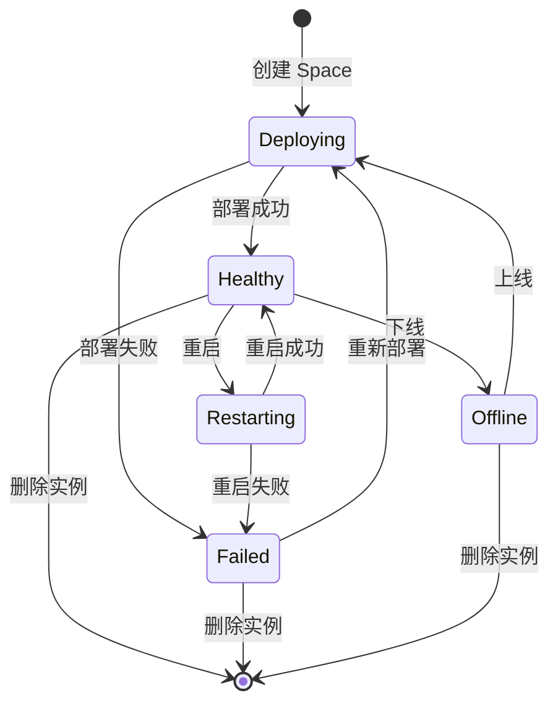

# Space 管理

## 功能简介

Space 是 Moha 中的 **在线交互式展示空间**，类似于 HuggingFace Spaces，用于部署和展示 AI 模型的交互式演示应用。通过 Space，您可以将模型推理服务、Gradio 应用、Streamlit 应用等一键部署到平台，并通过浏览器直接访问和体验。

### Space 核心能力

## 进入路径

Moha → **Space**

## Space 列表

Space 列表页展示当前用户有权限查看的所有 Space：

| 列 | 说明 |
|----|------|
| 名称 | Space 名称，格式为 `组织名/Space名` |
| 状态 | 运行状态（健康、部署中、错误等） |
| 可见性 | 🔓 公开 / 🔒 私有 / 🏢 内部 |
| 场景 | Space 应用场景 |
| 更新时间 | 最后更新时间 |
| 收藏量 | 用户收藏数 |

### 列表操作

- **搜索**：按 Space 名称搜索
- **排序**：按更新时间、收藏量排序
- **视图切换**：列表视图 / 卡片视图

## 创建 Space

点击列表页右上角的 **新建 Space** 按钮，打开创建表单。Space 的创建表单包含基础信息和部署配置两部分。

### 基础信息

| 字段 | 类型 | 必填 | 验证规则 | 说明 |
|------|------|------|----------|------|
| 所属组织 | 下拉选择 | ✅ | — | 选择 Space 所属的组织 |
| 名称 | 文本输入 | ✅ | 正则 `^[a-zA-Z0-9][a-zA-Z0-9._-]*$` | Space 名称 |
| 可见性 | 单选按钮组 | ✅ | — | `Private` / `Internal` / `Public` |
| 描述 | 多行文本域（4行） | — | — | Space 的简要描述 |
| 许可证 | 自动补全 | — | 从 `LICENSE_OPTIONS` 选择 | 开源许可证类型 |
| 域名 | 文本输入 | — | — | 自定义访问域名 |
| 场景 | 选择 | — | — | Space 应用场景类型 |

### 部署配置（spaceMetadata）

部署配置定义了 Space 的运行环境和资源规格：

| 字段 | 类型 | 必填 | 说明 |
|------|------|------|------|
| 集群 | 下拉选择 | ✅ | 部署到的 Kubernetes 集群 |
| 命名空间 | 下拉选择 | ✅ | 集群中的命名空间 |
| 规格（flavorID） | 下拉选择 | ✅ | 运行规格（CPU/内存/GPU 配置） |
| 产品模板 | 下拉选择 | ✅ | 应用产品模板（如 Gradio、Streamlit 等） |
| Git 仓库地址 | URL 输入 | ✅ | Space 源代码的 Git 仓库地址 |
| Git 用户名 | 文本输入 | — | Git 仓库访问用户名 |
| Git 密码 | 密码输入 | — | Git 仓库访问密码 |
| 基础域名 | 文本输入 | — | Space 的基础访问域名 |
| 环境变量 | 键值对数组 | — | 运行时环境变量配置 |

#### 环境变量配置

环境变量为键值对（`key` / `value`）数组，用于传递运行时参数：

| 键 | 值示例 | 说明 |
|----|--------|------|
| `MODEL_ID` | `org/my-model` | 要加载的模型 ID |
| `MAX_BATCH_SIZE` | `32` | 最大批处理大小 |
| `CUDA_VISIBLE_DEVICES` | `0` | 可见的 GPU 设备 |

> 💡 提示: 环境变量中可以传递模型路径、API 密钥等运行时参数。敏感信息建议使用密码类型字段。

> ⚠️ 注意: 集群、命名空间和规格选项取决于平台管理员的配置。如果没有可用选项，请联系平台管理员。

### 成员管理

| 字段 | 类型 | 必填 | 说明 |
|------|------|------|------|
| 成员 | 成员管理组件 | — | 添加仓库级别的成员，角色为 `admin` 或 `member` |

### 创建流程

## Space 生命周期

Space 创建后会进入自动部署流程，经历以下生命周期阶段：

### Space 状态字段

| 字段 | 说明 |
|------|------|
| `healthy` | Space 是否健康运行 |
| `phase` | 当前运行阶段（Deploying / Running / Failed 等） |
| `message` | 状态详情消息（错误原因等） |
| `instanceID` | 运行实例 ID |
| `endpoints` | 访问端点 URL 列表 |

### 运维操作

| 操作 | 说明 |
|------|------|
| 上线（Online） | 将已下线的 Space 重新部署上线 |
| 重启（Restart） | 重启 Space 实例，应用最新配置 |
| 删除实例 | 销毁运行实例，释放计算资源 |
| 查看状态 | 查看 Space 实时运行状态 |

## Space 详情

创建或进入 Space 后，展示 Space 的详情页面：

### 在线预览

Space 部署成功后，可以直接在浏览器中通过 Endpoint URL 访问交互式演示应用：

- 通过 `endpoints` 字段提供的 URL 访问
- 支持嵌入式 iframe 预览
- 公开 Space 可被任何用户访问

> 💡 提示: 将 Space 设为 Public，即可生成可分享的演示链接，方便与团队成员或外部用户分享模型效果。

### Pod 状态与日志

| 功能 | 说明 |
|------|------|
| Pod 列表 | 查看 Space 运行实例的所有 Pod |
| Pod 状态 | 查看每个 Pod 的运行状态（Running / Pending / Error） |
| Pod 日志 | 实时查看 Pod 的控制台输出日志 |

> 💡 提示: 当 Space 部署失败或运行异常时，通过 Pod 日志可以快速定位问题原因。

### 文件管理

Space 仓库中的文件通过 Git 进行版本管理：

- 浏览 Space 的源代码和配置文件
- 查看 Commit 历史
- 支持分支和标签管理

### 封面图片

Space 支持上传封面图片，在列表和详情页中展示。封面图片有助于在列表中直观展示 Space 的功能和效果。

## Space 设置

在 Space 详情页的 **设置** 标签中，管理员可以进行以下操作：

| 设置项 | 说明 |
|--------|------|
| 可见性变更 | 切换 Public / Internal / Private |
| 封面图片 | 上传或修改 Space 封面 |
| README 编辑 | 编辑 Space 说明文档 |
| 部署配置 | 修改运行规格、环境变量等部署参数 |
| 成员管理 | 添加或移除仓库成员，设置角色 |
| 删除 Space | 永久删除 Space 及其所有数据 |

> ⚠️ 注意: 修改部署配置后需要重启 Space 才能生效。删除 Space 会同时销毁运行实例并删除所有文件，此操作不可恢复。

## 典型使用场景

| 场景 | 说明 | 示例 |
|------|------|------|
| 模型演示 | 部署 Gradio/Streamlit 应用展示模型推理效果 | 文本生成、图像分类演示 |
| API 服务 | 将模型封装为 REST API 服务 | 推理 API 端点 |
| 数据可视化 | 部署数据分析和可视化应用 | 训练曲线、数据分布展示 |
| 开发环境 | 部署 Jupyter Notebook 等开发工具 | 在线编码和调试 |

## 权限要求

| 操作 | 要求 |
|------|------|
| 浏览公开 Space | 所有用户 |
| 浏览内部 Space | 同组织成员 |
| 浏览私有 Space | 仓库成员 |
| 创建 Space | 登录用户，拥有组织成员以上权限 |
| 部署 / 重启 / 下线 | 仓库管理员 |
| 查看日志 | 仓库成员 |
| 修改 Space 设置 | 仓库管理员或组织管理员 |
| 删除 Space | 仓库管理员或组织管理员 |
