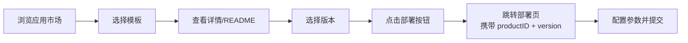

# 应用市场

## 功能概述

应用市场（App Market）是 Rune 平台的模板中心，提供丰富的预制产品模板，覆盖推理部署、微调训练、开发环境、实验管理和通用应用等多种场景。用户可以浏览、搜索、筛选模板，查看详细文档和版本信息，并一键跳转到部署页面。

### 核心能力

- **多维度筛选**：支持按类别、标签和关键字多维度定位模板
- **响应式卡片展示**：模板以直观的卡片网格布局展示，自适应屏幕宽度
- **详细文档**：每个模板提供完整的 README.md 文档、版本列表和更新日志
- **一键部署**：从模板详情页直接跳转到部署页面，自动携带产品 ID 和版本信息

## 进入路径

Rune 工作台 → 左侧导航 → **应用市场**

---

## 浏览模板

应用市场采用 **ProductListView** 组件展示，提供直观的模板浏览体验。

### 模板卡片

每个模板以卡片形式展示，包含以下信息：

| 信息项 | 说明 |
|--------|------|
| 图标 | 模板的图标/Logo |
| 名称 | 模板产品名称 |
| 简介 | 模板的简短描述（1-2 行） |
| 类别 | 所属分类标签（如推理、微调等） |
| 标签 | 技术标签（如 PyTorch、vLLM 等） |
| 版本 | 最新版本号 |

### 类别筛选

点击页面顶部的类别标签，按产品类别过滤模板：

| 类别 | 标识 | 说明 | 典型模板 |
|------|------|------|---------|
| 推理 | `inference` | 模型推理部署模板 | vLLM、TGI、Triton |
| 微调 | `tune` | 模型微调训练模板 | LLaMA-Factory、Swift |
| 开发环境 | `im` | 交互式开发环境模板 | JupyterLab、VSCode Server |
| 实验 | `experiment` | 实验管理和评估模板 | MLflow、WandB |
| 应用 | `app` | 通用应用模板 | ChatBot、API 服务 |

> 💡 提示: 类别筛选和标签筛选可以组合使用。例如，选择"推理"类别 + "vLLM"标签，快速定位 vLLM 推理相关模板。

### 标签筛选

通过技术标签进一步精细化筛选：

| 标签类别 | 可选值 | 说明 |
|---------|--------|------|
| 语言（language） | Python、Java、Go、Node.js | 模板使用的编程语言 |
| 框架（framework） | PyTorch、TensorFlow、vLLM、Transformers | 依赖的 AI 框架 |
| 操作系统（os） | Ubuntu、CentOS、Debian | 基础镜像的操作系统 |
| 工具（tool） | JupyterLab、VSCode、Terminal | 包含的开发工具 |

### 关键字搜索

在搜索框中输入关键字，实时搜索模板名称和描述：

- 搜索支持模糊匹配
- 内置 **500ms 防抖**（debounce），减少不必要的请求
- 搜索范围覆盖模板名称和描述文本

> 💡 提示: 搜索关键字可以是模型名称（如 "llama"）、工具名称（如 "jupyter"）、用途描述（如 "推理"）等。

### 分页与响应式布局

- 模板卡片采用响应式网格布局，根据浏览器窗口宽度自动调整每行卡片数量
- 支持分页浏览，底部提供分页控件

---

## 模板详情

点击任意模板卡片进入详情页面。详情页采用 **ProductDetailLayout** 布局组件。

### 页面结构

详情页包含以下几个区域：

#### 产品信息卡片

位于页面顶部或侧边，展示：

| 信息项 | 说明 |
|--------|------|
| 图标和名称 | 模板的 Logo 和完整名称 |
| 描述 | 模板的详细描述 |
| 类别 | 所属产品类别 |
| 标签列表 | 所有技术标签 |
| 最新版本 | 当前最新版本号 |
| 维护者 | 模板的维护团队或作者 |

#### README.md 渲染

详情页的主要内容区域渲染模板的 README.md 文档，通常包含：

- 模板功能介绍
- 使用前提和依赖要求
- 配置参数说明
- 使用示例
- 常见问题解答
- 参考链接

> 💡 提示: README 渲染支持完整的 Markdown 语法，包括标题、列表、表格、代码块、图片和链接。

#### 版本列表与切换

通过 **VersionPopover** 组件可以查看和切换模板版本：

- 点击当前版本号旁的下拉箭头，展开版本列表
- 版本列表按发布时间倒序排列
- 选择不同版本后，README 和部署配置会切换到对应版本

#### 更新日志（Changelog）

展示各版本的更新说明，帮助用户了解版本间的差异和改进内容。

---

## 一键部署

### 部署流程

### 操作步骤

1. 在模板详情页点击 **部署** 按钮
2. 系统根据模板的类别自动跳转到对应的资源创建页面：
   - `inference` 类别 → 推理服务创建页
   - `tune` 类别 → 微调服务创建页
   - `im` 类别 → 开发环境创建页
   - `experiment` 类别 → 实验创建页
   - `app` 类别 → 应用创建页
3. 产品 ID 和版本号自动填入，模板配置自动加载
4. 用户只需补充基本信息（名称、描述）和选择计算规格
5. 确认配置后提交部署

> 💡 提示: 一键部署会自动携带选定的产品 ID 和版本信息到部署页面。SchemaForm 将根据该版本的 `values.schema.json` 渲染配置表单，无需手动选择模板。

---

## 版本管理

每个模板可能包含多个版本，版本管理帮助用户选择适合的模板版本。

### 版本选择建议

| 场景 | 建议 |
|------|------|
| 生产部署 | 选择最新的稳定版本（非 beta/rc） |
| 测试评估 | 可以尝试最新的预发布版本 |
| 兼容性要求 | 选择与现有环境匹配的特定版本 |
| 已有实例升级 | 参考 Changelog 确认版本间兼容性 |

> ⚠️ 注意: 不同版本的模板可能包含不同的 Schema 参数定义。升级版本时，请注意检查配置参数的变化，避免不兼容问题。

---

## 如何找到合适的模板

根据你的使用场景，采用以下策略快速定位模板：

### 按使用场景

| 我想要... | 推荐类别 | 推荐关键字 |
|-----------|---------|-----------|
| 部署大语言模型提供 API | 推理（inference） | vLLM、TGI、OpenAI |
| 微调模型适应业务场景 | 微调（tune） | LLaMA-Factory、SFT、LoRA |
| 启动 Jupyter 进行数据分析 | 开发环境（im） | JupyterLab、Notebook |
| 使用 VSCode 远程开发 | 开发环境（im） | VSCode、SSH、IDE |
| 部署聊天界面应用 | 应用（app） | ChatBot、WebUI |

### 筛选技巧

1. **先选类别**：根据需求选择大类（推理/微调/开发环境等）
2. **再选标签**：用技术标签缩小范围（如框架、工具）
3. **最后搜索**：用模型名或工具名精确搜索
4. **查看 README**：进入详情页仔细阅读文档，确认模板能满足需求
5. **关注版本**：选择合适的版本进行部署

---

## 权限要求

| 操作 | 所需角色 |
|------|---------|
| 浏览应用市场 | ADMIN / DEVELOPER |
| 查看模板详情 | ADMIN / DEVELOPER |
| 一键部署 | ADMIN / DEVELOPER |
