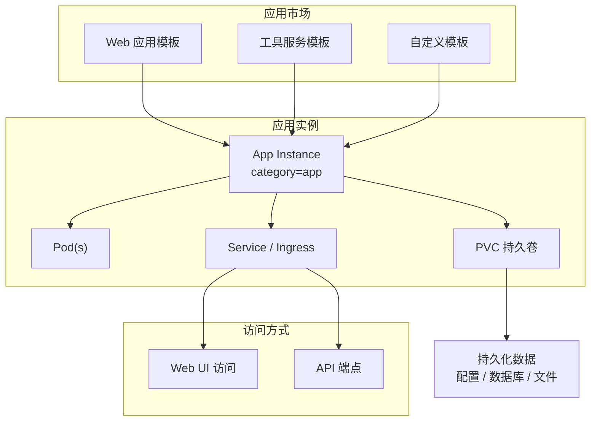
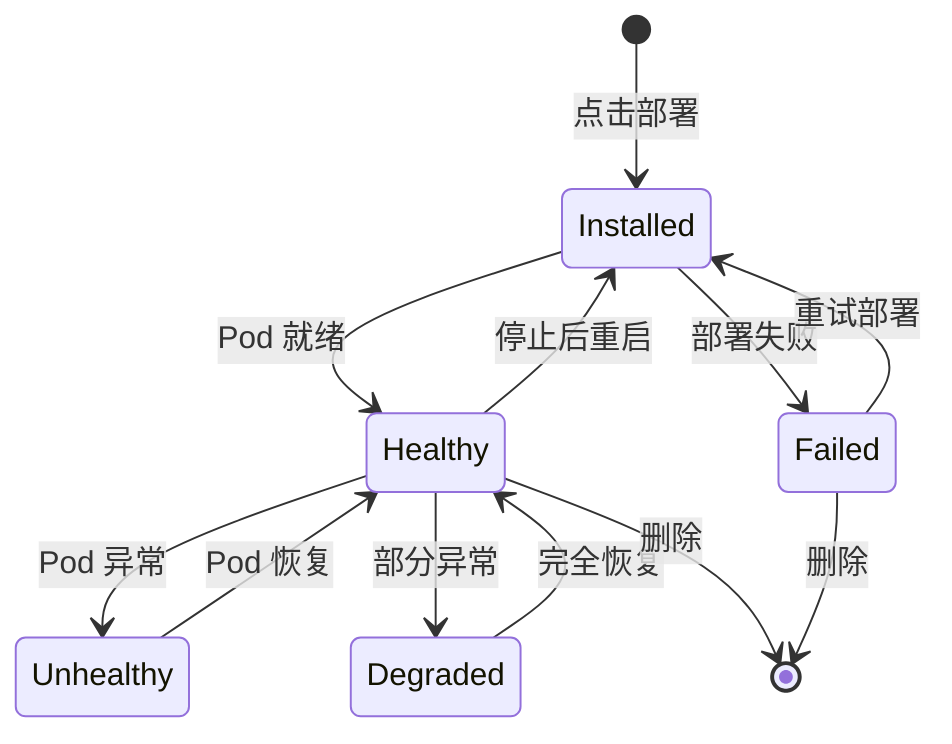

# 应用管理

## 功能概述

应用管理（App）是 Rune 平台中用于部署和管理各类 AI 应用实例的功能模块。不同于推理服务（专注于模型推理 API）和微调服务（专注于模型训练），应用管理提供了更通用的应用部署能力，支持通过模板市场一键部署各类 Web 应用、工具服务和自定义工作负载。

应用管理服务属于 Instance 架构中 `category=app` 类别，与推理、微调、实验、评测服务共享相同的底层实例模型和部署机制。应用详情页在标准实例信息基础上，额外提供了 **PVC（持久卷声明）列表**，便于管理应用的持久化存储。

### 核心能力

- **模板驱动部署**：从应用市场选择模板，一键部署各类 AI 应用
- **持久化存储**：通过 PVC（PersistentVolumeClaim）管理应用数据持久化
- **Web 访问**：部署完成后通过 URL 访问应用 Web 界面
- **完整生命周期**：支持创建、启动、停止、编辑、删除等操作
- **多维度监控**：集成 Prometheus 监控面板、日志查看器和 K8s 事件流

### 应用部署架构

## 进入路径

Rune 工作台 → 左侧导航 → **应用**

---

## 应用列表

列表页展示当前工作空间下所有应用实例，提供快速概览和操作入口。

### 列表列说明

| 列 | 说明 | 示例 |
|----|------|------|
| 名称 | 实例名称（K8s 资源名），点击进入详情 | `label-studio` |
| 状态 | 当前运行状态徽标 | 🟢 Healthy |
| 规格（Flavor） | 计算资源规格可读描述 | `4C8G` |
| 模板 | 使用的应用模板及版本 | `Label Studio v1.12` |
| 创建时间 | 实例创建时间 | `2025-07-01 10:00` |
| 操作 | 可执行操作 | Web 访问 / 启停 / 编辑 / 删除 |

### 状态徽标说明

| 状态 | 颜色 | 含义 |
|------|------|------|
| Installed | 🔵 蓝色 | Helm Chart 已安装，资源正在创建中 |
| Healthy | 🟢 绿色 | 应用运行正常，可正常访问 |
| Unhealthy | 🟡 黄色 | 部分 Pod 未就绪，应用可能不可用 |
| Degraded | 🟠 橙色 | 应用降级运行 |
| Failed | 🔴 红色 | 部署失败或应用崩溃 |

### Web 访问按钮

应用列表中提供 **Web 访问** 按钮（UrlSelectButton），用于通过浏览器直接访问应用的 Web 界面。

> 💡 提示: Web 访问按钮仅在实例状态为 Healthy 时可用。当应用暴露多个端点时，按钮将提供端点选择下拉列表。

### 列表操作

- **搜索**：支持按实例名称进行关键字搜索
- **状态过滤**：下拉选择状态值，快速过滤特定状态的实例
- **刷新**：点击刷新按钮获取最新状态
- **批量操作**：选中多个应用后可批量启动、停止或删除

---

## 部署应用

### 操作步骤

1. 点击列表页右上角的 **部署** 按钮
2. 在部署页面中选择应用模板，也可从应用市场一键跳转
3. 填写基本信息和模板参数
4. 配置存储卷（按需）
5. 确认资源规格后提交

### 基本信息字段

| 字段 | 类型 | 必填 | 说明 |
|------|------|------|------|
| ID（名称） | 文本 | ✅ | K8s 资源名，仅支持小写字母、数字和连字符，1-63 字符 |
| 显示名称 | 文本 | ✅ | 实例的可读名称，可包含中文 |
| 模板 | 选择 | ✅ | 应用部署模板 |
| 模板版本 | 选择 | ✅ | 模板的版本号 |
| 规格（Flavor） | 选择 | ✅ | 计算资源规格（根据应用需求选择 CPU 或 GPU 规格） |
| 存储卷 | 选择 | — | 持久化存储卷，用于保存应用数据 |

### 模板参数配置

模板参数通过 SchemaForm 动态渲染，根据所选模板不同，可配置的参数也不同。常见参数包括：

| 参数类别 | 示例参数 | 说明 |
|---------|---------|------|
| 应用设置 | `admin_username`, `admin_password` | 应用初始管理员账号 |
| 网络配置 | `port`, `ingress_enabled` | 服务端口和暴露方式 |
| 数据库 | `database_url`, `redis_url` | 外部数据库连接配置 |
| 环境变量 | 自定义键值对 | 额外的应用运行参数 |

> ⚠️ 注意: 部署应用前请确认所选规格的资源配额充足。如果需要使用 GPU（如 AI 绘图类应用），请选择带 GPU 的规格。

---

## 应用详情页

点击应用名称进入详情页，可查看以下信息：

### 基本信息

- **实例名称**：K8s 资源名和显示名称
- **状态**：当前运行状态
- **模板信息**：所用模板名称和版本
- **规格**：分配的计算资源（CPU / 内存 / GPU）
- **访问地址**：应用暴露的 Web URL
- **创建/更新时间**：生命周期时间戳

### PVC 列表（持久卷声明）

应用详情页特有的 **PVC 列表**（InstancePVCList），展示与应用关联的所有持久卷声明：

| 字段 | 说明 |
|------|------|
| PVC 名称 | 持久卷声明的 K8s 名称 |
| 状态 | Bound / Pending / Lost |
| 容量 | PVC 请求的存储容量 |
| 存储类 | 使用的 StorageClass |
| 访问模式 | ReadWriteOnce / ReadWriteMany |
| 创建时间 | PVC 创建时间 |

> 💡 提示: PVC 的生命周期独立于应用实例。删除应用时，可以选择是否保留关联的 PVC 数据。这在需要保留应用数据（如数据库文件、上传的文件等）的场景下非常有用。

### Pod 列表

展示与应用实例关联的所有 Kubernetes Pod：

| 字段 | 说明 |
|------|------|
| Pod 名称 | K8s Pod 名称 |
| 状态 | Running / Pending / Failed 等 |
| 节点 | 运行所在的 K8s 节点 |
| 重启次数 | 容器重启计数 |
| 创建时间 | Pod 创建时间 |

### 监控与日志

- **监控面板**：Prometheus/Grafana 风格的实例监控面板，展示 CPU、内存、网络等指标
- **日志查看器**：支持实时和历史日志查询，支持 LogQL 语法
- **K8s 事件**：展示与实例相关的 Kubernetes 事件流

---

## 应用类型与使用场景

通过应用市场中提供的不同模板，用户可以部署多种类型的 AI 应用：

| 应用类型 | 典型模板 | 使用场景 |
|---------|---------|---------|
| 数据标注 | Label Studio, Doccano | 训练数据标注和管理 |
| 可视化工具 | TensorBoard, Weights & Biases | 训练过程可视化 |
| 模型仓库 | Model Registry | 模型版本管理和分发 |
| Web 应用 | Gradio, Streamlit | AI 应用原型和 Demo |
| 数据处理 | Apache Spark, Dask | 大规模数据处理 |
| 自定义服务 | Custom Helm Chart | 用户自定义的任何服务 |

---

## 应用生命周期

### 生命周期操作

| 操作 | 说明 | 前提条件 |
|------|------|---------|
| 部署 | 创建新的应用实例 | 有足够的资源配额 |
| 启动 | 启动已停止的应用 | 应用已停止 |
| 停止 | 停止运行中的应用，释放计算资源 | 应用运行中 |
| 编辑 | 修改应用参数或规格 | — |
| 删除 | 删除应用实例 | — |

> ⚠️ 注意: 停止应用会释放 CPU/GPU 计算资源，但 PVC 中的数据会被保留。重新启动后，应用可以继续使用之前的持久化数据。

---

## PVC 管理最佳实践

### 何时使用 PVC

- **数据库应用**：需要持久化数据库文件
- **文件管理类应用**：需要保存用户上传的文件
- **有状态服务**：需要在重启后恢复状态
- **共享数据**：多个应用实例需要共享数据（使用 ReadWriteMany 模式）

### PVC 容量规划

| 应用类型 | 建议容量 | 说明 |
|---------|---------|------|
| 数据标注工具 | 50-200 Gi | 存储标注数据和上传的原始数据 |
| 可视化工具 | 10-50 Gi | 存储日志和缓存 |
| 模型仓库 | 200-1000 Gi | 存储模型权重文件 |
| 通用 Web 应用 | 10-50 Gi | 存储配置和运行时数据 |

> 💡 提示: PVC 创建后通常不能缩小容量，建议在规划时适当预留空间。如果使用支持动态扩容的 StorageClass，可以后续按需扩容。

---

## 权限要求

| 操作 | 所需角色 |
|------|---------|
| 查看应用列表 | ADMIN / DEVELOPER / MEMBER |
| 部署新应用 | ADMIN / DEVELOPER |
| Web 访问应用 | ADMIN / DEVELOPER |
| 启动/停止/编辑 | ADMIN / DEVELOPER |
| 删除应用 | ADMIN / DEVELOPER |
